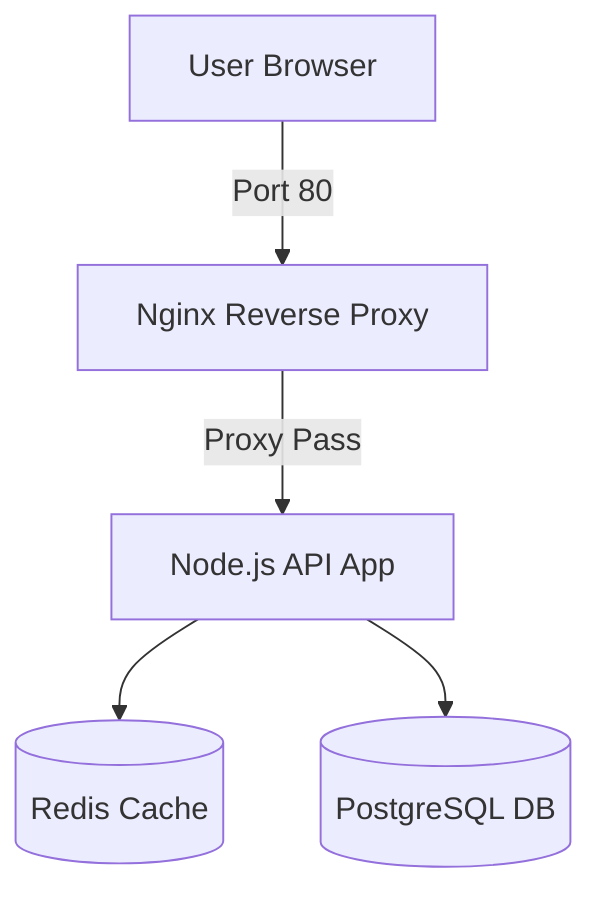

# 🐳 Bài 12: Dựng Môi Trường Development Đa Dịch Vụ Với Docker Compose - Docker Cho DevOps Chuyên Sâu

> 💡 **Bản chất 1 câu**: **Bài 12: Dựng Môi Trường Development Đa Dịch Vụ Với Docker Compose** giải quyết bài toán đóng gói, cô lập và tự động hóa vận hành ứng dụng trong môi trường Containerization chuẩn Cloud Native.  
> 🎯 **Trọng tâm thực chiến DevOps**: Thực hành dựng môi trường Development hoàn chỉnh 5 container: Nginx Reverse Proxy + Web App + Node.js API + PostgreSQL DB + Redis Cache + Adminer DB Client.

---

## 1. 🧠 Hình Hình Dung Nhanh Cho Người Mới (Intuitive Mindset)

Hãy tưởng tượng **Bài 12: Dựng Môi Trường Development Đa Dịch Vụ Với Docker Compose** giống như ngành vận tải biển quốc tế trước và sau khi có thùng Container tiêu chuẩn ISO:
- **Trước khi có Container**: Hàng hóa (Code ứng dụng, dependencies, thư viện OS) được xếp hỗn loạn trên tàu. Khi đổi từ tàu (Máy chủ Dev Windows) sang tàu khác (Máy chủ Prod Linux), hàng hóa bị hỏng, thiếu file, lỗi phiên bản (`It works on my machine`).
- **Sau khi có Docker Container**: Toàn bộ ứng dụng và môi trường được đóng gói chặt chẽ vào một thùng Container tiêu chuẩn. Bất kể chở bằng tàu hỏa, tàu thủy hay xe tải (Laptop Dev, Cloud AWS, Server On-premise), Container vận hành hoàn toàn giống hệt nhau 100%.

---

## 2. 📚 Lý Thuyết Chuyên Sâu & Bản Chất Hệ Thống (Under The Hood Architecture)



### 2.1 Phân Tích Chuyên Sâu Kiến Trúc & Cơ Chế Kernel:
- **Nguyên lý cô lập**: Container KHÔNG PHẢI là Virtual Machine (VM). Container không chạy Hypervisor hay OS riêng, mà dùng chung Linux Kernel với Host OS nhưng được cô lập hoàn toàn nhờ 2 tính năng cốt lõi của Linux Kernel:
  1. **Linux Namespaces**: Cô lập những gì tiến trình **NHÌN THẤY** (PID Namespace cô lập tiến trình, NET Namespace cô lập card mạng/IP, MNT Namespace cô lập file system, UTS Namespace cô lập hostname).
  2. **Control Groups (cgroups)**: Phân chia và giới hạn những gì tiến trình **SỬ DỤNG** (Giới hạn tối đa CPU, RAM, Disk I/O, Network Bandwidth).
- **Copy-on-Write (CoW) & OverlayFS**: Các lớp Image Layer là bất biến (Read-Only). Khi Container chạy, Docker chỉ tạo thêm 1 lớp mỏng Read/Write Container Layer trên cùng. Mọi thao tác sửa đổi file chỉ ghi vào lớp mỏng này giúp Container khởi động trong thời gian tính bằng miligiây.

---

## 3. ⚡ Bảng Tra Cứu Khái Niệm, Câu Lệnh & Tham Số (Reference Table)

| Câu Lệnh / Tham Số | Phân Loại | Ý Nghĩa Kỹ Thuật Bản Chất | Ứng Dụng Thực Tế In Production |
| :--- | :--- | :--- | :--- |
| **`docker run -d --name app`** | `CLI Execution` | Khởi chạy Container ở chế độ chạy ngầm (Detached mode) | `Deploy các background microservices` |
| **`--memory=1g --cpus=1.5`** | `Resource Limit` | Đặt ngưỡng cgroups giới hạn RAM 1GB và CPU 1.5 core | `Chống Container ăn lấn RAM đè sập Server Host` |
| **`-p 8080:80`** | `Port Forwarding` | Cấu hình iptables NAT map cổng 8080 trên Host vào 80 trong Container | `Mở cổng dịch vụ ra ngoài Internet` |
| **`-v data_vol:/var/lib/db`** | `Storage Mount` | Gắn Named Volume bền vững dữ liệu không bị mất khi xóa Container | `Lưu trữ Database MySQL, Postgres, MongoDB` |

---

## 4. 🛠 Thao Tác Thực Chiến & Kịch Bản Triển Khai Container (Production Playbook)

### 🛠 Đoạn code gõ ăn ngay & Cấu hình mẫu Production:
```dockerfile
# Dockerfile mẫu chuẩn Production hardened cho Microservice:
FROM golang:1.21-alpine AS builder
WORKDIR /app
COPY go.mod go.sum ./
RUN go mod download
COPY . .
RUN CGO_ENABLED=0 GOOS=linux go build -ldflags="-w -s" -o main .

FROM scratch
WORKDIR /app
COPY --from=builder /etc/ssl/certs/ca-certificates.crt /etc/ssl/certs/
COPY --from=builder /app/main .
USER 10001:10001
EXPOSE 8080
ENTRYPOINT ["./main"]
```

### 🚀 Kịch bản khắc phục sự cố Container khi đi làm (Production Incident Playbook):
1. **Sự cố 1: Container đột ngột bị sập với Exit Code 137 (Out Of Memory - OOM Killed)**:
   - **Triệu chứng**: Container đang chạy mượt mà thì ngắt giữa chừng, `docker inspect` trả về `ExitCode: 137` và `OOMKilled: true`.
   - **Các bước xử lý khẩn cấp**:
     1. Kiểm tra log hệ thống kernel để xác nhận OOM Killer tiêu diệt tiến trình: `sudo dmesg -T | grep -i oom`.
     2. Nâng ngưỡng giới hạn bộ nhớ RAM trong `--memory` hoặc sửa đoạn code ứng dụng bị Memory Leak.
     3. Bổ sung chỉ thị Swap hoặc cấu hình Swapiness cho cgroups.

---

## 5. 🚀 Bộ Câu Hỏi Phỏng Vấn DevOps Docker Thực Tế (Senior Interview Q&A)

> **Q: Giải thích sự khác biệt cốt lõi về mặt kiến trúc giữa Container và Virtual Machine (VM)?**  
> **A**: VM cô lập ở tầng **Phần cứng (Hardware Level)** bằng Hypervisor (KVM, ESXi) và yêu cầu mỗi VM phải chạy một Guest OS đầy đủ (nặng vài GB RAM/Disk). Trong khi đó, Container cô lập ở tầng **HĐH (OS Level)** bằng Linux Kernel Namespaces & cgroups, dùng chung Kernel của Host OS nên khởi động cực nhanh (miligiây) và siêu nhẹ (vài MB).

> **Q: Sự khác biệt giữa hai chỉ thị `CMD` và `ENTRYPOINT` trong Dockerfile là gì? Khi nào nên kết hợp cả hai?**  
> **A**:  
> - `ENTRYPOINT`: Định nghĩa lệnh cố định chính sẽ luôn được thực thi khi Container khởi chạy (không bị ghi đè bởi tham số truyền vào từ `docker run`).  
> - `CMD`: Định nghĩa tham số mặc định cho `ENTRYPOINT` (có thể bị ghi đè khi người dùng truyền tham số ở cuối lệnh `docker run`).  
> - **Kết hợp**: Dùng `ENTRYPOINT ["python", "app.py"]` làm lệnh cố định và `CMD ["--port", "8080"]` làm tham số mặc định có thể tùy biến.

---

## 6. 📝 Cheat Sheet Ghi Nhớ Nhanh (Summary)

- [x] Nắm vững cơ chế cô lập của **Linux Namespaces** và giới hạn tài nguyên của **cgroups**.
- [x] Luôn sử dụng **Multi-stage builds** để tối ưu dung lượng Docker Image xuống nhẹ nhất.
- [x] Luôn chỉ định **Non-root user (`USER 10001`)** để đảm bảo an toàn an ninh Container.
