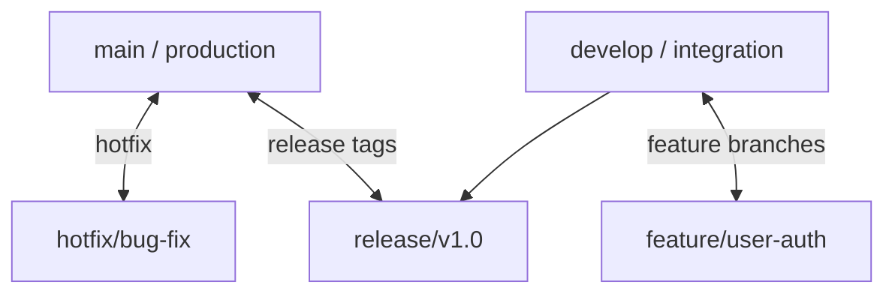

# 🐙 Bài 05: Các Mô Hình Quản Lý Nhánh (GitFlow, GitHub Flow, Trunk-Based) - Git Cho DevOps & Project Manager

> 💡 **Bản chất 1 câu**: **Bài 05: Các Mô Hình Quản Lý Nhánh (GitFlow, GitHub Flow, Trunk-Based)** giải quyết bài toán quản lý phiên bản mã nguồn phân tán (Distributed Version Control System - DVCS), quản lý luồng phát triển phần mềm, quy chuẩn giao tiếp nhóm và tự động hóa chuỗi cung ứng phần mềm CI/CD / GitOps.  
> 🎯 **Trọng tâm thực chiến DevOps & Project Manager**: Chiến lược phân nhánh chuẩn cho Project Manager & DevOps: GitFlow (feature, develop, release, hotfix, main), GitHub Flow (feature -> PR -> main), Trunk-Based Development (Feature Toggles) & Cách chọn mô hình dự án.

---

## 1. 🧠 Hình Hình Dung Nhanh Cho Người Mới (Intuitive Mindset)

Hãy tưởng tượng **Bài 05: Các Mô Hình Quản Lý Nhánh (GitFlow, GitHub Flow, Trunk-Based)** giống như việc điều hành một hệ thống ghi hình camera nhiều góc quay trong một dự án điện ảnh Hollywood:
- **Lập trình viên (Developers)** đóng vai trò các diễn viên và đạo diễn phân cảnh. Mỗi người có một bản sao kịch bản và tự do quay các cảnh phim của riêng mình trên máy cá nhân mà không làm ảnh hưởng đến bản phim chính.
- **Git (Bài 05: Các Mô Hình Quản Lý Nhánh (GitFlow, GitHub Flow, Trunk-Based))** đóng vai trò là cỗ máy thời gian ghi lại chính xác từng khung hình (Commits), cho phép tua lại (Reset/Revert), so sánh khác biệt (Diff), và ghép nhiều góc quay của các diễn viên lại thành một bộ phim hoàn chỉnh (Merge) mà không bao giờ lo mất mát dữ liệu.
- **Quản lý dự án (Project Manager / PM)** đóng vai trò Tổng đạo diễn theo dõi tiến độ sản xuất (Git Analytics), kiểm duyệt các phân cảnh đạt chuẩn trước khi phát sóng (Pull Request Reviews & Branch Protection).

---

## 2. 📚 Lý Thuyết Chuyên Sâu & Bản Chất Hệ Thống (Under The Hood Architecture)



### 2.1 Phân Tích Chuyên Sâu Cấu Trúc Dữ Liệu & Cơ Chế Git Engine:
- **Kiến trúc Đồ thị Hướng Không Chu Trình (DAG)**: Git lưu trữ lịch sử dưới dạng một Đồ thị DAG chứa các đỉnh đối tượng bất biến (Immutable Objects). Mọi đối tượng trong Git đều được định danh bằng mã băm **SHA-1 (40 ký tự)** hoặc **SHA-256**:
  1. **Blob Object**: Lưu nội dung thô của tệp tin (không lưu tên file hay permission).
  2. **Tree Object**: Lưu cấu trúc thư mục, ánh xạ tên file tới mã băm Blob và quyền file (0644, 0755).
  3. **Commit Object**: Lưu mã băm của Tree ở gốc, mã băm của Commit cha (Parent Commit), thông tin Tác giả (Author), Người commit (Committer) và Thông điệp commit (Commit Message).
  4. **Annotated Tag Object**: Lưu mốc phiên bản Release cố định chỉ tới 1 Commit cụ thể.

---

## 3. ⚡ Bảng Tra Cứu Khái Niệm, Câu Lệnh & Tham Số (Reference Table)

| Câu Lệnh / Tham Số | Phân Loại | Ý Nghĩa Kỹ Thuật Bản Chất | Ứng Dụng Thực Tế In Production |
| :--- | :--- | :--- | :--- |
| **`git status -s`** | `CLI Diagnostic` | Xem trạng thái ngắn gọn các tệp thay đổi trong Working Tree | `Tra cứu nhanh tệp chưa stage hoặc untracked` |
| **`git log --oneline --graph`** | `CLI Visualization` | Hiển thị đồ thị phân nhánh lịch sử commit ngắn gọn trên 1 dòng | `Theo dõi luồng merge và nhánh feature của team` |
| **`git commit --amend`** | `History Edit` | Gộp thay đổi mới vào commit gần nhất hoặc sửa lại commit message | `Sửa nhanh lỗi gõ sai thông điệp commit` |
| **`git push origin --force-with-lease`** | `Remote Push` | Push đè lịch sử an toàn (chỉ push nếu không có ai khác push trước) | `Cập nhật lại nhánh sau khi rebase an toàn` |

---

## 4. 🛠 Thao Tác Thực Chiến & Kịch Bản Triển Khai Git (Production Playbook)

### 🛠 Cấu hình mẫu tệp `.pre-commit-config.yaml` kiểm tra chất lượng tự động:
```yaml
# Cấu hình framework pre-commit tự động quét lỗi & secret trước khi commit:
reprs:
  - repo: https://github.com/pre-commit/pre-commit-hooks
    rev: v4.4.0
    hooks:
      - id: trailing-whitespace
      - id: end-of-file-fixer
      - id: check-yaml
      - id: check-added-large-files
        args: ['--maxkb=500']
  - repo: https://github.com/zricethezav/gitleaks
    rev: v8.18.0
    hooks:
      - id: gitleaks
```

### 🛠 Cấu hình tệp `CODEOWNERS` chỉ định người kiểm duyệt bắt buộc:
```ini
# Quy định người chịu trách nhiệm review code theo từng thư mục dự án:
# Toàn bộ dự án thuộc về Lead Engineer
*       @tech-lead-user

# Thư mục hạ tầng DevOps & K8s yêu cầu DevOps Team review
/infra/  @devops-team-lead
/.github/workflows/ @devops-team-lead

# Thư mục tài chính yêu cầu Lead Security review
/services/payment/ @security-lead
```

### 🚀 Kịch bản khắc phục sự cố Git khi đi làm (Production Incident Response Playbook):
1. **Sự cố 1: Lỡ commit và push mật khẩu/API Key bí mật lên GitHub Public Repository**:
   - **Triệu chứng**: GitHub gửi mail cảnh báo Secret Scanning lọt lộ API Key / AWS Credentials.
   - **Các bước xử lý khẩn cấp**:
     1. **BƯỚC VÀNG TỐI THƯỢNG**: Thu hồi (Revoke / Invalidate) API Key trên Console AWS/Cloud ngay lập tức.
     2. Gỡ bỏ triệt để tệp và lịch sử chứa Secret bằng `git-filter-repo` hoặc BFG Repo Cleaner:
        `git filter-repo --invert-paths --path config/secrets.env`
     3. Push đè lịch sử sạch mới lên Remote Repository: `git push origin --force --all`.

---

## 5. 🚀 Bộ Câu Hỏi Phỏng Vấn DevOps & Project Manager Thực Tế (Senior Interview Q&A)

> **Q: Sự khác biệt cốt lõi giữa hai lệnh `git merge` và `git rebase` là gì? Khi nào PM/DevOps nên yêu cầu team dùng loại nào?**  
> **A**:  
> - **`git merge`**: Tạo một **Commit Merge 3 bên mới** nối hai nhánh lại với nhau. Giữ nguyên lịch sử gốc theo thời gian nhưng có thể tạo ra nhiều đường nối chéo ngoằng ngoặc trên đồ thị log.  
> - **`git rebase`**: Đặt lại gốc của nhánh feature lên đỉnh của nhánh main, tạo lại các commit mới nối tiếp thẳng tắp. Giúp lịch sử commit **tuyến tính thẳng mượt (Linear History)** nhưng làm thay đổi mã băm SHA của commit.  
> - **Quy tắc PM**: Dùng `rebase` trên nhánh cá nhân (feature) trước khi tạo PR để giữ lịch sử sạch; Dùng `merge --no-ff` khi gộp PR vào nhánh chính (`main`/`develop`) để lưu lại mốc tích hợp tính năng.

> **Q: Làm thế nào Project Manager đo lường được tốc độ và sức khỏe của dự án phần mềm qua Git Analytics (DORA Metrics)?**  
> **A**: Sử dụng 4 chỉ số DORA Metrics:  
> 1. **Deployment Frequency (Tần suất triển khai)**: Đo số lần push/merge vào main kích hoạt deploy Production thành công.  
> 2. **Lead Time for Changes (Thời gian từ Code đến Production)**: Thời gian từ commit đầu tiên đến khi code chạy trên Prod.  
> 3. **Change Failure Rate (Tỷ lệ triển khai lỗi)**: % các lượt release gây ra lỗi cần rollback.  
> 4. **Mean Time to Restore (Thời gian trung bình phục hồi dịch vụ - MTTR)**: Thời gian từ khi có sự cố đến khi sửa xong.

---

## 6. 📝 Cheat Sheet Ghi Nhớ Nhanh (Summary)

- [x] Nắm vững cấu trúc **Working Tree, Staging Area và Local/Remote Repository**.
- [x] Viết thông điệp commit theo chuẩn **Conventional Commits (`feat:`, `fix:`, `docs:`)**.
- [x] KHÔNG BAO GIỜ được dùng `git push --force` trực tiếp lên các nhánh chính (`main`, `develop`).
