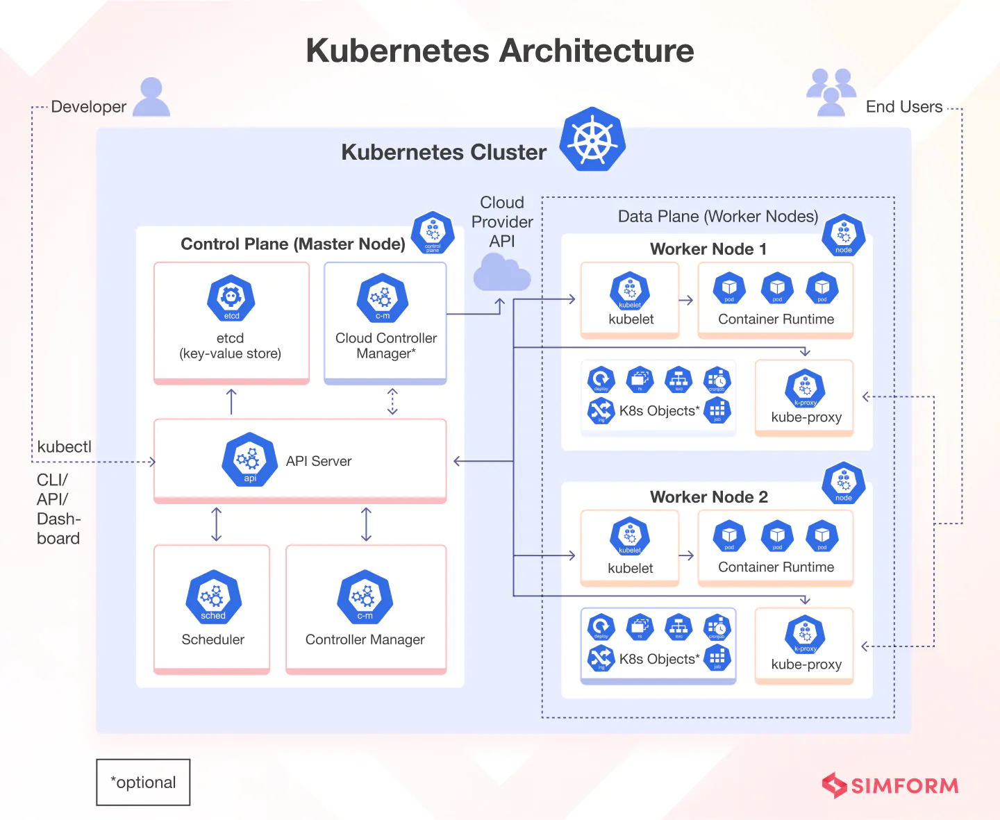

## 1. `kube-api-server` - "Cổng Giao tiếp" Chính của Kubernetes 🚪

`kube-api-server` là thành phần quản lý chính và là **"cổng vào" duy nhất** của cụm Kubernetes. Mọi tương tác, từ người dùng cho đến các thành phần khác trong cụm, đều phải đi qua nó.

- Khi bạn chạy một lệnh `kubectl`, thực chất `kubectl` đang gửi một yêu cầu đến `kube-api-server`.
- Bạn cũng có thể gọi trực tiếp API của nó mà không cần `kubectl`. dùng curl post

---

## 2. Luồng Hoạt động của `kube-api-server`

Để hiểu rõ vai trò trung tâm của nó, hãy xem qua hai luồng hoạt động chính:

### a. Khi bạn đọc dữ liệu (ví dụ: `kubectl get pods`)

1. Lệnh `kubectl` được gửi đến `kube-api-server`.
2. `api-server` **xác thực (authenticates)** và **kiểm tra tính hợp lệ (validates)** của yêu cầu.
3. `api-server` truy xuất dữ liệu từ kho lưu trữ **`etcd`**.
4. `api-server` trả kết quả về cho `kubectl`.

### b. Khi bạn thay đổi cụm (ví dụ: tạo một Pod mới)

Đây là lúc vai trò "nhạc trưởng" của `api-server` thể hiện rõ nhất:

1. Yêu cầu tạo Pod được gửi đến `api-server`.
2. `api-server` **xác thực** và **kiểm tra tính hợp lệ**.
3. `api-server` tạo một đối tượng Pod (chưa được gán cho Node nào) và **cập nhật thông tin này vào `etcd`**. Nó báo lại cho người dùng rằng Pod đã được tạo.
4. **`kube-scheduler`**, vốn luôn "lắng nghe" `api-server`, phát hiện ra có Pod mới chưa được điều phối.
5. `scheduler` tìm một Node phù hợp và **báo lại cho `api-server`**.
6. `api-server` **cập nhật thông tin Node được gán vào `etcd`**.
7. `api-server` **truyền thông tin này đến `kubelet`** trên Worker Node tương ứng.
8. `kubelet` nhận lệnh, tạo Pod trên Node của mình (bằng cách ra lệnh cho Container Runtime Engine) và **cập nhật trạng thái của Pod về lại cho `api-server`**.
9. `api-server` một lần nữa **cập nhật trạng thái cuối cùng này vào `etcd`**.

> Qua luồng trên, bạn có thể thấy `api-server` đứng ở trung tâm của mọi hoạt động, điều phối tất cả các thành phần khác.

---

## 3. Trách nhiệm Cốt lõi

- **Xác thực** và **kiểm tra tính hợp lệ** của mọi yêu cầu.
- **Truy xuất** và **cập nhật** dữ liệu trong `etcd`.
- **Điểm quan trọng nhất:** `kube-api-server` là **thành phần DUY NHẤT** được phép tương tác trực tiếp với kho dữ liệu `etcd`. Tất cả các thành phần khác (`scheduler`, `controller-manager`, `kubelet`) đều phải thông qua `api-server`.

---

## 4. Cách `kube-api-server` được triển khai

- **"Thủ công" (From Scratch):** Bạn sẽ tải file binary của `kube-api-server` và cấu hình nó chạy như một service trên Master Node (ví dụ: file service tại `/etc/systemd/system/kube-apiserver.service`).
- **Dùng `kubeadm`:** `kubeadm` sẽ triển khai `kube-api-server` dưới dạng một **static Pod** trong namespace **`kube-system`**. File định nghĩa của Pod này nằm tại `/etc/kubernetes/manifests/`.

---

## 5. Xem các Tùy chọn Cấu hình

`kube-api-server` có rất nhiều tùy chọn (flag) khi khởi chạy.

- Một tùy chọn cực kỳ quan trọng là **`--etcd-servers`**. Nó chỉ cho `api-server` biết địa chỉ của `etcd` cluster để kết nối.
- **Cách xem các tùy chọn đang chạy:**
  - Với cụm `kubeadm`: Xem file manifest của Pod `kube-api-server` tại `/etc/kubernetes/manifests/`.
  - Với cụm cài thủ công: Xem file service tại `/etc/systemd/system/`.
  - Cách chung: Liệt kê các tiến trình đang chạy trên Master Node và tìm `kube-api-server` (ví dụ: `ps aux | grep kube-apiserver`).

---

## 6. "Chốt hạ" cho Kỳ thi CKA 📝

- `kube-api-server` là **trung tâm điều phối**, là **cổng vào** của cụm Kubernetes.
- Nó là thành phần **duy nhất được nói chuyện trực tiếp với `etcd`**.
- Hiểu rõ vai trò của nó trong **vòng đời tạo Pod** là rất quan trọng.
- Biết cách tìm file cấu hình của `api-server` trong một cụm được dựng bằng `kubeadm` (nó là một **static Pod**).
