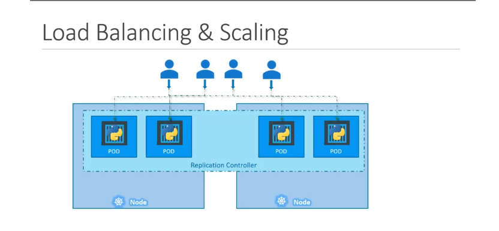

"người hùng" thầm lặng của Kubernetes, giúp ứng dụng của bạn luôn sẵn sàng và có thể mở rộng. Đó chính là **Replication Controller** và "hậu duệ" của nó, **ReplicaSet**.

---

### 1\. Tại sao cần "Nhân bản" (Replication)? 🤔

Trong thực tế, việc chỉ chạy một Pod duy nhất cho ứng dụng của bạn rất rủi ro. Chúng ta cần "nhân bản" vì hai lý do chính:

1. **Tính Sẵn sàng cao (High Availability):**

   - Nếu một Pod bị lỗi hoặc "chết", ứng dụng của bạn sẽ ngừng hoạt động.
   - Bằng cách chạy nhiều bản sao (replicas) của Pod, nếu một Pod gặp sự cố, những Pod còn lại vẫn tiếp tục phục vụ người dùng. Controller sẽ tự động tạo một Pod mới để thay thế Pod đã hỏng.

2. **Cân bằng tải & Mở rộng quy mô (Load Balancing & Scaling):**

   - Khi lượng người dùng tăng lên, một Pod có thể bị quá tải.
   - Bằng cách tạo thêm nhiều Pod, bạn có thể phân bổ (load balance) lượng truy cập trên nhiều Pod, giúp ứng dụng chạy mượt mà hơn và có thể xử lý nhiều yêu cầu hơn.
   - nếu số lượng pod trong 1 node nặng quá thì nó đưa sang node khác để
     

---

### 2\. Replication Controller vs. ReplicaSet

Cả hai đều có cùng mục đích: **đảm bảo một số lượng Pod nhất định luôn chạy**. Tuy nhiên:

- **Replication Controller:** Là công nghệ cũ hơn.
- **ReplicaSet:** Là công nghệ mới hơn và được **khuyến khích sử dụng**.

Trong bài này và về sau, chúng ta sẽ tập trung vào **ReplicaSet**.

---

### 3\. "Giải phẫu" một file YAML của ReplicaSet 🧬

Để tạo một ReplicaSet, chúng ta sẽ định nghĩa nó trong một file YAML. Cấu trúc của nó rất giống với Pod, nhưng có thêm vài phần quan trọng:

```yaml
apiVersion: apps/v1 # Khác với Pod (v1)
kind: ReplicaSet
metadata:
  name: myapp-replicaset
  labels:
    app: myapp
spec:
  replicas: 3 # 1. Số lượng bản sao mong muốn
  selector: # 2. "Bộ lọc" để tìm Pod, BẮT BUỘC
    matchLabels:
      app: myapp
  template: # 3. "Khuôn mẫu" để tạo Pod mới
    metadata:
      labels:
        app: myapp
    spec:
      containers:
        - name: nginx-container
          image: nginx
```

Hãy "mổ xẻ" phần `spec`:

1. **`replicas`**: Bạn muốn có bao nhiêu bản sao của Pod đang chạy. Trong ví dụ này là `3`.
2. **`selector`**: Đây là phần **cực kỳ quan trọng và bắt buộc** trong ReplicaSet. Nó giúp ReplicaSet biết được "những Pod nào thuộc về mình".
   - `matchLabels`: ReplicaSet sẽ tìm tất cả các Pod có nhãn (label) khớp với những gì được định nghĩa match ở chỗ template , phần tạo ra pod ấy (trong ví dụ là `app: myapp`). (lưu ý **label gắn cho chính bản thân ReplicaSet** , giống như "tag" để: Nhận diện ReplicaSet dễ hơn thôi)
3. **`template`**: Đây chính là "khuôn mẫu" định nghĩa Pod. Nếu ReplicaSet thấy số lượng Pod hiện tại ít hơn `replicas`, nó sẽ dùng "khuôn" này để tạo ra Pod mới. Về cơ bản, bạn có thể sao chép phần `metadata` và `spec` của một file định nghĩa Pod vào đây.

---

### 4\. Cơ chế "Kỳ diệu" của Labels và Selectors 🏷️🔎

- **Labels (Nhãn):** Là các cặp key-value bạn gắn vào các đối tượng (như Pod) để phân loại chúng.
- **Selectors (Bộ chọn):** Là cách các đối tượng khác (như ReplicaSet, Service) tìm và làm việc với các đối tượng có nhãn tương ứng.

Mối quan hệ này là "xương sống" của Kubernetes. ReplicaSet dùng `selector` để "quản lý" các Pod có `labels` phù hợp.

> **Câu hỏi hay:** Nếu Pod đã tồn tại sẵn, ReplicaSet có cần `template` không? **CÓ\!** Vì nếu một trong các Pod đó bị lỗi trong tương lai, ReplicaSet cần `template` để biết cách tạo ra một Pod mới thay thế.

---

### 5\. Mở rộng quy mô (Scaling) ReplicaSet 📈

Khi bạn muốn thay đổi số lượng replicas (ví dụ từ 3 lên 6), có hai cách chính:

1. **Cách 1 (Declarative - Khai báo):**

   - Sửa giá trị `replicas` trong file YAML (ví dụ: `replicas: 6`).
   - Chạy lệnh: `kubectl replace -f <tên-file.yaml>`

2. **Cách 2 (Imperative - Mệnh lệnh):**

   - Dùng lệnh `kubectl scale` trực tiếp:

     ```bash
     # Cách 1: Dùng tên của ReplicaSet
     kubectl scale --replicas=6 replicaset myapp-replicaset

     # Cách 2: Dùng file định nghĩa
     kubectl scale --replicas=6 -f <tên-file.yaml>
     ```

   - **Lưu ý:** Cách này chỉ thay đổi trạng thái hiện tại của ReplicaSet trên cụm, nó **không** cập nhật lại file YAML gốc của bạn.
   - nếu update image qua edit hay qua file . Muốn cập nhật, bạn phải **xóa Pod cũ** để nó tạo Pod mới với image mới. qua deployment sẽ xịn hơn

---

### 6\. "Chốt hạ" cho Kỳ thi CKA 📝

- **ReplicaSet** có nhiệm vụ duy trì một số lượng Pod ổn định.
- Cơ chế cốt lõi là sự kết hợp giữa **`labels`** (trên Pod) và **`selector`** (trong ReplicaSet).
- Nắm vững các trường bắt buộc trong file YAML của ReplicaSet: `apiVersion: apps/v1`, `kind: ReplicaSet`, `metadata`, và một `spec` chứa **`replicas`**, **`selector`**, và **`pod template`**.
- Biết cách scale một ReplicaSet bằng cả `kubectl replace` và `kubectl scale`.

---

# ReplicaSet Demo - Detailed Commands and Examples

## 1. View ReplicaSets

### List all ReplicaSets

```bash
kubectl get replicaset
# or short form
kubectl get rs
```

**Output example:**

```
NAME              DESIRED   CURRENT   READY   AGE
new-replica-set   3         3         3       5m
```

### View with more details

```bash
kubectl get rs -o wide
```

**Output example:**

```
NAME              DESIRED   CURRENT   READY   AGE   CONTAINERS   IMAGES         SELECTOR
new-replica-set   3         3         3       5m    nginx        nginx:1.20     app=nginx
```

## 2. Describe ReplicaSet

```bash
kubectl describe rs new-replica-set
```

**Output example:**

```
Name:         new-replica-set
Namespace:    default
Selector:     app=nginx
Labels:       <none>
Annotations:  <none>
Replicas:     3 desired | 3 updated | 3 total | 3 available | 0 unavailable
Pod Template:
  Labels:  app=nginx
  Containers:
   nginx:
    Image:        nginx:1.20
    Port:         80/TCP
    Host Port:    0/TCP
Events:
  Type    Reason            Age   From                   Message
  ----    ------            ----  ----                   -------
  Normal  SuccessfulCreate  5m    replicaset-controller  Created pod: new-replica-set-abc123
```

## 3. Edit ReplicaSet

### Edit interactively

```bash
kubectl edit rs new-replica-set
```

_This opens the ReplicaSet configuration in your default editor (vi/nano)_

### Apply changes from file

```bash
kubectl apply -f new-replica-set.yml
```

## 4. Scale ReplicaSet

### Scale using file

```bash
kubectl scale --replicas=5 -f new-replica-set.yml
```

### Scale using resource name

```bash
kubectl scale --replicas=5 rs new-replica-set
```

### Verify scaling

```bash
kubectl get rs new-replica-set
kubectl get pods -l app=nginx
```

## 5. Delete ReplicaSet

### Delete ReplicaSet and its pods

```bash
kubectl delete rs new-replica-set
```

### Delete ReplicaSet but keep pods

```bash
kubectl delete rs new-replica-set --cascade=orphan
```

## 6. Complete Demo Workflow

### Step 1: Create ReplicaSet

```yaml
apiVersion: apps/v1
kind: ReplicaSet
metadata:
  name: new-replica-set
  labels:
    app: nginx
spec:
  replicas: 3
  selector:
    matchLabels:
      app: nginx
  template:
    metadata:
      labels:
        app: nginx
    spec:
      containers:
        - name: nginx
          image: nginx:1.20
          ports:
            - containerPort: 80
```

```bash
kubectl create -f new-replica-set.yml
```

### Step 2: Monitor ReplicaSet

```bash
# Watch ReplicaSet status
kubectl get rs -w

# Check pods created by ReplicaSet
kubectl get pods -l app=nginx

# View detailed information
kubectl describe rs new-replica-set
```

### Step 3: Scale Operations

```bash
# Scale up to 5 replicas
kubectl scale --replicas=5 rs new-replica-set

# Verify scaling
kubectl get rs new-replica-set
kubectl get pods -l app=nginx

# Scale down to 2 replicas
kubectl scale --replicas=2 rs new-replica-set
```

### Step 4: Test Self-Healing

```bash
# Delete a pod to test self-healing
kubectl delete pod <pod-name>

# Watch ReplicaSet recreate the pod
kubectl get pods -l app=nginx -w
```

### Step 5: Cleanup

```bash
kubectl delete rs new-replica-set
```

## 7. Useful Additional Commands

### View ReplicaSet YAML

```bash
kubectl get rs new-replica-set -o yaml
```

### View ReplicaSet JSON

```bash
kubectl get rs new-replica-set -o json
```

### Filter by labels

```bash
kubectl get rs -l app=nginx
```

### View events related to ReplicaSet

```bash
kubectl get events --field-selector involvedObject.name=new-replica-set
```

### Monitor resource usage

```bash
kubectl top pods -l app=nginx
```

## Key Points to Remember

- **ReplicaSet ensures desired number of pods are running**
- **Pods are recreated automatically if deleted**
- **Scaling can be done via file or direct command**
- **Use labels to identify and group related resources**
- **Always verify operations with `kubectl get` commands**
