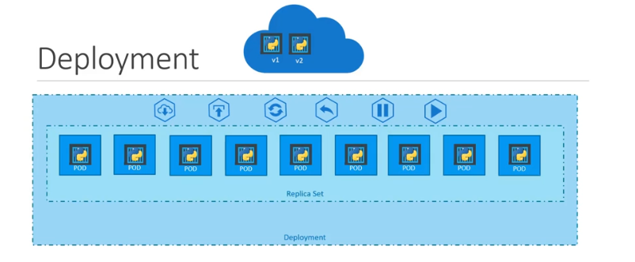

đối tượng mạnh mẽ và được sử dụng nhiều nhất để quản lý ứng dụng, đó là **Kubernetes Deployment**.

---

### 1\. Bài toán Quản lý Ứng dụng trong "Thế giới Thực" 🌍


Khi triển khai ứng dụng trong môi trường thực tế (production), chúng ta thường đối mặt với các yêu cầu sau:

- **Nhiều bản sao:** Cần chạy nhiều instance của ứng dụng để đảm bảo tính sẵn sàng cao và cân bằng tải.
- **Cập nhật liền mạch:** Khi có phiên bản mới, cần nâng cấp ứng dụng mà không gây gián đoạn dịch vụ. Đây gọi là **Rolling Updates**.
- **Quay lui (Rollback):** Nếu phiên bản mới bị lỗi, cần có khả năng quay trở lại phiên bản cũ một cách nhanh chóng.
- **Tạm dừng & Tiếp tục:** Đôi khi cần tạm dừng quá trình thay đổi, thực hiện nhiều cấu hình cùng lúc, rồi mới tiếp tục để tất cả được áp dụng một lần.

---

### 2\. `Deployment` - "Vị tướng" Chỉ huy Tối cao 🎖️

**Deployment** chính là đối tượng Kubernetes được sinh ra để giải quyết tất cả các bài toán trên. Nó là một đối tượng quản lý cấp cao hơn, đứng trên cả ReplicaSet và Pod.

Đây là hệ thống phân cấp bạn cần nhớ:

**Deployment** ➡️ quản lý ➡️ **ReplicaSet** ➡️ quản lý ➡️ **Pods**

> **Điểm mấu chốt:** Một Deployment không quản lý trực tiếp các Pod. Thay vào đó, nó quản lý các ReplicaSet. Khi bạn tạo hoặc cập nhật một Deployment, nó sẽ tạo ra một ReplicaSet mới, và chính ReplicaSet đó sẽ chịu trách nhiệm tạo ra các Pod.

---

### 3\. "Giải phẫu" một file YAML của Deployment 🧬

Tin vui là file định nghĩa của Deployment **gần như y hệt** file định nghĩa của ReplicaSet\!

- Sự khác biệt chính và duy nhất bạn cần thay đổi là `kind`.
- **`kind: Deployment`**

Mọi thứ khác như `apiVersion: apps/v1`, `metadata`, và `spec` (với `replicas`, `selector`, `template`) đều giữ nguyên.

```yaml
apiVersion: apps/v1
kind: Deployment # <-- Chỉ thay đổi ở đây
metadata:
  name: myapp-deployment
  labels:
    app: myapp
spec:
  replicas: 3
  selector:
    matchLabels:
      app: myapp
  template:
    metadata:
      labels:
        app: myapp
    spec:
      containers:
        - name: nginx-container
          image: nginx
```

---

### 4\. Điều gì xảy ra khi bạn tạo một Deployment? 🚀

Khi bạn chạy lệnh `kubectl create -f deployment-definition.yaml`, một chuỗi phản ứng sẽ xảy ra:

1. Một đối tượng **Deployment** được tạo.
2. Deployment controller ngay lập tức tạo ra một đối tượng **ReplicaSet** mới dựa trên `template` của Deployment.
3. ReplicaSet controller tiếp quản và tạo ra đủ số lượng **Pods** theo yêu cầu (`replicas: 3`).

---

### 5\. Các Lệnh Kiểm tra Hữu ích ✅

- **Xem Deployment:** `kubectl get deployment`
- **Xem ReplicaSet:** `kubectl get replicaset` (Bạn sẽ thấy một ReplicaSet mới được tạo bởi Deployment , có prefix của Deployment).
- **Xem Pods:** `kubectl get pods` (Tên các Pod sẽ có prefix của Deployment và ReplicaSet).
- **Xem tất cả:** Một lệnh rất tiện lợi là `kubectl get all`. Nó sẽ liệt kê tất cả các đối tượng liên quan (Deployment, ReplicaSet, Pods, và cả Service nếu có).

---

### 6\. "Chốt hạ" cho Kỳ thi CKA 📝

- **Deployment** là đối tượng được **khuyến khích sử dụng** để quản lý các ứng dụng không trạng thái (stateless applications).
- Nó cung cấp các tính năng quản lý vòng đời ứng dụng nâng cao như **rolling updates** và **rollbacks** (sẽ tìm hiểu chi tiết sau).
- Hãy nhớ kỹ hệ thống phân cấp: **Deployment quản lý ReplicaSet, ReplicaSet quản lý Pods.**
- Cấu trúc file YAML của Deployment gần như giống hệt ReplicaSet, chỉ cần đổi `kind` thành `Deployment`.

---

### 7. Lab Thực hành: Deployment trong Kubernetes 🧪

Chúng ta sẽ thực hành từng bước để hiểu rõ cách hoạt động của Deployment:

#### **Bước 1: Tạo Pod đơn giản với NGINX**

```bash
kubectl run nginx --image=nginx
```

#### **Bước 2: Tạo file YAML cho Pod (không deploy)**

```bash
kubectl run nginx --image=nginx --dry-run=client -o yaml
```

#### **Bước 3: Tạo Deployment đơn giản**

```bash
kubectl create deployment --image=nginx nginx
```

#### **Bước 4: Tạo file YAML cho Deployment (không deploy)**

```bash
kubectl create deployment --image=nginx nginx --dry-run=client -o yaml
```

#### **Bước 5: Lưu file YAML và chỉnh sửa**

```bash
kubectl create deployment --image=nginx nginx --dry-run=client -o yaml > nginx-deployment.yaml
```

Sau đó chỉnh sửa file `nginx-deployment.yaml` để thêm số replica:

```yaml
apiVersion: apps/v1
kind: Deployment
metadata:
      name: nginx
spec:
      replicas: 3  # Thay đổi từ 1 thành 3
      selector:
            matchLabels:
                  app: nginx
      template:
            metadata:
                  labels:
                        app: nginx
            spec:
                  containers:
                  - image: nginx
                        name: nginx
```

#### **Bước 6: Deploy từ file YAML**

```bash
kubectl create -f nginx-deployment.yaml
```

#### **Bước 7: Tạo Deployment với replica ngay từ đầu (k8s 1.19+)**

```bash
kubectl create deployment --image=nginx nginx --replicas=4 --dry-run=client -o yaml > nginx-deployment.yaml
```

#### **Bước 8: Kiểm tra kết quả**

```bash
# Xem tất cả objects
kubectl get all

# Xem chi tiết Deployment
kubectl get deployment

# Xem chi tiết ReplicaSet (được tạo bởi Deployment)
kubectl get replicaset

# Xem chi tiết Pods
kubectl get pods

# Xem thông tin chi tiết của Deployment
kubectl describe deployment nginx
```

#### **Bước 9: Thử nghiệm Scale Up/Down**

```bash
# Scale up to 6 replicas
kubectl scale deployment nginx --replicas=6

# Scale down to 2 replicas
kubectl scale deployment nginx --replicas=2

# Kiểm tra
kubectl get pods
```

#### **Bước 10: Dọn dẹp**

```bash
kubectl delete deployment nginx
```

> **💡 Ghi chú quan trọng:** Khi bạn xóa Deployment, tất cả ReplicaSet và Pod con của nó cũng sẽ bị xóa theo. Đây chính là sức mạnh của hệ thống phân cấp trong Kubernetes!

---
