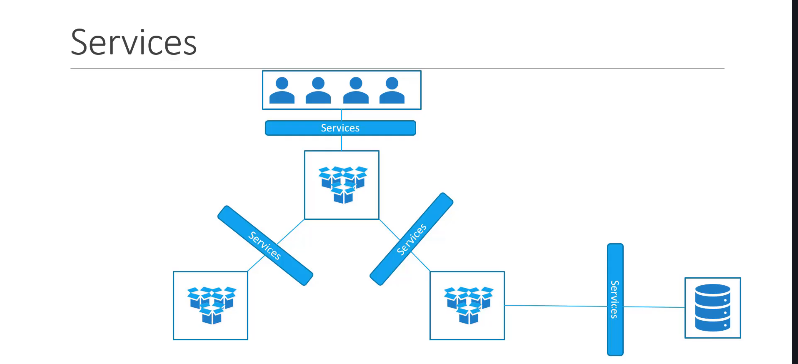
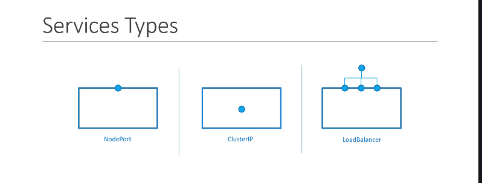
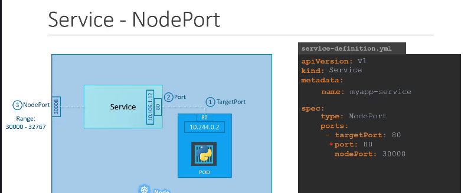
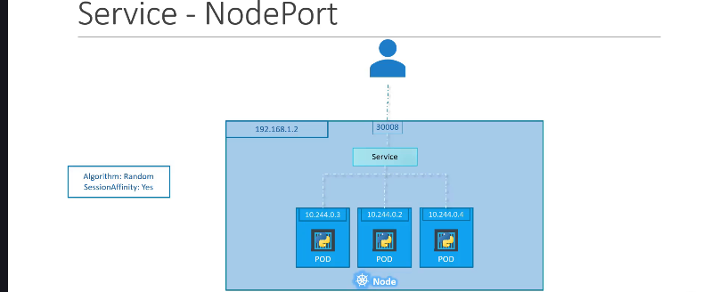
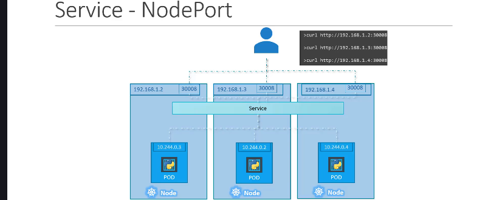

### 1\. Bài toán: Làm sao để "Thế giới bên ngoài" nói chuyện với Pod? 🌐

Chúng ta đã biết Pod là nơi chạy ứng dụng, nhưng Pod có những vấn đề:

- Nó có địa chỉ IP nội bộ, không thể truy cập trực tiếp từ bên ngoài cụm.
- IP của Pod không ổn định, nó sẽ thay đổi nếu Pod được tạo lại.

Vậy làm sao để người dùng bên ngoài có thể truy cập vào ứng dụng đang chạy trong Pod? Hoặc làm sao để các Pod frontend có thể nói chuyện ổn định với các Pod backend? **Service** chính là câu trả lời.



---

### 2\. Giới thiệu các loại "Dịch vụ" (Services)

Kubernetes cung cấp một vài loại Service chính:



1. **`NodePort`**: "Mở một cổng" trên mỗi Node trong cụm để thế giới bên ngoài có thể truy cập vào ứng dụng. (Chúng ta sẽ tập trung vào loại này trong bài hôm nay).

   

2. **`ClusterIP`**: Tạo ra một IP "ảo" chỉ có thể truy cập được từ bên trong cụm. Dùng cho việc giao tiếp giữa các Pod với nhau (ví dụ: frontend gọi backend).
3. **`LoadBalancer`**: Tạo ra một bộ cân bằng tải (Load Balancer) của nhà cung cấp dịch vụ đám mây (như AWS, Google Cloud) để phân phối traffic từ internet vào ứng dụng của bạn.

---

### 3\. "Mổ xẻ" `NodePort` Service 🔍

Khi làm việc với `NodePort`, có 3 loại port bạn cần phân biệt rõ:



- **`targetPort`**: Đây là port mà container của bạn đang thực sự lắng nghe bên trong **Pod**. Ví dụ: web server của bạn chạy ở port `80`.
- **`port`**: Đây là port được mở trên chính cái **Service** (trên địa chỉ IP ảo ClusterIP của nó).
- **`nodePort`**: Đây là port được mở trên **mỗi Worker Node**. Người dùng bên ngoài sẽ truy cập ứng dụng của bạn qua địa chỉ `<IP-của-Node>:<nodePort>`.
  - _Lưu ý:_ `nodePort` chỉ có thể nằm trong một dải nhất định, mặc định là **30000 - 32767**.

---

### 4\. Tạo `NodePort` Service bằng YAML

Để tạo một Service, chúng ta cũng dùng file YAML. Cấu trúc của nó như sau:

```yaml
apiVersion: v1
kind: Service
metadata:
  name: myapp-service
spec:
  type: NodePort # 1. Khai báo loại Service là NodePort

  ports:
    - port: 80 # 2. Port trên chính Service
      targetPort: 80 # 3. Port trên Pod mà Service sẽ trỏ tới
      nodePort: 30008 # 4. Port trên Node để bên ngoài truy cập

  selector: # 5. Mấu chốt: Kết nối Service với Pod!
    app: myapp
```

**Giải thích các phần trong `spec`:**

1. **`type: NodePort`**: Chỉ định rõ đây là một NodePort Service.
2. **`port`**: Port trên Service. Đây là trường bắt buộc.
3. **`targetPort`**: Port trên Pod đích. Nếu không khai báo, nó sẽ mặc định bằng giá trị của `port`.
4. **`nodePort`**: Port trên Node. Nếu không khai báo, Kubernetes sẽ tự chọn một port trống trong dải cho phép.
5. **`selector`**: Đây là phần **QUAN TRỌNG NHẤT**. Nó nói cho Service biết: "Hãy tìm tất cả các Pod nào có nhãn (label) là `app: myapp` và chuyển traffic đến cho chúng". Cơ chế **labels và selectors** này chính là cầu nối giữa Service và Pods.

---

### 5\. Service và "Siêu năng lực" Load Balancing ⚖️

- Nếu `selector` của Service khớp với **nhiều Pod** (ví dụ: bạn có 3 Pod frontend cùng có label `app: myapp`), Service sẽ tự động hoạt động như một bộ cân bằng tải.
- Nó sẽ phân phối traffic đến các Pod này một cách ngẫu nhiên (random algorithm). Bạn không cần phải làm gì thêm\!

  

---

### 6\. Service trên nhiều Node



- Khi bạn tạo một `NodePort` Service, Kubernetes sẽ tự động mở cùng một `nodePort` đó **trên TẤT CẢ các Node** trong cụm.
- Điều này có nghĩa là bạn có thể truy cập ứng dụng của mình bằng cách dùng IP của **bất kỳ Node nào** trong cụm, kết hợp với `nodePort` đó.

---

### 7\. "Chốt hạ" cho Kỳ thi CKA 📝

- **Service** là đối tượng dùng để tạo ra một điểm truy cập (endpoint) ổn định cho các Pod.
- **`NodePort`** là loại Service dùng để "mở cổng" trên Node, cho phép truy cập từ bên ngoài.
- Sự kết nối giữa Service và Pod được thực hiện thông qua **labels và selectors**. Đây là cơ chế nền tảng của Kubernetes.
- Một Service có thể tự động **cân bằng tải** cho nhiều Pod.
- Một `NodePort` Service sẽ có hiệu lực trên **tất cả các Node** trong cụm.
