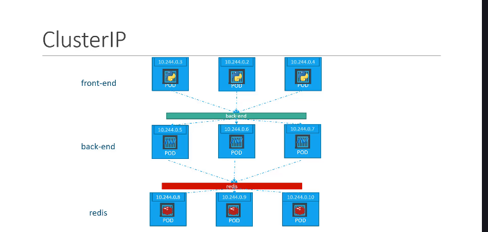

### 1\. Bài toán: Giao tiếp "Nội bộ" trong Kiến trúc Microservices 🗣️



Hãy tưởng tượng một ứng dụng web hoàn chỉnh thường có nhiều tầng (tiers):

- Một nhóm Pod chạy **frontend** (giao diện người dùng).
- Một nhóm Pod chạy **backend** (xử lý logic).
- Một nhóm Pod chạy cơ sở dữ liệu (ví dụ: **database**, Redis).

**Câu hỏi đặt ra là:** Làm thế nào để các Pod frontend có thể nói chuyện một cách ổn định và đáng tin cậy với các Pod backend, khi mà địa chỉ IP của các Pod backend có thể thay đổi liên tục?

---

### 2\. `ClusterIP` Service - "Tổng đài nội bộ" của Kubernetes ☎️

**`ClusterIP`** chính là giải pháp cho vấn đề này.

- **Nó là gì?** Đây là loại Service **mặc định** trong Kubernetes. Khi bạn tạo một Service mà không chỉ định `type`, nó sẽ tự động là `ClusterIP`.
- **Nó làm gì?** Nó sẽ tạo ra một **địa chỉ IP ảo (gọi là ClusterIP)** và một **tên DNS ổn định**, chỉ có thể được truy cập từ **bên trong cụm Kubernetes**.
- **Lợi ích:**
  - Các Pod khác (ví dụ: frontend) có thể giao tiếp với một nhóm Pod (ví dụ: backend) thông qua một "địa chỉ" duy nhất và không đổi này.
  - Nó hoạt động như một bộ cân bằng tải nội bộ, tự động phân phối các yêu cầu đến một trong các Pod backend một cách ngẫu nhiên.
  - Giúp tạo ra các kiến trúc microservices découple (ít phụ thuộc) và linh hoạt.

---

### 3\. "Giải phẫu" một file YAML của `ClusterIP` Service 🧬

Việc tạo một `ClusterIP` Service rất đơn giản.

```yaml
apiVersion: v1
kind: Service
metadata:
  name: backend-service # Tên của Service
spec:
  # type: ClusterIP     # Đây là loại mặc định, nên có thể bỏ qua
  ports:
    - port: 80 # Port mà Service sẽ lắng nghe
      targetPort: 80 # Port trên các Pod đích
  selector:
    app: my-backend # Tìm tất cả các Pod có label này
```

**Giải thích các phần trong `spec`:**

- **`type: ClusterIP`**: Bạn có thể ghi tường minh, nhưng nếu bỏ trống trường `type`, Kubernetes sẽ tự hiểu đây là `ClusterIP`.
- **`ports`**:
  - `port`: Port mà Service này sẽ mở trên địa chỉ ClusterIP của nó.
  - `targetPort`: Port mà các container trong Pod đích đang lắng nghe.
- **`selector`**: Mấu chốt của vấn đề\! Nó nói cho Service biết: "Hãy tìm và chuyển traffic đến tất cả các Pod có nhãn là `app: my-backend`".

---

### 4\. Cách sử dụng

Sau khi Service `backend-service` được tạo, các Pod frontend trong cùng cụm có thể dễ dàng truy cập vào các Pod backend bằng cách sử dụng tên DNS của Service:

`http://backend-service`

Kubernetes sẽ tự động phân giải tên này thành địa chỉ ClusterIP tương ứng và chuyển yêu cầu đến một trong các Pod backend khỏe mạnh.

---

### 5\. "Chốt hạ" cho Kỳ thi CKA 📝

- `ClusterIP` là loại Service **mặc định** trong Kubernetes.
- Nó được sử dụng cho việc **giao tiếp bên trong cụm (internal communication)**, ví dụ: giữa frontend và backend.
- Nó **KHÔNG** thể được truy cập từ bên ngoài cụm.
- Nó sử dụng **`selector`** để tìm các Pod mà nó sẽ quản lý và chuyển traffic đến.
