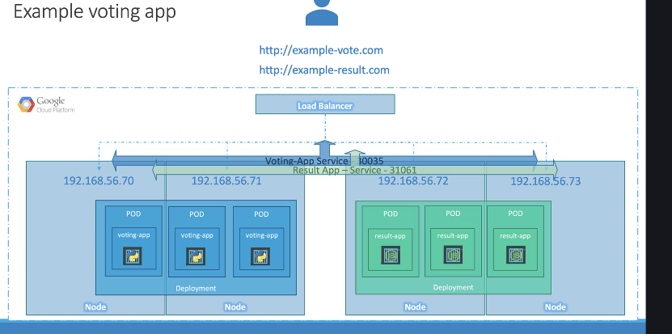

### 1. Bài toán: Từ `NodePort` đến một URL thân thiện với người dùng 🤔

Ở bài trước, chúng ta đã dùng `NodePort` để truy cập ứng dụng. Tuy nhiên, nó có một vấn đề lớn:

- Để truy cập, bạn phải dùng địa chỉ `<IP-của-Node>:<nodePort>`.
- Nếu cụm của bạn có 4 node, bạn sẽ có tới 4 địa chỉ IP khác nhau để truy cập cùng một ứng dụng.
- Bạn không thể đưa cho người dùng cuối một danh sách các IP như vậy. Cái họ cần là một **URL duy nhất**, thân thiện, ví dụ: `votingapp.com`.

**Giải pháp truyền thống là gì?** Bạn có thể tự dựng một máy chủ VM riêng, cài đặt một bộ cân bằng tải như Nginx hoặc HAProxy, rồi cấu hình nó để trỏ đến các node trong cụm Kubernetes. Nhưng cách này rất thủ công, tốn công sức cài đặt và bảo trì.

---

### 2. `LoadBalancer` Service - "Cầu nối" ra Internet 🌉

Kubernetes cung cấp một giải pháp "xịn" hơn nhiều, đó là Service loại `LoadBalancer`.

- **Nó là gì?** Đây là loại Service được thiết kế để tự động tích hợp với các bộ cân bằng tải của những nhà cung cấp dịch vụ đám mây (cloud provider).
- **Bạn cần làm gì?** Rất đơn giản, bạn chỉ cần khai báo `type: LoadBalancer` trong file YAML của Service.

---

### 3. "Phép màu" đằng sau `type: LoadBalancer` ✨

Khi bạn tạo một Service với `type: LoadBalancer` trên một nền tảng cloud được hỗ trợ, một chuỗi hành động tự động sẽ xảy ra:

1. Kubernetes vẫn sẽ tạo ra một **`ClusterIP`** Service để giao tiếp nội bộ.
2. Nó cũng sẽ tạo ra một **`NodePort`** Service để mở một cổng trên mỗi node.
3. **Điều quan trọng nhất:** Kubernetes sẽ gửi một yêu cầu API đến nhà cung cấp cloud (ví dụ: AWS, Google Cloud, Azure).
4. Nhà cung cấp cloud sẽ tự động tạo ra một **Bộ cân bằng tải mạng bên ngoài (External Network Load Balancer)**.
5. Load Balancer này sẽ có một địa chỉ IP public, cố định và được cấu hình để tự động chuyển tiếp tất cả traffic từ Internet vào cái `NodePort` đã được mở trên các node của bạn.

Kết quả là người dùng chỉ cần truy cập vào địa chỉ IP public của Load Balancer này là có thể vào được ứng dụng của bạn.

---

### 4. Điểm "Chí mạng" cần nhớ: Phụ thuộc vào Nhà cung cấp Cloud ☁️⚠️

- Tính năng này **CHỈ HOẠT ĐỘNG** trên các nền tảng cloud được Kubernetes hỗ trợ (GCP, AWS, Azure là các ví dụ điển hình).
- Nếu bạn khai báo `type: LoadBalancer` trong một môi trường không được hỗ trợ (ví dụ: một cụm Kubernetes bạn tự dựng trên máy ảo VirtualBox ở nhà), nó sẽ **chỉ hoạt động như một `NodePort` Service**. Sẽ không có external load balancer nào được tạo ra cả.

---

### 5. "Chốt hạ" cho Kỳ thi CKA 📝

- Sử dụng `type: LoadBalancer` là cách tiêu chuẩn để "đưa" một ứng dụng trong Kubernetes ra Internet với một **địa chỉ IP duy nhất và ổn định**.
- Tính năng này phụ thuộc vào sự **tích hợp với một nhà cung cấp cloud được hỗ trợ**.
- Trong môi trường không được hỗ trợ, `LoadBalancer` sẽ hoạt động giống hệt như `NodePort`.
- Về bản chất, khi bạn tạo một `LoadBalancer` Service, nó cũng đồng thời tạo ra cả `NodePort` và `ClusterIP` Service bên dưới.
