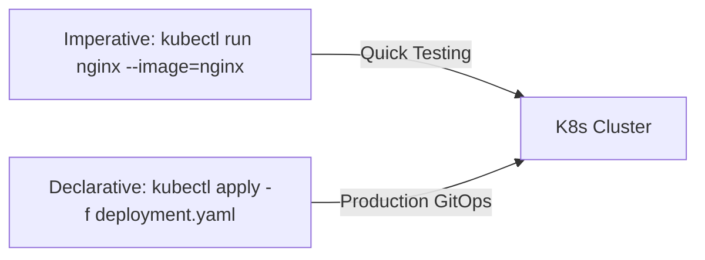

# ☸️ Bài 03: Thành Thạo Lệnh Kubectl CLI, Imperative vs Declarative & Krew Plugins - Kubernetes Cho DevOps Chuyên Sâu

> 💡 **Bản chất 1 câu**: **Bài 03: Thành Thạo Lệnh Kubectl CLI, Imperative vs Declarative & Krew Plugins** giải quyết bài toán cốt lõi trong việc tự động hóa điều phối (Orchestration), vận hành quy mô lớn, đảm bảo tính sẵn sàng cao (High Availability 99.999%) và tự phục hồi (Self-healing) cho các ứng dụng Containerized chuẩn Cloud Native.  
> 🎯 **Trọng tâm thực chiến DevOps & Kubernetes Architect**: Lệnh `kubectl` thực chiến: Imperative vs Declarative, `kubectl run/create/apply/get/describe/logs/exec/port-forward/edit/top`, Krew plugin manager (ctx, ns, Popeye, Stern, access-matrix).

---

## 1. 🧠 Hình Hình Dung Nhanh Cho Người Mới (Intuitive Mindset)

Hãy tưởng tượng **Bài 03: Thành Thạo Lệnh Kubectl CLI, Imperative vs Declarative & Krew Plugins** giống như việc điều hành một dàn nhạc giao hưởng khổng lồ quốc tế:
- **Người dùng (Clients)** đóng vai trò khán giả thưởng thức âm nhạc.
- **Các Container (Pods)** đóng vai trò là các nhạc công chơi từng loại nhạc cụ riêng lẻ.
- **Kubernetes (Bài 03: Thành Thạo Lệnh Kubectl CLI, Imperative vs Declarative & Krew Plugins)** đóng vai trò là Nhạc trưởng (Conductor) thiên tài. Nhạc trưởng không trực tiếp chơi nhạc cụ nhưng biết chính xác từng nhạc công đang làm gì, khi nào cần tăng/giảm nhịp độ (Autoscaling), và khi có một nhạc công bị ngất xỉu (Pod Crash), Nhạc trưởng lập tức gọi nhạc công dự phòng lên thay thế ngay lập tức trong miligiây mà bản nhạc không hề bị ngắt quãng.

---

## 2. 📚 Lý Thuyết Chuyên Sâu & Bản Chất Hệ Thống (Under The Hood Architecture)



### 2.1 Phân Tích Chuyên Sâu Kiến Trúc & Cơ Chế Hoạt Động Cốt Lõi:
- **Cơ chế Reconcile Loop (Control Loop)**: Kubernetes hoạt động dựa trên nguyên lý **Desired State vs Current State**. Người dùng khai báo trạng thái mong muốn (Desired State) qua tệp YAML, các Controllers liên tục chạy vòng lặp kiểm tra trạng thái thực tế (Current State) và tự động thực hiện hành động điều chỉnh (Reconcile) để giữ cho Current State luôn trùng khớp với Desired State.
- **Tương tác qua `kube-apiserver` & `etcd`**: Mọi thông tin trạng thái cụm K8s đều được lưu trữ bất biến trong cơ sở dữ liệu Key-Value `etcd`. Không có bất kỳ thành phần nào (Kubelet, Scheduler, Controller) được truy cập trực tiếp vào `etcd` ngoại trừ `kube-apiserver`.

---

## 3. ⚡ Bảng Tra Cứu Khái Niệm, Câu Lệnh & Tham Số (Reference Table)

| Câu Lệnh / Khái Niệm | Phân Loại | Ý Nghĩa Kỹ Thuật Bản Chất | Ứng Dụng Thực Tế In Production |
| :--- | :--- | :--- | :--- |
| **`kubectl get pods -A -o wide`** | `CLI Diagnostic` | Liệt kê toàn bộ Pods trên tất cả Namespace kèm IP và Node | `Kiểm tra tổng quan trạng thái Pods toàn cụm` |
| **`kubectl describe pod <name>`** | `CLI Debugging` | Xem chi tiết sự kiện Events, Probes và lý do Pod bị lỗi | `Điều tra nguyên nhân CrashLoopBackOff / Pending` |
| **`kubectl logs -f <pod> -c <container>`** | `CLI Logging` | Stream log ứng dụng theo thời gian thực từ 1 container cụ thể | `Theo dõi log ứng dụng khi đang xử lý request` |
| **`kubectl exec -it <pod> -- sh`** | `CLI Interactive` | Truy cập trực tiếp vào Terminal bên trong Container | `Debug mạng, kiểm tra file config hoặc test DB connection` |

---

## 4. 🛠 Thao Tác Thực Chiến & Kịch Bản Triển Khai Kubernetes (Production Playbook)

### 🛠 Đoạn Manifest YAML Mẫu Chuẩn Production Gõ Là Ăn Ngay:
```yaml
# Deployment YAML mẫu chuẩn Production với đầy đủ Probes & Resource Limits:
apiVersion: apps/v1
kind: Deployment
metadata:
  name: k8s-master-service
  namespace: production
  labels:
    app.kubernetes.io/name: master-service
    app.kubernetes.io/tier: backend
spec:
  replicas: 3
  selector:
    matchLabels:
      app: master-service
  template:
    metadata:
      labels:
        app: master-service
    spec:
      containers:
      - name: app
        image: registry.company.com/k8s/master-service:v2.5.0
        ports:
        - containerPort: 8080
        resources:
          limits:
            cpu: "2000m"
            memory: "4Gi"
          requests:
            cpu: "500m"
            memory: "1Gi"
        readinessProbe:
          httpGet:
            path: /healthz
            port: 8080
          initialDelaySeconds: 10
          periodSeconds: 5
        livenessProbe:
          httpGet:
            path: /healthz
            port: 8080
          initialDelaySeconds: 15
          periodSeconds: 10
        securityContext:
          runAsNonRoot: true
          runAsUser: 10001
          readOnlyRootFilesystem: true
          allowPrivilegeEscalation: false
```

### 🚀 Kịch bản khắc phục sự cố Kubernetes khi đi làm (Production Incident Response Playbook):
1. **Sự cố 1: Pod rơi vào trạng thái `CrashLoopBackOff` liên tục**:
   - **Triệu chứng**: Pod liên tục khởi động lại, số lần Restart tăng vọt, dịch vụ báo lỗi 502 Bad Gateway.
   - **Các bước xử lý khẩn cấp**:
     1. Kiểm tra log của lần khởi động trước đó: `kubectl logs <pod-name> --previous`.
     2. Xem sự kiện Events xem có bị từ chối do thiếu ConfigMap/Secret không: `kubectl describe pod <pod-name>`.
     3. Kiểm tra xem ứng dụng có bị sập do OOM Killed không (`Exit Code 137`).

---

## 5. 🚀 Bộ Câu Hỏi Phỏng Vấn DevOps Kubernetes Thực Tế (Senior Interview Q&A)

> **Q: Sự khác biệt giữa `ReadinessProbe` và `LivenessProbe` trong Kubernetes là gì? Điều gì xảy ra khi mỗi probe thất bại?**  
> **A**:  
> - **`ReadinessProbe`**: Kiểm tra xem Pod đã **SẴN SÀNG NHẬN TRAFFIC** chưa. Khi thất bại, Kubernetes sẽ gỡ IP của Pod khỏi danh sách Endpoints của Service (ngừng truyền request tới Pod) nhưng KHÔNG restart Pod.  
> - **`LivenessProbe`**: Kiểm tra xem Pod còn **SỐNG (HEALTHY)** không. Khi thất bại, Kubelet sẽ lập tức tiêu diệt và **RESTART KHỞI ĐỘNG LẠI CONTAINER**.

> **Q: Giải thích nguyên lý hoạt động của `kube-proxy` và sự khác biệt giữa các mode `iptables` vs `IPVS` vs `eBPF` (Cilium)?**  
> **A**: `kube-proxy` chịu trách nhiệm điều hướng traffic từ Service IP tới Pod IPs.  
> - Mode `iptables`: Sử dụng các quy tắc NAT tuần tự trong Kernel ($O(N)$), xử lý chậm khi cụm có hàng ngàn Services.  
> - Mode `IPVS`: Sử dụng bảng băm IPVS Kernel ($O(1)$), xử lý cực nhanh cho cụm quy mô lớn.  
> - Mode `eBPF` (Cilium): Bỏ qua hoàn toàn iptables/IPVS, can thiệp trực tiếp vào Socket layer của Linux Kernel mang lại hiệu năng cao nhất và độ trễ thấp nhất.

---

## 6. 📝 Cheat Sheet Ghi Nhớ Nhanh (Summary)

- [x] Nắm vững nguyên lý **Desired State vs Current State** của Kubernetes Controllers.
- [x] Luôn khai báo đầy đủ **Resource Requests & Limits** và cấu hình **Probes** cho tất cả Pods.
- [x] Luôn chạy Container với **Non-root user (`runAsNonRoot: true`)** để bảo mật cụm K8s.
