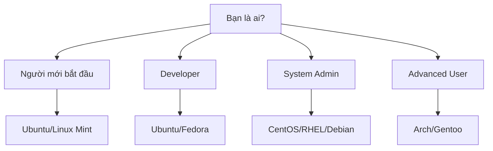

# Linux Introduction - Complete Guide

## 🎯 Learning Objectives

Sau khi hoàn thành chương này, bạn sẽ:

- Hiểu được hệ điều hành là gì và vai trò của nó
- Nắm rõ Linux là gì và lịch sử phát triển
- Phân biệt được Linux và Unix
- Biết các distributions (flavors) phổ biến của Linux
- Hiểu về các loại người dùng Linux
- So sánh Linux với Windows một cách chi tiết

---

## 🖥️ Hệ Điều Hành Là Gì?

### Định nghĩa

Hệ điều hành (Operating System - OS) là một phần mềm hệ thống quản lý và điều khiển tài nguyên phần cứng và phần mềm của máy tính.

### Vai trò chính của Hệ Điều Hành

#### 1. Quản lý tài nguyên phần cứng

- **CPU**: Phân chia thời gian xử lý cho các tiến trình
- **Memory (RAM)**: Cấp phát và thu hồi bộ nhớ
- **Storage**: Quản lý hệ thống file và thiết bị lưu trữ
- **I/O Devices**: Điều khiển bàn phím, chuột, màn hình, máy in

#### 2. Cung cấp giao diện người dùng

- **GUI** (Graphical User Interface): Giao diện đồ họa
- **CLI** (Command Line Interface): Giao diện dòng lệnh

#### 3. Quản lý tiến trình và an ninh

- Tạo, dừng, và giám sát các tiến trình
- Phân quyền truy cập file và thư mục
- Xác thực người dùng

---

## 🐧 Linux Là Gì?

### Định nghĩa

Linux là một hệ điều hành mã nguồn mở, miễn phí, dựa trên Unix, được phát triển bởi Linus Torvalds năm 1991.

### Lịch Sử Phát Triển

| Năm          | Sự kiện quan trọng                                 |
| ------------ | -------------------------------------------------- |
| **1991**     | Linus Torvalds tạo ra Linux kernel đầu tiên        |
| **1992**     | Phát hành Linux kernel 0.12 với giấy phép GPL      |
| **1993**     | Ra mắt Slackware - một trong những distro đầu tiên |
| **1994**     | Phát hành Linux kernel 1.0                         |
| **1996**     | Xuất hiện Red Hat và Debian                        |
| **2004**     | Ra mắt Ubuntu                                      |
| **Hiện tại** | Linux kernel 6.x với hàng triệu dòng code          |

### Đặc điểm nổi bật

- ✅ **Mã nguồn mở**: Có thể xem, sửa đổi và phân phối
- ✅ **Miễn phí**: Không mất phí bản quyền
- ✅ **Bảo mật cao**: Ít bị virus và malware
- ✅ **Ổn định**: Có thể chạy liên tục nhiều tháng không restart
- ✅ **Hiệu năng cao**: Tối ưu cho server và embedded systems

---

## ⚖️ So Sánh Linux vs Unix

### Lịch sử và nguồn gốc

| Aspect         | Unix                         | Linux                            |
| -------------- | ---------------------------- | -------------------------------- |
| **Năm ra đời** | 1969 (Bell Labs)             | 1991                             |
| **Người tạo**  | Ken Thompson, Dennis Ritchie | Linus Torvalds                   |
| **Bản chất**   | Hệ điều hành thương mại      | Mã nguồn mở                      |
| **Giấy phép**  | Proprietary                  | GPL (GNU General Public License) |

### Điểm giống nhau

- 🔄 Cùng triết lý thiết kế Unix
- 🔄 Hỗ trợ multi-user và multi-tasking
- 🔄 Sử dụng shell và command line
- 🔄 Hệ thống file tương tự
- 🔄 Networking capabilities mạnh mẽ

### Điểm khác biệt

| Tiêu chí        | Unix                            | Linux                       |
| --------------- | ------------------------------- | --------------------------- |
| **Chi phí**     | Đắt đỏ (hàng nghìn $)           | Miễn phí                    |
| **Mã nguồn**    | Đóng (Closed source)            | Mở (Open source)            |
| **Phần cứng**   | Chỉ chạy trên hardware đặc biệt | Chạy trên mọi loại hardware |
| **Vendor**      | IBM, HP, Oracle, etc.           | Cộng đồng + các công ty     |
| **Flexibility** | Hạn chế                         | Rất linh hoạt               |

---

## 📦 Các Linux Distributions Phổ Biến

### Debian-based

#### Ubuntu

- **Mục đích**: Desktop, Server, Cloud
- **Đặc điểm**: Dễ sử dụng, cộng đồng lớn
- **Phù hợp**: Người mới bắt đầu, developer

#### Debian

- **Mục đích**: Server, Desktop
- **Đặc điểm**: Ổn định, bảo mật cao
- **Phù hợp**: Production server

### Red Hat-based

#### CentOS/Rocky Linux

- **Mục đích**: Enterprise server
- **Đặc điểm**: Ổn định, hỗ trợ dài hạn
- **Phù hợp**: Corporate environment

#### Fedora

- **Mục đích**: Desktop, Development
- **Đặc điểm**: Công nghệ mới nhất
- **Phù hợp**: Developer, enthusiast

### Independent

#### Arch Linux

- **Mục đích**: Advanced users
- **Đặc điểm**: Rolling release, tùy chỉnh cao
- **Phù hợp**: Power users

#### openSUSE

- **Mục đích**: Desktop, Server
- **Đặc điểm**: YaST configuration tool
- **Phù hợp**: Enterprise, education

### Chọn Distribution nào?

---

## 👥 Các Loại Người Dùng Linux

### 1. End Users (Người dùng cuối)

- **Mục đích**: Sử dụng máy tính cá nhân hàng ngày
- **Distro phù hợp**: Ubuntu, Linux Mint, Elementary OS
- **Ứng dụng**: Web browsing, office work, multimedia

### 2. Developers (Lập trình viên)

- **Mục đích**: Phát triển phần mềm
- **Distro phù hợp**: Ubuntu, Fedora, Debian
- **Tools**: Git, Docker, IDEs, compilers

### 3. System Administrators

- **Mục đích**: Quản lý server và hệ thống
- **Distro phù hợp**: CentOS, RHEL, Ubuntu Server
- **Skills**: Shell scripting, networking, security

### 4. DevOps Engineers

- **Mục đích**: Automation, CI/CD, Infrastructure
- **Distro phù hợp**: Ubuntu, CentOS, CoreOS
- **Tools**: Kubernetes, Ansible, Terraform

### 5. Security Professionals

- **Mục đích**: Penetration testing, forensics
- **Distro phù hợp**: Kali Linux, Parrot Security
- **Tools**: Nmap, Wireshark, Metasploit

### 6. Enthusiasts/Power Users

- **Mục đích**: Học hỏi, tùy chỉnh hệ thống
- **Distro phù hợp**: Arch, Gentoo, LFS
- **Focus**: Kernel compilation, customization

---

## 🔄 So Sánh Linux vs Windows Chi Tiết

### Bảng So Sánh Tổng Quan

| Tiêu chí             | Linux                  | Windows        |
| -------------------- | ---------------------- | -------------- |
| **Giá cả**           | Miễn phí               | $100-300+      |
| **Mã nguồn**         | Mở                     | Đóng           |
| **Bảo mật**          | Rất cao                | Trung bình     |
| **Virus/Malware**    | Rất ít                 | Nhiều          |
| **Stability**        | Rất ổn định            | Ổn định        |
| **Performance**      | Cao                    | Trung bình-Cao |
| **Hardware Support** | Tốt                    | Rất tốt        |
| **Gaming**           | Đang cải thiện         | Xuất sắc       |
| **Software**         | Ít phần mềm thương mại | Nhiều          |

### Chi Tiết Từng Khía Cạnh

#### 🛡️ Bảo Mật

**Linux:**

- Kiến trúc permissions mạnh mẽ
- Ít target cho malware
- Updates bảo mật nhanh chóng
- Built-in firewall (iptables)

**Windows:**

- Windows Defender tích hợp
- Frequent security updates
- Nhiều target cho virus
- User Account Control (UAC)

#### 🎮 Gaming

**Linux:**

- Steam Proton cải thiện compatibility
- Native games đang tăng
- Emulation tốt cho retro games
- Performance cao với proper drivers

**Windows:**

- DirectX support
- Hầu hết games được optimize
- Hardware acceleration tốt
- VR support toàn diện

#### 💼 Sử Dụng Doanh Nghiệp

**Linux:**

- Chi phí licensing thấp
- Server deployment mạnh mẽ
- Container/Cloud native
- Automation và scripting tốt

**Windows:**

- Integration với Microsoft ecosystem
- Active Directory
- Office 365 seamless
- Enterprise support

#### 🖥️ Desktop Experience

**Linux:**

- Multiple desktop environments
- Highly customizable
- Command line powerful
- Resource efficient

**Windows:**

- Consistent UI/UX
- Familiar interface
- Better hardware detection
- Multimedia support tốt

### Khi Nào Nên Chọn Linux?

✅ **Chọn Linux khi:**

- Làm việc với servers/cloud
- Development work
- Quan tâm đến privacy/security
- Muốn tùy chỉnh sâu
- Budget hạn chế
- Học DevOps/System Administration

❌ **Không nên chọn Linux khi:**

- Gaming là ưu tiên hàng đầu
- Cần Adobe Creative Suite
- Làm việc với Windows-only software
- Không muốn học command line
- Cần support 24/7 từ vendor

---

## 🎯 Tổng Kết

### Key Takeaways

1. **Linux** là hệ điều hành mã nguồn mở, mạnh mẽ và linh hoạt
2. **Nhiều distributions** phù hợp với different use cases
3. **Command line** là sức mạnh của Linux
4. **Security và stability** là điểm mạnh lớn nhất
5. **Learning curve** steep nhưng đáng giá

### Bước Tiếp Theo

- Cài đặt Linux trong virtual machine
- Học basic command line
- Explore filesystem structure
- Practice với package management
- Join Linux communities

---

## 📚 Resources

### Official Documentation

- [Linux Documentation Project](https://tldp.org/)
- [Ubuntu Documentation](https://help.ubuntu.com/)
- [Red Hat Documentation](https://access.redhat.com/documentation/)

### Learning Platforms

- [Linux Academy](https://linuxacademy.com/)
- [edX Linux Courses](https://www.edx.org/)
- [Coursera Linux Specializations](https://www.coursera.org/)

### Communities

- [r/linux](https://reddit.com/r/linux)
- [Linux Questions](https://www.linuxquestions.org/)
- [Stack Overflow - Linux](https://stackoverflow.com/questions/tagged/linux)
