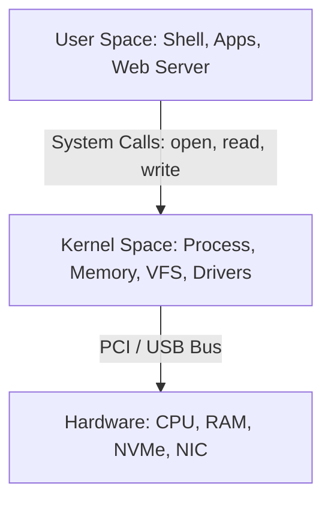

# 🐧 Objective 101.1: Quản Lý Phần Cứng & Thư Mục Ảo Linux - Bản Chất Hệ Thống & Thực Chiến DevOps

> 💡 **Bản chất 1 câu**: Linux quản lý mọi phần cứng qua các tệp tin ảo trong RAM (/sys, /proc, /dev), giúp DevOps kiểm tra tài nguyên và nạp driver động không cần reboot.  
> 🎯 **Trọng tâm phỏng vấn DevOps**: Phân biệt bản chất /proc vs /sys vs /dev, cách kiểm tra SSD/HDD, và cơ chế Kernel Module cho Docker/K8s.

---




---

## 2. 📚 Lý Thuyết Chuyên Sâu

### 2.2 Kiến Trúc Giao Tiếp Phần Cứng & Kernel Subsystems (sysfs, procfs, udev)
- **`/sys` (sysfs)**: File system ảo do Kernel mount, biểu diễn cây sơ đồ thiết bị phần cứng thực tế (bộ nhớ, bus, cạc mạng, đĩa cứng) dưới dạng các file cấu hình có thể đọc/ghi trực tiếp.
- **`/proc` (procfs)**: File system ảo biểu diễn thông tin trạng thái hoạt động của Kernel và các tiến trình (Processes).
- **`udev` Daemon**: Tiến trình lắng nghe sự kiện cắm/rút thiết bị phần cứng (Kernel uevents) để tự động tạo file thiết bị tương ứng trong thư mục `/dev` (ví dụ: `/dev/sda`, `/dev/nvme0n1`).
- **Kernel Modules (`.ko`)**: Các trình điều khiển (Drivers) được nạp động vào Kernel space bằng `modprobe` mà không cần khởi động lại máy.
 & Bản Chất Hệ Thống (Under The Hood Mechanics)

### 2.1 Kiến Trúc 3 Thư Mục Ảo (Virtual Filesystems) Trong Kernel
Các thư mục `/sys`, `/proc`, `/dev` là các **Filesystem ảo (In-memory Filesystem)** do Kernel Linux tự tạo ra trên RAM khi boot:
1. **`/proc/` (procfs)**: Xuất dữ liệu nội tại của Kernel và thông tin các tiến trình (Processes). Mỗi tiến trình `X` có thư mục `/proc/X/` chứa `cmdline`, `environ`, `fd/` (File Descriptors). Đọc thông số RAM tại `/proc/meminfo`, CPU tại `/proc/cpuinfo`.
2. **`/sys/` (sysfs)**: Xuất cấu trúc cây thiết bị phần cứng (Device Tree) theo mô hình đối tượng Unified Device Model từ Kernel 2.6. Đọc `/sys/block/sda/queue/rotational` (0 là SSD/NVMe, 1 là HDD).
3. **`/dev/` (devtmpfs)**: Chứa các tệp đại diện (Device Nodes) có số Major (loại driver) và Minor (thứ tự thiết bị). Được quản lý tự động bởi `udev`. Các tệp ảo đặc biệt: `/dev/null` (hố đen dữ liệu), `/dev/zero` (chuỗi byte 0), `/dev/urandom` (ngẫu nhiên mã hóa).

### 2.2 Cơ Chế Nạp Kernel Modules (.ko)
Kernel Linux là Monolithic Kernel có Modular. Các driver phần cứng được biên dịch thành file `.ko` (Kernel Object).
- `modprobe`: Đọc tệp phụ thuộc `/lib/modules/$(uname -r)/modules.dep` để tự động nạp toàn bộ các module phụ thuộc theo đúng thứ tự.


---


### 2.4 Cơ Chế Hoạt Động Bên Dưới Kernel & Kiến Trúc Hệ Thống Chi Tiết (Deep Kernel & Architecture)
- **Tầng Giao Tiếp System Calls**: Mọi thao tác người dùng hay lệnh CLI gõ trên Terminal đều trải qua giao diện System Call Interface (như `open()`, `read()`, `write()`, `fork()`, `execve()`, `socket()`, `epoll_wait()`) để chuyển quyền điều khiển từ User Space (Ring 3) xuống Kernel Space (Ring 0).
- **Quản Lý Tài Nguyên & Cấu Trúc Dữ Liệu**: Kernel duy trì các cấu trúc dữ liệu bảng điều khiển (Process Control Block - PCB, File Descriptor Table, Inode Index Table, Page Tables) để đảm bảo cô lập tài nguyên, an toàn bộ nhớ và tối ưu hiệu năng I/O.
- **Tương Tác Phần Cứng & Drivers**: Các trình điều khiển thiết bị (Kernel Modules `.ko`) trực tiếp tương tác với thanh ghi phần cứng (Hardware Registers) qua ngắt CPU (Interrupts - IRQ) và truy cập bộ nhớ trực tiếp (DMA - Direct Memory Access).

---

## 3. ⚡ Bảng Tra Cứu Câu Lệnh Thực Hành (CLI Command Reference)

| Câu lệnh | Tham số (Options/Flags) | Giải thích ý nghĩa chi tiết | Ví dụ thực tế trong DevOps |
| :--- | :--- | :--- | :--- |
| **`lsmod`** | `Không` | Liệt kê toàn bộ Kernel Module đang active trong RAM | `lsmod | grep overlay` |
| **`modprobe`** | `-r, -v` | Nạp hoặc gỡ Kernel Module tự động giải quyết phụ thuộc | `sudo modprobe overlay` |
| **`modinfo`** | `-p, -n` | Xem chi tiết tác giả, tham số và file .ko của module | `modinfo e1000e` |
| **`lspci`** | `-k, -nn` | Liệt kê các thiết bị kết nối qua bus PCI/PCIe | `lspci -k | grep -A 2 Ethernet` |
| **`lsusb`** | `-t, -v` | Liệt kê các thiết bị kết nối qua cổng USB dạng cây | `lsusb -t` |


---

## 4. 🛠 Thao Tác Thực Chiến & Kịch Bản DevOps (Real-World Scenarios)

### 🛠 Các lệnh thực hành gõ là ăn ngay:
```bash
# Kiểm tra chi tiết thông số Interrupts CPU:
cat /proc/interrupts
# Xem danh sách module kernel đang chạy kèm dung lượng bộ nhớ:
lsmod | head -n 10
# Nạp module kernel kèm tham số tùy chỉnh:
sudo modprobe e1000e InterruptThrottleRate=3
```
```bash
# Kiểm tra đĩa sda là SSD (0) hay HDD (1)
cat /sys/block/sda/queue/rotational

# Xem CPU info
cat /proc/cpuinfo | grep 'model name'

# Hủy output rác
cmd > /dev/null 2>&1
```

### 🚀 Kịch bản xử lý sự cố thực tế khi đi làm:
Sự cố cạc mạng NIC không nhận driver khi cắm vào máy chủ Server:
# Chạy `dmesg -T | grep -i network` xem Kernel có nhận dạng được PCI ID hay không. Nếu thiếu firmware, cài gói `firmware-linux-nonfree` hoặc `linux-firmware` và chạy `sudo udevadm trigger`.

Sự cố Docker báo lỗi Storage driver overlay2 is not supported:
sudo modprobe overlay
echo 'overlay' | sudo tee /etc/modules-load.d/overlay.conf

---


### 4.2 Chi Tiết Các Lỗi Thường Gặp & Kịch Bản Khắc Phục Lỗi (Troubleshooting Deep-Dive)
1. **Sự cố 1: Lỗi Cạn Kiệt Tài Nguyên & Nghẽn Cổ Chai (Resource Exhaustion / Bottleneck)**:
   - **Triệu chứng**: Hệ thống phản hồi siêu chậm, ứng dụng bị crash OOM (Out Of Memory) hoặc lệnh báo `No space left on device` dù đĩa còn dung lượng trống.
   - **Bản chất nguyên nhân**: Cạn kiệt Inodes đĩa cứng (`df -i`), tràn bộ nhớ đệm RAM (`free -h`), hoặc cạn kiệt File Descriptors tối đa (`sysctl fs.file-max`).
   - **Các bước xử lý khẩn cấp**:
     ```bash
     # 1. Kiểm tra số lượng Inodes khả dụng trên đĩa:
     df -i /
     
     # 2. Tìm thư mục chứa hàng triệu file rác gây hết Inodes:
     find /var/spool /tmp -xdev -type f | cut -d/ -f2-4 | sort | uniq -c | sort -nr | head -n 10
     
     # 3. Kiểm tra các tiến trình đang chiếm giữ file đã bị xóa (Deleted Descriptor Leak):
     sudo lsof | grep deleted
     
     # 4. Giải phóng bộ nhớ RAM Cache tạm thời của Linux Kernel:
     sudo sysctl -w vm.drop_caches=3
     ```

2. **Sự cố 2: Lỗi Sai Cấu Hình & Tự Động Phục Hồi (Configuration Misconfiguration & Recovery)**:
   - **Triệu chứng**: Dịch vụ ngắt đột ngột, không kết nối được qua cổng mạng (Port Unreachable) hoặc lệnh service return exit code != 0.
   - **Các bước xử lý khẩn cấp**:
     ```bash
     # 1. Kiểm tra cú pháp file cấu hình trước khi restart service:
     sudo systemctl status <service_name> --no-pager -l
     
     # 2. Xem log chi tiết lỗi khởi động từ Journald binary log:
     sudo journalctl -u <service_name> -n 100 --no-pager -e
     
     # 3. Phân tích lời gọi hệ thống Syscall xem tiến trình bị treo ở đâu bằng strace:
     sudo strace -p <PID> -f -e trace=file,network
     ```

---

## 5. 🚀 Bộ Câu Hỏi Phỏng Vấn DevOps

> **Q: Sự khác biệt cốt lõi giữa `/proc` và `/sys` trong Linux là gì?**  
> **A**: `/proc` chứa thông tin trạng thái tiến trình và runtime parameters của Kernel. `/sys` (sysfs) chứa cấu trúc phân cấp cây thiết bị phần cứng vật lý và drivers.

> **Q: Lệnh `modprobe` khác gì so với `insmod` khi nạp Kernel Module?**  
> **A**: `insmod` chỉ nạp đúng 1 file module `.ko` chỉ định và sẽ báo lỗi nếu thiếu module phụ thuộc. `modprobe` tự động phân tích cây phụ thuộc (dependencies) trong `modules.dep` và nạp đầy đủ các module liên quan.

 Thực Tế (Interview Q&A)

> **Q: Sự khác biệt về bản chất giữa /proc và /sys là gì?**  
> **A**: /proc tập trung vào dữ liệu tiến trình và RAM/CPU của Kernel. /sys tập trung biểu diễn cấu trúc cây phần cứng chuẩn hóa.

> **Q: Làm sao nạp Kernel Module cho Docker mà không cần reboot Server?**  
> **A**: Sử dụng lệnh `sudo modprobe overlay` tự động giải quyết phụ thuộc từ modules.dep.


> **Q: Làm thế nào để điều tra và xử lý tận gốc sự cố Linux Server báo lỗi "No space left on device" trong khi lệnh `df -h` cho thấy dung lượng đĩa vẫn còn trống 40%?**  
> **A**: Lỗi này thường do 2 nguyên nhân cốt lõi:  
> 1. **Hết Inode (Inode Exhaustion)**: File system đã dùng hết số lượng bảng Inode để lưu trữ metadata file (do có hàng triệu file kích thước siêu nhỏ 0-byte). Kiểm tra bằng `df -i`. Xử lý bằng cách tìm và xóa các thư mục chứa file rác (như `/var/spool/postfix/maildrop` hay `/tmp`).  
> 2. **File Descriptor Leak (File đã xóa nhưng tiến trình vẫn đang mở)**: Một file dung lượng lớn bị xóa bằng lệnh `rm` nhưng tiến trình ứng dụng vẫn đang giữ file handle mở, khiến Kernel chưa thể giải phóng dung lượng đĩa thực sự. Kiểm tra bằng `sudo lsof | grep deleted`, sau đó restart lại tiến trình giữ file đó để Kernel thu hồi đĩa.

> **Q: Giải thích sự khác biệt giữa hai tín hiệu ngắt `SIGTERM` (15) và `SIGKILL` (9) trong Linux OS? Khi nào nên dùng loại nào trong kịch bản tự động hóa DevOps?**  
> **A**:  
> - **`SIGTERM` (Signal 15)**: Tín hiệu yêu cầu dừng ứng dụng **thỏa thuận (Graceful Termination)**. Tiến trình có thể bắt (catch) tín hiệu này để đóng kết nối Database, lưu trạng thái dữ liệu và dọn dẹp tài nguyên trước khi thoát hoàn toàn. Luôn luôn ưu tiên dùng `SIGTERM` trước (như trong Docker/Kubernetes shutdown flow).  
> - **`SIGKILL` (Signal 9)**: Tín hiệu dừng ứng dụng **cưỡng chế tuyệt đối (Forced Termination)** do Kernel trực tiếp tiêu diệt tiến trình ngay lập tức. Tiến trình KHÔNG THỂ bắt hay lờ đi tín hiệu này, dẫn tới nguy cơ hỏng dữ liệu dở dang. Chỉ dùng `SIGKILL` khi tiến trình bị treo đơ không phản hồi `SIGTERM`.

---

## 6. 📝 Cheat Sheet & Ghi Nhớ Nhanh (Summary)

- [x] /proc: RAM/CPU & Tiến trình
- [x] /sys: Cấu trúc cây phần cứng (0 SSD, 1 HDD)
- [x] /dev/null: Hố đen dữ liệu
- [x] modprobe: Nạp driver thông minh

