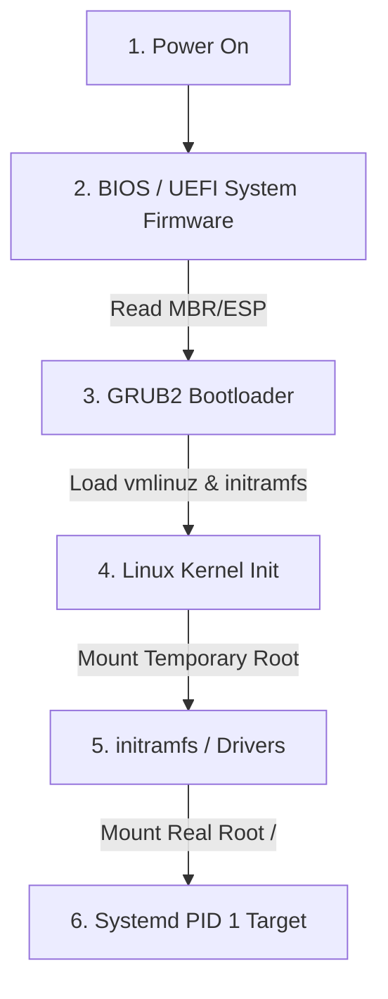
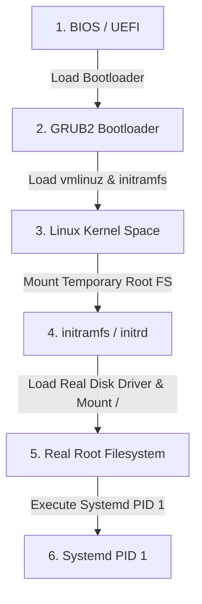

# 🐧 Objective 101.2: Tiến Trình Khởi Động Linux & Diagnostic Logs - Bản Chất Hệ Thống & Thực Chiến DevOps

> 💡 **Bản chất 1 câu**: Tiến trình boot đi từ BIOS/UEFI -> GRUB2 -> Kernel -> Systemd (PID 1), debug lỗi boot qua dmesg và journalctl -b.  
> 🎯 **Trọng tâm phỏng vấn DevOps**: 4 Giai đoạn Boot Linux, vai trò PID 1 của Systemd, đọc dmesg và journalctl -b.

---




---

## 2. 📚 Lý Thuyết Chuyên Sâu

### 2.2 Chi Tiết Tiến Trình Khởi Động Linux


 (Boot Sequence Internals)

- **vmlinuz**: File nhị phân nén của Linux Kernel.
- **initramfs (Initial RAM Filesystem)**: File cdfs nén chứa cạc đĩa (RAID/NVMe/LVM driver) tạm thời được nạp vào RAM để Kernel mount ổ đĩa chính `/`.
- **Systemd (PID 1)**: Tiến trình gốc đầu tiên được Kernel kích hoạt để khởi động tất cả các services/daemons còn lại.
 & Bản Chất Hệ Thống (Under The Hood Mechanics)

### 2.1 Bản Chất 4 Giai Đoạn Boot Linux
1. **BIOS / UEFI**: BIOS đọc 512 bytes đầu đĩa (MBR Partition Table). UEFI đọc phân đĩa ESP FAT32 chứa file `.efi`.
2. **GRUB2 Bootloader**: Nạp `vmlinuz` (ảnh nén Kernel) và `initramfs` (đĩa RAM ảo tạm thời chứa driver đĩa).
3. **Kernel Initialization**: Kernel giải nén `initramfs` vào RAM, nạp driver SATA/NVMe/LVM, mount đĩa root thật (`/`) bằng `pivot_root`, rồi gọi tiến trình PID 1.
4. **Systemd / Init (PID 1)**: Tiến trình cha PID 1 đọc `default.target` để khởi chạy song song các service SSH, Docker, Network.

### 2.2 Log Khởi Động (Boot Diagnostics Logs)
- `dmesg`: Đọc bộ nhớ đệm **Kernel Ring Buffer** trong RAM chứa log khởi tạo driver phần cứng của Kernel.
- `journalctl -b`: Đọc nhật ký binary của Systemd cho lượt boot hiện tại (`journalctl -b -1` đọc lượt boot trước).


---


### 2.4 Cơ Chế Hoạt Động Bên Dưới Kernel & Kiến Trúc Hệ Thống Chi Tiết (Deep Kernel & Architecture)
- **Tầng Giao Tiếp System Calls**: Mọi thao tác người dùng hay lệnh CLI gõ trên Terminal đều trải qua giao diện System Call Interface (như `open()`, `read()`, `write()`, `fork()`, `execve()`, `socket()`, `epoll_wait()`) để chuyển quyền điều khiển từ User Space (Ring 3) xuống Kernel Space (Ring 0).
- **Quản Lý Tài Nguyên & Cấu Trúc Dữ Liệu**: Kernel duy trì các cấu trúc dữ liệu bảng điều khiển (Process Control Block - PCB, File Descriptor Table, Inode Index Table, Page Tables) để đảm bảo cô lập tài nguyên, an toàn bộ nhớ và tối ưu hiệu năng I/O.
- **Tương Tác Phần Cứng & Drivers**: Các trình điều khiển thiết bị (Kernel Modules `.ko`) trực tiếp tương tác với thanh ghi phần cứng (Hardware Registers) qua ngắt CPU (Interrupts - IRQ) và truy cập bộ nhớ trực tiếp (DMA - Direct Memory Access).

---

## 3. ⚡ Bảng Tra Cứu Câu Lệnh Thực Hành (CLI Command Reference)

| Câu lệnh | Tham số (Options/Flags) | Giải thích ý nghĩa chi tiết | Ví dụ thực tế trong DevOps |
| :--- | :--- | :--- | :--- |
| **`dmesg`** | `-T, -l err, -w` | Đọc trực tiếp log Kernel Ring Buffer từ RAM | `dmesg -T | grep -i error` |
| **`journalctl`** | `-b, -u, -p err` | Xem log hệ thống Systemd theo lượt boot | `journalctl -b -p err` |
| **`uname`** | `-r, -a` | Xem phiên bản Kernel Linux đang chạy | `uname -r` |


---

## 4. 🛠 Thao Tác Thực Chiến & Kịch Bản DevOps (Real-World Scenarios)

### 🛠 Các lệnh thực hành gõ là ăn ngay:
```bash
# Phân tích thời gian khởi động của từng dịch vụ bằng systemd-analyze:
systemd-analyze blame
# Xoay vết biểu đồ thời gian boot ra file SVG:
systemd-analyze plot > boot.svg
```
```bash
# Xem log Kernel có ngày giờ:
dmesg -T -w

# Xem lỗi boot lượt này:
journalctl -b -p err
```

### 🚀 Kịch bản xử lý sự cố thực tế khi đi làm:
Sự cố Server bị dừng ở màn hình GRUB / initramfs prompt không boot được vào OS:
# Nguyên nhân: File `/etc/fstab` bị sai UUID ổ đĩa hoặc đứt gãy initramfs. Sửa bằng cách dùng Live CD `chroot /mnt` và chạy `dracut -f` hoặc `update-initramfs -u`.

Debug máy chủ không nhận card mạng sau khi boot:
dmesg -T | grep -i eth
journalctl -b -u systemd-networkd

---


### 4.2 Chi Tiết Các Lỗi Thường Gặp & Kịch Bản Khắc Phục Lỗi (Troubleshooting Deep-Dive)
1. **Sự cố 1: Lỗi Cạn Kiệt Tài Nguyên & Nghẽn Cổ Chai (Resource Exhaustion / Bottleneck)**:
   - **Triệu chứng**: Hệ thống phản hồi siêu chậm, ứng dụng bị crash OOM (Out Of Memory) hoặc lệnh báo `No space left on device` dù đĩa còn dung lượng trống.
   - **Bản chất nguyên nhân**: Cạn kiệt Inodes đĩa cứng (`df -i`), tràn bộ nhớ đệm RAM (`free -h`), hoặc cạn kiệt File Descriptors tối đa (`sysctl fs.file-max`).
   - **Các bước xử lý khẩn cấp**:
     ```bash
     # 1. Kiểm tra số lượng Inodes khả dụng trên đĩa:
     df -i /
     
     # 2. Tìm thư mục chứa hàng triệu file rác gây hết Inodes:
     find /var/spool /tmp -xdev -type f | cut -d/ -f2-4 | sort | uniq -c | sort -nr | head -n 10
     
     # 3. Kiểm tra các tiến trình đang chiếm giữ file đã bị xóa (Deleted Descriptor Leak):
     sudo lsof | grep deleted
     
     # 4. Giải phóng bộ nhớ RAM Cache tạm thời của Linux Kernel:
     sudo sysctl -w vm.drop_caches=3
     ```

2. **Sự cố 2: Lỗi Sai Cấu Hình & Tự Động Phục Hồi (Configuration Misconfiguration & Recovery)**:
   - **Triệu chứng**: Dịch vụ ngắt đột ngột, không kết nối được qua cổng mạng (Port Unreachable) hoặc lệnh service return exit code != 0.
   - **Các bước xử lý khẩn cấp**:
     ```bash
     # 1. Kiểm tra cú pháp file cấu hình trước khi restart service:
     sudo systemctl status <service_name> --no-pager -l
     
     # 2. Xem log chi tiết lỗi khởi động từ Journald binary log:
     sudo journalctl -u <service_name> -n 100 --no-pager -e
     
     # 3. Phân tích lời gọi hệ thống Syscall xem tiến trình bị treo ở đâu bằng strace:
     sudo strace -p <PID> -f -e trace=file,network
     ```

---

## 5. 🚀 Bộ Câu Hỏi Phỏng Vấn DevOps

> **Q: File `initramfs` đóng vai trò gì quan trọng trong tiến trình boot Linux?**  
> **A**: Chứa các driver thiết bị (RAID, NVMe, LVM) tạm thời để nạp vào RAM, giúp Kernel mount được ổ đĩa cứng thực sự `/` trước khi bàn giao quyền điều khiển cho systemd.

> **Q: Lệnh `systemd-analyze blame` giúp ích gì cho kỹ sư DevOps khi tối ưu boot time?**  
> **A**: Hiển thị danh sách chính xác các dịch vụ systemd sắp xếp theo thời gian khởi động từ lâu nhất đến nhanh nhất, giúp phát hiện service gây chậm quá trình boot.

 Thực Tế (Interview Q&A)

> **Q: Tiến trình đầu tiên Linux khởi chạy có PID bằng bao nhiêu?**  
> **A**: Luôn là PID 1 (Systemd hoặc Init).

> **Q: Lệnh nào đọc log Kernel Ring Buffer ngay sau khi boot?**  
> **A**: Sử dụng lệnh `dmesg -T`.


> **Q: Làm thế nào để điều tra và xử lý tận gốc sự cố Linux Server báo lỗi "No space left on device" trong khi lệnh `df -h` cho thấy dung lượng đĩa vẫn còn trống 40%?**  
> **A**: Lỗi này thường do 2 nguyên nhân cốt lõi:  
> 1. **Hết Inode (Inode Exhaustion)**: File system đã dùng hết số lượng bảng Inode để lưu trữ metadata file (do có hàng triệu file kích thước siêu nhỏ 0-byte). Kiểm tra bằng `df -i`. Xử lý bằng cách tìm và xóa các thư mục chứa file rác (như `/var/spool/postfix/maildrop` hay `/tmp`).  
> 2. **File Descriptor Leak (File đã xóa nhưng tiến trình vẫn đang mở)**: Một file dung lượng lớn bị xóa bằng lệnh `rm` nhưng tiến trình ứng dụng vẫn đang giữ file handle mở, khiến Kernel chưa thể giải phóng dung lượng đĩa thực sự. Kiểm tra bằng `sudo lsof | grep deleted`, sau đó restart lại tiến trình giữ file đó để Kernel thu hồi đĩa.

> **Q: Giải thích sự khác biệt giữa hai tín hiệu ngắt `SIGTERM` (15) và `SIGKILL` (9) trong Linux OS? Khi nào nên dùng loại nào trong kịch bản tự động hóa DevOps?**  
> **A**:  
> - **`SIGTERM` (Signal 15)**: Tín hiệu yêu cầu dừng ứng dụng **thỏa thuận (Graceful Termination)**. Tiến trình có thể bắt (catch) tín hiệu này để đóng kết nối Database, lưu trạng thái dữ liệu và dọn dẹp tài nguyên trước khi thoát hoàn toàn. Luôn luôn ưu tiên dùng `SIGTERM` trước (như trong Docker/Kubernetes shutdown flow).  
> - **`SIGKILL` (Signal 9)**: Tín hiệu dừng ứng dụng **cưỡng chế tuyệt đối (Forced Termination)** do Kernel trực tiếp tiêu diệt tiến trình ngay lập tức. Tiến trình KHÔNG THỂ bắt hay lờ đi tín hiệu này, dẫn tới nguy cơ hỏng dữ liệu dở dang. Chỉ dùng `SIGKILL` khi tiến trình bị treo đơ không phản hồi `SIGTERM`.

---

## 6. 📝 Cheat Sheet & Ghi Nhớ Nhanh (Summary)

- [x] 4 Giai đoạn Boot: BIOS/UEFI -> GRUB2 -> Kernel -> Systemd
- [x] PID 1: Systemd (Tiến trình cha)
- [x] dmesg -T: Đọc log Kernel Ring Buffer
- [x] journalctl -b: xem log boot Systemd

