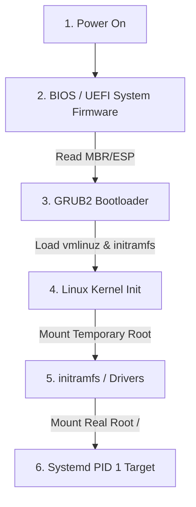
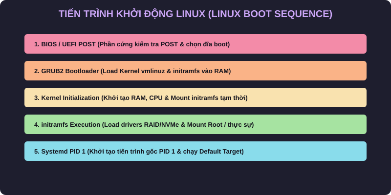
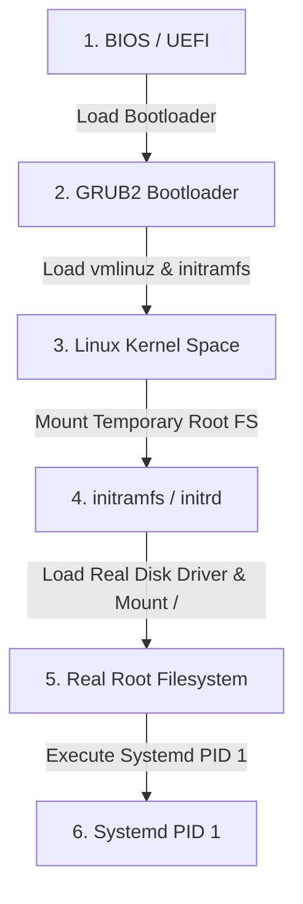

# 🐧 Objective 101.2: Tiến Trình Khởi Động Linux & Diagnostic Logs - Bản Chất Hệ Thống & Thực Chiến DevOps

> 💡 **Bản chất 1 câu**: Tiến trình boot đi từ BIOS/UEFI -> GRUB2 -> Kernel -> Systemd (PID 1), debug lỗi boot qua dmesg và journalctl -b.  
> 🎯 **Trọng tâm phỏng vấn DevOps**: 4 Giai đoạn Boot Linux, vai trò PID 1 của Systemd, đọc dmesg và journalctl -b.

---




---

## 2. 📚 Lý Thuyết Chuyên Sâu

### 2.2 Chi Tiết Tiến Trình Khởi Động Linux


 (Boot Sequence Internals)

- **vmlinuz**: File nhị phân nén của Linux Kernel.
- **initramfs (Initial RAM Filesystem)**: File cdfs nén chứa cạc đĩa (RAID/NVMe/LVM driver) tạm thời được nạp vào RAM để Kernel mount ổ đĩa chính `/`.
- **Systemd (PID 1)**: Tiến trình gốc đầu tiên được Kernel kích hoạt để khởi động tất cả các services/daemons còn lại.
 & Bản Chất Hệ Thống (Under The Hood Mechanics)

### 2.1 Bản Chất 4 Giai Đoạn Boot Linux
1. **BIOS / UEFI**: BIOS đọc 512 bytes đầu đĩa (MBR Partition Table). UEFI đọc phân đĩa ESP FAT32 chứa file `.efi`.
2. **GRUB2 Bootloader**: Nạp `vmlinuz` (ảnh nén Kernel) và `initramfs` (đĩa RAM ảo tạm thời chứa driver đĩa).
3. **Kernel Initialization**: Kernel giải nén `initramfs` vào RAM, nạp driver SATA/NVMe/LVM, mount đĩa root thật (`/`) bằng `pivot_root`, rồi gọi tiến trình PID 1.
4. **Systemd / Init (PID 1)**: Tiến trình cha PID 1 đọc `default.target` để khởi chạy song song các service SSH, Docker, Network.

### 2.2 Log Khởi Động (Boot Diagnostics Logs)
- `dmesg`: Đọc bộ nhớ đệm **Kernel Ring Buffer** trong RAM chứa log khởi tạo driver phần cứng của Kernel.
- `journalctl -b`: Đọc nhật ký binary của Systemd cho lượt boot hiện tại (`journalctl -b -1` đọc lượt boot trước).


---

## 3. ⚡ Bảng Tra Cứu Câu Lệnh Thực Hành (CLI Command Reference)

| Câu lệnh | Tham số (Options/Flags) | Giải thích ý nghĩa chi tiết | Ví dụ thực tế trong DevOps |
| :--- | :--- | :--- | :--- |
| **`dmesg`** | `-T, -l err, -w` | Đọc trực tiếp log Kernel Ring Buffer từ RAM | `dmesg -T | grep -i error` |
| **`journalctl`** | `-b, -u, -p err` | Xem log hệ thống Systemd theo lượt boot | `journalctl -b -p err` |
| **`uname`** | `-r, -a` | Xem phiên bản Kernel Linux đang chạy | `uname -r` |


---

## 4. 🛠 Thao Tác Thực Chiến & Kịch Bản DevOps (Real-World Scenarios)

### 🛠 Các lệnh thực hành gõ là ăn ngay:
```bash
# Phân tích thời gian khởi động của từng dịch vụ bằng systemd-analyze:
systemd-analyze blame
# Xoay vết biểu đồ thời gian boot ra file SVG:
systemd-analyze plot > boot.svg
```
```bash
# Xem log Kernel có ngày giờ:
dmesg -T -w

# Xem lỗi boot lượt này:
journalctl -b -p err
```

### 🚀 Kịch bản xử lý sự cố thực tế khi đi làm:
Sự cố Server bị dừng ở màn hình GRUB / initramfs prompt không boot được vào OS:
# Nguyên nhân: File `/etc/fstab` bị sai UUID ổ đĩa hoặc đứt gãy initramfs. Sửa bằng cách dùng Live CD `chroot /mnt` và chạy `dracut -f` hoặc `update-initramfs -u`.

Debug máy chủ không nhận card mạng sau khi boot:
dmesg -T | grep -i eth
journalctl -b -u systemd-networkd

---

## 5. 🚀 Bộ Câu Hỏi Phỏng Vấn DevOps

> **Q: File `initramfs` đóng vai trò gì quan trọng trong tiến trình boot Linux?**  
> **A**: Chứa các driver thiết bị (RAID, NVMe, LVM) tạm thời để nạp vào RAM, giúp Kernel mount được ổ đĩa cứng thực sự `/` trước khi bàn giao quyền điều khiển cho systemd.

> **Q: Lệnh `systemd-analyze blame` giúp ích gì cho kỹ sư DevOps khi tối ưu boot time?**  
> **A**: Hiển thị danh sách chính xác các dịch vụ systemd sắp xếp theo thời gian khởi động từ lâu nhất đến nhanh nhất, giúp phát hiện service gây chậm quá trình boot.

 Thực Tế (Interview Q&A)

> **Q: Tiến trình đầu tiên Linux khởi chạy có PID bằng bao nhiêu?**  
> **A**: Luôn là PID 1 (Systemd hoặc Init).

> **Q: Lệnh nào đọc log Kernel Ring Buffer ngay sau khi boot?**  
> **A**: Sử dụng lệnh `dmesg -T`.


---

## 6. 📝 Cheat Sheet & Ghi Nhớ Nhanh (Summary)

- [x] 4 Giai đoạn Boot: BIOS/UEFI -> GRUB2 -> Kernel -> Systemd
- [x] PID 1: Systemd (Tiến trình cha)
- [x] dmesg -T: Đọc log Kernel Ring Buffer
- [x] journalctl -b: xem log boot Systemd

