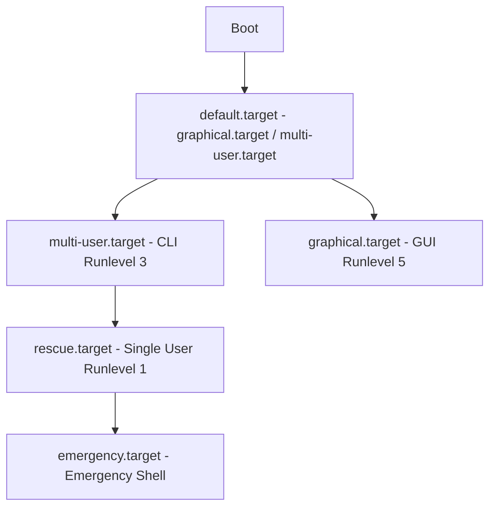

# 🐧 Objective 101.3: Quản Lý Runlevels, Boot Targets & Shutdown - Bản Chất Hệ Thống & Thực Chiến DevOps

> 💡 **Bản chất 1 câu**: Systemd dùng Target Units thay thế Runlevels (multi-user.target cho CLI Server, graphical.target cho GUI).  
> 🎯 **Trọng tâm phỏng vấn DevOps**: Chuyển đổi multi-user.target vs graphical.target, lệnh shutdown/reboot an toàn.

---



---

## 2. 📚 Lý Thuyết Chuyên Sâu & Bản Chất Hệ Thống (Under The Hood Mechanics)

### 2.1 Bản Chất SysVinit Runlevels vs Systemd Target Units
Systemd chuẩn hóa Runlevel số cổ điển thành các **Target Units** định dạng `.target`:

| Runlevel (SysVinit) | Systemd Target Unit | Bản chất hoạt động | Ứng dụng DevOps |
| :--- | :--- | :--- | :--- |
| **Runlevel 0** | `poweroff.target` | Ngắt toàn bộ dịch vụ và tắt nguồn | Shutdown máy chủ |
| **Runlevel 1 / S** | `rescue.target` | Single-user Mode (Chỉ Root, không mạng) | Cứu hộ, sửa lỗi `/etc/fstab`, reset pass root |
| **Runlevel 3** | `multi-user.target` | Multi-user CLI (Dòng lệnh + Mạng) | Standard Linux Server Production |
| **Runlevel 5** | `graphical.target` | Multi-user GUI (Giao diện đồ họa) | Máy trạm Linux Workstation |
| **Runlevel 6** | `reboot.target` | Khởi động lại hệ thống | Reboot Server |

Symlink chỉ định target mặc định: `/etc/systemd/system/default.target`.
Lệnh `shutdown` gửi broadcast `wall` tới tất cả các terminal trước khi tắt nguồn.


---

## 3. ⚡ Bảng Tra Cứu Câu Lệnh Thực Hành (CLI Command Reference)

| Câu lệnh | Tham số (Options/Flags) | Giải thích ý nghĩa chi tiết | Ví dụ thực tế trong DevOps |
| :--- | :--- | :--- | :--- |
| **`systemctl`** | `get-default, set-default, isolate` | Quản lý và chuyển đổi Target Units trong Systemd | `systemctl set-default multi-user.target` |
| **`shutdown`** | `-h, -r, +m` | Tắt máy hoặc reboot an toàn kèm thông báo broadcast | `shutdown -h +5 'Maintenance'` |
| **`wall`** | `Message` | Gửi thông báo tới tất cả người dùng đang đăng nhập | `wall 'System reboot in 5m'` |


---

## 4. 🛠 Thao Tác Thực Chiến & Kịch Bản DevOps (Real-World Scenarios)

### 🛠 Các lệnh thực hành gõ là ăn ngay:
```bash
# Đặt CLI làm mặc định:
sudo systemctl set-default multi-user.target

# Tắt máy sau 10 phút:
sudo shutdown -h +10 'Bảo trì'
```

### 🚀 Kịch bản xử lý sự cố thực tế khi đi làm:
Cấu hình 100 EC2 Instance chạy CLI nhẹ nhất:
sudo systemctl set-default multi-user.target
ls -l /etc/systemd/system/default.target

---

## 5. 🚀 Bộ Câu Hỏi Phỏng Vấn DevOps Thực Tế (Interview Q&A)

> **Q: Target Unit nào tương đương Runlevel 3 cổ điển?**  
> **A**: Là `multi-user.target` (Chạy CLI đa người dùng có mạng).

> **Q: Lệnh nào đặt giao diện dòng lệnh mặc định?**  
> **A**: Dùng `sudo systemctl set-default multi-user.target`.


---

## 6. 📝 Cheat Sheet & Ghi Nhớ Nhanh (Summary)

- [x] Runlevel 3: `multi-user.target` (CLI Server)
- [x] Runlevel 5: `graphical.target` (GUI)
- [x] systemctl set-default: Đặt chế độ mặc định
- [x] shutdown -h +m: Tắt máy an toàn

