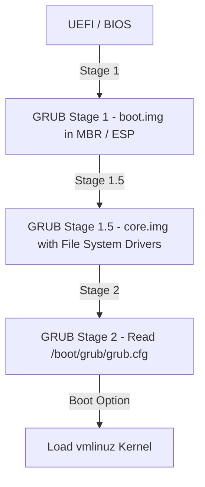

# 🐧 Objective 102.2: Cấu Hình GRUB2 Bootloader & Khôi Phục Root - Bản Chất Hệ Thống & Thực Chiến DevOps

> 💡 **Bản chất 1 câu**: GRUB2 đọc cấu hình từ /etc/default/grub, sinh file grub.cfg qua update-grub và cho phép boot vào Single-user để reset root pass.  
> 🎯 **Trọng tâm phỏng vấn DevOps**: File /etc/default/grub, lệnh update-grub/grub2-mkconfig, tham số init=/bin/bash.

---



---

## 2. 📚 Lý Thuyết Chuyên Sâu & Bản Chất Hệ Thống (Under The Hood Mechanics)

### 2.1 Kiến Trúc Cấu Hình GRUB2
- **File cấu hình người dùng**: `/etc/default/grub` (Chứa biến `GRUB_TIMEOUT`, `GRUB_CMDLINE_LINUX`).
- **File cấu hình hệ thống đã sinh**: `/boot/grub/grub.cfg` (Không được sửa trực tiếp!).
- **Lệnh cập nhật**: `update-grub` (Debian/Ubuntu) hoặc `grub2-mkconfig -o /boot/grub2/grub.cfg` (RHEL/CentOS).
- **Khôi phục Root Pass**: Reboot -> Nhấn `e` tại GRUB2 -> Thêm `init=/bin/bash` vào cuối dòng Kernel -> `Ctrl+X` -> Chạy `passwd root`.


---

## 3. ⚡ Bảng Tra Cứu Câu Lệnh Thực Hành (CLI Command Reference)

| Câu lệnh | Tham số (Options/Flags) | Giải thích ý nghĩa chi tiết | Ví dụ thực tế trong DevOps |
| :--- | :--- | :--- | :--- |
| **`update-grub`** | `Cập nhật lại grub.cfg trên Ubuntu` | Không | `sudo update-grub` |
| **`grub2-mkconfig`** | `Cập nhật grub.cfg trên RHEL/CentOS` | -o <path> | `grub2-mkconfig -o /boot/grub2/grub.cfg` |


---

## 4. 🛠 Thao Tác Thực Chiến & Kịch Bản DevOps (Real-World Scenarios)

### 🛠 Các lệnh thực hành gõ là ăn ngay:
```bash
# Khôi phục pass Root khi quên:
# Boot GRUB2 -> nhấn 'e' -> thêm 'init=/bin/bash' -> Ctrl+X -> passwd root
```

### 🚀 Kịch bản xử lý sự cố thực tế khi đi làm:
Sửa /etc/default/grub xong áp dụng lại:
sudo update-grub

---

## 5. 🚀 Bộ Câu Hỏi Phỏng Vấn DevOps Thực Tế (Interview Q&A)

> **Q: File nào chứa biến cấu hình GRUB2 cho phép người dùng sửa?**  
> **A**: File `/etc/default/grub`.

> **Q: Lệnh nào áp dụng cấu hình GRUB2 mới trên Ubuntu?**  
> **A**: Lệnh `sudo update-grub`.


---

## 6. 📝 Cheat Sheet & Ghi Nhớ Nhanh (Summary)

- [x] Cấu hình GRUB2: `/etc/default/grub`
- [x] Cập nhật: `update-grub`
- [x] Reset Root Pass: `init=/bin/bash`

