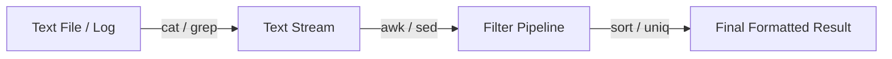

# 🐧 Objective 103.2: Xử Lý Luồng Văn Bản Bằng Bộ Lọc (Text Filters) - Bản Chất Hệ Thống & Thực Chiến DevOps

> 💡 **Bản chất 1 câu**: Thành thạo các bộ lọc văn bản `head`, `tail -f`, `cut`, `sort`, `uniq -c`, `wc -l` để phân tích log hệ thống.  
> 🎯 **Trọng tâm phỏng vấn DevOps**: Lệnh tail -f theo dõi log real-time, cut cắt cột, sort & uniq đếm dữ liệu trùng lặp.

---



---

## 2. 📚 Lý Thuyết Chuyên Sâu & Bản Chất Hệ Thống (Under The Hood Mechanics)

### 2.1 Bản Chất Xử Lý Luồng Text Stream
- Các công cụ Linux làm việc trên luồng dữ liệu từng dòng (Line-oriented text stream).
- `tail -f`: Sử dụng syscall `inotify` để lắng nghe sự kiện ghi tệp log và in ra màn hình tức thì.
- `uniq -c`: So sánh các dòng **kề nhau**. Do đó BẮT BUỘC phải dùng `sort` trước khi pipe sang `uniq`.


---

## 3. ⚡ Bảng Tra Cứu Câu Lệnh Thực Hành (CLI Command Reference)

| Câu lệnh | Tham số (Options/Flags) | Giải thích ý nghĩa chi tiết | Ví dụ thực tế trong DevOps |
| :--- | :--- | :--- | :--- |
| **`tail`** | `Xem log cuối file (real-time với -f)` | -f, -n 50 | `tail -f /var/log/nginx/access.log` |
| **`cut`** | `Cắt cột dữ liệu theo ký tự phân cách` | -d, -f | `cut -d: -f1 /etc/passwd` |
| **`sort`** | `Sắp xếp dữ liệu` | -n, -r, -k | `sort -nr` |
| **`uniq`** | `Đếm/Lọc dòng trùng lặp liên tiếp` | -c, -d | `uniq -c` |


---

## 4. 🛠 Thao Tác Thực Chiến & Kịch Bản DevOps (Real-World Scenarios)

### 🛠 Các lệnh thực hành gõ là ăn ngay:
```bash
# Lệnh kinh điển tìm TOP 5 IP truy cập nhiều nhất từ Nginx Access Log:
cat /var/log/nginx/access.log | cut -d' ' -f1 | sort | uniq -c | sort -nr | head -n 5
```

### 🚀 Kịch bản xử lý sự cố thực tế khi đi làm:
Filter log lỗi Nginx live stream:
tail -f /var/log/nginx/access.log | grep -i 500

---

## 5. 🚀 Bộ Câu Hỏi Phỏng Vấn DevOps Thực Tế (Interview Q&A)

> **Q: Tham số nào của tail cho phép xem log theo thời gian thực?**  
> **A**: Tùy chọn `tail -f` (follow).

> **Q: Tại sao phải dùng `sort` trước khi pipe sang `uniq`?**  
> **A**: Vì `uniq` chỉ so sánh các dòng nằm kề nhau liên tiếp.


---

## 6. 📝 Cheat Sheet & Ghi Nhớ Nhanh (Summary)

- [x] tail -f: Xem log live stream
- [x] cut -d -f: Cắt cột dữ liệu
- [x] sort | uniq -c: Gom nhóm đếm số lượng

