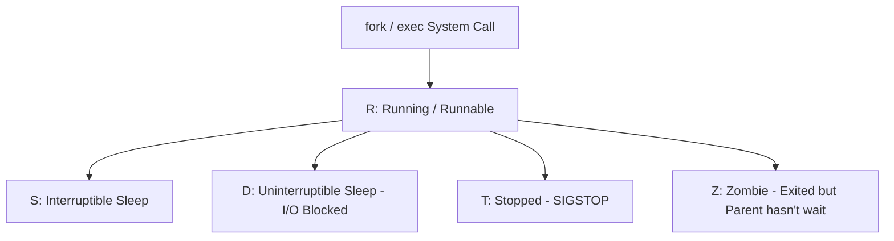
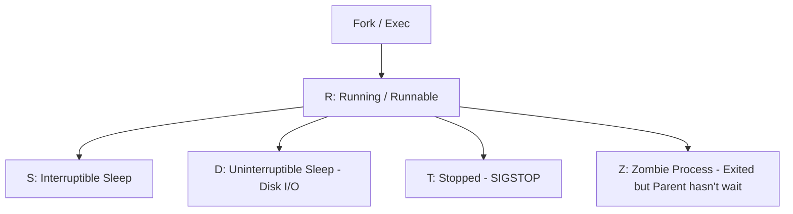

# 🐧 Objective 103.5: Quản Lý Tiến Trình (ps, top, kill & tmux) - Bản Chất Hệ Thống & Thực Chiến DevOps

> 💡 **Bản chất 1 câu**: Giám sát tiến trình bằng `ps aux` & `htop`, gửi Signal dừng tiến trình (`kill -15` vs `kill -9`), duy trì session bằng `tmux`.  
> 🎯 **Trọng tâm phỏng vấn DevOps**: Lệnh ps aux, top/htop, Signal 15 (SIGTERM) vs Signal 9 (SIGKILL), tmux session.

---




---

## 2. 📚 Lý Thuyết Chuyên Sâu

### 2.2 Kiến Trúc Tiến Trình Linux (Process States & Signals)

- **Process States**: `R` (Running), `S` (Sleeping), `D` (Uninterruptible Sleep - Thường kẹt Disk I/O không thể kill!), `Z` (Zombie - Tiến trình con đã chết nhưng cha chưa đọc exit code).
- **Signals**: `1` (SIGHUP - Reload config), `9` (SIGKILL - Ép diệt ngay), `15` (SIGTERM - Yêu cầu dừng êm đẹp), `17/18/19` (SIGSTOP/SIGCONT).
 & Bản Chất Hệ Thống (Under The Hood Mechanics)

### 2.1 Bản Chất Tiến Trình (Process) & POSIX Signals
- Tiến trình được quản lý bởi cấu trúc `struct task_struct` trong Kernel.
- Trạng thái tiến trình: `R` (Running), `S` (Sleeping), `D` (Uninterruptible Sleep - chờ đĩa), `Z` (Zombie - đã chết nhưng cha chưa thu hồi).
- **Signals**:
  - `SIGTERM (15)`: Cho phép tiến trình bắt signal và đóng file/connection an toàn trước khi thoát.
  - `SIGKILL (9)`: Kernel tiêu diệt tiến trình lập tức, tiến trình KHÔNG THỂ cưỡng lại hoặc bắt signal này.


---


### 2.4 Cơ Chế Hoạt Động Bên Dưới Kernel & Kiến Trúc Hệ Thống Chi Tiết (Deep Kernel & Architecture)
- **Tầng Giao Tiếp System Calls**: Mọi thao tác người dùng hay lệnh CLI gõ trên Terminal đều trải qua giao diện System Call Interface (như `open()`, `read()`, `write()`, `fork()`, `execve()`, `socket()`, `epoll_wait()`) để chuyển quyền điều khiển từ User Space (Ring 3) xuống Kernel Space (Ring 0).
- **Quản Lý Tài Nguyên & Cấu Trúc Dữ Liệu**: Kernel duy trì các cấu trúc dữ liệu bảng điều khiển (Process Control Block - PCB, File Descriptor Table, Inode Index Table, Page Tables) để đảm bảo cô lập tài nguyên, an toàn bộ nhớ và tối ưu hiệu năng I/O.
- **Tương Tác Phần Cứng & Drivers**: Các trình điều khiển thiết bị (Kernel Modules `.ko`) trực tiếp tương tác với thanh ghi phần cứng (Hardware Registers) qua ngắt CPU (Interrupts - IRQ) và truy cập bộ nhớ trực tiếp (DMA - Direct Memory Access).

---

## 3. ⚡ Bảng Tra Cứu Câu Lệnh Thực Hành (CLI Command Reference)

| Câu lệnh | Tham số (Options/Flags) | Giải thích ý nghĩa chi tiết | Ví dụ thực tế trong DevOps |
| :--- | :--- | :--- | :--- |
| **`ps`** | `Xem danh sách tiến trình đang chạy` | aux, -ef | `ps aux | grep python` |
| **`htop / top`** | `Giám sát CPU/RAM tiến trình thời gian thực` | Không | `htop` |
| **`kill`** | `Gửi Signal dừng tiến trình theo PID` | -15, -9 | `kill -9 <PID>` |
| **`tmux`** | `Tạo phiên làm việc terminal chạy ngầm` | new -s, attach | `tmux attach -t devops` |


---

## 4. 🛠 Thao Tác Thực Chiến & Kịch Bản DevOps (Real-World Scenarios)

### 🛠 Các lệnh thực hành gõ là ăn ngay:
```bash
# Tìm các tiến trình ở trạng thái Zombie (Z) hoặc Uninterruptible Sleep (D):
ps aux | awk '$8 ~ /[ZD]/ {print $0}'
# Diệt tất cả tiến trình theo tên ứng dụng:
sudo killall -9 nginx
```
```bash
# Tìm PID và diệt tiến trình bị treo:
ps aux | grep node
kill -9 12345

# Tạo tmux session:
tmux new -s build_session
```

### 🚀 Kịch bản xử lý sự cố thực tế khi đi làm:
Sự cố tiến trình ngốn 100% CPU nhưng dùng `kill -9` không thể diệt được:
# Nguyên nhân: Tiến trình đang nằm ở trạng thái `D` (Uninterruptible Sleep) do kẹt đĩa I/O hoặc NFS mount bị rớt. Phải xử lý ổ đĩa / mount point hoặc reboot máy.

Giám sát top 10 tiến trình tốn RAM nhất:
ps aux --sort=-%mem | head -n 10

---


### 4.2 Chi Tiết Các Lỗi Thường Gặp & Kịch Bản Khắc Phục Lỗi (Troubleshooting Deep-Dive)
1. **Sự cố 1: Lỗi Cạn Kiệt Tài Nguyên & Nghẽn Cổ Chai (Resource Exhaustion / Bottleneck)**:
   - **Triệu chứng**: Hệ thống phản hồi siêu chậm, ứng dụng bị crash OOM (Out Of Memory) hoặc lệnh báo `No space left on device` dù đĩa còn dung lượng trống.
   - **Bản chất nguyên nhân**: Cạn kiệt Inodes đĩa cứng (`df -i`), tràn bộ nhớ đệm RAM (`free -h`), hoặc cạn kiệt File Descriptors tối đa (`sysctl fs.file-max`).
   - **Các bước xử lý khẩn cấp**:
     ```bash
     # 1. Kiểm tra số lượng Inodes khả dụng trên đĩa:
     df -i /
     
     # 2. Tìm thư mục chứa hàng triệu file rác gây hết Inodes:
     find /var/spool /tmp -xdev -type f | cut -d/ -f2-4 | sort | uniq -c | sort -nr | head -n 10
     
     # 3. Kiểm tra các tiến trình đang chiếm giữ file đã bị xóa (Deleted Descriptor Leak):
     sudo lsof | grep deleted
     
     # 4. Giải phóng bộ nhớ RAM Cache tạm thời của Linux Kernel:
     sudo sysctl -w vm.drop_caches=3
     ```

2. **Sự cố 2: Lỗi Sai Cấu Hình & Tự Động Phục Hồi (Configuration Misconfiguration & Recovery)**:
   - **Triệu chứng**: Dịch vụ ngắt đột ngột, không kết nối được qua cổng mạng (Port Unreachable) hoặc lệnh service return exit code != 0.
   - **Các bước xử lý khẩn cấp**:
     ```bash
     # 1. Kiểm tra cú pháp file cấu hình trước khi restart service:
     sudo systemctl status <service_name> --no-pager -l
     
     # 2. Xem log chi tiết lỗi khởi động từ Journald binary log:
     sudo journalctl -u <service_name> -n 100 --no-pager -e
     
     # 3. Phân tích lời gọi hệ thống Syscall xem tiến trình bị treo ở đâu bằng strace:
     sudo strace -p <PID> -f -e trace=file,network
     ```

---

## 5. 🚀 Bộ Câu Hỏi Phỏng Vấn DevOps

> **Q: Tại sao không thể diệt một tiến trình ở trạng thái `D` (Uninterruptible Sleep) bằng lệnh `kill -9`?**  
> **A**: Vì tiến trình ở trạng thái `D` đang chờ Kernel xử lý xong thao tác I/O phần cứng (như đọc đĩa hoặc NFS). Kernel không xử lý bất kỳ Signal nào (kể cả SIGKILL) cho đến khi I/O hoàn tất.

> **Q: Tiến trình Zombie (Z) là gì và làm thế nào để dọn dẹp nó khỏi RAM?**  
> **A**: Zombie là tiến trình con đã kết thúc thi hành nhưng tiến trình cha chưa gọi hàm `wait()` để nhận exit code. Để dọn Zombie, phải diệt tiến trình CHA của nó hoặc gửi tín hiệu SIGHUP cho tiến trình cha.

 Thực Tế (Interview Q&A)

> **Q: Sự khác biệt giữa `kill -15` và `kill -9` là gì?**  
> **A**: `kill -15` (SIGTERM) dừng êm đẹp an toàn; `kill -9` (SIGKILL) ép Kernel tiêu diệt tiến trình lập tức.

> **Q: Công cụ nào giúp duy trì script chạy trên Server kể cả khi bị rớt kết nối SSH?**  
> **A**: Sử dụng `tmux`.


> **Q: Làm thế nào để điều tra và xử lý tận gốc sự cố Linux Server báo lỗi "No space left on device" trong khi lệnh `df -h` cho thấy dung lượng đĩa vẫn còn trống 40%?**  
> **A**: Lỗi này thường do 2 nguyên nhân cốt lõi:  
> 1. **Hết Inode (Inode Exhaustion)**: File system đã dùng hết số lượng bảng Inode để lưu trữ metadata file (do có hàng triệu file kích thước siêu nhỏ 0-byte). Kiểm tra bằng `df -i`. Xử lý bằng cách tìm và xóa các thư mục chứa file rác (như `/var/spool/postfix/maildrop` hay `/tmp`).  
> 2. **File Descriptor Leak (File đã xóa nhưng tiến trình vẫn đang mở)**: Một file dung lượng lớn bị xóa bằng lệnh `rm` nhưng tiến trình ứng dụng vẫn đang giữ file handle mở, khiến Kernel chưa thể giải phóng dung lượng đĩa thực sự. Kiểm tra bằng `sudo lsof | grep deleted`, sau đó restart lại tiến trình giữ file đó để Kernel thu hồi đĩa.

> **Q: Giải thích sự khác biệt giữa hai tín hiệu ngắt `SIGTERM` (15) và `SIGKILL` (9) trong Linux OS? Khi nào nên dùng loại nào trong kịch bản tự động hóa DevOps?**  
> **A**:  
> - **`SIGTERM` (Signal 15)**: Tín hiệu yêu cầu dừng ứng dụng **thỏa thuận (Graceful Termination)**. Tiến trình có thể bắt (catch) tín hiệu này để đóng kết nối Database, lưu trạng thái dữ liệu và dọn dẹp tài nguyên trước khi thoát hoàn toàn. Luôn luôn ưu tiên dùng `SIGTERM` trước (như trong Docker/Kubernetes shutdown flow).  
> - **`SIGKILL` (Signal 9)**: Tín hiệu dừng ứng dụng **cưỡng chế tuyệt đối (Forced Termination)** do Kernel trực tiếp tiêu diệt tiến trình ngay lập tức. Tiến trình KHÔNG THỂ bắt hay lờ đi tín hiệu này, dẫn tới nguy cơ hỏng dữ liệu dở dang. Chỉ dùng `SIGKILL` khi tiến trình bị treo đơ không phản hồi `SIGTERM`.

---

## 6. 📝 Cheat Sheet & Ghi Nhớ Nhanh (Summary)

- [x] ps aux: Liệt kê tiến trình
- [x] kill -15: Dừng êm đẹp, kill -9: Ép dừng ngay
- [x] tmux: Chạy terminal ngầm rớt SSH không mất

