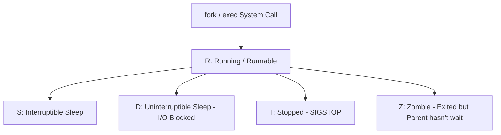
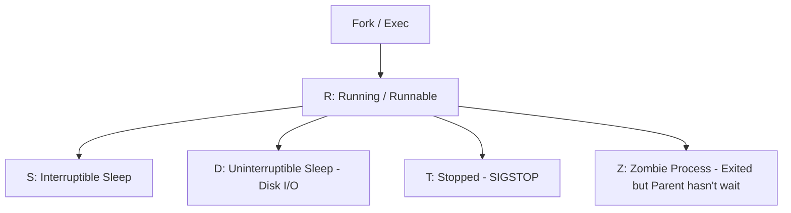

# 🐧 Objective 103.5: Quản Lý Tiến Trình (ps, top, kill & tmux) - Bản Chất Hệ Thống & Thực Chiến DevOps

> 💡 **Bản chất 1 câu**: Giám sát tiến trình bằng `ps aux` & `htop`, gửi Signal dừng tiến trình (`kill -15` vs `kill -9`), duy trì session bằng `tmux`.  
> 🎯 **Trọng tâm phỏng vấn DevOps**: Lệnh ps aux, top/htop, Signal 15 (SIGTERM) vs Signal 9 (SIGKILL), tmux session.

---




---

## 2. 📚 Lý Thuyết Chuyên Sâu

### 2.2 Kiến Trúc Tiến Trình Linux (Process States & Signals)

- **Process States**: `R` (Running), `S` (Sleeping), `D` (Uninterruptible Sleep - Thường kẹt Disk I/O không thể kill!), `Z` (Zombie - Tiến trình con đã chết nhưng cha chưa đọc exit code).
- **Signals**: `1` (SIGHUP - Reload config), `9` (SIGKILL - Ép diệt ngay), `15` (SIGTERM - Yêu cầu dừng êm đẹp), `17/18/19` (SIGSTOP/SIGCONT).
 & Bản Chất Hệ Thống (Under The Hood Mechanics)

### 2.1 Bản Chất Tiến Trình (Process) & POSIX Signals
- Tiến trình được quản lý bởi cấu trúc `struct task_struct` trong Kernel.
- Trạng thái tiến trình: `R` (Running), `S` (Sleeping), `D` (Uninterruptible Sleep - chờ đĩa), `Z` (Zombie - đã chết nhưng cha chưa thu hồi).
- **Signals**:
  - `SIGTERM (15)`: Cho phép tiến trình bắt signal và đóng file/connection an toàn trước khi thoát.
  - `SIGKILL (9)`: Kernel tiêu diệt tiến trình lập tức, tiến trình KHÔNG THỂ cưỡng lại hoặc bắt signal này.


---

## 3. ⚡ Bảng Tra Cứu Câu Lệnh Thực Hành (CLI Command Reference)

| Câu lệnh | Tham số (Options/Flags) | Giải thích ý nghĩa chi tiết | Ví dụ thực tế trong DevOps |
| :--- | :--- | :--- | :--- |
| **`ps`** | `Xem danh sách tiến trình đang chạy` | aux, -ef | `ps aux | grep python` |
| **`htop / top`** | `Giám sát CPU/RAM tiến trình thời gian thực` | Không | `htop` |
| **`kill`** | `Gửi Signal dừng tiến trình theo PID` | -15, -9 | `kill -9 <PID>` |
| **`tmux`** | `Tạo phiên làm việc terminal chạy ngầm` | new -s, attach | `tmux attach -t devops` |


---

## 4. 🛠 Thao Tác Thực Chiến & Kịch Bản DevOps (Real-World Scenarios)

### 🛠 Các lệnh thực hành gõ là ăn ngay:
```bash
# Tìm các tiến trình ở trạng thái Zombie (Z) hoặc Uninterruptible Sleep (D):
ps aux | awk '$8 ~ /[ZD]/ {print $0}'
# Diệt tất cả tiến trình theo tên ứng dụng:
sudo killall -9 nginx
```
```bash
# Tìm PID và diệt tiến trình bị treo:
ps aux | grep node
kill -9 12345

# Tạo tmux session:
tmux new -s build_session
```

### 🚀 Kịch bản xử lý sự cố thực tế khi đi làm:
Sự cố tiến trình ngốn 100% CPU nhưng dùng `kill -9` không thể diệt được:
# Nguyên nhân: Tiến trình đang nằm ở trạng thái `D` (Uninterruptible Sleep) do kẹt đĩa I/O hoặc NFS mount bị rớt. Phải xử lý ổ đĩa / mount point hoặc reboot máy.

Giám sát top 10 tiến trình tốn RAM nhất:
ps aux --sort=-%mem | head -n 10

---

## 5. 🚀 Bộ Câu Hỏi Phỏng Vấn DevOps

> **Q: Tại sao không thể diệt một tiến trình ở trạng thái `D` (Uninterruptible Sleep) bằng lệnh `kill -9`?**  
> **A**: Vì tiến trình ở trạng thái `D` đang chờ Kernel xử lý xong thao tác I/O phần cứng (như đọc đĩa hoặc NFS). Kernel không xử lý bất kỳ Signal nào (kể cả SIGKILL) cho đến khi I/O hoàn tất.

> **Q: Tiến trình Zombie (Z) là gì và làm thế nào để dọn dẹp nó khỏi RAM?**  
> **A**: Zombie là tiến trình con đã kết thúc thi hành nhưng tiến trình cha chưa gọi hàm `wait()` để nhận exit code. Để dọn Zombie, phải diệt tiến trình CHA của nó hoặc gửi tín hiệu SIGHUP cho tiến trình cha.

 Thực Tế (Interview Q&A)

> **Q: Sự khác biệt giữa `kill -15` và `kill -9` là gì?**  
> **A**: `kill -15` (SIGTERM) dừng êm đẹp an toàn; `kill -9` (SIGKILL) ép Kernel tiêu diệt tiến trình lập tức.

> **Q: Công cụ nào giúp duy trì script chạy trên Server kể cả khi bị rớt kết nối SSH?**  
> **A**: Sử dụng `tmux`.


---

## 6. 📝 Cheat Sheet & Ghi Nhớ Nhanh (Summary)

- [x] ps aux: Liệt kê tiến trình
- [x] kill -15: Dừng êm đẹp, kill -9: Ép dừng ngay
- [x] tmux: Chạy terminal ngầm rớt SSH không mất

