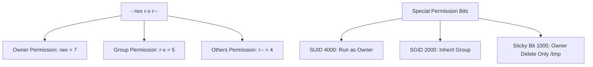

# 🐧 Objective 104.5: Quản Lý Quyền File & Owner (chmod, chown, umask) - Bản Chất Hệ Thống & Thực Chiến DevOps

> 💡 **Bản chất 1 câu**: Thành thạo phân quyền file Read (4), Write (2), Execute (1), đổi chủ sở hữu `chown`, thiết lập `umask` và quyền đặc biệt SUID/SGID.  
> 🎯 **Trọng tâm phỏng vấn DevOps**: chmod (755, 644, 600), chown user:group, umask (0022), SUID (4000), SGID (2000), Sticky Bit (1000).

---



---

## 2. 📚 Lý Thuyết Chuyên Sâu

### 2.2 Quyền Hạn Nâng Cao SUID, SGID, Sticky Bit & POSIX ACLs
- **SUID (Set User ID - 4000 / `u+s`)**: Chạy file thực thi với quyền của OWNER file đó (Ví dụ: `/usr/bin/passwd` chạy với quyền root).
- **SGID (Set Group ID - 2000 / `g+s`)**: Mọi file tạo ra trong thư mục sẽ TỰ ĐỘNG kế thừa GROUP cha (Dùng chung cho thư mục làm việc nhóm).
- **Sticky Bit (1000 / `t`)**: Chỉ duy nhất OWNER của file hoặc root mới có quyền xóa file trong thư mục đó (Áp dụng cho `/tmp`).
- **POSIX ACLs (`getfacl` / `setfacl`)**: Cấp quyền chi tiết cho từng User/Group cụ thể mà chmod thông thường không làm được.
 & Bản Chất Hệ Thống (Under The Hood Mechanics)

### 2.1 Bản Chất POSIX Permission Bitmask
- Permission biểu diễn bởi 9 bits (rwx cho User, Group, Others).
- Octal format: r=4, w=2, x=1.
- Special bits:
  - SUID (4000): Chạy file thực thi với quyền của Owner (vd: `/usr/bin/passwd`).
  - SGID (2000): File mới tạo trong thư mục kế thừa Group sở hữu của thư mục cha.
  - Sticky Bit (1000): Chỉ Owner của file mới được xóa file trong thư mục đó (vd: `/tmp`).


---


### 2.4 Cơ Chế Hoạt Động Bên Dưới Kernel & Kiến Trúc Hệ Thống Chi Tiết (Deep Kernel & Architecture)
- **Tầng Giao Tiếp System Calls**: Mọi thao tác người dùng hay lệnh CLI gõ trên Terminal đều trải qua giao diện System Call Interface (như `open()`, `read()`, `write()`, `fork()`, `execve()`, `socket()`, `epoll_wait()`) để chuyển quyền điều khiển từ User Space (Ring 3) xuống Kernel Space (Ring 0).
- **Quản Lý Tài Nguyên & Cấu Trúc Dữ Liệu**: Kernel duy trì các cấu trúc dữ liệu bảng điều khiển (Process Control Block - PCB, File Descriptor Table, Inode Index Table, Page Tables) để đảm bảo cô lập tài nguyên, an toàn bộ nhớ và tối ưu hiệu năng I/O.
- **Tương Tác Phần Cứng & Drivers**: Các trình điều khiển thiết bị (Kernel Modules `.ko`) trực tiếp tương tác với thanh ghi phần cứng (Hardware Registers) qua ngắt CPU (Interrupts - IRQ) và truy cập bộ nhớ trực tiếp (DMA - Direct Memory Access).

---

## 3. ⚡ Bảng Tra Cứu Câu Lệnh Thực Hành (CLI Command Reference)

| Câu lệnh | Tham số (Options/Flags) | Giải thích ý nghĩa chi tiết | Ví dụ thực tế trong DevOps |
| :--- | :--- | :--- | :--- |
| **`chmod`** | `Thay đổi quyền truy cập file/thư mục` | 755, 644, u+x | `chmod 755 script.sh` |
| **`chown`** | `Thay đổi User và Group sở hữu` | -R user:group | `chown -R www-data:www-data /var/www` |
| **`umask`** | `Đặt quyền mặc định khi tạo file/thư mục mới` | 0022 | `umask 0022` |


---

## 4. 🛠 Thao Tác Thực Chiến & Kịch Bản DevOps (Real-World Scenarios)

### 🛠 Các lệnh thực hành gõ là ăn ngay:
```bash
# Cấp quyền Sticky Bit cho thư mục chia sẻ:
sudo chmod +t /shared_dir
# Cấp quyền ACLs cho user 'devops' có quyền đọc ghi file mà không đổi owner:
sudo setfacl -m u:devops:rw /var/log/app.log
# Xem bảng phân quyền ACLs:
getfacl /var/log/app.log
```
```bash
# Phân quyền Web Server:
sudo chown -R www-data:www-data /var/www/html
sudo chmod -R 755 /var/www/html
```

### 🚀 Kịch bản xử lý sự cố thực tế khi đi làm:
Sự cố bảo mật hacker chiếm quyền root thông qua file SUID bị hổng:
# Tìm tất cả các file có gắn quyền SUID trên toàn bộ hệ thống để audit:
sudo find / -perm -4000 -type f -ls

Phân quyền SSH Key:
chmod 600 ~/.ssh/id_rsa

---


### 4.2 Chi Tiết Các Lỗi Thường Gặp & Kịch Bản Khắc Phục Lỗi (Troubleshooting Deep-Dive)
1. **Sự cố 1: Lỗi Cạn Kiệt Tài Nguyên & Nghẽn Cổ Chai (Resource Exhaustion / Bottleneck)**:
   - **Triệu chứng**: Hệ thống phản hồi siêu chậm, ứng dụng bị crash OOM (Out Of Memory) hoặc lệnh báo `No space left on device` dù đĩa còn dung lượng trống.
   - **Bản chất nguyên nhân**: Cạn kiệt Inodes đĩa cứng (`df -i`), tràn bộ nhớ đệm RAM (`free -h`), hoặc cạn kiệt File Descriptors tối đa (`sysctl fs.file-max`).
   - **Các bước xử lý khẩn cấp**:
     ```bash
     # 1. Kiểm tra số lượng Inodes khả dụng trên đĩa:
     df -i /
     
     # 2. Tìm thư mục chứa hàng triệu file rác gây hết Inodes:
     find /var/spool /tmp -xdev -type f | cut -d/ -f2-4 | sort | uniq -c | sort -nr | head -n 10
     
     # 3. Kiểm tra các tiến trình đang chiếm giữ file đã bị xóa (Deleted Descriptor Leak):
     sudo lsof | grep deleted
     
     # 4. Giải phóng bộ nhớ RAM Cache tạm thời của Linux Kernel:
     sudo sysctl -w vm.drop_caches=3
     ```

2. **Sự cố 2: Lỗi Sai Cấu Hình & Tự Động Phục Hồi (Configuration Misconfiguration & Recovery)**:
   - **Triệu chứng**: Dịch vụ ngắt đột ngột, không kết nối được qua cổng mạng (Port Unreachable) hoặc lệnh service return exit code != 0.
   - **Các bước xử lý khẩn cấp**:
     ```bash
     # 1. Kiểm tra cú pháp file cấu hình trước khi restart service:
     sudo systemctl status <service_name> --no-pager -l
     
     # 2. Xem log chi tiết lỗi khởi động từ Journald binary log:
     sudo journalctl -u <service_name> -n 100 --no-pager -e
     
     # 3. Phân tích lời gọi hệ thống Syscall xem tiến trình bị treo ở đâu bằng strace:
     sudo strace -p <PID> -f -e trace=file,network
     ```

---

## 5. 🚀 Bộ Câu Hỏi Phỏng Vấn DevOps

> **Q: Quyền Sticky Bit (ví dụ trên thư mục `/tmp`) có tác dụng bảo mật như thế nào?**  
> **A**: Sticky Bit ngăn không cho người dùng xóa hoặc đổi tên file của người khác trong cùng một thư mục chia sẻ, chỉ duy nhất OWNER của file đó hoặc root mới có quyền xóa.

> **Q: Lệnh `setfacl` giúp giải quyết hạn chế gì của lệnh `chmod` truyền thống?**  
> **A**: `chmod` chỉ cấp quyền cho 3 nhóm (User, Group, Other). `setfacl` cho phép phân quyền chi tiết cho từng tài khoản cá nhân hoặc nhiều nhóm khác nhau trên cùng một tệp tin.

 Thực Tế (Interview Q&A)

> **Q: Quyền số Octal `755` tương ứng với chuỗi ký tự quyền nào?**  
> **A**: Tương ứng với `rwxr-xr-x`.

> **Q: Lệnh nào thay đổi đồng thời cả User và Group sở hữu?**  
> **A**: Lệnh `sudo chown -R user:group /path`.


> **Q: Làm thế nào để điều tra và xử lý tận gốc sự cố Linux Server báo lỗi "No space left on device" trong khi lệnh `df -h` cho thấy dung lượng đĩa vẫn còn trống 40%?**  
> **A**: Lỗi này thường do 2 nguyên nhân cốt lõi:  
> 1. **Hết Inode (Inode Exhaustion)**: File system đã dùng hết số lượng bảng Inode để lưu trữ metadata file (do có hàng triệu file kích thước siêu nhỏ 0-byte). Kiểm tra bằng `df -i`. Xử lý bằng cách tìm và xóa các thư mục chứa file rác (như `/var/spool/postfix/maildrop` hay `/tmp`).  
> 2. **File Descriptor Leak (File đã xóa nhưng tiến trình vẫn đang mở)**: Một file dung lượng lớn bị xóa bằng lệnh `rm` nhưng tiến trình ứng dụng vẫn đang giữ file handle mở, khiến Kernel chưa thể giải phóng dung lượng đĩa thực sự. Kiểm tra bằng `sudo lsof | grep deleted`, sau đó restart lại tiến trình giữ file đó để Kernel thu hồi đĩa.

> **Q: Giải thích sự khác biệt giữa hai tín hiệu ngắt `SIGTERM` (15) và `SIGKILL` (9) trong Linux OS? Khi nào nên dùng loại nào trong kịch bản tự động hóa DevOps?**  
> **A**:  
> - **`SIGTERM` (Signal 15)**: Tín hiệu yêu cầu dừng ứng dụng **thỏa thuận (Graceful Termination)**. Tiến trình có thể bắt (catch) tín hiệu này để đóng kết nối Database, lưu trạng thái dữ liệu và dọn dẹp tài nguyên trước khi thoát hoàn toàn. Luôn luôn ưu tiên dùng `SIGTERM` trước (như trong Docker/Kubernetes shutdown flow).  
> - **`SIGKILL` (Signal 9)**: Tín hiệu dừng ứng dụng **cưỡng chế tuyệt đối (Forced Termination)** do Kernel trực tiếp tiêu diệt tiến trình ngay lập tức. Tiến trình KHÔNG THỂ bắt hay lờ đi tín hiệu này, dẫn tới nguy cơ hỏng dữ liệu dở dang. Chỉ dùng `SIGKILL` khi tiến trình bị treo đơ không phản hồi `SIGTERM`.

---

## 6. 📝 Cheat Sheet & Ghi Nhớ Nhanh (Summary)

- [x] Read=4, Write=2, Execute=1
- [x] chmod 755: rwxr-xr-x
- [x] chmod 600: rw------- (SSH Key)
- [x] chown user:group: Đổi chủ sở hữu

