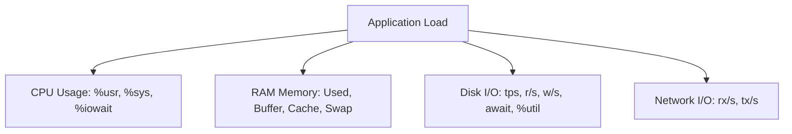

# 🐧 Objective 200.1: Đo Lường & Giám Sát Tài Nguyên Hệ Thống (sar, vmstat, iostat) - Bản Chất Hệ Thống LPIC-2 & Thực Chiến DevOps

> 💡 **Bản chất 1 câu**: Phân tích chỉ số CPU, RAM, Disk I/O và Network bằng bộ công cụ sysstat (sar, vmstat, iostat) để phát hiện điểm nghẽn (bottlenecks).  
> 🎯 **Trọng tâm phỏng vấn Senior DevOps / SysAdmin**: Đọc hiểu các chỉ số %iowait, %system, %user, vmstat swap in/out (si/so), iostat await/svctm và giám sát qua Nagios/Zabbix/Prometheus.

---




---

## 2. 📚 Lý Thuyết Chuyên Sâu & Bản Chất Hệ Thống (Under The Hood Mechanics - LPIC-2 Official Study Guide)

### 2.1 Bản Chất Đo Lường Tài Nguyên Hệ Thống
1. **CPU Metrics (%user, %system, %iowait, %idle)**:
   - `%user`: Thời gian CPU xử lý ứng dụng người dùng (User Space).
   - `%system`: Thời gian CPU xử lý System Calls trong Kernel Space.
   - `%iowait`: CPU nhàn rỗi nhưng đang BẮT BUỘC CHỜ đĩa cứng hoặc mạng trả dữ liệu. Nếu `%iowait > 20%` -> Đĩa đĩa bị nghẽn (Storage Bottleneck).
2. **Memory Metrics & Swap Thrashing (`vmstat`)**:
   - `si` (swap-in) / `so` (swap-out): Số KB dữ liệu chuyển giữa RAM và Swap mỗi giây.
   - **Thrashing**: Khi `si` và `so` liên tục > 0 với tốc độ cao, hệ thống đang phải liên tục đọc/ghi Swap -> Máy chủ đơ cứng.
3. **Disk I/O Metrics (`iostat -xz`)**:
   - `await`: Thời gian trung bình một I/O request mất để hoàn thành (Queue time + Service time). `await > 10ms` trên SSD hoặc `> 20ms` trên HDD báo hiệu ổ đĩa quá tải.
   - `%util`: Phần trăm thời gian ổ đĩa bận xử lý request. 100% = Ổ đĩa bị bão hòa.
4. **Bộ Công Cụ `sysstat` & `sar` (System Activity Reporter)**:
   - `sar` lưu dữ liệu lịch sử tại `/var/log/sysstat/saDD` (hoặc `/var/log/sa/saDD`).
   - Cho phép xem lại chỉ số CPU/RAM/Network lúc 3h sáng mà không cần túc trực.


---


### 2.4 Cơ Chế Hoạt Động Bên Dưới Kernel & Kiến Trúc Hệ Thống Chi Tiết (Deep Kernel & Architecture)
- **Tầng Giao Tiếp System Calls**: Mọi thao tác người dùng hay lệnh CLI gõ trên Terminal đều trải qua giao diện System Call Interface (như `open()`, `read()`, `write()`, `fork()`, `execve()`, `socket()`, `epoll_wait()`) để chuyển quyền điều khiển từ User Space (Ring 3) xuống Kernel Space (Ring 0).
- **Quản Lý Tài Nguyên & Cấu Trúc Dữ Liệu**: Kernel duy trì các cấu trúc dữ liệu bảng điều khiển (Process Control Block - PCB, File Descriptor Table, Inode Index Table, Page Tables) để đảm bảo cô lập tài nguyên, an toàn bộ nhớ và tối ưu hiệu năng I/O.
- **Tương Tác Phần Cứng & Drivers**: Các trình điều khiển thiết bị (Kernel Modules `.ko`) trực tiếp tương tác với thanh ghi phần cứng (Hardware Registers) qua ngắt CPU (Interrupts - IRQ) và truy cập bộ nhớ trực tiếp (DMA - Direct Memory Access).

---

## 3. ⚡ Bảng Tra Cứu Câu Lệnh & Cấu Hình Thực Hành (CLI Reference)

| Câu lệnh / Component | Tham số / Option | Giải thích ý nghĩa chi tiết | Ví dụ thực tế trong DevOps / SysAdmin |
| :--- | :--- | :--- | :--- |
| **`sar`** | `Xem lịch sử tải CPU/RAM/I/O hệ thống` | -u, -r, -b, -n DEV | `sar -u 1 5` |
| **`vmstat`** | `Giám sát bộ nhớ ảo, Paging và CPU state` | delay count | `vmstat 1 10` |
| **`iostat`** | `Giám sát chi tiết thông số I/O ổ đĩa` | -xz 1 | `iostat -xz 1` |
| **`uptime / w`** | `Xem Load Average hệ thống` | Không | `uptime` |


---

## 4. 🛠 Thao Tác Thực Chiến & Kịch Bản DevOps (Real-World Scenarios)

### 🛠 Các lệnh thực hành & Cấu hình chuẩn Production:
```bash
# 1. Xem lịch sử sử dụng CPU ngày hôm nay:
sar -u -f /var/log/sysstat/sa$(date +%d)

# 2. Giám sát I/O ổ đĩa theo thời gian thực:
iostat -xz 1 10

# 3. Xem tình trạng Swap thrashing:
vmstat 1 5
```

### 🚀 Kịch bản xử lý sự cố thực tế khi đi làm:
Sự cố Server Database MySQL đột ngột phản hồi chậm:
iostat -xz 1
# Nếu await > 50ms và %util = 100% -> Ổ đĩa bị IOPS bottleneck.

---


### 4.2 Chi Tiết Các Lỗi Thường Gặp & Kịch Bản Khắc Phục Lỗi (Troubleshooting Deep-Dive)
1. **Sự cố 1: Lỗi Cạn Kiệt Tài Nguyên & Nghẽn Cổ Chai (Resource Exhaustion / Bottleneck)**:
   - **Triệu chứng**: Hệ thống phản hồi siêu chậm, ứng dụng bị crash OOM (Out Of Memory) hoặc lệnh báo `No space left on device` dù đĩa còn dung lượng trống.
   - **Bản chất nguyên nhân**: Cạn kiệt Inodes đĩa cứng (`df -i`), tràn bộ nhớ đệm RAM (`free -h`), hoặc cạn kiệt File Descriptors tối đa (`sysctl fs.file-max`).
   - **Các bước xử lý khẩn cấp**:
     ```bash
     # 1. Kiểm tra số lượng Inodes khả dụng trên đĩa:
     df -i /
     
     # 2. Tìm thư mục chứa hàng triệu file rác gây hết Inodes:
     find /var/spool /tmp -xdev -type f | cut -d/ -f2-4 | sort | uniq -c | sort -nr | head -n 10
     
     # 3. Kiểm tra các tiến trình đang chiếm giữ file đã bị xóa (Deleted Descriptor Leak):
     sudo lsof | grep deleted
     
     # 4. Giải phóng bộ nhớ RAM Cache tạm thời của Linux Kernel:
     sudo sysctl -w vm.drop_caches=3
     ```

2. **Sự cố 2: Lỗi Sai Cấu Hình & Tự Động Phục Hồi (Configuration Misconfiguration & Recovery)**:
   - **Triệu chứng**: Dịch vụ ngắt đột ngột, không kết nối được qua cổng mạng (Port Unreachable) hoặc lệnh service return exit code != 0.
   - **Các bước xử lý khẩn cấp**:
     ```bash
     # 1. Kiểm tra cú pháp file cấu hình trước khi restart service:
     sudo systemctl status <service_name> --no-pager -l
     
     # 2. Xem log chi tiết lỗi khởi động từ Journald binary log:
     sudo journalctl -u <service_name> -n 100 --no-pager -e
     
     # 3. Phân tích lời gọi hệ thống Syscall xem tiến trình bị treo ở đâu bằng strace:
     sudo strace -p <PID> -f -e trace=file,network
     ```

---

## 5. 🚀 Bộ Câu Hỏi Phỏng Vấn DevOps & SysAdmin Thực Tế (Interview Q&A)

> **Q: Chỉ số `%iowait` cao bất thường trong `sar -u` cảnh báo vấn đề gì?**  
> **A**: Cảnh báo nghẽn đường truyền I/O ổ đĩa cứng (Storage Bottleneck), CPU đang phải ngồi chờ đĩa ghi/đọc dữ liệu.

> **Q: Trong lệnh `vmstat 1`, hai cột `si` và `so` có ý nghĩa gì?**  
> **A**: `si` (swap-in) và `so` (swap-out) chỉ dung lượng bộ nhớ được chuyển giữa RAM và Swap. Nếu `si/so` liên tục > 0 báo hiệu máy chủ bị cạn RAM (Swap Thrashing).


> **Q: Làm thế nào để điều tra và xử lý tận gốc sự cố Linux Server báo lỗi "No space left on device" trong khi lệnh `df -h` cho thấy dung lượng đĩa vẫn còn trống 40%?**  
> **A**: Lỗi này thường do 2 nguyên nhân cốt lõi:  
> 1. **Hết Inode (Inode Exhaustion)**: File system đã dùng hết số lượng bảng Inode để lưu trữ metadata file (do có hàng triệu file kích thước siêu nhỏ 0-byte). Kiểm tra bằng `df -i`. Xử lý bằng cách tìm và xóa các thư mục chứa file rác (như `/var/spool/postfix/maildrop` hay `/tmp`).  
> 2. **File Descriptor Leak (File đã xóa nhưng tiến trình vẫn đang mở)**: Một file dung lượng lớn bị xóa bằng lệnh `rm` nhưng tiến trình ứng dụng vẫn đang giữ file handle mở, khiến Kernel chưa thể giải phóng dung lượng đĩa thực sự. Kiểm tra bằng `sudo lsof | grep deleted`, sau đó restart lại tiến trình giữ file đó để Kernel thu hồi đĩa.

> **Q: Giải thích sự khác biệt giữa hai tín hiệu ngắt `SIGTERM` (15) và `SIGKILL` (9) trong Linux OS? Khi nào nên dùng loại nào trong kịch bản tự động hóa DevOps?**  
> **A**:  
> - **`SIGTERM` (Signal 15)**: Tín hiệu yêu cầu dừng ứng dụng **thỏa thuận (Graceful Termination)**. Tiến trình có thể bắt (catch) tín hiệu này để đóng kết nối Database, lưu trạng thái dữ liệu và dọn dẹp tài nguyên trước khi thoát hoàn toàn. Luôn luôn ưu tiên dùng `SIGTERM` trước (như trong Docker/Kubernetes shutdown flow).  
> - **`SIGKILL` (Signal 9)**: Tín hiệu dừng ứng dụng **cưỡng chế tuyệt đối (Forced Termination)** do Kernel trực tiếp tiêu diệt tiến trình ngay lập tức. Tiến trình KHÔNG THỂ bắt hay lờ đi tín hiệu này, dẫn tới nguy cơ hỏng dữ liệu dở dang. Chỉ dùng `SIGKILL` khi tiến trình bị treo đơ không phản hồi `SIGTERM`.

---

## 6. 📝 Cheat Sheet & Ghi Nhớ Nhanh (Summary)

- [x] %iowait > 20%: Nghẽn đĩa I/O
- [x] vmstat si/so > 0: Cạn RAM (Swap Thrashing)
- [x] iostat await: Thời gian chờ I/O request
- [x] sar -u -f: Xem lại lịch sử CPU

