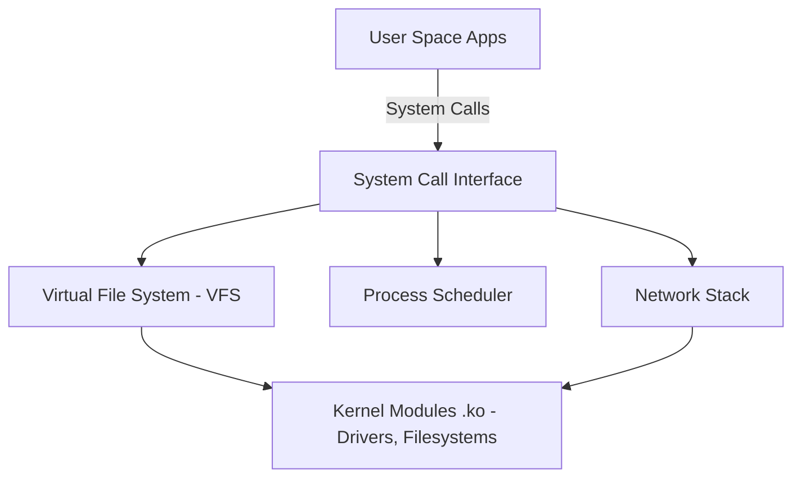

# 🐧 Objective 201.1: Thành Phần Kernel & Quản Lý Modules Chuyên Sâu - Bản Chất Hệ Thống LPIC-2 & Thực Chiến DevOps

> 💡 **Bản chất 1 câu**: Quản lý Kernel Modules, tùy chỉnh tham số Kernel runtime qua `/proc/sys/` và `/etc/sysctl.conf`, tìm hiểu vị trí `/lib/modules/`.  
> 🎯 **Trọng tâm phỏng vấn Senior DevOps / SysAdmin**: Lệnh lsmod, insmod, rmmod, modprobe (-r, -c, -v), modinfo, sysctl (-a, -w, -p), file /etc/sysctl.conf, thư mục /lib/modules/$(uname -r)/.

---




---

## 2. 📚 Lý Thuyết Chuyên Sâu & Bản Chất Hệ Thống (Under The Hood Mechanics - LPIC-2 Official Study Guide)

### 2.1 Kiến Trúc Kernel Linux & Quản Lý Dynamic Module
1. **Cấu Trúc Thư Mục Kernel Modules**:
   - Các file `.ko` (Kernel Object) nằm tại `/lib/modules/$(uname -r)/`.
   - File danh mục phụ thuộc: `/lib/modules/$(uname -r)/modules.dep` (được tạo ra bởi lệnh `depmod -a`).
2. **So Sánh Công Cụ Thao Tác Modules**:
   - `insmod /path/to/driver.ko`: Nạp file `.ko` trực tiếp (KHÔNG tự nạp phụ thuộc).
   - `rmmod driver`: Gỡ module khỏi RAM.
   - `modprobe driver`: Nạp module THÔNG MINH (Tự đọc `modules.dep` để nạp các module phụ thuộc trước).
   - `modprobe -r driver`: Gỡ module và các module phụ thuộc không dùng đến.
   - `modinfo driver`: Xem tác giả, mô tả, license và các tham số điều chỉnh của module.
3. **Cấu Hình Tham Số Kernel Runtime (`sysctl`)**:
   - Các tham số Kernel xuất hiện tại `/proc/sys/`. Ví dụ `/proc/sys/net/ipv4/ip_forward` tương ứng với khóa `net.ipv4.ip_forward` trong `sysctl`.
   - `sysctl -a`: In toàn bộ tham số Kernel hiện tại.
   - `sysctl -p /etc/sysctl.conf`: Nạp lại file cấu hình vĩnh viễn.


---


### 2.4 Cơ Chế Hoạt Động Bên Dưới Kernel & Kiến Trúc Hệ Thống Chi Tiết (Deep Kernel & Architecture)
- **Tầng Giao Tiếp System Calls**: Mọi thao tác người dùng hay lệnh CLI gõ trên Terminal đều trải qua giao diện System Call Interface (như `open()`, `read()`, `write()`, `fork()`, `execve()`, `socket()`, `epoll_wait()`) để chuyển quyền điều khiển từ User Space (Ring 3) xuống Kernel Space (Ring 0).
- **Quản Lý Tài Nguyên & Cấu Trúc Dữ Liệu**: Kernel duy trì các cấu trúc dữ liệu bảng điều khiển (Process Control Block - PCB, File Descriptor Table, Inode Index Table, Page Tables) để đảm bảo cô lập tài nguyên, an toàn bộ nhớ và tối ưu hiệu năng I/O.
- **Tương Tác Phần Cứng & Drivers**: Các trình điều khiển thiết bị (Kernel Modules `.ko`) trực tiếp tương tác với thanh ghi phần cứng (Hardware Registers) qua ngắt CPU (Interrupts - IRQ) và truy cập bộ nhớ trực tiếp (DMA - Direct Memory Access).

---

## 3. ⚡ Bảng Tra Cứu Câu Lệnh & Cấu Hình Thực Hành (CLI Reference)

| Câu lệnh / Component | Tham số / Option | Giải thích ý nghĩa chi tiết | Ví dụ thực tế trong DevOps / SysAdmin |
| :--- | :--- | :--- | :--- |
| **`modprobe`** | `Nạp hoặc gỡ Kernel Module tự động giải quyết phụ thuộc` | -r, -v, -c | `sudo modprobe overlay` |
| **`depmod`** | `Tạo lại file danh mục phụ thuộc modules.dep` | -a | `sudo depmod -a` |
| **`sysctl`** | `Xem và thay đổi thông số Kernel đang chạy` | -a, -w, -p | `sudo sysctl -p` |
| **`modinfo`** | `Xem thông tin chi tiết và tham số của file .ko` | -p | `modinfo e1000e` |


---

## 4. 🛠 Thao Tác Thực Chiến & Kịch Bản DevOps (Real-World Scenarios)

### 🛠 Các lệnh thực hành & Cấu hình chuẩn Production:
```bash
# 1. Bật IP Forwarding cho Router/Docker trong /etc/sysctl.conf:
echo 'net.ipv4.ip_forward = 1' | sudo tee -a /etc/sysctl.conf
sudo sysctl -p

# 2. Nạp module overlay và kiểm tra:
sudo modprobe overlay
lsmod | grep overlay
```

### 🚀 Kịch bản xử lý sự cố thực tế khi đi làm:
Tối ưu Network Kernel Parameters cho Web Server triệu connection:
cat << 'EOF' | sudo tee -a /etc/sysctl.d/99-network.conf
net.core.somaxconn = 65535
net.ipv4.tcp_max_syn_backlog = 65535
net.ipv4.ip_local_port_range = 1024 65535
EOF
sudo sysctl --system

---


### 4.2 Chi Tiết Các Lỗi Thường Gặp & Kịch Bản Khắc Phục Lỗi (Troubleshooting Deep-Dive)
1. **Sự cố 1: Lỗi Cạn Kiệt Tài Nguyên & Nghẽn Cổ Chai (Resource Exhaustion / Bottleneck)**:
   - **Triệu chứng**: Hệ thống phản hồi siêu chậm, ứng dụng bị crash OOM (Out Of Memory) hoặc lệnh báo `No space left on device` dù đĩa còn dung lượng trống.
   - **Bản chất nguyên nhân**: Cạn kiệt Inodes đĩa cứng (`df -i`), tràn bộ nhớ đệm RAM (`free -h`), hoặc cạn kiệt File Descriptors tối đa (`sysctl fs.file-max`).
   - **Các bước xử lý khẩn cấp**:
     ```bash
     # 1. Kiểm tra số lượng Inodes khả dụng trên đĩa:
     df -i /
     
     # 2. Tìm thư mục chứa hàng triệu file rác gây hết Inodes:
     find /var/spool /tmp -xdev -type f | cut -d/ -f2-4 | sort | uniq -c | sort -nr | head -n 10
     
     # 3. Kiểm tra các tiến trình đang chiếm giữ file đã bị xóa (Deleted Descriptor Leak):
     sudo lsof | grep deleted
     
     # 4. Giải phóng bộ nhớ RAM Cache tạm thời của Linux Kernel:
     sudo sysctl -w vm.drop_caches=3
     ```

2. **Sự cố 2: Lỗi Sai Cấu Hình & Tự Động Phục Hồi (Configuration Misconfiguration & Recovery)**:
   - **Triệu chứng**: Dịch vụ ngắt đột ngột, không kết nối được qua cổng mạng (Port Unreachable) hoặc lệnh service return exit code != 0.
   - **Các bước xử lý khẩn cấp**:
     ```bash
     # 1. Kiểm tra cú pháp file cấu hình trước khi restart service:
     sudo systemctl status <service_name> --no-pager -l
     
     # 2. Xem log chi tiết lỗi khởi động từ Journald binary log:
     sudo journalctl -u <service_name> -n 100 --no-pager -e
     
     # 3. Phân tích lời gọi hệ thống Syscall xem tiến trình bị treo ở đâu bằng strace:
     sudo strace -p <PID> -f -e trace=file,network
     ```

---

## 5. 🚀 Bộ Câu Hỏi Phỏng Vấn DevOps & SysAdmin Thực Tế (Interview Q&A)

> **Q: Sự khác biệt cốt lõi giữa `insmod` và `modprobe` là gì?**  
> **A**: `insmod` yêu cầu truyền đường dẫn trực tiếp file `.ko` và KHÔNG tự nạp module phụ thuộc. `modprobe` tự đọc `modules.dep` để nạp đầy đủ các module phụ thuộc.

> **Q: Lệnh nào cập nhật lại file `modules.dep` khi thêm một module `.ko` mới thủ công?**  
> **A**: Lệnh `sudo depmod -a`.


> **Q: Làm thế nào để điều tra và xử lý tận gốc sự cố Linux Server báo lỗi "No space left on device" trong khi lệnh `df -h` cho thấy dung lượng đĩa vẫn còn trống 40%?**  
> **A**: Lỗi này thường do 2 nguyên nhân cốt lõi:  
> 1. **Hết Inode (Inode Exhaustion)**: File system đã dùng hết số lượng bảng Inode để lưu trữ metadata file (do có hàng triệu file kích thước siêu nhỏ 0-byte). Kiểm tra bằng `df -i`. Xử lý bằng cách tìm và xóa các thư mục chứa file rác (như `/var/spool/postfix/maildrop` hay `/tmp`).  
> 2. **File Descriptor Leak (File đã xóa nhưng tiến trình vẫn đang mở)**: Một file dung lượng lớn bị xóa bằng lệnh `rm` nhưng tiến trình ứng dụng vẫn đang giữ file handle mở, khiến Kernel chưa thể giải phóng dung lượng đĩa thực sự. Kiểm tra bằng `sudo lsof | grep deleted`, sau đó restart lại tiến trình giữ file đó để Kernel thu hồi đĩa.

> **Q: Giải thích sự khác biệt giữa hai tín hiệu ngắt `SIGTERM` (15) và `SIGKILL` (9) trong Linux OS? Khi nào nên dùng loại nào trong kịch bản tự động hóa DevOps?**  
> **A**:  
> - **`SIGTERM` (Signal 15)**: Tín hiệu yêu cầu dừng ứng dụng **thỏa thuận (Graceful Termination)**. Tiến trình có thể bắt (catch) tín hiệu này để đóng kết nối Database, lưu trạng thái dữ liệu và dọn dẹp tài nguyên trước khi thoát hoàn toàn. Luôn luôn ưu tiên dùng `SIGTERM` trước (như trong Docker/Kubernetes shutdown flow).  
> - **`SIGKILL` (Signal 9)**: Tín hiệu dừng ứng dụng **cưỡng chế tuyệt đối (Forced Termination)** do Kernel trực tiếp tiêu diệt tiến trình ngay lập tức. Tiến trình KHÔNG THỂ bắt hay lờ đi tín hiệu này, dẫn tới nguy cơ hỏng dữ liệu dở dang. Chỉ dùng `SIGKILL` khi tiến trình bị treo đơ không phản hồi `SIGTERM`.

---

## 6. 📝 Cheat Sheet & Ghi Nhớ Nhanh (Summary)

- [x] /lib/modules/$(uname -r)/: Nơi chứa Kernel Modules
- [x] depmod -a: Cập nhật modules.dep
- [x] modprobe: Nạp module thông minh
- [x] sysctl -p: Reload cấu hình Kernel

