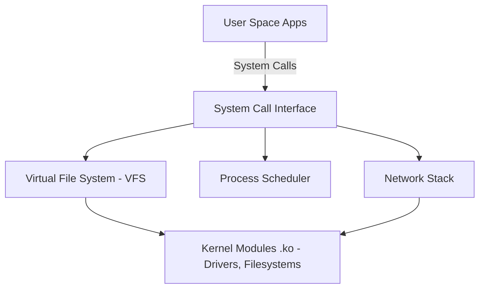

# 🐧 Objective 201.1: Thành Phần Kernel & Quản Lý Modules Chuyên Sâu - Bản Chất Hệ Thống LPIC-2 & Thực Chiến DevOps

> 💡 **Bản chất 1 câu**: Quản lý Kernel Modules, tùy chỉnh tham số Kernel runtime qua `/proc/sys/` và `/etc/sysctl.conf`, tìm hiểu vị trí `/lib/modules/`.  
> 🎯 **Trọng tâm phỏng vấn Senior DevOps / SysAdmin**: Lệnh lsmod, insmod, rmmod, modprobe (-r, -c, -v), modinfo, sysctl (-a, -w, -p), file /etc/sysctl.conf, thư mục /lib/modules/$(uname -r)/.

---




---

## 2. 📚 Lý Thuyết Chuyên Sâu & Bản Chất Hệ Thống (Under The Hood Mechanics - LPIC-2 Official Study Guide)

### 2.1 Kiến Trúc Kernel Linux & Quản Lý Dynamic Module
1. **Cấu Trúc Thư Mục Kernel Modules**:
   - Các file `.ko` (Kernel Object) nằm tại `/lib/modules/$(uname -r)/`.
   - File danh mục phụ thuộc: `/lib/modules/$(uname -r)/modules.dep` (được tạo ra bởi lệnh `depmod -a`).
2. **So Sánh Công Cụ Thao Tác Modules**:
   - `insmod /path/to/driver.ko`: Nạp file `.ko` trực tiếp (KHÔNG tự nạp phụ thuộc).
   - `rmmod driver`: Gỡ module khỏi RAM.
   - `modprobe driver`: Nạp module THÔNG MINH (Tự đọc `modules.dep` để nạp các module phụ thuộc trước).
   - `modprobe -r driver`: Gỡ module và các module phụ thuộc không dùng đến.
   - `modinfo driver`: Xem tác giả, mô tả, license và các tham số điều chỉnh của module.
3. **Cấu Hình Tham Số Kernel Runtime (`sysctl`)**:
   - Các tham số Kernel xuất hiện tại `/proc/sys/`. Ví dụ `/proc/sys/net/ipv4/ip_forward` tương ứng với khóa `net.ipv4.ip_forward` trong `sysctl`.
   - `sysctl -a`: In toàn bộ tham số Kernel hiện tại.
   - `sysctl -p /etc/sysctl.conf`: Nạp lại file cấu hình vĩnh viễn.


---

## 3. ⚡ Bảng Tra Cứu Câu Lệnh & Cấu Hình Thực Hành (CLI Reference)

| Câu lệnh / Component | Tham số / Option | Giải thích ý nghĩa chi tiết | Ví dụ thực tế trong DevOps / SysAdmin |
| :--- | :--- | :--- | :--- |
| **`modprobe`** | `Nạp hoặc gỡ Kernel Module tự động giải quyết phụ thuộc` | -r, -v, -c | `sudo modprobe overlay` |
| **`depmod`** | `Tạo lại file danh mục phụ thuộc modules.dep` | -a | `sudo depmod -a` |
| **`sysctl`** | `Xem và thay đổi thông số Kernel đang chạy` | -a, -w, -p | `sudo sysctl -p` |
| **`modinfo`** | `Xem thông tin chi tiết và tham số của file .ko` | -p | `modinfo e1000e` |


---

## 4. 🛠 Thao Tác Thực Chiến & Kịch Bản DevOps (Real-World Scenarios)

### 🛠 Các lệnh thực hành & Cấu hình chuẩn Production:
```bash
# 1. Bật IP Forwarding cho Router/Docker trong /etc/sysctl.conf:
echo 'net.ipv4.ip_forward = 1' | sudo tee -a /etc/sysctl.conf
sudo sysctl -p

# 2. Nạp module overlay và kiểm tra:
sudo modprobe overlay
lsmod | grep overlay
```

### 🚀 Kịch bản xử lý sự cố thực tế khi đi làm:
Tối ưu Network Kernel Parameters cho Web Server triệu connection:
cat << 'EOF' | sudo tee -a /etc/sysctl.d/99-network.conf
net.core.somaxconn = 65535
net.ipv4.tcp_max_syn_backlog = 65535
net.ipv4.ip_local_port_range = 1024 65535
EOF
sudo sysctl --system

---

## 5. 🚀 Bộ Câu Hỏi Phỏng Vấn DevOps & SysAdmin Thực Tế (Interview Q&A)

> **Q: Sự khác biệt cốt lõi giữa `insmod` và `modprobe` là gì?**  
> **A**: `insmod` yêu cầu truyền đường dẫn trực tiếp file `.ko` và KHÔNG tự nạp module phụ thuộc. `modprobe` tự đọc `modules.dep` để nạp đầy đủ các module phụ thuộc.

> **Q: Lệnh nào cập nhật lại file `modules.dep` khi thêm một module `.ko` mới thủ công?**  
> **A**: Lệnh `sudo depmod -a`.


---

## 6. 📝 Cheat Sheet & Ghi Nhớ Nhanh (Summary)

- [x] /lib/modules/$(uname -r)/: Nơi chứa Kernel Modules
- [x] depmod -a: Cập nhật modules.dep
- [x] modprobe: Nạp module thông minh
- [x] sysctl -p: Reload cấu hình Kernel

