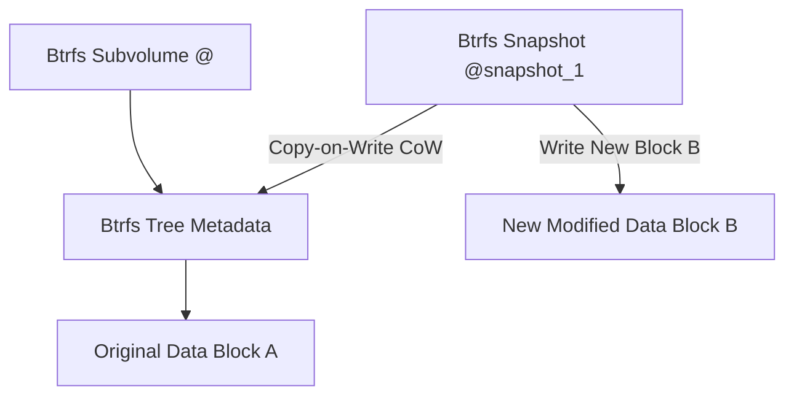

# 🐧 Objective 203.1: Quản Lý Phân Đĩa & Filesystems Cao Cấp (Ext4, XFS, Btrfs) - Bản Chất Hệ Thống LPIC-2 & Thực Chiến DevOps

> 💡 **Bản chất 1 câu**: Thành thạo phân đĩa cao cấp với `parted`, quản lý hệ thống tệp thế hệ mới Btrfs (Subvolumes, Snapshots) và Ext4/XFS.  
> 🎯 **Trọng tâm phỏng vấn Senior DevOps / SysAdmin**: Lệnh parted (scriptable partition), mkfs.btrfs, btrfs subvolume (create, snapshot), btrfs device add, btrfs balance, mkfs.xfs, mkfs.ext4.

---




---

## 2. 📚 Lý Thuyết Chuyên Sâu & Bản Chất Hệ Thống (Under The Hood Mechanics - LPIC-2 Official Study Guide)

### 2.1 So Sánh Các Hệ Thống Tệp Hiện Đại Trong Linux

| Tính năng | Ext4 | XFS | Btrfs (B-tree FS) |
| :--- | :--- | :--- | :--- |
| **Dung lượng tối đa** | 1 EiB | 8 EiB | 16 EiB |
| **Cấu trúc dữ liệu** | Extents & Inode tables | Allocation Groups (B-tree) | Copy-on-Write (CoW) B-tree |
| **Tính năng nổi bật** | Ổn định, tương thích cao | Hiệu năng I/O file lớn cao | Subvolumes, Snapshots, RAID tích hợp |
| **Mở rộng / Thu nhỏ** | Mở rộng + Thu nhỏ được | Chỉ mở rộng được | Mở rộng + Thu nhỏ live |

---

### 2.2 Công Cụ Phân Đĩa Scriptable `parted`
- Khác với `fdisk` (tương tác phím), `parted` cho phép chạy câu lệnh không tương tác thích hợp viết script tự động hóa.
- `parted -s /dev/sdb mklabel gpt`: Tạo nhãn GPT.
- `parted -s /dev/sdb mkpart primary ext4 1MiB 100%`: Tạo phân đĩa aligned chuẩn 1MiB.


---

## 3. ⚡ Bảng Tra Cứu Câu Lệnh & Cấu Hình Thực Hành (CLI Reference)

| Câu lệnh / Component | Tham số / Option | Giải thích ý nghĩa chi tiết | Ví dụ thực tế trong DevOps / SysAdmin |
| :--- | :--- | :--- | :--- |
| **`parted`** | `Công cụ phân đĩa hỗ trợ scriptable và đĩa > 2TB` | -s, mklabel, mkpart | `parted -s /dev/sdb mklabel gpt` |
| **`btrfs subvolume`** | `Quản lý Subvolume và Snapshots trong Btrfs` | create, list, snapshot | `btrfs subvolume snapshot /data /data/snap1` |
| **`btrfs balance`** | `Cân bằng lại phân bổ dữ liệu giữa các đĩa trong Btrfs` | start | `btrfs balance start /data` |


---

## 4. 🛠 Thao Tác Thực Chiến & Kịch Bản DevOps (Real-World Scenarios)

### 🛠 Các lệnh thực hành & Cấu hình chuẩn Production:
```bash
# 1. Phân đĩa tự động bằng parted cho Cloud Automation Script:
sudo parted -s /dev/sdb mklabel gpt
sudo parted -s /dev/sdb mkpart primary ext4 1MiB 100%

# 2. Tạo Btrfs Filesystem và chụp Snapshot:
sudo mkfs.btrfs /dev/sdb1
sudo mount /dev/sdb1 /mnt/btrfs
sudo btrfs subvolume snapshot /mnt/btrfs /mnt/btrfs/@snap_$(date +%F)
```

### 🚀 Kịch bản xử lý sự cố thực tế khi đi làm:
Tự động tạo Snapshot Btrfs trước khi nâng cấp hệ thống:
sudo btrfs subvolume snapshot / /@snap_backup_before_upgrade

---

## 5. 🚀 Bộ Câu Hỏi Phỏng Vấn DevOps & SysAdmin Thực Tế (Interview Q&A)

> **Q: Hệ thống tệp nào hỗ trợ tính năng Copy-on-Write (CoW) và Snapshots tức thì không tốn dung lượng ban đầu?**  
> **A**: Hệ thống tệp `Btrfs`.

> **Q: Tại sao `parted` thường được dùng trong các script tự động hóa hạ tầng hơn `fdisk`?**  
> **A**: Vì `parted` hỗ trợ cờ `-s` (script mode) cho phép chạy lệnh phân đĩa trực tiếp không cần nhập phím tương tác.


---

## 6. 📝 Cheat Sheet & Ghi Nhớ Nhanh (Summary)

- [x] parted -s: Phân đĩa scriptable tự động
- [x] Ext4: Ổn định
- [x] XFS: Hiệu năng cao file lớn
- [x] Btrfs: Snapshots CoW & RAID tích hợp

