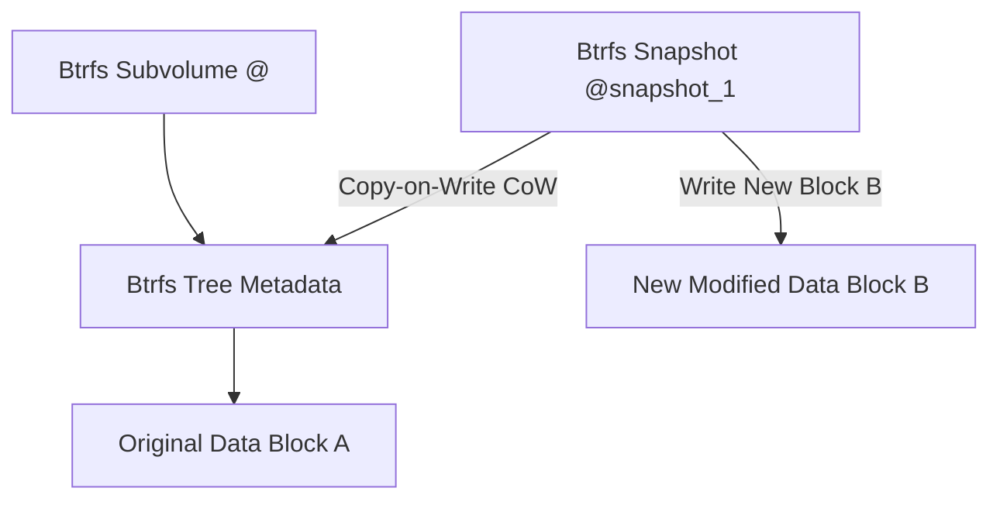

# 🐧 Objective 203.1: Quản Lý Phân Đĩa & Filesystems Cao Cấp (Ext4, XFS, Btrfs) - Bản Chất Hệ Thống LPIC-2 & Thực Chiến DevOps

> 💡 **Bản chất 1 câu**: Thành thạo phân đĩa cao cấp với `parted`, quản lý hệ thống tệp thế hệ mới Btrfs (Subvolumes, Snapshots) và Ext4/XFS.  
> 🎯 **Trọng tâm phỏng vấn Senior DevOps / SysAdmin**: Lệnh parted (scriptable partition), mkfs.btrfs, btrfs subvolume (create, snapshot), btrfs device add, btrfs balance, mkfs.xfs, mkfs.ext4.

---




---

## 2. 📚 Lý Thuyết Chuyên Sâu & Bản Chất Hệ Thống (Under The Hood Mechanics - LPIC-2 Official Study Guide)

### 2.1 So Sánh Các Hệ Thống Tệp Hiện Đại Trong Linux

| Tính năng | Ext4 | XFS | Btrfs (B-tree FS) |
| :--- | :--- | :--- | :--- |
| **Dung lượng tối đa** | 1 EiB | 8 EiB | 16 EiB |
| **Cấu trúc dữ liệu** | Extents & Inode tables | Allocation Groups (B-tree) | Copy-on-Write (CoW) B-tree |
| **Tính năng nổi bật** | Ổn định, tương thích cao | Hiệu năng I/O file lớn cao | Subvolumes, Snapshots, RAID tích hợp |
| **Mở rộng / Thu nhỏ** | Mở rộng + Thu nhỏ được | Chỉ mở rộng được | Mở rộng + Thu nhỏ live |

---

### 2.2 Công Cụ Phân Đĩa Scriptable `parted`
- Khác với `fdisk` (tương tác phím), `parted` cho phép chạy câu lệnh không tương tác thích hợp viết script tự động hóa.
- `parted -s /dev/sdb mklabel gpt`: Tạo nhãn GPT.
- `parted -s /dev/sdb mkpart primary ext4 1MiB 100%`: Tạo phân đĩa aligned chuẩn 1MiB.


---


### 2.4 Cơ Chế Hoạt Động Bên Dưới Kernel & Kiến Trúc Hệ Thống Chi Tiết (Deep Kernel & Architecture)
- **Tầng Giao Tiếp System Calls**: Mọi thao tác người dùng hay lệnh CLI gõ trên Terminal đều trải qua giao diện System Call Interface (như `open()`, `read()`, `write()`, `fork()`, `execve()`, `socket()`, `epoll_wait()`) để chuyển quyền điều khiển từ User Space (Ring 3) xuống Kernel Space (Ring 0).
- **Quản Lý Tài Nguyên & Cấu Trúc Dữ Liệu**: Kernel duy trì các cấu trúc dữ liệu bảng điều khiển (Process Control Block - PCB, File Descriptor Table, Inode Index Table, Page Tables) để đảm bảo cô lập tài nguyên, an toàn bộ nhớ và tối ưu hiệu năng I/O.
- **Tương Tác Phần Cứng & Drivers**: Các trình điều khiển thiết bị (Kernel Modules `.ko`) trực tiếp tương tác với thanh ghi phần cứng (Hardware Registers) qua ngắt CPU (Interrupts - IRQ) và truy cập bộ nhớ trực tiếp (DMA - Direct Memory Access).

---

## 3. ⚡ Bảng Tra Cứu Câu Lệnh & Cấu Hình Thực Hành (CLI Reference)

| Câu lệnh / Component | Tham số / Option | Giải thích ý nghĩa chi tiết | Ví dụ thực tế trong DevOps / SysAdmin |
| :--- | :--- | :--- | :--- |
| **`parted`** | `Công cụ phân đĩa hỗ trợ scriptable và đĩa > 2TB` | -s, mklabel, mkpart | `parted -s /dev/sdb mklabel gpt` |
| **`btrfs subvolume`** | `Quản lý Subvolume và Snapshots trong Btrfs` | create, list, snapshot | `btrfs subvolume snapshot /data /data/snap1` |
| **`btrfs balance`** | `Cân bằng lại phân bổ dữ liệu giữa các đĩa trong Btrfs` | start | `btrfs balance start /data` |


---

## 4. 🛠 Thao Tác Thực Chiến & Kịch Bản DevOps (Real-World Scenarios)

### 🛠 Các lệnh thực hành & Cấu hình chuẩn Production:
```bash
# 1. Phân đĩa tự động bằng parted cho Cloud Automation Script:
sudo parted -s /dev/sdb mklabel gpt
sudo parted -s /dev/sdb mkpart primary ext4 1MiB 100%

# 2. Tạo Btrfs Filesystem và chụp Snapshot:
sudo mkfs.btrfs /dev/sdb1
sudo mount /dev/sdb1 /mnt/btrfs
sudo btrfs subvolume snapshot /mnt/btrfs /mnt/btrfs/@snap_$(date +%F)
```

### 🚀 Kịch bản xử lý sự cố thực tế khi đi làm:
Tự động tạo Snapshot Btrfs trước khi nâng cấp hệ thống:
sudo btrfs subvolume snapshot / /@snap_backup_before_upgrade

---


### 4.2 Chi Tiết Các Lỗi Thường Gặp & Kịch Bản Khắc Phục Lỗi (Troubleshooting Deep-Dive)
1. **Sự cố 1: Lỗi Cạn Kiệt Tài Nguyên & Nghẽn Cổ Chai (Resource Exhaustion / Bottleneck)**:
   - **Triệu chứng**: Hệ thống phản hồi siêu chậm, ứng dụng bị crash OOM (Out Of Memory) hoặc lệnh báo `No space left on device` dù đĩa còn dung lượng trống.
   - **Bản chất nguyên nhân**: Cạn kiệt Inodes đĩa cứng (`df -i`), tràn bộ nhớ đệm RAM (`free -h`), hoặc cạn kiệt File Descriptors tối đa (`sysctl fs.file-max`).
   - **Các bước xử lý khẩn cấp**:
     ```bash
     # 1. Kiểm tra số lượng Inodes khả dụng trên đĩa:
     df -i /
     
     # 2. Tìm thư mục chứa hàng triệu file rác gây hết Inodes:
     find /var/spool /tmp -xdev -type f | cut -d/ -f2-4 | sort | uniq -c | sort -nr | head -n 10
     
     # 3. Kiểm tra các tiến trình đang chiếm giữ file đã bị xóa (Deleted Descriptor Leak):
     sudo lsof | grep deleted
     
     # 4. Giải phóng bộ nhớ RAM Cache tạm thời của Linux Kernel:
     sudo sysctl -w vm.drop_caches=3
     ```

2. **Sự cố 2: Lỗi Sai Cấu Hình & Tự Động Phục Hồi (Configuration Misconfiguration & Recovery)**:
   - **Triệu chứng**: Dịch vụ ngắt đột ngột, không kết nối được qua cổng mạng (Port Unreachable) hoặc lệnh service return exit code != 0.
   - **Các bước xử lý khẩn cấp**:
     ```bash
     # 1. Kiểm tra cú pháp file cấu hình trước khi restart service:
     sudo systemctl status <service_name> --no-pager -l
     
     # 2. Xem log chi tiết lỗi khởi động từ Journald binary log:
     sudo journalctl -u <service_name> -n 100 --no-pager -e
     
     # 3. Phân tích lời gọi hệ thống Syscall xem tiến trình bị treo ở đâu bằng strace:
     sudo strace -p <PID> -f -e trace=file,network
     ```

---

## 5. 🚀 Bộ Câu Hỏi Phỏng Vấn DevOps & SysAdmin Thực Tế (Interview Q&A)

> **Q: Hệ thống tệp nào hỗ trợ tính năng Copy-on-Write (CoW) và Snapshots tức thì không tốn dung lượng ban đầu?**  
> **A**: Hệ thống tệp `Btrfs`.

> **Q: Tại sao `parted` thường được dùng trong các script tự động hóa hạ tầng hơn `fdisk`?**  
> **A**: Vì `parted` hỗ trợ cờ `-s` (script mode) cho phép chạy lệnh phân đĩa trực tiếp không cần nhập phím tương tác.


> **Q: Làm thế nào để điều tra và xử lý tận gốc sự cố Linux Server báo lỗi "No space left on device" trong khi lệnh `df -h` cho thấy dung lượng đĩa vẫn còn trống 40%?**  
> **A**: Lỗi này thường do 2 nguyên nhân cốt lõi:  
> 1. **Hết Inode (Inode Exhaustion)**: File system đã dùng hết số lượng bảng Inode để lưu trữ metadata file (do có hàng triệu file kích thước siêu nhỏ 0-byte). Kiểm tra bằng `df -i`. Xử lý bằng cách tìm và xóa các thư mục chứa file rác (như `/var/spool/postfix/maildrop` hay `/tmp`).  
> 2. **File Descriptor Leak (File đã xóa nhưng tiến trình vẫn đang mở)**: Một file dung lượng lớn bị xóa bằng lệnh `rm` nhưng tiến trình ứng dụng vẫn đang giữ file handle mở, khiến Kernel chưa thể giải phóng dung lượng đĩa thực sự. Kiểm tra bằng `sudo lsof | grep deleted`, sau đó restart lại tiến trình giữ file đó để Kernel thu hồi đĩa.

> **Q: Giải thích sự khác biệt giữa hai tín hiệu ngắt `SIGTERM` (15) và `SIGKILL` (9) trong Linux OS? Khi nào nên dùng loại nào trong kịch bản tự động hóa DevOps?**  
> **A**:  
> - **`SIGTERM` (Signal 15)**: Tín hiệu yêu cầu dừng ứng dụng **thỏa thuận (Graceful Termination)**. Tiến trình có thể bắt (catch) tín hiệu này để đóng kết nối Database, lưu trạng thái dữ liệu và dọn dẹp tài nguyên trước khi thoát hoàn toàn. Luôn luôn ưu tiên dùng `SIGTERM` trước (như trong Docker/Kubernetes shutdown flow).  
> - **`SIGKILL` (Signal 9)**: Tín hiệu dừng ứng dụng **cưỡng chế tuyệt đối (Forced Termination)** do Kernel trực tiếp tiêu diệt tiến trình ngay lập tức. Tiến trình KHÔNG THỂ bắt hay lờ đi tín hiệu này, dẫn tới nguy cơ hỏng dữ liệu dở dang. Chỉ dùng `SIGKILL` khi tiến trình bị treo đơ không phản hồi `SIGTERM`.

---

## 6. 📝 Cheat Sheet & Ghi Nhớ Nhanh (Summary)

- [x] parted -s: Phân đĩa scriptable tự động
- [x] Ext4: Ổn định
- [x] XFS: Hiệu năng cao file lớn
- [x] Btrfs: Snapshots CoW & RAID tích hợp

