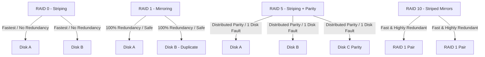

# 🐧 Objective 204.1: Quản Lý Software RAID Chuyên Sâu (mdadm) - Bản Chất Hệ Thống LPIC-2 & Thực Chiến DevOps

> 💡 **Bản chất 1 câu**: Cấu hình và quản lý Software RAID bằng `mdadm` (RAID 0, 1, 5, 6, 10), thay thế đĩa cứng hỏng, thêm Hot-Spare và lưu cấu hình `/etc/mdadm/mdadm.conf`.  
> 🎯 **Trọng tâm phỏng vấn Senior DevOps / SysAdmin**: Lệnh mdadm (--create, --manage, --detail, --fail, --remove, --add), file /etc/mdadm/mdadm.conf, các chuẩn RAID (0, 1, 5, 6, 10), Hot-Spare.

---




---

## 2. 📚 Lý Thuyết Chuyên Sâu & Bản Chất Hệ Thống (Under The Hood Mechanics - LPIC-2 Official Study Guide)

### 2.1 Bản Chất Các Chuẩn Software RAID Trong Linux

| Chuẩn RAID | Số đĩa tối thiểu | Khả năng chịu lỗi (Fault Tolerance) | Hiệu năng Đọc / Ghi | Dung lượng sử dụng được |
| :--- | :--- | :--- | :--- | :--- |
| **RAID 0 (Striping)** | 2 | KHÔNG (Hỏng 1 đĩa = Mất toàn bộ data) | Rất nhanh / Rất nhanh | 100% tổng dung lượng |
| **RAID 1 (Mirroring)** | 2 | Chịu hỏng $N-1$ đĩa | Nhanh / Bình thường | 50% tổng dung lượng |
| **RAID 5 (Parity)** | 3 | Chịu hỏng **1 đĩa** | Nhanh / Chậm (do tính Parity) | $(N-1) 	imes 	ext{Size}$ |
| **RAID 6 (Dual Parity)**| 4 | Chịu hỏng **2 đĩa** cùng lúc | Nhanh / Chậm | $(N-2) 	imes 	ext{Size}$ |
| **RAID 10 (1+0 Striped Mirror)**| 4 | Chịu hỏng 1 đĩa trên mỗi cặp Mirror | Cực nhanh / Cực nhanh | 50% tổng dung lượng |

---

### 2.2 Quy Trình Thay Thế Đĩa RAID Hỏng Nhàn Rỗi (Hot-Swap / Repair)
1. Giả lập hoặc đánh dấu đĩa hỏng: `sudo mdadm /dev/md0 --fail /dev/sdb1`.
2. Gỡ đĩa hỏng ra khỏi mảng RAID: `sudo mdadm /dev/md0 --remove /dev/sdb1`.
3. Rút đĩa cũ cắm đĩa mới vào máy (`/dev/sde1`).
4. Thêm đĩa mới vào mảng RAID để tự động rebuild: `sudo mdadm /dev/md0 --add /dev/sde1`.
5. Cập nhật file cấu hình: `sudo mdadm --detail --scan | sudo tee /etc/mdadm/mdadm.conf`.


---


### 2.4 Cơ Chế Hoạt Động Bên Dưới Kernel & Kiến Trúc Hệ Thống Chi Tiết (Deep Kernel & Architecture)
- **Tầng Giao Tiếp System Calls**: Mọi thao tác người dùng hay lệnh CLI gõ trên Terminal đều trải qua giao diện System Call Interface (như `open()`, `read()`, `write()`, `fork()`, `execve()`, `socket()`, `epoll_wait()`) để chuyển quyền điều khiển từ User Space (Ring 3) xuống Kernel Space (Ring 0).
- **Quản Lý Tài Nguyên & Cấu Trúc Dữ Liệu**: Kernel duy trì các cấu trúc dữ liệu bảng điều khiển (Process Control Block - PCB, File Descriptor Table, Inode Index Table, Page Tables) để đảm bảo cô lập tài nguyên, an toàn bộ nhớ và tối ưu hiệu năng I/O.
- **Tương Tác Phần Cứng & Drivers**: Các trình điều khiển thiết bị (Kernel Modules `.ko`) trực tiếp tương tác với thanh ghi phần cứng (Hardware Registers) qua ngắt CPU (Interrupts - IRQ) và truy cập bộ nhớ trực tiếp (DMA - Direct Memory Access).

---

## 3. ⚡ Bảng Tra Cứu Câu Lệnh & Cấu Hình Thực Hành (CLI Reference)

| Câu lệnh / Component | Tham số / Option | Giải thích ý nghĩa chi tiết | Ví dụ thực tế trong DevOps / SysAdmin |
| :--- | :--- | :--- | :--- |
| **`mdadm`** | `Công cụ quản lý Software RAID toàn năng` | --create, --manage, --detail | `mdadm --detail /dev/md0` |
| **`mdadm --create`** | `Tạo mảng RAID mới` | --level, --raid-devices | `mdadm --create /dev/md0 --level=5 --raid-devices=3 /dev/sd[bcd]1` |


---

## 4. 🛠 Thao Tác Thực Chiến & Kịch Bản DevOps (Real-World Scenarios)

### 🛠 Các lệnh thực hành & Cấu hình chuẩn Production:
```bash
# 1. Tạo mảng RAID 5 từ 3 ổ đĩa sdb1, sdc1, sdd1 kèm 1 đĩa dự phòng sde1 (Hot-Spare):
sudo mdadm --create /dev/md0 --level=5 --raid-devices=3 /dev/sdb1 /dev/sdc1 /dev/sdd1 --spare-devices=1 /dev/sde1

# 2. Định dạng và xem trạng thái rebuild RAID:
cat /proc/mdstat
sudo mdadm --detail /dev/md0
```

### 🚀 Kịch bản xử lý sự cố thực tế khi đi làm:
Sự cố đĩa /dev/sdb1 trong mảng RAID 1 bị báo lỗi I/O:
sudo mdadm /dev/md0 --fail /dev/sdb1
sudo mdadm /dev/md0 --remove /dev/sdb1
sudo mdadm /dev/md0 --add /dev/sdf1

---


### 4.2 Chi Tiết Các Lỗi Thường Gặp & Kịch Bản Khắc Phục Lỗi (Troubleshooting Deep-Dive)
1. **Sự cố 1: Lỗi Cạn Kiệt Tài Nguyên & Nghẽn Cổ Chai (Resource Exhaustion / Bottleneck)**:
   - **Triệu chứng**: Hệ thống phản hồi siêu chậm, ứng dụng bị crash OOM (Out Of Memory) hoặc lệnh báo `No space left on device` dù đĩa còn dung lượng trống.
   - **Bản chất nguyên nhân**: Cạn kiệt Inodes đĩa cứng (`df -i`), tràn bộ nhớ đệm RAM (`free -h`), hoặc cạn kiệt File Descriptors tối đa (`sysctl fs.file-max`).
   - **Các bước xử lý khẩn cấp**:
     ```bash
     # 1. Kiểm tra số lượng Inodes khả dụng trên đĩa:
     df -i /
     
     # 2. Tìm thư mục chứa hàng triệu file rác gây hết Inodes:
     find /var/spool /tmp -xdev -type f | cut -d/ -f2-4 | sort | uniq -c | sort -nr | head -n 10
     
     # 3. Kiểm tra các tiến trình đang chiếm giữ file đã bị xóa (Deleted Descriptor Leak):
     sudo lsof | grep deleted
     
     # 4. Giải phóng bộ nhớ RAM Cache tạm thời của Linux Kernel:
     sudo sysctl -w vm.drop_caches=3
     ```

2. **Sự cố 2: Lỗi Sai Cấu Hình & Tự Động Phục Hồi (Configuration Misconfiguration & Recovery)**:
   - **Triệu chứng**: Dịch vụ ngắt đột ngột, không kết nối được qua cổng mạng (Port Unreachable) hoặc lệnh service return exit code != 0.
   - **Các bước xử lý khẩn cấp**:
     ```bash
     # 1. Kiểm tra cú pháp file cấu hình trước khi restart service:
     sudo systemctl status <service_name> --no-pager -l
     
     # 2. Xem log chi tiết lỗi khởi động từ Journald binary log:
     sudo journalctl -u <service_name> -n 100 --no-pager -e
     
     # 3. Phân tích lời gọi hệ thống Syscall xem tiến trình bị treo ở đâu bằng strace:
     sudo strace -p <PID> -f -e trace=file,network
     ```

---

## 5. 🚀 Bộ Câu Hỏi Phỏng Vấn DevOps & SysAdmin Thực Tế (Interview Q&A)

> **Q: RAID 5 cần tối thiểu bao nhiêu ổ đĩa và chịu hỏng được tối đa bao nhiêu đĩa?**  
> **A**: RAID 5 cần tối thiểu 3 ổ đĩa và chịu hỏng được tối đa 1 ổ đĩa.

> **Q: File nào lưu cấu hình các mảng RAID để tự động nhận diện khi boot?**  
> **A**: File `/etc/mdadm/mdadm.conf` (hoặc `/etc/mdadm.conf`).


> **Q: Làm thế nào để điều tra và xử lý tận gốc sự cố Linux Server báo lỗi "No space left on device" trong khi lệnh `df -h` cho thấy dung lượng đĩa vẫn còn trống 40%?**  
> **A**: Lỗi này thường do 2 nguyên nhân cốt lõi:  
> 1. **Hết Inode (Inode Exhaustion)**: File system đã dùng hết số lượng bảng Inode để lưu trữ metadata file (do có hàng triệu file kích thước siêu nhỏ 0-byte). Kiểm tra bằng `df -i`. Xử lý bằng cách tìm và xóa các thư mục chứa file rác (như `/var/spool/postfix/maildrop` hay `/tmp`).  
> 2. **File Descriptor Leak (File đã xóa nhưng tiến trình vẫn đang mở)**: Một file dung lượng lớn bị xóa bằng lệnh `rm` nhưng tiến trình ứng dụng vẫn đang giữ file handle mở, khiến Kernel chưa thể giải phóng dung lượng đĩa thực sự. Kiểm tra bằng `sudo lsof | grep deleted`, sau đó restart lại tiến trình giữ file đó để Kernel thu hồi đĩa.

> **Q: Giải thích sự khác biệt giữa hai tín hiệu ngắt `SIGTERM` (15) và `SIGKILL` (9) trong Linux OS? Khi nào nên dùng loại nào trong kịch bản tự động hóa DevOps?**  
> **A**:  
> - **`SIGTERM` (Signal 15)**: Tín hiệu yêu cầu dừng ứng dụng **thỏa thuận (Graceful Termination)**. Tiến trình có thể bắt (catch) tín hiệu này để đóng kết nối Database, lưu trạng thái dữ liệu và dọn dẹp tài nguyên trước khi thoát hoàn toàn. Luôn luôn ưu tiên dùng `SIGTERM` trước (như trong Docker/Kubernetes shutdown flow).  
> - **`SIGKILL` (Signal 9)**: Tín hiệu dừng ứng dụng **cưỡng chế tuyệt đối (Forced Termination)** do Kernel trực tiếp tiêu diệt tiến trình ngay lập tức. Tiến trình KHÔNG THỂ bắt hay lờ đi tín hiệu này, dẫn tới nguy cơ hỏng dữ liệu dở dang. Chỉ dùng `SIGKILL` khi tiến trình bị treo đơ không phản hồi `SIGTERM`.

---

## 6. 📝 Cheat Sheet & Ghi Nhớ Nhanh (Summary)

- [x] RAID 0: Tốc độ max, không chịu lỗi
- [x] RAID 1: Soi gương 2 đĩa
- [x] RAID 5: 3 đĩa hỏng 1
- [x] RAID 10: Nhanh + An toàn
- [x] cat /proc/mdstat: Xem trạng thái RAID

