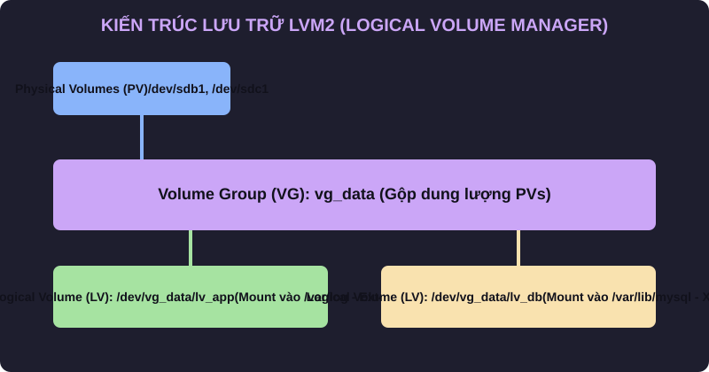

# 🐧 Objective 204.3: LVM2 Quản Lý Lưu Trữ Nâng Cao & Snapshots - Bản Chất Hệ Thống LPIC-2 & Thực Chiến DevOps

> 💡 **Bản chất 1 câu**: Thao tác LVM2 nâng cao: Tạo và khôi phục LVM Snapshots, mở rộng/thu nhỏ VG/LV live, LVM Thin Provisioning và di chuyển dữ liệu (`pvmove`).  
> 🎯 **Trọng tâm phỏng vấn Senior DevOps / SysAdmin**: PV/VG/LV commands (pvcreate, vgcreate, lvcreate, pvmove, vgextend, vgreduce, lvextend, lvreduce), LVM Snapshots (lvcreate -s), LVM Thin Provisioning.

---


```mermaid
graph TD
    Disk1[/dev/sdb - 100GB] --> PV1[Physical Volume PV 1]
    Disk2[/dev/sdc - 100GB] --> PV2[Physical Volume PV 2]
    PV1 --> VG[Volume Group VG - vg_data 200GB]
    PV2 --> VG
    VG --> LV1[Logical Volume LV - lv_app 50GB Ext4]
    VG --> LV2[Logical Volume LV - lv_db 100GB XFS]
```

---

## 2. 📚 Lý Thuyết Chuyên Sâu


 & Bản Chất Hệ Thống (Under The Hood Mechanics - LPIC-2 Official Study Guide)

### 2.1 Quản Lý LVM2 Nâng Cao Trong Môi Trường Doanh Nghiệp
1. **Cơ Cơ Hoạt Động Của LVM Snapshots**:
   - LVM Snapshot sử dụng cơ chế **Copy-on-Write (CoW)**. Bản Snapshot ban đầu có dung lượng gần như bằng 0. Khi dữ liệu trên LV gốc thay đổi, dữ liệu CŨ được chép sang không gian Snapshot trước khi bị ghi đè.
   - **Tạo Snapshot**: `lvcreate -L 5G -s -n lv_app_snap /dev/vg_system/lv_app`.
   - **Rollback khôi phục**: `lvconvert --merge /dev/vg_system/lv_app_snap`.
2. **LVM Thin Provisioning (Cấp Phát Dung Lượng Ảo)**:
   - Cho phép phân bổ dung lượng ảo cho các LV vượt quá dung lượng thực tế của VG (Over-commit).
3. **Di Chuyển Dữ Liệu Live Không Ngắt Dịch Vụ (`pvmove`)**:
   - Khi cần thay thế một ổ đĩa cứng hỏng `/dev/sdb` trong Volume Group mà không ngắt hệ thống:
     `vgextend vg_system /dev/sdc` -> `pvmove /dev/sdb /dev/sdc` -> `vgreduce vg_system /dev/sdb`.


---


### 2.4 Cơ Chế Hoạt Động Bên Dưới Kernel & Kiến Trúc Hệ Thống Chi Tiết (Deep Kernel & Architecture)
- **Tầng Giao Tiếp System Calls**: Mọi thao tác người dùng hay lệnh CLI gõ trên Terminal đều trải qua giao diện System Call Interface (như `open()`, `read()`, `write()`, `fork()`, `execve()`, `socket()`, `epoll_wait()`) để chuyển quyền điều khiển từ User Space (Ring 3) xuống Kernel Space (Ring 0).
- **Quản Lý Tài Nguyên & Cấu Trúc Dữ Liệu**: Kernel duy trì các cấu trúc dữ liệu bảng điều khiển (Process Control Block - PCB, File Descriptor Table, Inode Index Table, Page Tables) để đảm bảo cô lập tài nguyên, an toàn bộ nhớ và tối ưu hiệu năng I/O.
- **Tương Tác Phần Cứng & Drivers**: Các trình điều khiển thiết bị (Kernel Modules `.ko`) trực tiếp tương tác với thanh ghi phần cứng (Hardware Registers) qua ngắt CPU (Interrupts - IRQ) và truy cập bộ nhớ trực tiếp (DMA - Direct Memory Access).

---

## 3. ⚡ Bảng Tra Cứu Câu Lệnh & Cấu Hình Thực Hành (CLI Reference)

| Câu lệnh / Component | Tham số / Option | Giải thích ý nghĩa chi tiết | Ví dụ thực tế trong DevOps / SysAdmin |
| :--- | :--- | :--- | :--- |
| **`lvcreate -s`** | `Tạo bản Snapshot CoW cho Logical Volume` | -L, -n, -s | `lvcreate -L 10G -s -n snap_db /dev/vg/lv_db` |
| **`lvconvert --merge`** | `Phục hồi toàn bộ dữ liệu LV về trạng thái bản Snapshot` | snapshot_path | `lvconvert --merge /dev/vg/snap_db` |
| **`pvmove`** | `Di chuyển dữ liệu live giữa các Physical Volume` | src_pv dst_pv | `pvmove /dev/sdb /dev/sdc` |


---

## 4. 🛠 Thao Tác Thực Chiến & Kịch Bản DevOps (Real-World Scenarios)

### 🛠 Các lệnh thực hành & Cấu hình chuẩn Production:
```bash
# 1. Tạo Snapshot trước khi nâng cấp Database:
sudo lvcreate -L 10G -s -n lv_db_snap /dev/vg_data/lv_db

# 2. Nếu nâng cấp thất bại, Rollback lại nguyên trạng:
sudo umount /var/lib/mysql
sudo lvconvert --merge /dev/vg_data/lv_db_snap
sudo mount /dev/vg_data/lv_db /var/lib/mysql
```

### 🚀 Kịch bản xử lý sự cố thực tế khi đi làm:
Thay thế ổ đĩa cứng cũ bị lỗi bằng đĩa mới không gián đoạn Web Server:
sudo pvcreate /dev/sdc
sudo vgextend vg_system /dev/sdc
sudo pvmove /dev/sdb /dev/sdc
sudo vgreduce vg_system /dev/sdb

---


### 4.2 Chi Tiết Các Lỗi Thường Gặp & Kịch Bản Khắc Phục Lỗi (Troubleshooting Deep-Dive)
1. **Sự cố 1: Lỗi Cạn Kiệt Tài Nguyên & Nghẽn Cổ Chai (Resource Exhaustion / Bottleneck)**:
   - **Triệu chứng**: Hệ thống phản hồi siêu chậm, ứng dụng bị crash OOM (Out Of Memory) hoặc lệnh báo `No space left on device` dù đĩa còn dung lượng trống.
   - **Bản chất nguyên nhân**: Cạn kiệt Inodes đĩa cứng (`df -i`), tràn bộ nhớ đệm RAM (`free -h`), hoặc cạn kiệt File Descriptors tối đa (`sysctl fs.file-max`).
   - **Các bước xử lý khẩn cấp**:
     ```bash
     # 1. Kiểm tra số lượng Inodes khả dụng trên đĩa:
     df -i /
     
     # 2. Tìm thư mục chứa hàng triệu file rác gây hết Inodes:
     find /var/spool /tmp -xdev -type f | cut -d/ -f2-4 | sort | uniq -c | sort -nr | head -n 10
     
     # 3. Kiểm tra các tiến trình đang chiếm giữ file đã bị xóa (Deleted Descriptor Leak):
     sudo lsof | grep deleted
     
     # 4. Giải phóng bộ nhớ RAM Cache tạm thời của Linux Kernel:
     sudo sysctl -w vm.drop_caches=3
     ```

2. **Sự cố 2: Lỗi Sai Cấu Hình & Tự Động Phục Hồi (Configuration Misconfiguration & Recovery)**:
   - **Triệu chứng**: Dịch vụ ngắt đột ngột, không kết nối được qua cổng mạng (Port Unreachable) hoặc lệnh service return exit code != 0.
   - **Các bước xử lý khẩn cấp**:
     ```bash
     # 1. Kiểm tra cú pháp file cấu hình trước khi restart service:
     sudo systemctl status <service_name> --no-pager -l
     
     # 2. Xem log chi tiết lỗi khởi động từ Journald binary log:
     sudo journalctl -u <service_name> -n 100 --no-pager -e
     
     # 3. Phân tích lời gọi hệ thống Syscall xem tiến trình bị treo ở đâu bằng strace:
     sudo strace -p <PID> -f -e trace=file,network
     ```

---

## 5. 🚀 Bộ Câu Hỏi Phỏng Vấn DevOps & SysAdmin Thực Tế (Interview Q&A)

> **Q: Cơ chế Copy-on-Write (CoW) giúp LVM Snapshot hoạt động như thế nào?**  
> **A**: Snapshot chỉ lưu trữ phần dữ liệu CŨ bị thay đổi so với mốc thời gian chụp, giúp tạo bản sao nhanh chóng trong 1 giây mà không cần copy toàn bộ ổ đĩa.

> **Q: Lệnh nào di chuyển toàn bộ dữ liệu live từ một đĩa cứng PV cũ sang đĩa cứng PV mới mà không cần tắt máy?**  
> **A**: Lệnh `sudo pvmove /dev/sdb /dev/sdc`.


> **Q: Làm thế nào để điều tra và xử lý tận gốc sự cố Linux Server báo lỗi "No space left on device" trong khi lệnh `df -h` cho thấy dung lượng đĩa vẫn còn trống 40%?**  
> **A**: Lỗi này thường do 2 nguyên nhân cốt lõi:  
> 1. **Hết Inode (Inode Exhaustion)**: File system đã dùng hết số lượng bảng Inode để lưu trữ metadata file (do có hàng triệu file kích thước siêu nhỏ 0-byte). Kiểm tra bằng `df -i`. Xử lý bằng cách tìm và xóa các thư mục chứa file rác (như `/var/spool/postfix/maildrop` hay `/tmp`).  
> 2. **File Descriptor Leak (File đã xóa nhưng tiến trình vẫn đang mở)**: Một file dung lượng lớn bị xóa bằng lệnh `rm` nhưng tiến trình ứng dụng vẫn đang giữ file handle mở, khiến Kernel chưa thể giải phóng dung lượng đĩa thực sự. Kiểm tra bằng `sudo lsof | grep deleted`, sau đó restart lại tiến trình giữ file đó để Kernel thu hồi đĩa.

> **Q: Giải thích sự khác biệt giữa hai tín hiệu ngắt `SIGTERM` (15) và `SIGKILL` (9) trong Linux OS? Khi nào nên dùng loại nào trong kịch bản tự động hóa DevOps?**  
> **A**:  
> - **`SIGTERM` (Signal 15)**: Tín hiệu yêu cầu dừng ứng dụng **thỏa thuận (Graceful Termination)**. Tiến trình có thể bắt (catch) tín hiệu này để đóng kết nối Database, lưu trạng thái dữ liệu và dọn dẹp tài nguyên trước khi thoát hoàn toàn. Luôn luôn ưu tiên dùng `SIGTERM` trước (như trong Docker/Kubernetes shutdown flow).  
> - **`SIGKILL` (Signal 9)**: Tín hiệu dừng ứng dụng **cưỡng chế tuyệt đối (Forced Termination)** do Kernel trực tiếp tiêu diệt tiến trình ngay lập tức. Tiến trình KHÔNG THỂ bắt hay lờ đi tín hiệu này, dẫn tới nguy cơ hỏng dữ liệu dở dang. Chỉ dùng `SIGKILL` khi tiến trình bị treo đơ không phản hồi `SIGTERM`.

---

## 6. 📝 Cheat Sheet & Ghi Nhớ Nhanh (Summary)

- [x] lvcreate -s: Tạo LVM Snapshot CoW
- [x] lvconvert --merge: Rollback đĩa về Snapshot
- [x] pvmove: Di chuyển data live giữa các đĩa PV
- [x] Thin Provisioning: Cấp phát dung lượng ảo

