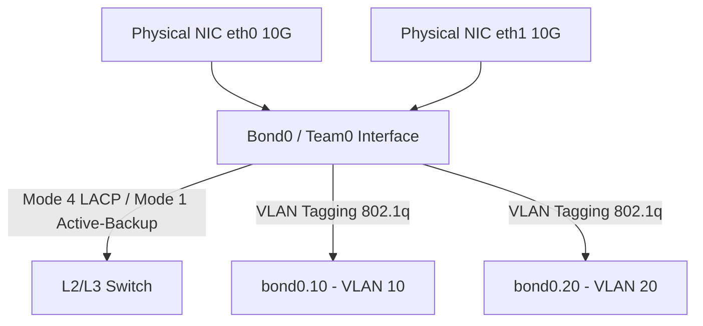

# 🐧 Objective 205.2: Cấu Hình Mạng Nâng Cao: Network Bonding & VLANs 802.1q - Bản Chất Hệ Thống LPIC-2 & Thực Chiến DevOps

> 💡 **Bản chất 1 câu**: Cấu hình gộp card mạng Network Bonding/Teaming (Active-Backup, LACP 802.3ad) tăng băng thông/chống lỗi và phân chia VLAN 802.1q.  
> 🎯 **Trọng tâm phỏng vấn Senior DevOps / SysAdmin**: Network Bonding (bonding driver, mode 0..6: mode 1 active-backup, mode 4 LACP 802.3ad), Network Teaming (teamd), VLAN 802.1q (vconfig, ip link add link type vlan).

---



---

## 2. 📚 Lý Thuyết Chuyên Sâu & Bản Chất Hệ Thống (Under The Hood Mechanics - LPIC-2 Official Study Guide)

### 2.1 Kiến Trúc Network Bonding & Teaming
1. **Các Chế Độ Bonding Quan Trọng (Bonding Modes)**:
   - **Mode 1 (Active-Backup)**: 1 card chạy chính, 1 card dự phòng.
   - **Mode 4 (Dynamic Link Aggregation - LACP 802.3ad)**: Gộp băng thông của nhiều card mạng. Yêu cầu Switch vật lý hỗ trợ LACP.
2. **Cấu Hình Phân Chia Mạng Ảo VLAN 802.1q**:
   - Thêm thẻ VLAN Tagging 802.1q vào gói tin Ethernet.
   - Tạo VLAN interface bằng `ip`: `ip link add link eth0 name eth0.100 type vlan id 100`.


---


### 2.4 Cơ Chế Hoạt Động Bên Dưới Kernel & Kiến Trúc Hệ Thống Chi Tiết (Deep Kernel & Architecture)
- **Tầng Giao Tiếp System Calls**: Mọi thao tác người dùng hay lệnh CLI gõ trên Terminal đều trải qua giao diện System Call Interface (như `open()`, `read()`, `write()`, `fork()`, `execve()`, `socket()`, `epoll_wait()`) để chuyển quyền điều khiển từ User Space (Ring 3) xuống Kernel Space (Ring 0).
- **Quản Lý Tài Nguyên & Cấu Trúc Dữ Liệu**: Kernel duy trì các cấu trúc dữ liệu bảng điều khiển (Process Control Block - PCB, File Descriptor Table, Inode Index Table, Page Tables) để đảm bảo cô lập tài nguyên, an toàn bộ nhớ và tối ưu hiệu năng I/O.
- **Tương Tác Phần Cứng & Drivers**: Các trình điều khiển thiết bị (Kernel Modules `.ko`) trực tiếp tương tác với thanh ghi phần cứng (Hardware Registers) qua ngắt CPU (Interrupts - IRQ) và truy cập bộ nhớ trực tiếp (DMA - Direct Memory Access).

---

## 3. ⚡ Bảng Tra Cứu Câu Lệnh & Cấu Hình Thực Hành (CLI Reference)

| Câu lệnh / Component | Tham số / Option | Giải thích ý nghĩa chi tiết | Ví dụ thực tế trong DevOps / SysAdmin |
| :--- | :--- | :--- | :--- |
| **`ip link add type bond`** | `Tạo giao diện gộp card mạng Bond ảo` | name, mode | `ip link add name bond0 type bond mode active-backup` |
| **`ip link add type vlan`** | `Tạo giao diện mạng ảo phân chia VLAN Tagging` | link, id | `ip link add link eth0 name eth0.100 type vlan id 100` |
| **`teamd`** | `Daemon quản lý Network Teaming hiện đại trên RHEL` | -g, -c | `teamctl team0 status` |


---

## 4. 🛠 Thao Tác Thực Chiến & Kịch Bản DevOps (Real-World Scenarios)

### 🛠 Các lệnh thực hành & Cấu hình chuẩn Production:
```bash
# Cấu hình VLAN 100 trên card mạng eth0:
sudo ip link add link eth0 name eth0.100 type vlan id 100
sudo ip addr add 192.168.100.10/24 dev eth0.100
sudo ip link set dev eth0.100 up
```

### 🚀 Kịch bản xử lý sự cố thực tế khi đi làm:
Cấu hình Network Bonding Mode 1 (Active-Backup) trên Ubuntu Netplan:
# /etc/netplan/01-bond.yaml
network:
  version: 2
  bonds:
    bond0:
      interfaces: [eth0, eth1]
      parameters:
        mode: active-backup
        mii-monitor-interval: 100
      addresses: [10.0.0.10/24]

---


### 4.2 Chi Tiết Các Lỗi Thường Gặp & Kịch Bản Khắc Phục Lỗi (Troubleshooting Deep-Dive)
1. **Sự cố 1: Lỗi Cạn Kiệt Tài Nguyên & Nghẽn Cổ Chai (Resource Exhaustion / Bottleneck)**:
   - **Triệu chứng**: Hệ thống phản hồi siêu chậm, ứng dụng bị crash OOM (Out Of Memory) hoặc lệnh báo `No space left on device` dù đĩa còn dung lượng trống.
   - **Bản chất nguyên nhân**: Cạn kiệt Inodes đĩa cứng (`df -i`), tràn bộ nhớ đệm RAM (`free -h`), hoặc cạn kiệt File Descriptors tối đa (`sysctl fs.file-max`).
   - **Các bước xử lý khẩn cấp**:
     ```bash
     # 1. Kiểm tra số lượng Inodes khả dụng trên đĩa:
     df -i /
     
     # 2. Tìm thư mục chứa hàng triệu file rác gây hết Inodes:
     find /var/spool /tmp -xdev -type f | cut -d/ -f2-4 | sort | uniq -c | sort -nr | head -n 10
     
     # 3. Kiểm tra các tiến trình đang chiếm giữ file đã bị xóa (Deleted Descriptor Leak):
     sudo lsof | grep deleted
     
     # 4. Giải phóng bộ nhớ RAM Cache tạm thời của Linux Kernel:
     sudo sysctl -w vm.drop_caches=3
     ```

2. **Sự cố 2: Lỗi Sai Cấu Hình & Tự Động Phục Hồi (Configuration Misconfiguration & Recovery)**:
   - **Triệu chứng**: Dịch vụ ngắt đột ngột, không kết nối được qua cổng mạng (Port Unreachable) hoặc lệnh service return exit code != 0.
   - **Các bước xử lý khẩn cấp**:
     ```bash
     # 1. Kiểm tra cú pháp file cấu hình trước khi restart service:
     sudo systemctl status <service_name> --no-pager -l
     
     # 2. Xem log chi tiết lỗi khởi động từ Journald binary log:
     sudo journalctl -u <service_name> -n 100 --no-pager -e
     
     # 3. Phân tích lời gọi hệ thống Syscall xem tiến trình bị treo ở đâu bằng strace:
     sudo strace -p <PID> -f -e trace=file,network
     ```

---

## 5. 🚀 Bộ Câu Hỏi Phỏng Vấn DevOps & SysAdmin Thực Tế (Interview Q&A)

> **Q: Chế độ Bonding Mode nào vừa hỗ trợ tăng gấp đôi băng thông vừa dự phòng lỗi và yêu cầu Switch hỗ trợ LACP?**  
> **A**: Chế độ **Bonding Mode 4 (IEEE 802.3ad LACP)**.

> **Q: Chuẩn đóng gói tiêu chuẩn nào được sử dụng để phân chia VLAN trên giao diện Ethernet?**  
> **A**: Chuẩn **IEEE 802.1q**.


> **Q: Làm thế nào để điều tra và xử lý tận gốc sự cố Linux Server báo lỗi "No space left on device" trong khi lệnh `df -h` cho thấy dung lượng đĩa vẫn còn trống 40%?**  
> **A**: Lỗi này thường do 2 nguyên nhân cốt lõi:  
> 1. **Hết Inode (Inode Exhaustion)**: File system đã dùng hết số lượng bảng Inode để lưu trữ metadata file (do có hàng triệu file kích thước siêu nhỏ 0-byte). Kiểm tra bằng `df -i`. Xử lý bằng cách tìm và xóa các thư mục chứa file rác (như `/var/spool/postfix/maildrop` hay `/tmp`).  
> 2. **File Descriptor Leak (File đã xóa nhưng tiến trình vẫn đang mở)**: Một file dung lượng lớn bị xóa bằng lệnh `rm` nhưng tiến trình ứng dụng vẫn đang giữ file handle mở, khiến Kernel chưa thể giải phóng dung lượng đĩa thực sự. Kiểm tra bằng `sudo lsof | grep deleted`, sau đó restart lại tiến trình giữ file đó để Kernel thu hồi đĩa.

> **Q: Giải thích sự khác biệt giữa hai tín hiệu ngắt `SIGTERM` (15) và `SIGKILL` (9) trong Linux OS? Khi nào nên dùng loại nào trong kịch bản tự động hóa DevOps?**  
> **A**:  
> - **`SIGTERM` (Signal 15)**: Tín hiệu yêu cầu dừng ứng dụng **thỏa thuận (Graceful Termination)**. Tiến trình có thể bắt (catch) tín hiệu này để đóng kết nối Database, lưu trạng thái dữ liệu và dọn dẹp tài nguyên trước khi thoát hoàn toàn. Luôn luôn ưu tiên dùng `SIGTERM` trước (như trong Docker/Kubernetes shutdown flow).  
> - **`SIGKILL` (Signal 9)**: Tín hiệu dừng ứng dụng **cưỡng chế tuyệt đối (Forced Termination)** do Kernel trực tiếp tiêu diệt tiến trình ngay lập tức. Tiến trình KHÔNG THỂ bắt hay lờ đi tín hiệu này, dẫn tới nguy cơ hỏng dữ liệu dở dang. Chỉ dùng `SIGKILL` khi tiến trình bị treo đơ không phản hồi `SIGTERM`.

---

## 6. 📝 Cheat Sheet & Ghi Nhớ Nhanh (Summary)

- [x] Bonding Mode 1: Active-Backup (Dự phòng ngắt kết nối)
- [x] Bonding Mode 4: LACP (Gộp băng thông + Dự phòng)
- [x] VLAN 802.1q: Phân chia mạng ảo eth0.100

