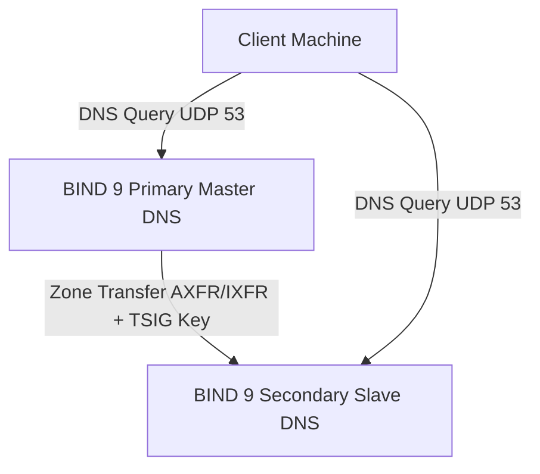

# 🐧 Objective 207.1: Cấu Hình Máy Chủ Tên Miền BIND 9 Cơ Bản - Bản Chất Hệ Thống LPIC-2 & Thực Chiến DevOps

> 💡 **Bản chất 1 câu**: Triển khai và cấu hình máy chủ DNS BIND 9 (`named.conf`, Zone Files: SOA, NS, A, AAAA, CNAME, MX, PTR, TXT) và kiểm tra cú pháp.  
> 🎯 **Trọng tâm phỏng vấn Senior DevOps / SysAdmin**: BIND 9 service (named), file /etc/bind/named.conf (/etc/named.conf), các loại bản ghi (SOA, NS, A, AAAA, CNAME, MX, PTR, TXT), named-checkconf, named-checkzone.

---




---

## 2. 📚 Lý Thuyết Chuyên Sâu & Bản Chất Hệ Thống (Under The Hood Mechanics - LPIC-2 Official Study Guide)

### 2.1 Cấu Trúc Bản Ghi DNS & File Zone Của BIND 9
1. **Các Loại Bản Ghi DNS Cốt Lõi (DNS Resource Records - RR)**:
   - **SOA (Start of Authority)**: Khai báo máy chủ DNS quản lý chính, email admin, và các tham số Serial Number, Refresh, Retry, Expire.
   - **NS (Name Server)**: Chỉ định máy chủ DNS đảm nhiệm giải mã domain.
   - **A / AAAA**: Map tên miền sang địa chỉ IPv4 (A) hoặc IPv6 (AAAA).
   - **CNAME (Canonical Name)**: Tên biệt hiệu trỏ sang một tên miền khác.
   - **MX (Mail Exchanger)**: Chỉ định Server nhận Email cho domain kèm độ ưu tiên.
   - **PTR (Pointer Record)**: Phân giải NGUỢC từ địa chỉ IP sang Tên miền (Reverse DNS lookup).
   - **TXT**: Bản ghi văn bản (Dùng cấu hình SPF, DKIM, DMARC xác thực email).

---

### 2.2 Ví Dụ File Zone Chuẩn BIND 9 (`db.company.com`)
```bind
$TTL 86400
@   IN  SOA ns1.company.com. admin.company.com. (
            2026080401 ; Serial YYYYMMDDnn
            3600       ; Refresh
            1800       ; Retry
            604800     ; Expire
            86400 )    ; Minimum TTL

@   IN  NS   ns1.company.com.
@   IN  MX 10 mail.company.com.

ns1 IN  A    10.0.0.10
mail IN A    10.0.0.20
app  IN A    10.0.0.50
www  IN CNAME app
```


---

## 3. ⚡ Bảng Tra Cứu Câu Lệnh & Cấu Hình Thực Hành (CLI Reference)

| Câu lệnh / Component | Tham số / Option | Giải thích ý nghĩa chi tiết | Ví dụ thực tế trong DevOps / SysAdmin |
| :--- | :--- | :--- | :--- |
| **`named-checkconf`** | `Kiểm tra lỗi cú pháp file cấu hình chính named.conf` | Không | `sudo named-checkconf` |
| **`named-checkzone`** | `Kiểm tra cú pháp và tính hợp lệ của file Zone` | domain zonefile | `sudo named-checkzone company.com /etc/bind/db.company.com` |
| **`rndc`** | `Công cụ điều khiển và reload BIND 9 daemon live` | reload, status | `sudo rndc reload` |


---

## 4. 🛠 Thao Tác Thực Chiến & Kịch Bản DevOps (Real-World Scenarios)

### 🛠 Các lệnh thực hành & Cấu hình chuẩn Production:
```bash
# Kiểm tra cú pháp cấu hình BIND 9 trước khi reload:
sudo named-checkconf
sudo named-checkzone company.com /etc/bind/db.company.com
sudo rndc reload
```

### 🚀 Kịch bản xử lý sự cố thực tế khi đi làm:
Sự cố sửa Zone file quên tăng số Serial Number khiến Secondary DNS không cập nhật bản ghi mới:
# Bắt buộc tăng Serial Number (vd: 2026080401 -> 2026080402) mỗi khi sửa Zone file!

---

## 5. 🚀 Bộ Câu Hỏi Phỏng Vấn DevOps & SysAdmin Thực Tế (Interview Q&A)

> **Q: Bản ghi DNS nào dùng để phân giải NGUỢC từ địa chỉ IP sang Hostname (Reverse DNS)?**  
> **A**: Bản ghi **PTR Record**.

> **Q: Tại sao phải tăng chỉ số Serial Number trong bản ghi SOA mỗi khi chỉnh sửa Zone file?**  
> **A**: Vì các máy chủ Secondary DNS dựa vào Serial Number để biết dữ liệu Zone đã thay đổi và kích hoạt đồng bộ (Zone Transfer).


---

## 6. 📝 Cheat Sheet & Ghi Nhớ Nhanh (Summary)

- [x] SOA: Khai báo quyền quản lý & Serial Number
- [x] A/AAAA: Map domain sang IPv4/IPv6
- [x] PTR: Phân giải ngược IP sang Domain
- [x] named-checkconf & named-checkzone: Kiểm tra lỗi cú pháp

