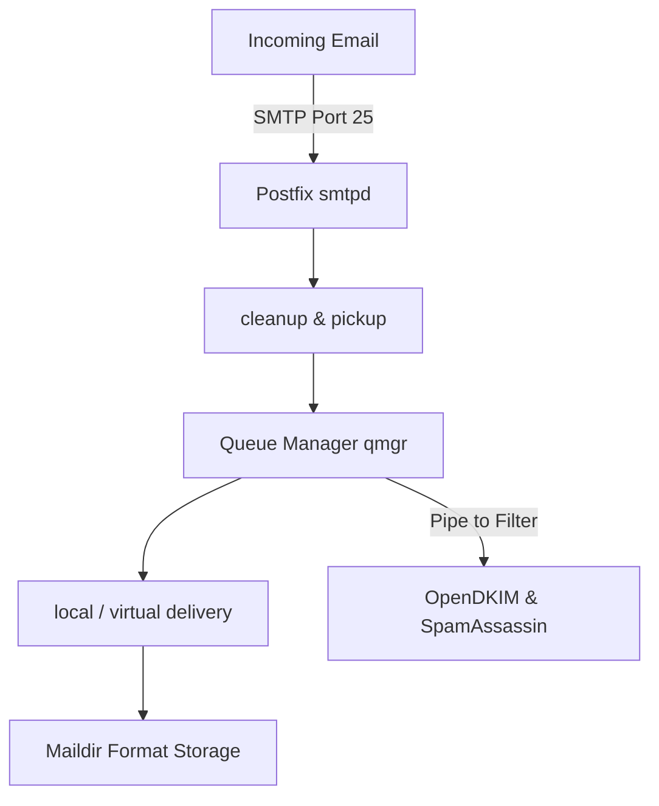

# 🐧 Objective 211.1: Quản Trị Máy Chủ Thư Postfix MTA Chuyên Sâu - Bản Chất Hệ Thống LPIC-2 & Thực Chiến DevOps

> 💡 **Bản chất 1 câu**: Triển khai máy chủ gửi/nhận thư Postfix MTA (`main.cf`, `master.cf`), định tuyến Virtual Domains, Relay Host, SASL Authentication và kiểm tra Mail Queue.  
> 🎯 **Trọng tâm phỏng vấn Senior DevOps / SysAdmin**: Postfix config (/etc/postfix/main.cf, master.cf), lookup tables (postmap hash:), virtual_alias_maps, relayhost, mynetworks, mailq, postqueue, postsuper.

---




---

## 2. 📚 Lý Thuyết Chuyên Sâu & Bản Chất Hệ Thống (Under The Hood Mechanics - LPIC-2 Official Study Guide)

### 2.1 Cấu Trúc Quản Trị Máy Chủ Postfix MTA
1. **Các File Cấu Hình Cốt Lõi**:
   - `/etc/postfix/main.cf`: Cấu hình thông số chính của Postfix.
   - `/etc/postfix/master.cf`: Cấu hình các daemon chạy ngầm (SMTPd, Cleanup, Qmgr).
2. **Các Chỉ Thị Quan Trọng**:
   - `myhostname = mail.company.com`
   - `mynetworks = 127.0.0.0/8, 10.0.0.0/24` (Dải IP tin cậy).
   - `relayhost = [smtp.sendgrid.net]:587`
3. **Biên Dịch Lookup Tables (`postmap`)**:
   - Biên dịch file text sang Berkley DB `.db`: `postmap hash:/etc/postfix/virtual`.
4. **Quản Lý Mail Queue**:
   - `postqueue -p` (xem queue), `postsuper -d ALL` (xóa queue).


---

## 3. ⚡ Bảng Tra Cứu Câu Lệnh & Cấu Hình Thực Hành (CLI Reference)

| Câu lệnh / Component | Tham số / Option | Giải thích ý nghĩa chi tiết | Ví dụ thực tế trong DevOps / SysAdmin |
| :--- | :--- | :--- | :--- |
| **`postmap`** | `Biên dịch file text map sang database .db cho Postfix` | hash:file | `sudo postmap /etc/postfix/virtual` |
| **`postqueue`** | `Xem và kích hoạt xử lý hàng chờ Mail Queue` | -p, -f | `postqueue -p` |
| **`postsuper`** | `Quản trị viên xóa hoặc chuyển trạng thái mail trong Queue` | -d, -h | `sudo postsuper -d ALL` |


---

## 4. 🛠 Thao Tác Thực Chiến & Kịch Bản DevOps (Real-World Scenarios)

### 🛠 Các lệnh thực hành & Cấu hình chuẩn Production:
```bash
# 1. Khai báo Virtual Email Alias trong /etc/postfix/virtual:
sudo postmap /etc/postfix/virtual
sudo systemctl reload postfix

# 2. Xóa sạch mail rác kẹt trong Mail Queue:
sudo postsuper -d ALL
```

### 🚀 Kịch bản xử lý sự cố thực tế khi đi làm:
Sự cố Server bị Hacker lợi dụng gửi SPAM làm đầy Mail Queue 100,000 emails:
# Tắt ngay mynetworks mở rộng và xóa queue:
sudo postsuper -d ALL deferred

---

## 5. 🚀 Bộ Câu Hỏi Phỏng Vấn DevOps & SysAdmin Thực Tế (Interview Q&A)

> **Q: Nguy cơ bảo mật nghiêm trọng nào xảy ra nếu cấu hình `mynetworks = 0.0.0.0/0` trong Postfix `main.cf`?**  
> **A**: Máy chủ sẽ biến thành một **Open Relay**, cho phép bất kỳ Hacker nào mượn máy chủ để gửi SPAM rác.

> **Q: Lệnh nào biên dịch file map `/etc/postfix/virtual` sang dạng database `.db` để Postfix truy vấn?**  
> **A**: Lệnh `sudo postmap hash:/etc/postfix/virtual`.


---

## 6. 📝 Cheat Sheet & Ghi Nhớ Nhanh (Summary)

- [x] main.cf: File cấu hình chính Postfix
- [x] postmap hash:file: Biên dịch file map sang .db
- [x] mynetworks: Dải IP được phép gửi mail
- [x] postsuper -d ALL: Xóa sạch Mail Queue

