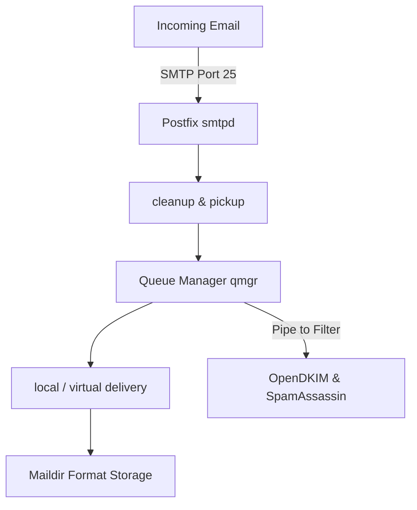

# 🐧 Objective 211.1: Quản Trị Máy Chủ Thư Postfix MTA Chuyên Sâu - Bản Chất Hệ Thống LPIC-2 & Thực Chiến DevOps

> 💡 **Bản chất 1 câu**: Triển khai máy chủ gửi/nhận thư Postfix MTA (`main.cf`, `master.cf`), định tuyến Virtual Domains, Relay Host, SASL Authentication và kiểm tra Mail Queue.  
> 🎯 **Trọng tâm phỏng vấn Senior DevOps / SysAdmin**: Postfix config (/etc/postfix/main.cf, master.cf), lookup tables (postmap hash:), virtual_alias_maps, relayhost, mynetworks, mailq, postqueue, postsuper.

---




---

## 2. 📚 Lý Thuyết Chuyên Sâu & Bản Chất Hệ Thống (Under The Hood Mechanics - LPIC-2 Official Study Guide)

### 2.1 Cấu Trúc Quản Trị Máy Chủ Postfix MTA
1. **Các File Cấu Hình Cốt Lõi**:
   - `/etc/postfix/main.cf`: Cấu hình thông số chính của Postfix.
   - `/etc/postfix/master.cf`: Cấu hình các daemon chạy ngầm (SMTPd, Cleanup, Qmgr).
2. **Các Chỉ Thị Quan Trọng**:
   - `myhostname = mail.company.com`
   - `mynetworks = 127.0.0.0/8, 10.0.0.0/24` (Dải IP tin cậy).
   - `relayhost = [smtp.sendgrid.net]:587`
3. **Biên Dịch Lookup Tables (`postmap`)**:
   - Biên dịch file text sang Berkley DB `.db`: `postmap hash:/etc/postfix/virtual`.
4. **Quản Lý Mail Queue**:
   - `postqueue -p` (xem queue), `postsuper -d ALL` (xóa queue).


---


### 2.4 Cơ Chế Hoạt Động Bên Dưới Kernel & Kiến Trúc Hệ Thống Chi Tiết (Deep Kernel & Architecture)
- **Tầng Giao Tiếp System Calls**: Mọi thao tác người dùng hay lệnh CLI gõ trên Terminal đều trải qua giao diện System Call Interface (như `open()`, `read()`, `write()`, `fork()`, `execve()`, `socket()`, `epoll_wait()`) để chuyển quyền điều khiển từ User Space (Ring 3) xuống Kernel Space (Ring 0).
- **Quản Lý Tài Nguyên & Cấu Trúc Dữ Liệu**: Kernel duy trì các cấu trúc dữ liệu bảng điều khiển (Process Control Block - PCB, File Descriptor Table, Inode Index Table, Page Tables) để đảm bảo cô lập tài nguyên, an toàn bộ nhớ và tối ưu hiệu năng I/O.
- **Tương Tác Phần Cứng & Drivers**: Các trình điều khiển thiết bị (Kernel Modules `.ko`) trực tiếp tương tác với thanh ghi phần cứng (Hardware Registers) qua ngắt CPU (Interrupts - IRQ) và truy cập bộ nhớ trực tiếp (DMA - Direct Memory Access).

---

## 3. ⚡ Bảng Tra Cứu Câu Lệnh & Cấu Hình Thực Hành (CLI Reference)

| Câu lệnh / Component | Tham số / Option | Giải thích ý nghĩa chi tiết | Ví dụ thực tế trong DevOps / SysAdmin |
| :--- | :--- | :--- | :--- |
| **`postmap`** | `Biên dịch file text map sang database .db cho Postfix` | hash:file | `sudo postmap /etc/postfix/virtual` |
| **`postqueue`** | `Xem và kích hoạt xử lý hàng chờ Mail Queue` | -p, -f | `postqueue -p` |
| **`postsuper`** | `Quản trị viên xóa hoặc chuyển trạng thái mail trong Queue` | -d, -h | `sudo postsuper -d ALL` |


---

## 4. 🛠 Thao Tác Thực Chiến & Kịch Bản DevOps (Real-World Scenarios)

### 🛠 Các lệnh thực hành & Cấu hình chuẩn Production:
```bash
# 1. Khai báo Virtual Email Alias trong /etc/postfix/virtual:
sudo postmap /etc/postfix/virtual
sudo systemctl reload postfix

# 2. Xóa sạch mail rác kẹt trong Mail Queue:
sudo postsuper -d ALL
```

### 🚀 Kịch bản xử lý sự cố thực tế khi đi làm:
Sự cố Server bị Hacker lợi dụng gửi SPAM làm đầy Mail Queue 100,000 emails:
# Tắt ngay mynetworks mở rộng và xóa queue:
sudo postsuper -d ALL deferred

---


### 4.2 Chi Tiết Các Lỗi Thường Gặp & Kịch Bản Khắc Phục Lỗi (Troubleshooting Deep-Dive)
1. **Sự cố 1: Lỗi Cạn Kiệt Tài Nguyên & Nghẽn Cổ Chai (Resource Exhaustion / Bottleneck)**:
   - **Triệu chứng**: Hệ thống phản hồi siêu chậm, ứng dụng bị crash OOM (Out Of Memory) hoặc lệnh báo `No space left on device` dù đĩa còn dung lượng trống.
   - **Bản chất nguyên nhân**: Cạn kiệt Inodes đĩa cứng (`df -i`), tràn bộ nhớ đệm RAM (`free -h`), hoặc cạn kiệt File Descriptors tối đa (`sysctl fs.file-max`).
   - **Các bước xử lý khẩn cấp**:
     ```bash
     # 1. Kiểm tra số lượng Inodes khả dụng trên đĩa:
     df -i /
     
     # 2. Tìm thư mục chứa hàng triệu file rác gây hết Inodes:
     find /var/spool /tmp -xdev -type f | cut -d/ -f2-4 | sort | uniq -c | sort -nr | head -n 10
     
     # 3. Kiểm tra các tiến trình đang chiếm giữ file đã bị xóa (Deleted Descriptor Leak):
     sudo lsof | grep deleted
     
     # 4. Giải phóng bộ nhớ RAM Cache tạm thời của Linux Kernel:
     sudo sysctl -w vm.drop_caches=3
     ```

2. **Sự cố 2: Lỗi Sai Cấu Hình & Tự Động Phục Hồi (Configuration Misconfiguration & Recovery)**:
   - **Triệu chứng**: Dịch vụ ngắt đột ngột, không kết nối được qua cổng mạng (Port Unreachable) hoặc lệnh service return exit code != 0.
   - **Các bước xử lý khẩn cấp**:
     ```bash
     # 1. Kiểm tra cú pháp file cấu hình trước khi restart service:
     sudo systemctl status <service_name> --no-pager -l
     
     # 2. Xem log chi tiết lỗi khởi động từ Journald binary log:
     sudo journalctl -u <service_name> -n 100 --no-pager -e
     
     # 3. Phân tích lời gọi hệ thống Syscall xem tiến trình bị treo ở đâu bằng strace:
     sudo strace -p <PID> -f -e trace=file,network
     ```

---

## 5. 🚀 Bộ Câu Hỏi Phỏng Vấn DevOps & SysAdmin Thực Tế (Interview Q&A)

> **Q: Nguy cơ bảo mật nghiêm trọng nào xảy ra nếu cấu hình `mynetworks = 0.0.0.0/0` trong Postfix `main.cf`?**  
> **A**: Máy chủ sẽ biến thành một **Open Relay**, cho phép bất kỳ Hacker nào mượn máy chủ để gửi SPAM rác.

> **Q: Lệnh nào biên dịch file map `/etc/postfix/virtual` sang dạng database `.db` để Postfix truy vấn?**  
> **A**: Lệnh `sudo postmap hash:/etc/postfix/virtual`.


> **Q: Làm thế nào để điều tra và xử lý tận gốc sự cố Linux Server báo lỗi "No space left on device" trong khi lệnh `df -h` cho thấy dung lượng đĩa vẫn còn trống 40%?**  
> **A**: Lỗi này thường do 2 nguyên nhân cốt lõi:  
> 1. **Hết Inode (Inode Exhaustion)**: File system đã dùng hết số lượng bảng Inode để lưu trữ metadata file (do có hàng triệu file kích thước siêu nhỏ 0-byte). Kiểm tra bằng `df -i`. Xử lý bằng cách tìm và xóa các thư mục chứa file rác (như `/var/spool/postfix/maildrop` hay `/tmp`).  
> 2. **File Descriptor Leak (File đã xóa nhưng tiến trình vẫn đang mở)**: Một file dung lượng lớn bị xóa bằng lệnh `rm` nhưng tiến trình ứng dụng vẫn đang giữ file handle mở, khiến Kernel chưa thể giải phóng dung lượng đĩa thực sự. Kiểm tra bằng `sudo lsof | grep deleted`, sau đó restart lại tiến trình giữ file đó để Kernel thu hồi đĩa.

> **Q: Giải thích sự khác biệt giữa hai tín hiệu ngắt `SIGTERM` (15) và `SIGKILL` (9) trong Linux OS? Khi nào nên dùng loại nào trong kịch bản tự động hóa DevOps?**  
> **A**:  
> - **`SIGTERM` (Signal 15)**: Tín hiệu yêu cầu dừng ứng dụng **thỏa thuận (Graceful Termination)**. Tiến trình có thể bắt (catch) tín hiệu này để đóng kết nối Database, lưu trạng thái dữ liệu và dọn dẹp tài nguyên trước khi thoát hoàn toàn. Luôn luôn ưu tiên dùng `SIGTERM` trước (như trong Docker/Kubernetes shutdown flow).  
> - **`SIGKILL` (Signal 9)**: Tín hiệu dừng ứng dụng **cưỡng chế tuyệt đối (Forced Termination)** do Kernel trực tiếp tiêu diệt tiến trình ngay lập tức. Tiến trình KHÔNG THỂ bắt hay lờ đi tín hiệu này, dẫn tới nguy cơ hỏng dữ liệu dở dang. Chỉ dùng `SIGKILL` khi tiến trình bị treo đơ không phản hồi `SIGTERM`.

---

## 6. 📝 Cheat Sheet & Ghi Nhớ Nhanh (Summary)

- [x] main.cf: File cấu hình chính Postfix
- [x] postmap hash:file: Biên dịch file map sang .db
- [x] mynetworks: Dải IP được phép gửi mail
- [x] postsuper -d ALL: Xóa sạch Mail Queue

