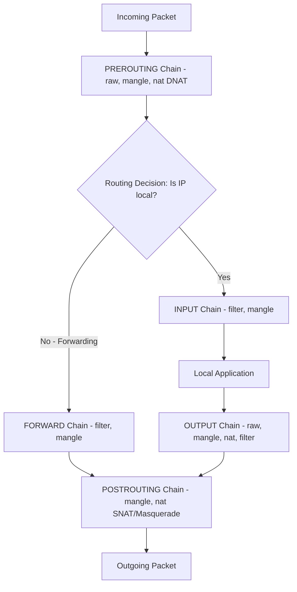

# 🐧 Objective 212.1: Quản Trị Tường Lửa Netfilter (IPTables & NFTables) - Bản Chất Hệ Thống LPIC-2 & Thực Chiến DevOps

> 💡 **Bản chất 1 câu**: Cấu hình tường lửa Kernel Netfilter với `iptables` (Tables, Chains, Rules, NAT/Port Forwarding) và cú pháp mới `nftables`.  
> 🎯 **Trọng tâm phỏng vấn Senior DevOps / SysAdmin**: iptables (tables: filter, nat, mangle; chains: INPUT, OUTPUT, FORWARD, PREROUTING, POSTROUTING; -A, -D, -L, -n, -F, -j ACCEPT/DROP/REJECT/MASQUERADE/DNAT/SNAT), iptables-save, iptables-restore, nftables (nft), UFW, Firewalld.

---




---

## 2. 📚 Lý Thuyết Chuyên Sâu & Bản Chất Hệ Thống (Under The Hood Mechanics - LPIC-2 Official Study Guide)

### 2.1 Kiến Trúc Tường Lửa Netfilter IPTables & NFTables
1. **Các Bảng (Tables) & Chuỗi (Chains)**:
   - **Table `filter`**: `INPUT` (vào server), `OUTPUT` (ra từ server), `FORWARD` (quá cảnh).
   - **Table `nat`**: `PREROUTING` (Port Forwarding / DNAT), `POSTROUTING` (SNAT / MASQUERADE).
2. **DROP vs REJECT**:
   - `-j DROP`: Lặng lẽ vứt bỏ gói tin không phản hồi (Bảo mật cao hơn).
   - `-j REJECT`: Vứt bỏ và gửi lại phản hồi lỗi ICMP.


---


### 2.4 Cơ Chế Hoạt Động Bên Dưới Kernel & Kiến Trúc Hệ Thống Chi Tiết (Deep Kernel & Architecture)
- **Tầng Giao Tiếp System Calls**: Mọi thao tác người dùng hay lệnh CLI gõ trên Terminal đều trải qua giao diện System Call Interface (như `open()`, `read()`, `write()`, `fork()`, `execve()`, `socket()`, `epoll_wait()`) để chuyển quyền điều khiển từ User Space (Ring 3) xuống Kernel Space (Ring 0).
- **Quản Lý Tài Nguyên & Cấu Trúc Dữ Liệu**: Kernel duy trì các cấu trúc dữ liệu bảng điều khiển (Process Control Block - PCB, File Descriptor Table, Inode Index Table, Page Tables) để đảm bảo cô lập tài nguyên, an toàn bộ nhớ và tối ưu hiệu năng I/O.
- **Tương Tác Phần Cứng & Drivers**: Các trình điều khiển thiết bị (Kernel Modules `.ko`) trực tiếp tương tác với thanh ghi phần cứng (Hardware Registers) qua ngắt CPU (Interrupts - IRQ) và truy cập bộ nhớ trực tiếp (DMA - Direct Memory Access).

---

## 3. ⚡ Bảng Tra Cứu Câu Lệnh & Cấu Hình Thực Hành (CLI Reference)

| Câu lệnh / Component | Tham số / Option | Giải thích ý nghĩa chi tiết | Ví dụ thực tế trong DevOps / SysAdmin |
| :--- | :--- | :--- | :--- |
| **`iptables`** | `Công cụ cấu hình tường lửa Netfilter classic` | -A, -D, -L, -n, -t, -j | `sudo iptables -L -n -v` |
| **`iptables-save / restore`** | `Lưu và khôi phục bộ quy tắc iptables vĩnh viễn` | file | `sudo iptables-save > /etc/iptables/rules.v4` |
| **`nft`** | `Công cụ cấu hình tường lửa nftables thế hệ mới` | list ruleset | `sudo nft list ruleset` |


---

## 4. 🛠 Thao Tác Thực Chiến & Kịch Bản DevOps (Real-World Scenarios)

### 🛠 Các lệnh thực hành & Cấu hình chuẩn Production:
```bash
# 1. Chặn toàn bộ kết nối tới Port 22 SSH từ IP 192.168.1.50:
sudo iptables -A INPUT -p tcp -s 192.168.1.50 --dport 22 -j DROP

# 2. Cấu hình Port Forwarding (DNAT) từ Port 8080 ra ngoài vào Port 80 của Container 10.0.0.5:
sudo iptables -t nat -A PREROUTING -p tcp --dport 8080 -j DNAT --to-destination 10.0.0.5:80
sudo iptables -t nat -A POSTROUTING -j MASQUERADE
```

### 🚀 Kịch bản xử lý sự cố thực tế khi đi làm:
Khôi phục quy tắc iptables tự động sau khi reboot:
sudo iptables-save | sudo tee /etc/iptables/rules.v4

---


### 4.2 Chi Tiết Các Lỗi Thường Gặp & Kịch Bản Khắc Phục Lỗi (Troubleshooting Deep-Dive)
1. **Sự cố 1: Lỗi Cạn Kiệt Tài Nguyên & Nghẽn Cổ Chai (Resource Exhaustion / Bottleneck)**:
   - **Triệu chứng**: Hệ thống phản hồi siêu chậm, ứng dụng bị crash OOM (Out Of Memory) hoặc lệnh báo `No space left on device` dù đĩa còn dung lượng trống.
   - **Bản chất nguyên nhân**: Cạn kiệt Inodes đĩa cứng (`df -i`), tràn bộ nhớ đệm RAM (`free -h`), hoặc cạn kiệt File Descriptors tối đa (`sysctl fs.file-max`).
   - **Các bước xử lý khẩn cấp**:
     ```bash
     # 1. Kiểm tra số lượng Inodes khả dụng trên đĩa:
     df -i /
     
     # 2. Tìm thư mục chứa hàng triệu file rác gây hết Inodes:
     find /var/spool /tmp -xdev -type f | cut -d/ -f2-4 | sort | uniq -c | sort -nr | head -n 10
     
     # 3. Kiểm tra các tiến trình đang chiếm giữ file đã bị xóa (Deleted Descriptor Leak):
     sudo lsof | grep deleted
     
     # 4. Giải phóng bộ nhớ RAM Cache tạm thời của Linux Kernel:
     sudo sysctl -w vm.drop_caches=3
     ```

2. **Sự cố 2: Lỗi Sai Cấu Hình & Tự Động Phục Hồi (Configuration Misconfiguration & Recovery)**:
   - **Triệu chứng**: Dịch vụ ngắt đột ngột, không kết nối được qua cổng mạng (Port Unreachable) hoặc lệnh service return exit code != 0.
   - **Các bước xử lý khẩn cấp**:
     ```bash
     # 1. Kiểm tra cú pháp file cấu hình trước khi restart service:
     sudo systemctl status <service_name> --no-pager -l
     
     # 2. Xem log chi tiết lỗi khởi động từ Journald binary log:
     sudo journalctl -u <service_name> -n 100 --no-pager -e
     
     # 3. Phân tích lời gọi hệ thống Syscall xem tiến trình bị treo ở đâu bằng strace:
     sudo strace -p <PID> -f -e trace=file,network
     ```

---

## 5. 🚀 Bộ Câu Hỏi Phỏng Vấn DevOps & SysAdmin Thực Tế (Interview Q&A)

> **Q: Sự khác biệt về hành vi bảo mật giữa `-j DROP` và `-j REJECT` trong IPTables là gì?**  
> **A**: `-j DROP` lặng lẽ vứt bỏ gói tin không phản hồi (khiến kẻ tấn công bị timeout); `-j REJECT` vứt bỏ nhưng gửi lại phản hồi ICMP error.

> **Q: Chuỗi (Chain) nào trong bảng `nat` của IPTables được sử dụng để cấu hình Port Forwarding (DNAT)?**  
> **A**: Chuỗi **`PREROUTING`**.


> **Q: Làm thế nào để điều tra và xử lý tận gốc sự cố Linux Server báo lỗi "No space left on device" trong khi lệnh `df -h` cho thấy dung lượng đĩa vẫn còn trống 40%?**  
> **A**: Lỗi này thường do 2 nguyên nhân cốt lõi:  
> 1. **Hết Inode (Inode Exhaustion)**: File system đã dùng hết số lượng bảng Inode để lưu trữ metadata file (do có hàng triệu file kích thước siêu nhỏ 0-byte). Kiểm tra bằng `df -i`. Xử lý bằng cách tìm và xóa các thư mục chứa file rác (như `/var/spool/postfix/maildrop` hay `/tmp`).  
> 2. **File Descriptor Leak (File đã xóa nhưng tiến trình vẫn đang mở)**: Một file dung lượng lớn bị xóa bằng lệnh `rm` nhưng tiến trình ứng dụng vẫn đang giữ file handle mở, khiến Kernel chưa thể giải phóng dung lượng đĩa thực sự. Kiểm tra bằng `sudo lsof | grep deleted`, sau đó restart lại tiến trình giữ file đó để Kernel thu hồi đĩa.

> **Q: Giải thích sự khác biệt giữa hai tín hiệu ngắt `SIGTERM` (15) và `SIGKILL` (9) trong Linux OS? Khi nào nên dùng loại nào trong kịch bản tự động hóa DevOps?**  
> **A**:  
> - **`SIGTERM` (Signal 15)**: Tín hiệu yêu cầu dừng ứng dụng **thỏa thuận (Graceful Termination)**. Tiến trình có thể bắt (catch) tín hiệu này để đóng kết nối Database, lưu trạng thái dữ liệu và dọn dẹp tài nguyên trước khi thoát hoàn toàn. Luôn luôn ưu tiên dùng `SIGTERM` trước (như trong Docker/Kubernetes shutdown flow).  
> - **`SIGKILL` (Signal 9)**: Tín hiệu dừng ứng dụng **cưỡng chế tuyệt đối (Forced Termination)** do Kernel trực tiếp tiêu diệt tiến trình ngay lập tức. Tiến trình KHÔNG THỂ bắt hay lờ đi tín hiệu này, dẫn tới nguy cơ hỏng dữ liệu dở dang. Chỉ dùng `SIGKILL` khi tiến trình bị treo đơ không phản hồi `SIGTERM`.

---

## 6. 📝 Cheat Sheet & Ghi Nhớ Nhanh (Summary)

- [x] Table filter: INPUT, OUTPUT, FORWARD
- [x] Table nat: PREROUTING (DNAT), POSTROUTING (SNAT/MASQUERADE)
- [x] DROP: Vứt gói tin ngầm bảo mật hơn REJECT
- [x] iptables-save: Lưu quy tắc tường lửa

