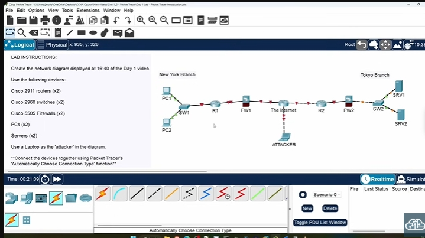

# Hướng Dẫn Cisco Packet Tracer - CCNA Lab

## Lab Là Gì?

### Định Nghĩa

**Lab** trong IT = thực hành hands-on với công nghệ đang học.

**Labbing cho CCNA** = thực hành cấu hình router và switch Cisco.

### Lựa Chọn Lab CCNA

| Phương pháp       | Ưu điểm            | Nhược điểm          |
| ----------------- | ------------------ | ------------------- |
| **Hardware thật** | Thực tế 100%       | Đắt, khó vận chuyển |
| **Packet Tracer** | Miễn phí, tiện lợi | Mô phỏng            |

## Cisco Packet Tracer

### Packet Tracer Là Gì?

**Cisco Packet Tracer** = công cụ mô phỏng mạng miễn phí của Cisco.

### Tính Năng Chính

- **Mô phỏng** thiết bị mạng Cisco
- **Thực hành** cấu hình router/switch
- **Không cần** hardware thật
- **Miễn phí** và dễ sử dụng

### Hạn Chế

- **Không phải** thiết bị thật
- **Phần mềm mô phỏng** có giới hạn
- **Một số tính năng** không có

## Tải Và Cài Đặt Packet Tracer

### Yêu Cầu Hệ Thống

**Nền tảng hỗ trợ:**

- Windows (64-bit, 32-bit)
- Ubuntu Linux
- macOS

### Tạo Tài Khoản Cisco

**Bắt buộc:** Cần tài khoản Cisco để tải Packet Tracer.

**Cách tạo:**

1. Truy cập trang đăng nhập Cisco
2. Click **"Sign Up"**
3. Điền thông tin cá nhân
4. Xác nhận email
5. Đăng nhập

### Tải Packet Tracer

**Quy trình:**

1. Truy cập [Download Cisco Packet Tracer 9.0 &amp; GNS3 - Packet Tracer Network](https://www.packettracernetwork.com/download-packet-tracer.html)
2. Đăng nhập tài khoản Cisco
3. Chọn **phiên bản phù hợp** với hệ điều hành
4. **Tải phiên bản mới nhất** (8.2 tại thời điểm viết)
5. Cài đặt như phần mềm thường

### Tại Sao Dùng Phiên Bản Mới?

**Vấn đề tương thích:**

- **Phiên bản cũ** KHÔNG mở được file lab từ phiên bản mới
- **Phiên bản mới** MỞ ĐƯỢC file lab từ phiên bản cũ

**Khuyến nghị:** Luôn dùng phiên bản mới nhất.

## Khóa Học Cisco NetAcademy

### Khóa Học Miễn Phí

Cisco cung cấp khóa học miễn phí về Packet Tracer:

1. **"Getting Started with Cisco Packet Tracer"** - 2 giờ
2. **"Exploring Networking with Cisco Packet Tracer"** - Chi tiết hơn

### Khi Nào Nên Học?

- **Muốn master** Packet Tracer hoàn toàn
- **Thời gian rảnh** để học thêm
- **Không bắt buộc** cho khóa CCNA này

## Tải Lab Files Khóa Học

### Địa Chỉ Tải

my-website\docs\network-ccna\ccna\00.lab\CCNA 200-301 Course Files-20221107T182858Z-001.zip

### Quy Trình

1. Nhập **First Name** và **Email**
2. Click **"Join"**
3. Kiểm tra email xác nhận
4. Nhận **Google Drive link** chứa tất cả files

### Cấu Trúc Files

```
Google Drive/
├── Day 1 flashcards
├── Day 1 lab          ← Lab files
├── Day 2 flashcards
├── Day 2 lab          ← Lab files
└── ...
```

### Lưu Ý

- **Đợi 10 phút** trước khi liên hệ support
- **Cùng Google Drive** với Anki flashcards
- **Bookmark** để truy cập dễ dàng

## Giao Diện Packet Tracer

### Đăng Nhập Lần Đầu

**Sau khi cài đặt:**

1. Mở Packet Tracer
2. **Đăng nhập** tài khoản Cisco (lần đầu)
3. Giao diện chính hiển thị

### Mở Lab File

**Cách 1:** Double-click file `.pkt`
**Cách 2:** File menu → Open → chọn file

### Cấu Trúc Lab Files

**Layout tiêu chuẩn:**

- **Instructions:** Bên trái hoặc dưới màn hình
- **Network topology:** Giữa màn hình
- **Devices:** Đã được đặt sẵn một số

## Cài Đặt Preferences

### Truy Cập Preferences

**Menu:** Options → Preferences

### Tab Interface

**Device Model Labels:**

- **Bật:** Hiển thị model thiết bị (VD: 2911)
- **Tắt:** Chỉ hiển thị tên đặt

**Device Name:**

- **Khuyến nghị:** Để bật để dễ nhận biết

### Tab Font

**Điều chỉnh:**

- **Menu font sizes:** Kích thước menu
- **CLI font size:** Kích thước trong command-line
- **Font colors:** Màu chữ

**Ví dụ Matrix Style:**

- **Router IOS Text:** Green
- **Router IOS Background:** Black

## CLI (Command-Line Interface)

### CLI Là Gì?

**CLI** = Command-Line Interface = giao diện dòng lệnh.

### Vai Trò Trong Khóa Học

- **Phương pháp chính** cấu hình router/switch
- **Giao diện text-based**
- **Commands** để điều khiển thiết bị

### Truy Cập CLI

1. Click vào router/switch
2. Chọn tab **"CLI"**
3. Giao diện dòng lệnh hiển thị

## Lab 1: Tạo Lại Network Topology

### Mục Tiêu

Tạo lại network từ **Day 1 lecture video** về network devices.

### Topology Cần Tạo



### Thiết Bị Cần Dùng

| Thiết bị | Model  | Số lượng | Vị trí   |
| -------- | ------ | -------- | -------- |
| Router   | 2911   | 2        | R1, R2   |
| Switch   | 2960   | 2        | SW1, SW2 |
| Firewall | 5505   | 2        | FW1, FW2 |
| PC       | PC     | 2        | New York |
| Server   | Server | 2        | Tokyo    |
| Laptop   | Laptop | 1        | Attacker |

## Thực Hành Lab

### Bước 1: Đặt Thiết Bị

#### Đặt Routers

1. Click **network devices icon** (bottom left)
2. Chọn **"Routers"**
3. Chọn **"2911"**
4. Đặt 2 router vào topology

**Cisco ISR 2911:** ISR = Integrated Services Router

#### Đặt Switches

1. Chọn **"Switches"**
2. Chọ **"2960"**
3. Đặt 2 switch vào topology

**Cisco Catalyst 2960:** Catalyst = dòng switch của Cisco

#### Đặt Firewalls

1. Chọn **"Security"** → **"Firewalls"**
2. Chọn **"5505"**
3. Đặt 2 firewall vào topology

**Cisco ASA 5505:** ASA = Adaptive Security Appliance

#### Đặt End Devices

1. Chọn **"End Devices"**
2. Đặt **2 PCs** (New York)
3. Đặt **2 Servers** (Tokyo)
4. Đặt **1 Laptop** (Attacker)

### Bước 2: Đổi Tên Thiết Bị

**Cách đổi tên:**

1. Click vào **tên thiết bị**
2. Nhập tên mới
3. Enter

**Danh sách tên:**

- PC1, PC2 (New York)
- SW1, R1, FW1 (New York)
- R2, FW2, SW2 (Tokyo)
- SRV1, SRV2 (Tokyo)
- Attacker

### Bước 3: Kết Nối Thiết Bị

#### Chọn Cable Tool

1. Click **lightning bolt icon** (connection tool)
2. Chọn **"Automatically Choose Connection Type"**

#### Thực Hiện Kết Nối

**Tip tăng tốc:** Giữ **Ctrl + click** lightning bolt để không phải chọn lại.

**Thứ tự kết nối:**

1. PC1 → SW1
2. PC2 → SW1
3. SW1 → R1
4. R1 → FW1
5. FW1 → The Internet
6. The Internet → R2
7. R2 → FW2
8. FW2 → SW2
9. SW2 → SRV1
10. SW2 → SRV2
11. Attacker → The Internet

#### Hoàn Thành

Click **"Cancel"** khi hoàn thành kết nối.

## Chiến Lược Học Lab

### Quy Trình Lý Tưởng

1. **Xem lecture video** trước
2. **Thử làm lab** tự lực trong Packet Tracer
3. **Xem lab video** để kiểm tra đáp án
4. **Sửa lỗi** nếu có

### Nếu Gặp Khó Khăn

**Có thể:**

1. Xem lab video trước khi làm
2. Làm theo hướng dẫn step-by-step
3. **Quan trọng:** Vẫn phải thực hành hands-on

### Mục Tiêu Lab

1. **Hands-on practice** với router/switch Cisco
2. **Hiểu sâu** concepts từ lecture
3. **Chuẩn bị** cho exam thực tế

## Loại Lab Trong Khóa Học

### Configuration Labs

- **Mục đích:** Học cách cấu hình
- **Nội dung:** Commands và settings
- **Approach:** Follow instructions

### Troubleshooting Labs

- **Mục đích:** Tìm và sửa lỗi
- **Nội dung:** Các lỗi cấu hình có sẵn
- **Approach:** Debug và fix problems

**Lưu ý:** Troubleshooting labs cần dùng **pre-made lab files** vì đã có lỗi cố ý.

## Tips Sử Dụng Packet Tracer

### Shortcuts Hữu Ích

- **Ctrl + click tool:** Giữ tool được chọn
- **Space:** Pan view
- **Mouse wheel:** Zoom in/out
- **Ctrl + Z:** Undo
- **Ctrl + S:** Save

### Quản Lý Files

- **Save thường xuyên:** Tránh mất công việc
- **Đặt tên file:** Rõ ràng theo lab
- **Backup:** Lưu nhiều version

### Performance Tips

- **Đóng unused tabs**
- **Không mở quá nhiều devices** cùng lúc
- **Update Packet Tracer** thường xuyên

## Hạn Chế Packet Tracer

### So Với Hardware Thật

- **Không phải 100% giống** hardware thật
- **Một số commands** không có
- **Performance** khác biệt
- **Bugs** trong simulation

### Khi Nào Cần Hardware Thật?

- **Advanced features** không có trong PT
- **Real-world experience**
- **Performance testing**
- **Production environment**

## Kết Luận

### Tầm Quan Trọng Labs

**Labs là then chốt** để:

- **Hiểu sâu** lý thuyết
- **Thực hành** skills
- **Chuẩn bị** exam
- **Experience** thực tế

### Next Steps

1. **Complete Day 1 lab** theo hướng dẫn
2. **Familiar** với Packet Tracer interface
3. **Chuẩ bị** cho các labs tiếp theo
4. **Practice regularly** để nâng cao skills

---

**Tóm tắt:** Packet Tracer là công cụ quan trọng để thực hành CCNA. Hiểu cách sử dụng và làm labs đều đặn sẽ giúp học hiệu quả hơn.
