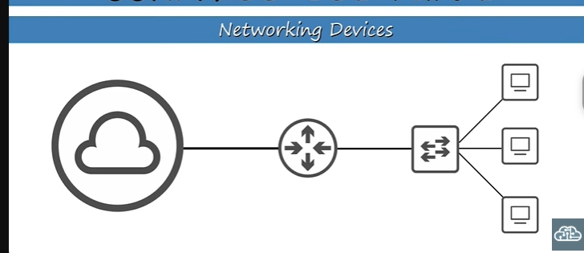
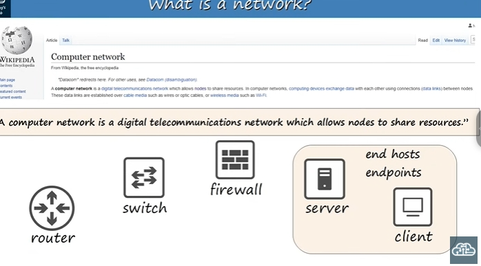
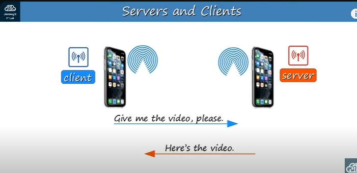
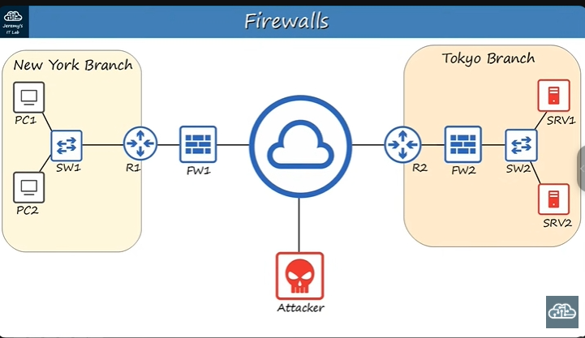

# Thiết Bị Mạng (Network Devices) - Kiến Thức Đầy Đủ

## Khái Niệm Cơ Bản



### Mạng Máy Tính Là Gì?

**Mạng máy tính** là hệ thống truyền thông kỹ thuật số cho phép các thiết bị (node) chia sẻ tài nguyên với nhau.

**Mạng đơn giản nhất:** Hai PC kết nối bằng dây cáp = một mạng hoàn chỉnh.

### Node Là Gì?

**Node** là bất kỳ thiết bị nào tham gia vào mạng. Có 5 loại node chính:



## 1. CLIENT (Máy Khách)

### Định Nghĩa

**Client** = thiết bị **truy cập** dịch vụ từ server

### Đặc Điểm

- **Vai trò:** Yêu cầu và nhận dịch vụ
- **Ví dụ thiết bị:** Windows PC, macOS iMac, iPhone, Android, laptop
- **Trong thực tế:** Máy tính đang dùng xem YouTube, nhận AirDrop, tải file

### Ví Dụ Thực Tế

- Xem video YouTube → máy tính bạn = client
- Nhận file AirDrop → iPhone bạn = client
- Tải file từ Google Drive → thiết bị bạn = client

## 2. SERVER (Máy Chủ)

### Định Nghĩa

**Server** = thiết bị **cung cấp** dịch vụ cho client

### Đặc Điểm

- **Vai trò:** Phục vụ và gửi dữ liệu
- **Ví dụ thiết bị:** YouTube server, web server, file server, email server
- **Hình dạng:** Có thể là máy chuyên dụng (IBM, DELL) hoặc PC thường

### Ví Dụ Thực Tế

- YouTube server → cung cấp video cho bạn
- iPhone gửi AirDrop → iPhone đó = server
- Google Drive → lưu trữ file cho bạn tải

### Điểm Quan Trọng

**Cùng một thiết bị có thể vừa là client vừa là server** tùy tình huống:

- iPhone bạn nhận AirDrop = client
- iPhone bạn gửi AirDrop = server

## 3. SWITCH (Bộ Chuyển Mạch)

### Định Nghĩa


**Switch** = thiết bị kết nối nhiều end hosts trong **cùng một LAN**

### Đặc Điểm Chính

- **Số cổng:** Nhiều (thường 24, 48 cổng)
- **Phạm vi:** Chỉ hoạt động trong LAN
- **Chức năng:** Chuyển tiếp dữ liệu giữa các thiết bị trong LAN
- **Hạn chế:** KHÔNG kết nối Internet, KHÔNG kết nối giữa các LAN khác nhau

### Model Cisco Phổ Biến

- **Catalyst 9200** - Enterprise cao cấp
- **Catalyst 3650** - Enterprise trung cấp

### Ví Dụ Sử Dụng

```
PC1 ─┐
PC2 ─┤ Switch ─ (chỉ trong LAN)
PC3 ─┘
```

## 4. ROUTER (Bộ Định Tuyến)

### Định Nghĩa


**Router** = thiết bị kết nối **giữa các LAN khác nhau** và với Internet

### Đặc Điểm Chính

- **Số cổng:** Ít (2-8 cổng)
- **Phạm vi:** Kết nối nhiều mạng
- **Chức năng:** Định tuyến dữ liệu giữa các LAN, kết nối Internet
- **Vai trò:** Cầu nối giữa mạng nội bộ và Internet

### Model Cisco Phổ Biến

- **ISR 900** - Văn phòng nhỏ
- **ISR 1000, 4000** - Doanh nghiệp

### So Sánh Switch vs Router

| Tiêu chí         | Switch       | Router     |
| ------------------ | ------------ | ---------- |
| Số cổng          | Nhiều (24+) | Ít (2-8)  |
| Phạm vi           | Trong LAN    | Giữa LANs |
| Kết nối Internet | ❌           | ✅         |

## 5. FIREWALL (Tường Lửa)

### Định Nghĩa

**Firewall** = thiết bị bảo mật kiểm soát traffic ra/vào mạng

### Tại Sao Cần Firewall?

- **Mối đe dọa:** Kẻ tấn công trên Internet
- **Bảo vệ:** End hosts (PC, server) trong mạng nội bộ
- **Router không đủ:** Chỉ có tính năng bảo mật cơ bản

### Đặc Điểm Chính

- **Hoạt động:** Theo rules được cấu hình
- **Vị trí:** "Inside" hoặc "outside" mạng
- **Quyết định:** Cho phép/chặn traffic dựa trên rules

### Loại Firewall

#### Network Firewall (Hardware)

- **ASA 5500-X** - Firewall cổ điển Cisco
- **Firepower 2100** - Next-generation firewall
- **Tính năng:** IPS (Intrusion Prevention System)

#### Host-based Firewall (Software)

- **Vị trí:** Trên từng PC
- **Ví dụ:** Windows Defender Firewall
- **Vai trò:** Lớp bảo vệ bổ sung

#### Next-generation Firewall

- **Định nghĩa:** Firewall + tính năng lọc nâng cao
- **Tính năng:** IPS, Deep Packet Inspection, Application Control

## Mô Hình Mạng Doanh Nghiệp

### Cấu Trúc Cơ Bản



```
[Chi nhánh New York]          [Internet]          [Chi nhánh Tokyo]
PC1 ─┐                                                    ┌─ SRV1
PC2 ─┤ SW1 ── R1 ── FW1 ═══════════════ FW2 ── R2 ── SW2 ├─ SRV2
     ┘                                                    ┘
```

### Luồng Dữ Liệu

**Kịch bản:** PC1 (New York) cần file từ SRV1 (Tokyo)

**Đường đi:**

1. PC1 → SW1 (chuyển trong LAN New York)
2. SW1 → R1 (ra khỏi LAN New York)
3. R1 → FW1 (kiểm tra bảo mật)
4. FW1 → Internet (ra mạng công cộng)
5. Internet → FW2 (vào mạng Tokyo)
6. FW2 → R2 (vào LAN Tokyo)
7. R2 → SW2 (trong LAN Tokyo)
8. SW2 → SRV1 (đến server đích)

**Đường về:** SRV1 → ... → PC1 (ngược lại)

## Khái Niệm Quan Trọng

### LAN (Local Area Network)

- **Định nghĩa:** Mạng cục bộ trong cùng khu vực
- **Ví dụ:** Văn phòng, tầng nhà, nhà riêng
- **Đặc điểm:** Tốc độ cao, kết nối trực tiếp

### Internet

- **Định nghĩa:** Mạng toàn cầu kết nối các LAN
- **Biểu tượng:** Hình đám mây trong sơ đồ
- **Chức năng:** Truyền dữ liệu giữa các mạng xa nhau

### End Hosts/Endpoints

- **Định nghĩa:** Thiết bị cuối trong mạng
- **Bao gồm:** PC, laptop, server, smartphone, máy in
- **Vai trò:** Client hoặc Server

### Traffic

- **Định nghĩa:** Dữ liệu di chuyển qua mạng
- **Ví dụ:** Email, file, video, web page

### Interface/Port

- **Định nghĩa:** Cổng kết nối trên thiết bị mạng
- **Ví dụ:** Cổng Ethernet, USB, WiFi

## Nguyên Tắc Hoạt Động

### Client-Server Model


1. **Client gửi yêu cầu** (request)
2. **Server xử lý yêu cầu**
3. **Server gửi phản hồi** (response)
4. **Client nhận kết quả**

### Network Communication

1. **Trong LAN:** PC → Switch → PC khác
2. **Giữa LANs:** PC → Switch → Router → Internet → Router → Switch → Server
3. **Có Firewall:** Thêm bước kiểm tra bảo mật

## Điểm Cần Nhớ

### Vai Trò Thiết Bị

- **Switch:** Kết nối trong LAN, nhiều cổng
- **Router:** Kết nối giữa LANs, ít cổng, có Internet
- **Firewall:** Bảo mật, kiểm soát traffic
- **Client:** Yêu cầu dịch vụ
- **Server:** Cung cấp dịch vụ

### Quy Tắc Quan Trọng

1. **Switch KHÔNG kết nối Internet**
2. **Router CẦN THIẾT để ra Internet**
3. **Firewall BẮT BUỘC cho bảo mật**
4. **Cùng thiết bị có thể là client/server**
5. **LAN = mạng cục bộ, Internet = mạng toàn cầu**

### Ứng Dụng Thực Tế

- **Văn phòng nhỏ:** PC → Switch → Router → Internet
- **Doanh nghiệp:** PC → Switch → Firewall → Router → Internet
- **Nhiều chi nhánh:** LAN1 → Router → Internet → Router → LAN2

---

**Tóm tắt:** Hiểu được 5 loại thiết bị mạng cơ bản và cách chúng kết nối tạo thành một mạng hoàn chỉnh từ đơn giản đến phức tạp.
