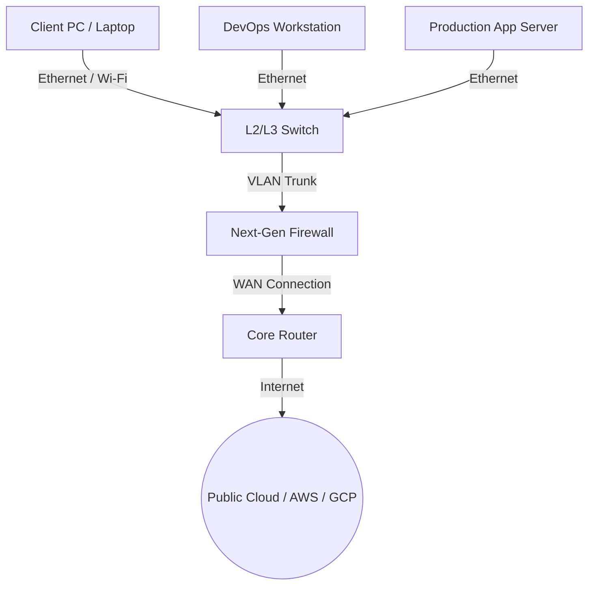

# 🌐 Kiến Trúc Mạng Máy Tính & Thiết Bị Phần Cứng (Network Components) - Chuyên Sâu Mạng Máy Tính Cho DevOps

> 💡 **Bản chất 1 câu**: Mạng máy tính kết nối các hệ thống qua Router (định tuyến L3), Switch (chuyển mạch L2), Firewall (bảo mật) và Access Point.  
> 🎯 **Trọng tâm thực chiến DevOps**: Hiểu rõ vai trò của Router, Switch L2/L3, Firewall, Access Point, NIC và mô hình Client-Server vs Peer-to-Peer.

---

## 1. 🧠 Hình Hình Dung Nhanh (Intuitive Mindset)

Mạng máy tính giống như hệ thống giao thông thành phố: Switch là các vòng xuyến chuyển làn trong nội thành, Router là các trạm BOT thu phí chỉ đường giữa các tỉnh, còn Firewall là cổng kiểm soát an ninh.

---

## 2. 📚 Lý Thuyết Chuyên Sâu & Bản Chất Mạng (Under The Hood Architecture)

### 2.1 Các Thiết Bị Phần Cứng Mạng Cốt Lõi (Core Network Hardware)



1. **Router (Bộ Định Tuyến - OSI Layer 3)**:
   - **Bản chất**: Kết nối các mạng máy tính KHÁC dải IP (Subnet) với nhau và quyết định đường đi tối ưu nhất cho gói tin (Packet) dựa vào bảng **Routing Table**.
   - Phân biệt IP nguồn và IP đích để chuyển tiếp dữ liệu giữa LAN và WAN.
2. **Switch (Bộ Chuyển Mạch - OSI Layer 2 / Layer 3)**:
   - **Switch Layer 2**: Kết nối các thiết bị trong CÙNG một dải mạng LAN. Sử dụng bảng **MAC Address Table (CAM Table)** để chuyển tiếp Ethernet Frame.
   - **Switch Layer 3**: Tích hợp tính năng định tuyến IP của Router ngay trên phần cứng ASIC tốc độ cao.
3. **Firewall (Tường Lửa An Ninh)**:
   - Đứng giữa các vùng mạng (DMZ, Internal, External) để lọc gói tin theo Access Control Lists (ACLs) hoặc trạng thái kết nối (Stateful Inspection).
4. **Access Point (AP - Điểm Truy Cập Không Dây)**:
   - Chuyển đổi tín hiệu sóng vô tuyến Wi-Fi (802.11) sang tín hiệu điện Ethernet (802.3).


---

## 3. ⚡ Bảng Tra Cứu Câu Lệnh & Khái Niệm Thực Hành (Reference Table)

| Công cụ / Lệnh / Khái niệm | Tham số / Flag / Protocol | Giải thích ý nghĩa chi tiết | Ứng dụng thực tế trong DevOps / Network |
| :--- | :--- | :--- | :--- |
| **`Router`** | `Layer 3` | Định tuyến gói tin giữa các mạng IP khác nhau | `Kết nối mạng LAN công ty ra Internet` |
| **`Switch L2`** | `Layer 2` | Chuyển mạch Ethernet Frame dựa vào địa chỉ MAC | `Kết nối 48 máy chủ trong RACK Data Center` |
| **`Switch L3`** | `Layer 2/3` | Chuyển mạch MAC + Định tuyến IP tốc độ cao | `Core Switch phân chia VLAN nội bộ` |
| **`Firewall`** | `Layer 3-7` | Lọc traffic bảo mật theo IP/Port/State | `Đặt tại cổng WAN chặn truy cập trái phép` |


---

## 4. 🛠 Thao Tác Thực Chiến & Kịch Bản DevOps (Real-World Scenarios)

### 🛠 Các lệnh thực hành gõ là ăn ngay:
```bash
# Kiểm tra danh sách các cạc mạng và địa chỉ MAC trên Linux Server:
ip link show

# Xem bảng ARP Cache lưu MAC address của các máy xung quanh:
ip neighbor show
```

### 🚀 Kịch bản xử lý sự cố thực tế khi đi làm:
Sự cố 2 máy chủ trong cùng một Rack Data Center không cắm chung Switch nên không ping thấy nhau:
# Debug: Kiểm tra đèn tín hiệu Link/Act trên cổng Switch và kiểm tra bảng MAC Table trên Switch:
# show mac address-table dynamic

---

## 5. 🚀 Bộ Câu Hỏi Phỏng Vấn DevOps & Network Thực Tế (Interview Q&A)

> **Q: Sự khác biệt cốt lõi giữa Router (L3) và Switch L2 là gì?**  
> **A**: Switch L2 chuyển mạch gói tin dựa trên địa chỉ MAC vật lý trong CÙNG dải LAN. Router L3 định tuyến gói tin dựa trên địa chỉ IP giữa các dải mạng KHÁC NHAU.

> **Q: Switch Layer 3 khác gì so với Router truyền thống?**  
> **A**: Switch L3 thực hiện định tuyến IP trực tiếp bằng chip phần cứng chuyên dụng ASIC cho tốc độ cực cao, thường dùng làm Core Switch trong nội bộ Datacenter.


---

## 6. 📝 Cheat Sheet & Ghi Nhớ Nhanh (Summary)

- [x] Router: Định tuyến IP (Layer 3)
- [x] Switch L2: Chuyển mạch MAC (Layer 2)
- [x] Switch L3: Định tuyến phần cứng ASIC tốc độ cao
- [x] Firewall: Kiểm soát an ninh traffic

