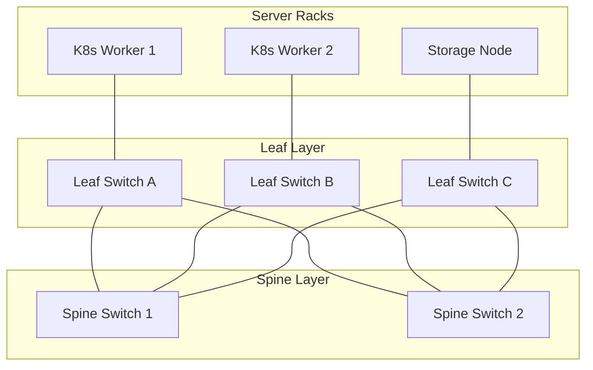

# 🌐 Địa Lý Mạng & Kiến Trúc Topology (LAN, WAN, Leaf-Spine Datacenter) - Chuyên Sâu Mạng Máy Tính Cho DevOps

> 💡 **Bản chất 1 câu**: Phân loại mạng theo phạm vi địa lý (LAN, WAN, SAN) và thiết kế sơ đồ mạng Topology (Star, Mesh, Leaf-Spine Datacenter).  
> 🎯 **Trọng tâm thực chiến DevOps**: Phân biệt LAN, WAN, MAN, SAN và nắm vững kiến trúc Leaf-Spine hiện đại trong Datacenter / Kubernetes Infrastructure.

---

## 1. 🧠 Hình Hình Dung Nhanh (Intuitive Mindset)

Mạng Topo Star giống như bánh xe đạp: Mọi nan hoa (máy tính) đều nối về trục giữa (Switch). Mạng Leaf-Spine Datacenter như lưới siêu thị: Mọi Switch Leaf bên dưới đều nối trực tiếp lên tất cả Switch Spine bên trên.

---

## 2. 📚 Lý Thuyết Chuyên Sâu & Bản Chất Mạng (Under The Hood Architecture)

### 2.1 Phân Loại Mạng Theo Địa Lý (Network Geography)
- **PAN (Personal Area Network)**: Kết nối cá nhân tầm ngắn (Bluetooth, Zigbee).
- **LAN (Local Area Network)**: Mạng nội bộ văn phòng/tòa nhà (Ethernet/Wi-Fi).
- **CAN (Campus Area Network)**: Kết nối nhiều tòa nhà trong một đại học/khu công nghiệp.
- **MAN (Metropolitan Area Network)**: Mạng phạm vi thành phố.
- **WAN (Wide Area Network)**: Mạng diện rộng kết nối các chi nhánh toàn cầu qua Internet/MPLS.
- **SAN (Storage Area Network)**: Mạng lưu trữ tốc độ cao (iSCSI, Fibre Channel) nối Server tới SAN Storage.

---

### 2.2 Kiến Trúc Topology Datacenter Hiện Đại: Leaf-Spine
Trong Datacenter đám mây hiện đại (AWS/GCP/Kubernetes), kiến trúc 3 tầng cổ điển (Core-Aggregation-Access) được thay thế bởi kiến trúc **Leaf-Spine 2 tầng**:



- **Đặc điểm Leaf-Spine**:
  - Mọi Leaf Switch đều nối với TẤT CẢ Spine Switch.
  - Độ trễ (Latency) giữa 2 máy chủ bất kỳ trong Datacenter BẰNG NHAU (chỉ tối đa 2 hops).
  - Tối ưu tuyệt đối cho luồng traffic **East-West** (truyền dữ liệu giữa các microservices/containers với nhau).


---

## 3. ⚡ Bảng Tra Cứu Câu Lệnh & Khái Niệm Thực Hành (Reference Table)

| Công cụ / Lệnh / Khái niệm | Tham số / Flag / Protocol | Giải thích ý nghĩa chi tiết | Ứng dụng thực tế trong DevOps / Network |
| :--- | :--- | :--- | :--- |
| **`LAN`** | `Local Area Network` | Mạng nội bộ trong phạm vi 100m | `Mạng văn phòng công ty` |
| **`WAN`** | `Wide Area Network` | Mạng diện rộng kết nối các chi nhánh | `Đường truyền leased line VPN giữa HN và HCM` |
| **`SAN`** | `Storage Area Network` | Mạng lưu trữ tốc độ cao dedicated | `Kết nối ESXi Host tới SAN Storage iSCSI` |
| **`Leaf-Spine`** | `Datacenter Topology` | Kiến trúc 2 tầng độ trễ cố định 2-hop | `Hạ tầng mạng Cloud / Kubernetes Cluster` |


---

## 4. 🛠 Thao Tác Thực Chiến & Kịch Bản DevOps (Real-World Scenarios)

### 🛠 Các lệnh thực hành gõ là ăn ngay:
```bash
# Kiểm tra số lượng Hops (số trạm trung chuyển) tới destination bằng traceroute:
traceroute 8.8.8.8
```

### 🚀 Kịch bản xử lý sự cố thực tế khi đi làm:
Thiết kế hạ tầng mạng cho Kubernetes Cluster 500 Nodes:
# Chọn kiến trúc Leaf-Spine để đảm bảo traffic ngang (East-West) giữa các Pods có độ trễ cực thấp và không bị nghẽn cổ chai.

---

## 5. 🚀 Bộ Câu Hỏi Phỏng Vấn DevOps & Network Thực Tế (Interview Q&A)

> **Q: Tại sao kiến trúc Leaf-Spine lại thay thế mô hình 3 tầng truyền thống trong các Datacenter hiện đại?**  
> **A**: Vì Leaf-Spine tối ưu cho luồng traffic ngang East-West (giữa các Server/Pod với nhau) với độ trễ cố định chỉ 2 hops và cân bằng tải ECMP cực tốt.

> **Q: Mạng SAN (Storage Area Network) được dùng để làm gì?**  
> **A**: Dùng làm mạng truyền dữ liệu khối (Block Storage) tốc độ cao riêng biệt giữa máy chủ ảo hóa (ESXi/KVM) và tủ đĩa SAN Storage.


---

## 6. 📝 Cheat Sheet & Ghi Nhớ Nhanh (Summary)

- [x] LAN: Mạng nội bộ văn phòng
- [x] WAN: Mạng diện rộng toàn cầu
- [x] SAN: Mạng lưu trữ dedicated
- [x] Leaf-Spine: Kiến trúc Datacenter tối ưu traffic East-West

