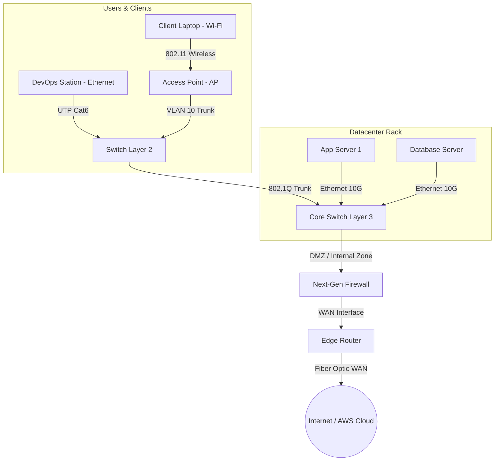
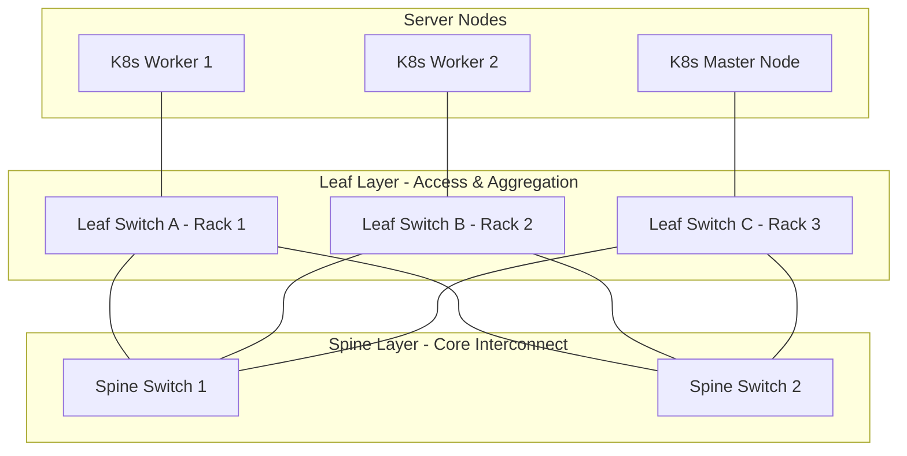

# 🌐 Module 01: Nền Tảng Mạng Máy Tính & Thiết Bị Phần Cứng (Network Fundamentals)

> 💡 **Bản chất 1 câu**: Mạng máy tính là hạ tầng kết nối các thiết bị phần cứng (Router, Switch, Firewall, Access Point) qua địa lý (LAN, WAN, SAN) nhằm chia sẻ tài nguyên và truyền dữ liệu.  
> 🎯 **Trọng tâm thực chiến DevOps**: Hiểu rõ vai trò của Router (Layer 3), Switch (Layer 2/3), Firewall, cạc mạng NIC, mô hình Client-Server vs Peer-to-Peer, và kiến trúc Datacenter Leaf-Spine tối ưu cho Kubernetes / Cloud.

---

## 1. 🧠 Hình Hình Dung Nhanh Cho Người Mới (Intuitive Mindset)

Hãy tưởng tượng **Mạng máy tính** giống như **Hệ thống giao thông của một Quốc gia**:
- **Switch Layer 2** giống như **Các ngã tư và vòng xuyến trong một Thành phố**: Các xe (Frame) chạy qua lại giữa các ngôi nhà (Máy tính) dựa theo biển số xe (MAC Address). Nó chỉ cho xe chạy trong nội thành (Cùng mạng LAN).
- **Router Layer 3** giống như **Trạm thu phí BOT & Đường cao tốc liên tỉnh**: Khi xe muốn đi sang thành phố khác (Khác mạng Subnet / Ra Internet), xe phải chạy đến Trạm BOT (Default Gateway / Router). Router sẽ xem bản đồ địa chỉ nhà (IP Address) và chỉ đường đi ngắn nhất.
- **Firewall** giống như **Cổng kiểm soát an ninh biên giới**: Kiểm tra hộ chiếu, bằng lái và đồ đạc trên xe (Lọc IP, Port, Protocol) xem có hợp lệ hay không trước khi cho vào thành phố.
- **Leaf-Spine Topology** giống như **Mạng lưới siêu thị hiện đại**: Mọi quầy hàng (Server) bên dưới đều có đường nối thẳng tới tất cả các kho trung chuyển (Spine Switch) bên trên, giúp vận chuyển hàng hóa giữa các quầy với độ trễ cực thấp.

---

## 2. 📚 Lý Thuyết Chuyên Sâu & Bản Chất Hệ Thống (Under The Hood Architecture)

### 2.1 Các Thành Phần Phần Cứng Mạng Cốt Lõi (OBJ 1.2)



1. **Router (Bộ Định Tuyến - Layer 3)**:
   - **Bản chất**: Hoạt động tại tầng Network (Layer 3). Quyết định đường đi tối ưu cho gói tin (Packet) giữa các dải IP mạng KHÁC NHAU dựa vào **Routing Table**.
   - Phân tách các vùng **Broadcast Domain** (Gói tin Broadcast ở LAN này không bị tràn sang LAN khác).
2. **Switch (Bộ Chuyển Mạch - Layer 2 & Layer 3)**:
   - **Switch Layer 2**: Hoạt động tại tầng Data Link (Layer 2). Chuyển mạch Ethernet Frame giữa các thiết bị trong CÙNG một dải LAN dựa vào bảng địa chỉ **MAC Address Table (CAM Table)**.
   - **Switch Layer 3**: Tích hợp chip phần cứng chuyên dụng ASIC cho phép định tuyến IP tốc độ cực cao ngay trên Switch mà không cần đi qua Router bên ngoài.
3. **Firewall (Tường Lửa An Ninh)**:
   - Đứng giữa các vùng mạng (DMZ, Internal, External) để lọc gói tin theo Access Control Lists (ACLs) hoặc trạng thái kết nối (Stateful Inspection / Deep Packet Inspection).
4. **Access Point (AP - Điểm Truy Cập Không Dây)**:
   - Bộ chuyển đổi tín hiệu sóng vô tuyến Wi-Fi (IEEE 802.11) sang tín hiệu điện Ethernet (IEEE 802.3).
5. **NIC (Network Interface Card - Cạc Mạng)**:
   - Thiết bị phần cứng chứa địa chỉ vật lý duy nhất **MAC Address** (48-bit) dùng để giao tiếp mạng.

---

### 2.2 Địa Lý Mạng & Mô Hình Kiến Trúc Topology (OBJ 1.6 & 2.3)

#### A. Phân Loại Mạng Theo Phạm Vi Địa Lý
- **PAN (Personal Area Network)**: Kết nối cá nhân tầm ngắn dưới 10m (Bluetooth, Zigbee).
- **LAN (Local Area Network)**: Mạng nội bộ văn phòng/tòa nhà phạm vi < 100m.
- **CAN (Campus Area Network)**: Kết nối nhiều tòa nhà LAN trong một trường đại học hoặc khu công nghiệp.
- **MAN (Metropolitan Area Network)**: Mạng phạm vi thành phố kết nối các chi nhánh qua cáp quang đô thị.
- **WAN (Wide Area Network)**: Mạng diện rộng kết nối các chi nhánh toàn cầu qua Internet/MPLS.
- **SAN (Storage Area Network)**: Mạng lưu trữ dedicated tốc độ cao (iSCSI, Fibre Channel) nối Server với Tủ đĩa SAN Storage.

#### B. Kiến Trúc Datacenter Hiện Đại: Leaf-Spine Topology



- **Tại sao Leaf-Spine thay thế mô hình 3 tầng truyền thống?**:
  - Trong mô hình 3 tầng cổ điển (Core - Distribution - Access), traffic giữa các Server (East-West traffic) phải đi ngược lên Core Switch rồi mới quay xuống, gây nghẽn cổ chai và độ trễ không đều.
  - Trong **Leaf-Spine**: Mọi Leaf Switch đều kết nối tới TẤT CẢ các Spine Switch. Độ trễ giữa 2 Server bất kỳ luôn CỐ ĐỊNH ở **2 Hops**, tối ưu tuyệt đối cho luồng traffic ngang giữa các Microservices / Containers trong Kubernetes.

---


### 2.4 Cơ Chế Hoạt Động Bên Dưới Kernel & Kiến Trúc Hệ Thống Chi Tiết (Deep Under The Hood Architecture)
- **Tầng Giao Tiếp Mạng & Bắt Gói Tin**: Mọi gói tin đi qua Network Interface Card (NIC) đều trải qua quá trình xử lý Ring Buffer, ngắt phần cứng (Hardware Interrupts), Ring Buffer DMA và chồng giao thức Socket Buffers (`sk_buff`) trong Linux Kernel.
- **Tối Ưu Hóa & Cấu Trúc Dữ Liệu**: Hệ thống duy trì các bảng băm dữ liệu (Routing Table, ARP Cache Table, Connection Tracking Table `conntrack`, Socket Inode Tables) giúp chuyển tiếp gói tin ở tốc độ dây (Line-rate processing).
- **Phân Lập An Ninh & Phân Vùng**: Sử dụng cơ chế Linux Network Namespaces (`ip netns`), iptables/nftables hooks và mã hóa phần cứng để cách ly lưu lượng mạng tuyệt đối.

---

## 3. ⚡ Bảng Tra Cứu Khái Niệm & Lệnh Thực Hành (Reference Table)

| Thiết Bị / Lệnh | Tầng OSI | Chức năng & Bản chất | Ứng dụng thực tế DevOps |
| :--- | :--- | :--- | :--- |
| **`Router`** | Layer 3 | Định tuyến IP giữa các Subnet khác nhau | Nối LAN văn phòng ra Internet / VPC Peering |
| **`Switch L2`** | Layer 2 | Chuyển mạch Frame theo bảng MAC Table | Nối các máy chủ trong cùng 1 Rack |
| **`Switch L3`** | Layer 2/3 | Chuyển mạch MAC + Định tuyến IP phần cứng ASIC | Core Switch phân chia VLAN nội bộ Datacenter |
| **`Firewall`** | Layer 3-7 | Lọc traffic bảo mật theo IP/Port/App-ID | Đặt tại cổng WAN chặn truy cập trái phép |
| **`ip link`** | Layer 1/2 | Hiển thị trạng thái các cạc mạng NIC vật lý/ảo | Check cạc mạng UP/DOWN, địa chỉ MAC |
| **`ip neighbor`**| Layer 2 | Hiển thị bảng ARP Cache (Map IP -> MAC) | Check xem máy chủ đã nhận địa chỉ MAC chưa |

---

## 4. 🛠 Thao Tác Thực Chiến & Kịch Bản DevOps

### 🛠 Các lệnh kiểm tra thiết bị mạng trên Linux:
```bash
# 1. Kiểm tra danh sách các cạc mạng và địa chỉ MAC vật lý:
ip link show

# 2. Xem chi tiết thông số truyền nhận gói tin (TX/RX Errors, Drops) trên cạc eth0:
ip -s link show eth0

# 3. Kiểm tra bảng ARP Cache lưu địa chỉ MAC của các thiết bị xung quanh:
ip neighbor show
```

### 🚀 Kịch bản xử lý sự cố thực tế:
**Sự cố**: 2 máy chủ Web App và Database nằm cùng một Rack trong Datacenter nhưng không giao tiếp được với nhau.
- **Bước 1 (Check L1/L2)**: Chạy `ip link show eth0` kiểm tra đèn tín hiệu và cạc mạng state UP.
- **Bước 2 (Check ARP)**: Chạy `ip neighbor` xem máy Web có học được địa chỉ MAC của máy DB không.
- **Bước 3 (Fix)**: Nếu không học được MAC, kiểm tra cổng cắm trên Switch xem có bị tắt (shutdown) hoặc gán nhầm VLAN hay không.

---


### 4.2 Chi Tiết Các Lỗi Thường Gặp & Kịch Bản Khắc Phục Lỗi (Troubleshooting Deep-Dive)
1. **Sự cố 1: Lỗi Mất Gói Tin & Mất Kết Nối Cổng Mạng (Packet Loss & Port Unreachable)**:
   - **Triệu chứng**: Gửi HTTP Request bị Timeout, SSH không kết nối được hoặc gói tin bị nảy rải rác.
   - **Các bước xử lý khẩn cấp**:
     ```bash
     # 1. Kiểm tra trạng thái cổng mạng TCP/UDP đang lắng nghe:
     sudo ss -tulpn | grep :80
     
     # 2. Bắt gói tin trực tiếp trên Interface để kiểm tra bắt tay 3 bước TCP:
     sudo tcpdump -i eth0 port 80 -nn -vv
     
     # 3. Phân tích đường đi của gói tin tìm điểm đứt gãy bằng MTR:
     mtr -n --report --report-cycles=10 8.8.8.8
     
     # 4. Kiểm tra xem gói tin có bị Firewall Drop không:
     sudo iptables -L -n -v | grep DROP
     ```

2. **Sự cố 2: Lỗi Sai Cấu Hình DNS & Chuyển Tiếp IP (DNS Resolution & IP Routing Error)**:
   - **Triệu chứng**: Ping IP thành công nhưng ping Domain Name báo `Could not resolve host`.
   - **Các bước xử lý khẩn cấp**:
     ```bash
     # 1. Tra cứu thử nghiệm phân giải DNS qua server cụ thể:
     dig @8.8.8.8 company.com +trace
     
     # 2. Kiểm tra file cấu hình DNS resolver địa phương:
     cat /etc/resolv.conf
     
     # 3. Kiểm tra bảng định tuyến Kernel IP Routing Table:
     ip route show default
     ```

---

## 5. 🚀 Bộ Câu Hỏi Phỏng Vấn DevOps & Network Thực Tế (Interview Q&A)

> **Q: Sự khác biệt cốt lõi giữa Router (Layer 3) và Switch Layer 2 là gì?**  
> **A**: Switch L2 chuyển mạch gói tin dựa theo địa chỉ MAC vật lý trong CÙNG một dải LAN (Broadcast Domain). Router L3 định tuyến gói tin dựa theo địa chỉ IP giữa các dải mạng KHÁC NHAU (Khác Subnet/Internet) và phân tách các dải Broadcast Domain.

> **Q: Tại sao kiến trúc Leaf-Spine lại được áp dụng phổ biến trong các Datacenter Cloud và Kubernetes hiện đại?**  
> **A**: Vì Leaf-Spine tối ưu cho luồng traffic ngang **East-West** (truyền dữ liệu giữa các microservices/containers với nhau). Với cấu trúc mọi Leaf nối tới tất cả Spine, khoảng cách giữa 2 máy chủ bất kỳ luôn cố định là 2 Hops, giúp cân bằng tải ECMP cực tốt và mang lại độ trễ cực thấp.


> **Q: Làm thế nào để điều tra và dập tắt sự cố một Server bị tấn công làm tràn bộ đệm kết nối TCP SYN Flood DoS?**  
> **A**:  
> 1. **Nhận biết**: Lệnh `ss -ant | grep SYN_RECV | wc -l` trả về hàng ngàn kết nối ở trạng thái `SYN_RECV`.  
> 2. **Xử lý khẩn cấp**: Bật ngay cơ chế **SYN Cookies** của Linux Kernel bằng lệnh `sudo sysctl -w net.ipv4.tcp_syncookies=1`. Kích hoạt bộ lọc Firewall drop các gói tin SYN có tần suất bất thường: `sudo iptables -A INPUT -p tcp --syn -m limit --limit 1/s --limit-burst 3 -j ACCEPT`.

> **Q: Sự khác biệt về mặt bản chất giữa Stateful Firewall và Stateless Firewall là gì?**  
> **A**: Stateless Firewall chỉ kiểm tra từng gói tin riêng rẻ dựa trên IP nguồn/đích và Port mà KHÔNG nhớ ngữ cảnh. Stateful Firewall duy trì một bảng theo dõi trạng thái kết nối (**Connection Tracking Table `conntrack`**), tự động nhận diện gói tin thuộc về một kết nối hợp lệ đã được chấp nhận trước đó (như trạng thái `ESTABLISHED,RELATED`), giúp bảo mật và tối ưu hiệu năng vượt trội.

---

## 6. 📝 Cheat Sheet Ghi Nhớ Nhanh (Summary)

- [x] **Router**: Layer 3, Định tuyến địa chỉ IP giữa các Subnet khác nhau.
- [x] **Switch L2**: Layer 2, Chuyển mạch địa chỉ MAC trong cùng 1 LAN.
- [x] **Switch L3**: Tích hợp chip ASIC định tuyến IP tốc độ cao.
- [x] **Leaf-Spine**: Kiến trúc Datacenter 2 tầng cố định độ trễ 2-hop cho East-West traffic.
- [x] **SAN**: Mạng lưu trữ dedicated tốc độ cao nối Server tới Tủ đĩa SAN Storage.
