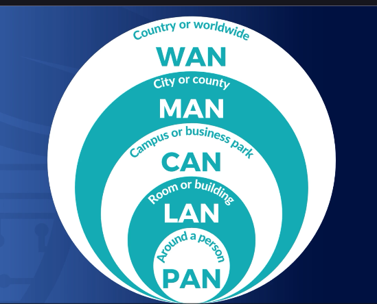

# Địa Lý Mạng: PAN, LAN, CAN, MAN và WAN

Khi nói về “địa lý mạng”, chúng ta sẽ bắt đầu từ những mạng nhỏ nhất và mở rộng dần đến mạng lớn nhất.

## 1. PAN (Personal Area Network – Mạng cá nhân)

Đây là loại mạng nhỏ nhất, có thể là có dây hoặc không dây, thường chỉ phủ khoảng 3 mét hoặc 10 feet. Một số ví dụ về PAN:

- **Bluetooth:** Kết nối điện thoại với loa, tai nghe, hoặc truyền nhạc từ điện thoại lên radio ô tô.
- **USB:** Khi bạn kết nối ổ cứng ngoài qua USB với laptop, đó cũng là một loại mạng cá nhân.
- **Firewire:** Chuẩn kết nối cũ cho máy quay hoặc webcam, cũng thuộc PAN.

Cách dễ hình dung: Đứng giữa phòng, dang tay và quay một vòng, mọi thiết bị bạn có thể chạm tới là phạm vi của PAN.

## 2. LAN (Local Area Network – Mạng nội bộ)

LAN kết nối các thiết bị trong phạm vi nhỏ hơn 100 mét (300 feet), ví dụ như trong một văn phòng, một tầng của toà nhà, hoặc một căn nhà. LAN có thể sử dụng:

- **Ethernet (Chuẩn IEEE 802.3):** Mạng có dây.
- **WiFi (Chuẩn IEEE 802.11):** Mạng không dây.

Ví dụ: Mạng trong trường học, văn phòng, hoặc mạng nội bộ trong nhà bạn với các thiết bị như laptop, máy in, desktop đều thuộc LAN.

## 3. CAN (Campus Area Network – Mạng khuôn viên)

CAN mở rộng phạm vi của LAN ra nhiều toà nhà trong một khu vực như trường đại học, khu công nghiệp hoặc doanh nghiệp có nhiều phân xưởng. CAN thường phủ vài km, kết nối nhiều LAN lại với nhau.

Ví dụ: Một trường đại học có nhiều toà nhà, mỗi toà nhà có LAN riêng, tất cả kết nối lại thành một CAN của toàn trường.

## 4. MAN (Metropolitan Area Network – Mạng đô thị)

MAN kết nối các vị trí trải rộng khắp thành phố, lớn hơn CAN nhưng nhỏ hơn WAN. Phạm vi thường lên tới 25 miles (~40 km) hoặc hơn tuỳ thành phố.

Ví dụ: Một trường đại học có nhiều cơ sở trong thành phố, mỗi cơ sở có CAN, tất cả các CAN kết nối thành một MAN. Các sở ban ngành của thành phố (công an, sở giao thông…) cũng có thể kết nối thành một MAN.

## 5. WAN (Wide Area Network – Mạng diện rộng)

WAN kết nối các mạng nội bộ (LAN) ở những vị trí cách xa nhau, có thể là giữa các thành phố, quốc gia hoặc toàn cầu.

- **Internet** là ví dụ lớn nhất về WAN.
- WAN có thể là mạng công cộng (Internet) hoặc mạng riêng (intranet) của doanh nghiệp, chính phủ.

Ví dụ: Một công ty có văn phòng ở TP.HCM và Hà Nội, mỗi nơi có LAN riêng, hai văn phòng kết nối qua WAN. Chính phủ Mỹ kết nối các văn phòng ở 50 bang qua WAN riêng.

---

## Tổng Kết

Khi học về địa lý mạng, hãy nhớ thứ tự và phạm vi:

- **PAN:** Cá nhân, ~3 mét
- **LAN:** Văn phòng/nhà, ~100 mét
- **CAN:** Khuôn viên, vài km
- **MAN:** Thành phố, hàng chục km
- **WAN:** Quốc gia, toàn cầu

Việc nắm rõ phạm vi và ứng dụng của từng loại mạng sẽ giúp bạn trả lời tốt các câu hỏi về PAN, LAN, CAN, MAN và WAN trong kỳ thi cũng như trong thực tế thiết kế mạng.
