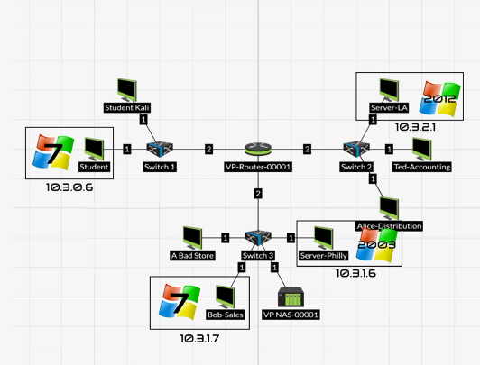
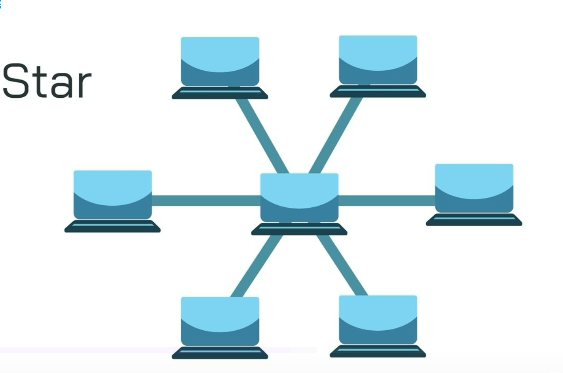
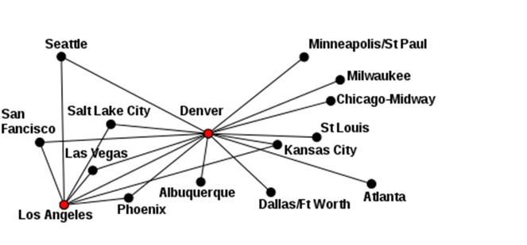
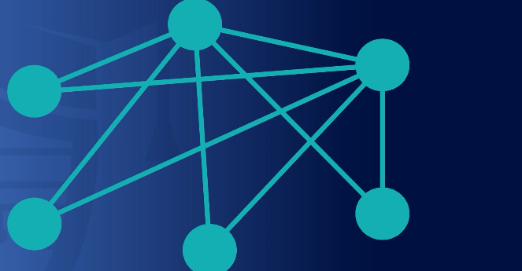

# Network Topologies: Hướng Dẫn Chi Tiết Về Các Kiểu Kết Nối Mạng

## Giới Thiệu

Topology mạng là một khái niệm cơ bản trong networking, đề cập đến cách sắp xếp các thành phần khác nhau như liên kết, nodes, clients và servers tạo nên một mạng máy tính. Hiểu rõ các loại topology khác nhau là điều quan trọng khi thiết kế một hạ tầng mạng hiệu quả và ổn định.

## Physical Topology vs Logical Topology

Trước khi tìm hiểu về 6 loại topology chính, chúng ta cần hiểu cách chúng được tài liệu hóa trong các sơ đồ mạng.

### Physical Topology

- **Định nghĩa**: Cho thấy cách các thiết bị và thành phần mạng được kết nối vật lý thông qua các loại cáp đồng hoặc quang.
- **Ví dụ**: Sơ đồ mặt bằng tòa nhà hiển thị vị trí thực tế của máy tính, router, switch và đường cáp.

### Logical Topology

- **Định nghĩa**: Mô tả cách dữ liệu thực sự di chuyển qua mạng.
- **Đặc điểm**: Hiển thị workstation, router, switch và cách chúng kết nối nhưng không thể hiện vị trí vật lý thực tế.

## 6 Loại Network Topology Chính

### 1. Point-to-Point Topology

**Đặc điểm:**

- Hình thức đơn giản nhất của topology mạng
- Kết nối trực tiếp giữa hai thiết bị
- Thường dùng để kết nối máy tính với thiết bị ngoại vi (máy in, scanner)

**Ưu điểm:**

- Đơn giản và đáng tin cậy
- Phù hợp cho kết nối quy mô nhỏ

**Nhược điểm:**

- Không thể mở rộng cho mạng lớn
- **Ngoại lệ**: Sử dụng trong WAN connections để kết nối các văn phòng từ xa

### 2. Ring Topology

**Đặc điểm:**

- Mỗi thiết bị kết nối với hai thiết bị khác, tạo thành đường dẫn dữ liệu hình tròn
- Dữ liệu di chuyển theo một hướng (clockwise hoặc counterclockwise)

**Ưu điểm:**

- Ngăn chặn collision do luồng dữ liệu một chiều
- Thích hợp cho FDDI (Fiber Distributed Data Interface)

**Nhược điểm:**

- Một node lỗi có thể làm gián đoạn toàn bộ mạng
- Công nghệ cũ, ít được sử dụng hiện tại

**FDDI Ring:**

- Hoạt động với cấu trúc dual ring (primary và secondary)
- Băng thông cao, phạm vi đến 200km
- Phù hợp cho campus networks và data centers

### 3. Bus Topology

**Đặc điểm:**

- Tất cả thiết bị kết nối với một cáp trung tâm (backbone/bus)
- Dữ liệu có sẵn cho mọi thiết bị nhưng chỉ recipient được xác định mới xử lý

**Ưu điểm:**

- Dễ cài đặt
- Yêu cầu ít cáp hơn các layout khác

**Nhược điểm:**

- Toàn bộ mạng ngừng hoạt động khi cáp chính lỗi
- Hiệu suất giảm khi thêm thiết bị (do data collision)
- Công nghệ cũ, ít sử dụng

### 4. Star Topology

**Đặc điểm:**

- Mỗi node kết nối với một điểm trung tâm (thường là network switch)
- Switch hoạt động như repeater cho luồng dữ liệu
- **Topology phổ biến nhất hiện tại**

**Ưu điểm:**

- Rất robust - lỗi một link không ảnh hưởng các link khác
- Dễ quản lý và troubleshoot
- Mạng gia đình thường sử dụng topology này

**Nhược điểm:**

- Phụ thuộc hoàn toàn vào switch trung tâm
- Switch lỗi = toàn bộ mạng ngừng hoạt động

### 5. Hub-and-Spoke Topology

**Đặc điểm:**

- Biến thể của star topology
- Node trung tâm (hub) kết nối với nhiều nodes (spokes)
- Spokes không kết nối trực tiếp với nhau

**Ứng dụng thực tế:**

- **Hàng không**: Orlando → Atlanta → Los Angeles → Hawaii
- **Mạng viễn thông**: Consolidate các văn phòng khu vực về hub trung tâm

**Ưu điểm:**

- Tiết kiệm chi phí kết nối đường dài
- Tập trung băng thông cao giữa các hub chính

**Nhược điểm:**

- Phụ thuộc vào hub trung tâm
- Latency cao do phải đi qua hub

### 6. Mesh Topology

**Đặc điểm:**

- Kết nối point-to-point giữa mọi thiết bị
- Tạo mạng robust và redundant

#### Full-Mesh Topology

- **Định nghĩa**: Mọi node kết nối với mọi node khác
- **Công thức số kết nối**: n × (n-1) ÷ 2
  - 3 nodes = 3 kết nối
  - 6 nodes = 15 kết nối

**Ưu điểm:**

- Redundancy cao
- Nhiều đường backup

**Nhược điểm:**

- Rất đắt và phức tạp
- Số kết nối tăng theo cấp số nhân

#### Partial-Mesh Topology

- **Định nghĩa**: Một số nodes được kết nối full-mesh, các nodes khác chỉ kết nối với 1-2 thiết bị
- **Ứng dụng**: Cân bằng giữa redundancy và cost

## So Sánh Tổng Quan

| Topology       | Ưu điểm                       | Nhược điểm              | Sử dụng              |
| -------------- | ----------------------------- | ----------------------- | -------------------- |
| Point-to-Point | Đơn giản, đáng tin cậy        | Không scalable          | WAN connections      |
| Ring           | Không collision, FDDI support | Single point of failure | FDDI networks        |
| Bus            | Dễ cài đặt, ít cáp            | Performance giảm, cũ    | Legacy systems       |
| Star           | Robust, dễ quản lý            | Phụ thuộc switch        | Home/office networks |
| Hub-and-Spoke  | Tiết kiệm, tập trung          | Phụ thuộc hub, latency  | Enterprise networks  |
| Mesh           | Redundancy cao                | Đắt, phức tạp           | Critical networks    |

## Kết Luận

Hiểu biết về các loại topology mạng là nền tảng quan trọng cho thiết kế và quản lý mạng. Mỗi topology có những ưu nhược điểm riêng, phù hợp với các scenario khác nhau:

- **Point-to-point**: Ideal cho kết nối nhỏ và WAN links
- **Ring/Bus**: Công nghệ legacy với vulnerability cao
- **Star**: Phổ biến nhất, cân bằng tốt giữa reliability và cost
- **Hub-and-spoke**: Tốt cho enterprise với centralized management
- **Mesh**: Maximum redundancy nhưng cost cao

Việc lựa chọn topology phù hợp phụ thuộc vào yêu cầu cụ thể về performance, redundancy, cost và scalability của tổ chức.

---
