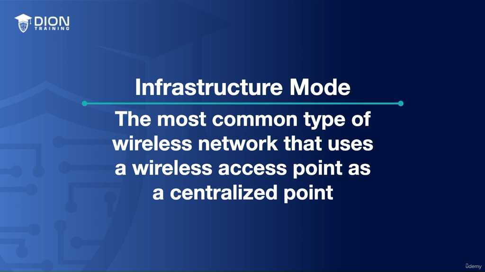
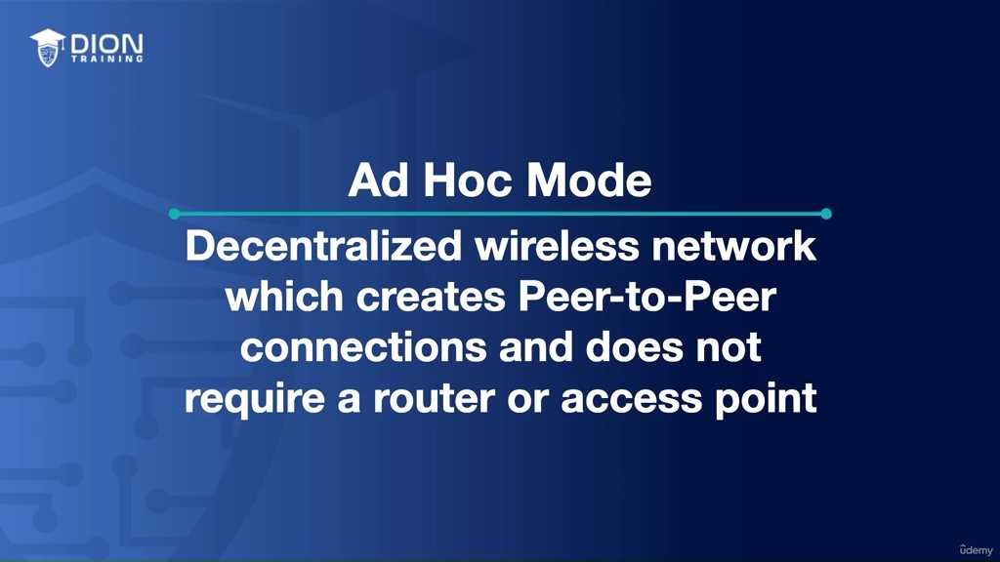
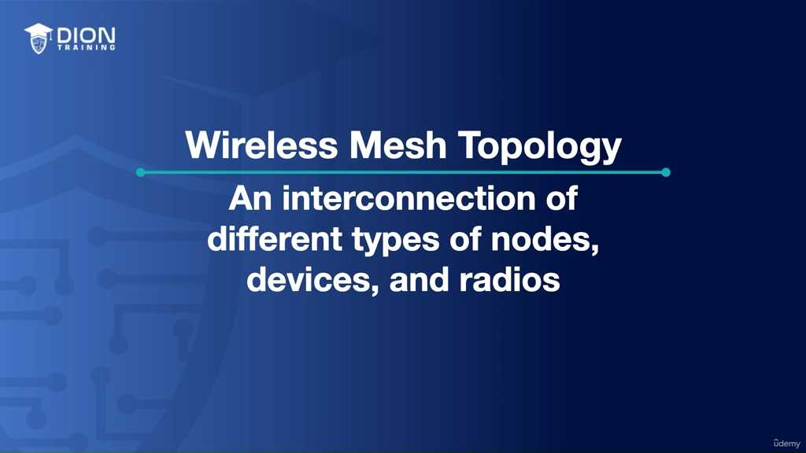
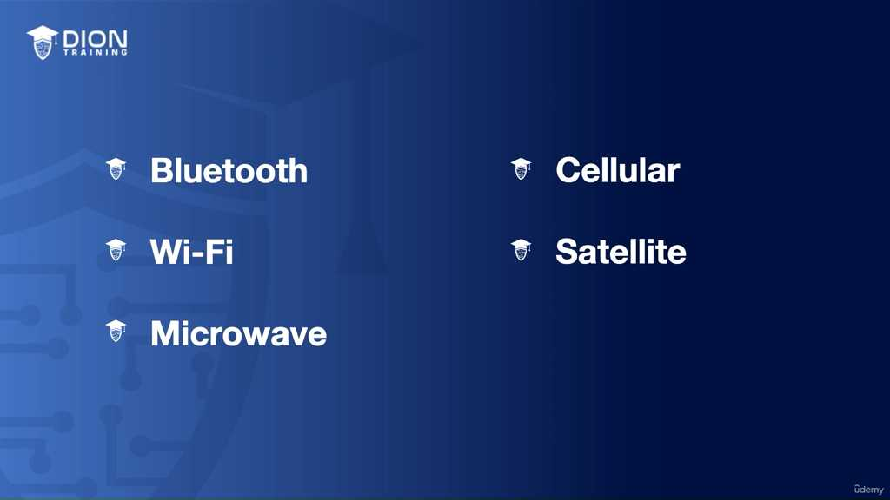
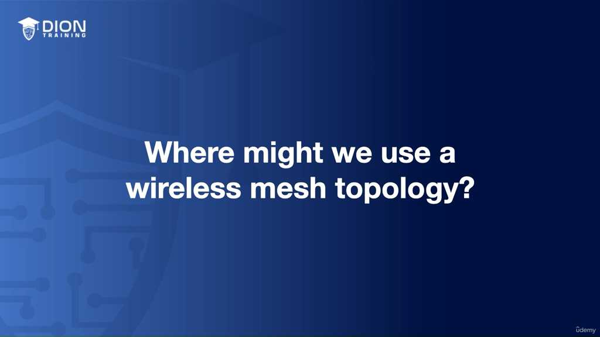
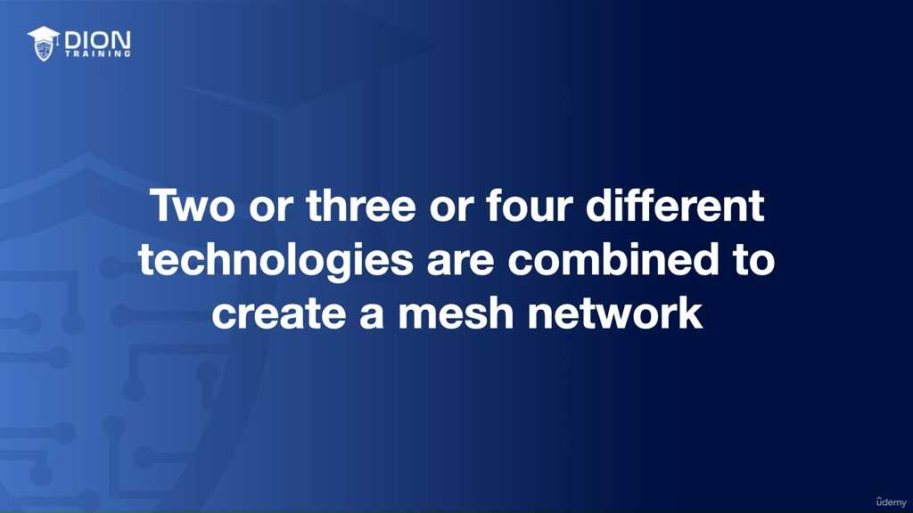
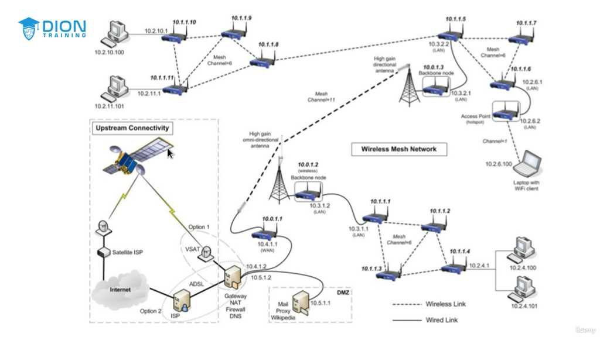
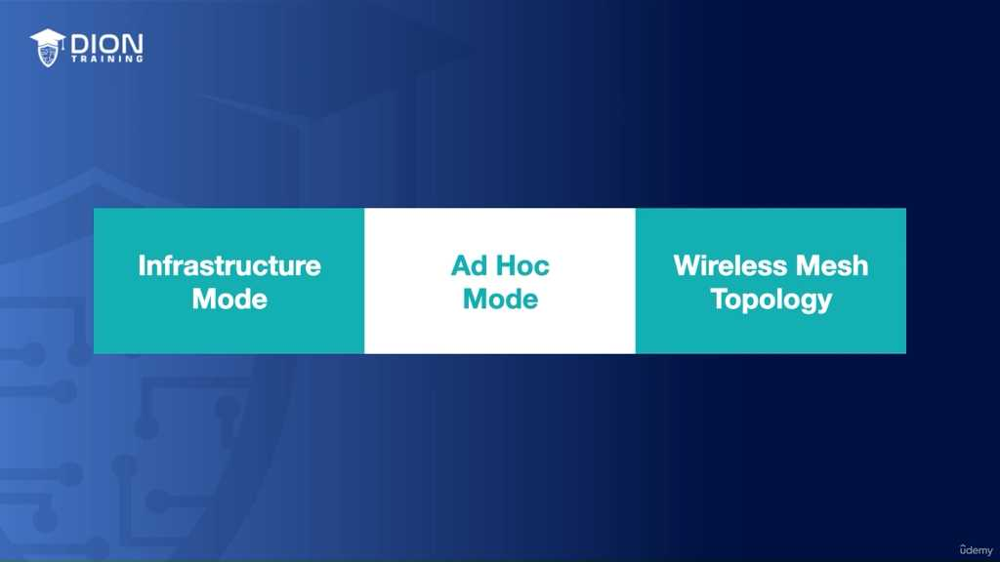

# Wireless Infrastructure Mode

Tiếp nối nền tảng về topology vật lý và logic đã học, bài giảng này tập trung vào các chế độ vận hành (operational modes) đặc thù của mạng không dây. Dưới đây là phân tích chi tiết:

### 1. Infrastructure Mode (Chế độ Cơ sở hạ tầng)
Đây là chế độ phổ biến nhất trong hệ thống mạng hiện nay. Điểm cốt lõi của Infrastructure Mode là sự hiện diện của một "trung tâm điều phối" – cụ thể là **Wireless Access Point (WAP)**.

*   **Cơ chế vận hành:** Tất cả các thiết bị như điện thoại, laptop, hay máy tính bảng đều không kết nối trực tiếp với nhau mà phải "nói chuyện" thông qua WAP. WAP đóng vai trò như một bộ lọc, một trạm trung chuyển và là "cửa ngõ" để truy cập Internet.
*   **Liên hệ thực tế:** Bạn có thể hình dung đây chính là cấu trúc **Star Topology** (hình sao) trong mạng có dây nhưng được triển khai bằng sóng vô tuyến. WAP nằm ở vị trí trung tâm, mọi lưu lượng dữ liệu đều đổ về đó.

 (Sơ đồ mô phỏng các thiết bị Wi-Fi kết nối vào một Access Point duy nhất đặt ở trung tâm).

> **💡 Ví dụ nhớ đời:** Hãy tưởng tượng Infrastructure Mode giống như một **lớp học truyền thống**. Mọi học sinh muốn trao đổi thông tin với nhau đều phải thông qua giáo viên đứng lớp. Giáo viên (WAP) là người kiểm soát ai được nói, ai được vào lớp, và đảm bảo mọi quy tắc an ninh (password/firewall) được thực thi nghiêm ngặt.

*   **Ưu điểm:** Khả năng quản lý tập trung, tính bảo mật cao (hỗ trợ WPA3, mã hóa mạnh), và dễ dàng mở rộng quy mô.

### 2. Ad Hoc Mode (Chế độ phi tập trung)
Trái ngược hoàn toàn với Infrastructure, Ad Hoc Mode hoạt động theo mô hình **Peer-to-Peer (ngang hàng)**. Trong chế độ này, không có WAP, không có router trung tâm.

*   **Cơ chế vận hành:** Các thiết bị tự "bắt tay" với nhau. Khi hai thiết bị (ví dụ: hai laptop) ở trong phạm vi sóng của nhau, chúng tự thiết lập một liên kết mạng tạm thời để trao đổi dữ liệu.
*   **Đặc tính:** Nó mang tính chất tức thời (on-the-fly). Một thiết bị có thể gia nhập hoặc rời khỏi mạng bất cứ lúc nào mà không cần sự cho phép hay cấu hình từ một máy chủ trung tâm nào.

> **💡 Ví dụ nhớ đời:** Ad Hoc Mode giống như một **cuộc tụ tập tự phát ngoài công viên**. Không có ban tổ chức, không có loa đài trung tâm. Mọi người tự đến, tự nói chuyện với người đứng cạnh, rồi tự bỏ đi. Khi bạn rời đi, cuộc hội thoại đó không còn tồn tại dưới hình thức một mạng lưới chính thống nữa.

### 3. Wireless Mesh (Mạng lưới không dây)
Đây là khái niệm nâng cao và phức tạp hơn hai loại trên. Nhiều người lầm tưởng Mesh là sự kết hợp của Infrastructure và Ad Hoc, nhưng thực tế nó là một cấu trúc mạng thông minh với khả năng tự cấu hình (self-configuring) và tự phục hồi (self-healing).

*   **Cơ chế vận hành:** Mesh sử dụng nhiều loại nút (nodes) khác nhau—từ router, gateway, cho đến các thiết bị thu phát vô tuyến—tạo thành một "tấm lưới" bao phủ không gian rộng lớn. Các nút này phối hợp với nhau để tìm đường đi tối ưu cho dữ liệu.
*   **Sự đa dạng giao thức:** Điểm đặc biệt nhất của Mesh là tính linh hoạt về môi trường. Nó không chỉ dùng Wi-Fi mà còn hòa trộn các băng tần khác như Bluetooth, sóng vô tuyến, tín hiệu vệ tinh hay cellular vào cùng một cấu trúc mạng duy nhất.

 (Sơ đồ mạng Mesh với nhiều nút kết nối chằng chịt, nếu một đường dẫn bị đứt, dữ liệu sẽ tự động chuyển hướng qua đường dẫn khác).

> **💡 Ví dụ nhớ đời:** Nếu Infrastructure Mode là một **căn nhà có một cửa chính duy nhất**, thì Wireless Mesh giống như **hệ thống đường bộ của một thành phố lớn**. Nếu con đường chính bị tắc nghẽn (đứt kết nối), dữ liệu của bạn sẽ tự động "rẽ" sang các con đường khác (nodes khác) để đến đích mà không cần người điều khiển giao thông chỉ dẫn. Tính dự phòng (redundancy) ở đây cực kỳ cao, đảm bảo mạng luôn "sống".

**Tổng kết:**
*   **Infrastructure:** Quản lý tập trung, bảo mật cao (Dành cho doanh nghiệp, gia đình).
*   **Ad Hoc:** Nhanh gọn, phi tập trung, tạm thời (Dành cho truyền file nhanh giữa 2 thiết bị).
*   **Mesh:** Thông minh, bền bỉ, đa dạng phương thức kết nối (Dành cho phủ sóng diện rộng hoặc hệ thống IoT phức tạp).

Trong môi trường khắc nghiệt, nơi các cấu trúc hạ tầng cố định như cáp quang hay đường dây điện thoại bị phá hủy, khái niệm "kết nối" không còn là một đường thẳng đơn giản mà là một mạng lưới linh hoạt. Đây chính là bản chất của **Wireless Mesh Topology (Cấu trúc liên kết mạng lưới không dây)**.

Khi thảm họa như bão lũ xảy ra, nhu cầu thiết lập mạng lưới liên lạc khẩn cấp trở nên tối quan trọng để các đội cứu hộ nhân đạo có thể kết nối ngược về trụ sở chính. Hệ thống này không dựa vào một đơn vị truyền dẫn duy nhất mà là sự kết hợp đa dạng: mạng di động (cellular), Wi-Fi cục bộ, kết nối vệ tinh (satellite) và sóng viba (microwave). 

> **💡 Ví dụ nhớ đời:** Hãy tưởng tượng mạng lưới này giống như một "đội quân tiếp sức". Một người chạy bộ (Wi-Fi) chỉ có thể truyền tin trong cự ly ngắn 50 mét. Để đưa thư xuyên quốc gia, người chạy bộ đó phải trao túi tin cho một người đi xe máy (viba) để đi quãng đường 50km, và người đó lại giao tiếp với một máy bay vận tải (vệ tinh) để băng qua đại dương. Cả ba phương thức này cùng phối hợp để tạo nên một con đường thông suốt.

Tại mỗi trại căn cứ (basecamp), chúng ta triển khai một mạng Wi-Fi để mọi người trong trại có thể truy cập bằng điện thoại hoặc laptop. Nhưng làm sao để mạng cục bộ này nói chuyện được với thế giới? Đó là lúc Mesh Topology phát huy sức mạnh. 

Sơ đồ trên cho thấy cách các lớp công nghệ chồng lên nhau:
1. **Lớp Wi-Fi:** Phục vụ truy cập tại chỗ (bán kính 30-60 mét).
2. **Lớp Microwave (Viba):** Kết nối giữa các trại căn cứ với nhau (bán kính 50-60 km).
3. **Lớp Vệ tinh:** Kết nối từ khu vực thảm họa về trung tâm điều phối ở quốc gia khác (bán kính hàng ngàn km).

Việc kết hợp nhiều công nghệ khác nhau chính là chìa khóa của tính "Redundant" (Dư thừa/Dự phòng). Nếu một trạm viba bị hỏng do gió bão, dữ liệu có thể tự động chuyển hướng qua đường vệ tinh hoặc modem di động để duy trì kết nối. Trong viễn thông, dư thừa không phải là lãng phí, đó là sự đảm bảo sống còn.

Để làm rõ sự khác biệt trong việc mở rộng mạng lưới, hãy nhìn vào khả năng bao phủ của từng loại hình:
- **Wi-Fi:** Phù hợp mật độ cao, cự ly cực ngắn.
- **Microwave:** Phù hợp kết nối điểm - điểm (Point-to-Point) giữa các tòa nhà hoặc cụm hạ tầng trong phạm vi tỉnh/thành phố mà không cần đào đường đặt cáp.
- **Satellite:** Giải pháp cuối cùng khi mọi thứ trên mặt đất đã bị cắt đứt.

Tóm lại, Wireless Mesh không chỉ là một cấu trúc mạng đơn thuần; đó là một triết lý thiết kế mạng **"không bao giờ bỏ cuộc"**. Khi bạn thiết kế hệ thống theo mô hình này, bạn đang tạo ra một thực thể có khả năng tự phục hồi, tự mở rộng và không phụ thuộc vào một mắt xích duy nhất.

Để nắm vững chương này, bạn cần ghi nhớ ba trụ cột của topo mạng không dây:
1. **Infrastructure (Cơ sở hạ tầng):** Mạng truyền thống có điểm truy cập trung tâm (AP).
2. **Ad hoc:** Mạng tự hình thành giữa các thiết bị mà không cần AP trung tâm.
3. **Mesh:** Mạng lưới lai tạp, kết hợp sự linh hoạt của Ad hoc và sức mạnh của hạ tầng công nghệ khác nhau để tạo ra kết nối bền bỉ nhất.

### Hình ảnh minh họa thêm:

---
*Ghi chú: 8 hình ảnh minh họa (.jpg) đã được tải về và lưu tự động vào thư mục con `image/` cùng cấp với file này. Để ảnh hiển thị tự động, hãy đảm bảo bạn sao chép cả thư mục `image/` nếu bạn muốn di chuyển file markdown sang nơi khác!*
