# Datacenter Topologies Overview

Trong phần đầu tiên của bài học, chúng ta sẽ làm sáng tỏ bản chất của các trung tâm dữ liệu (Datacenter - DC) và đi sâu vào kiến trúc phân cấp ba lớp (three-tiered hierarchy) – nền tảng kinh điển của mạng doanh nghiệp.

### 1. Định nghĩa về Trung tâm dữ liệu (Datacenter)
Một trung tâm dữ liệu không chỉ đơn thuần là một căn phòng chứa đầy máy móc. Về mặt kỹ thuật, đó là một cơ sở hạ tầng hội tụ ba thành phần cốt lõi: **Network** (hệ thống kết nối), **Computers** (hệ thống máy chủ xử lý), và **Storage** (hệ thống lưu trữ dữ liệu).

Mục tiêu tối thượng của DC là cung cấp khả năng:
*   **Organize:** Sắp xếp cấu trúc dữ liệu.
*   **Process:** Xử lý các thuật toán hoặc yêu cầu của người dùng.
*   **Store:** Lưu giữ dữ liệu dài hạn.
*   **Disseminate:** Truyền tải dữ liệu đi khắp nơi.

> **💡 Ví dụ nhớ đời:** Hãy tưởng tượng Datacenter giống như "bộ não và hệ thần kinh" của một cơ thể doanh nghiệp. Nếu máy chủ (server) là các tế bào thần kinh thực hiện suy nghĩ, thì hạ tầng mạng (network) chính là các sợi trục thần kinh truyền tải thông tin, và thiết bị lưu trữ chính là bộ nhớ dài hạn của cơ thể đó.

### 2. Quy mô Datacenter: Từ phòng ngủ đến "siêu thành phố"
Sự linh hoạt trong định nghĩa "Datacenter" xuất phát từ sự chênh lệch khủng khiếp về quy mô:

*   **Quy mô nhỏ (Local):** Khoảng 150 foot vuông (~14m2). Đây thường là các tủ rack đặt tại văn phòng công ty, quản lý vài chục server. Nó giống như một "kho lưu trữ cá nhân" tại gia.
*   **Quy mô khổng lồ (Hyperscale):** Điển hình là Utah Datacenter với 1.5 triệu foot vuông (~140.000m2). 
    *   **Điểm cần lưu ý:** Với mức tiêu thụ 65 megawatts điện, trung tâm này tương đương với năng lượng tiêu thụ của hàng chục nghìn hộ gia đình. Việc quản trị một hệ thống có chi phí vận hành 40 triệu USD/năm đòi hỏi trình độ kỹ thuật cực cao để tối ưu hóa hiệu suất năng lượng.

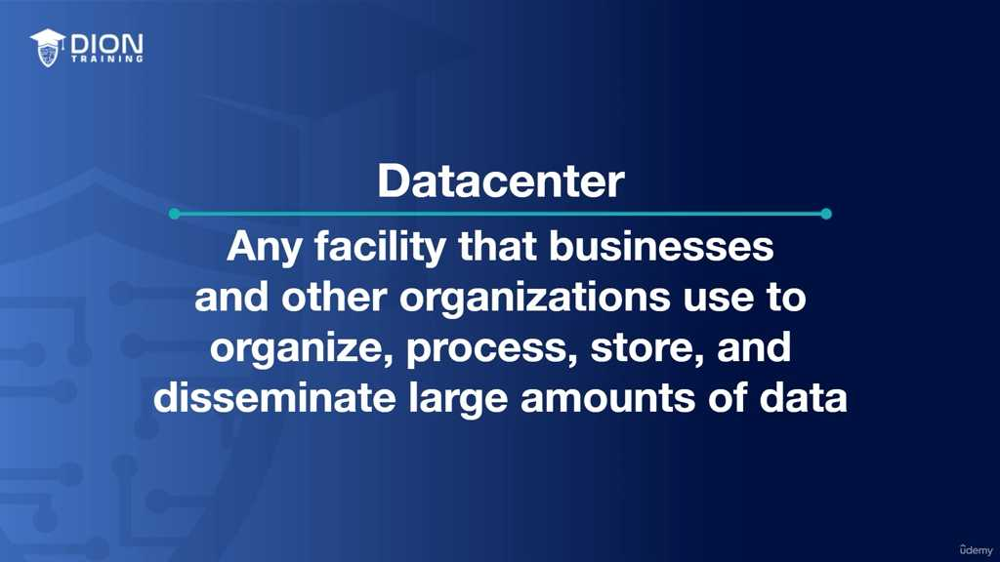 (Sơ đồ so sánh kích thước giữa một phòng Server nhỏ và cấu trúc Hyperscale đồ sộ với các dãy Rack trải dài).

### 3. Tại sao cần hiểu các kiến trúc (Topologies)?
Là một kỹ thuật viên mạng, việc bạn hiểu về Topology không chỉ để biết cách cắm dây, mà là để biết cách luồng dữ liệu chảy qua hệ thống. Bạn cần nắm vững các mô hình như:
*   **Three-tiered hierarchy (Phân cấp 3 lớp).**
*   **Collapsed core (Lớp lõi rút gọn).**
*   **Spine and Leaf (Kiến trúc xương sống và lá).**

Việc nắm vững các mô hình này giúp bạn chẩn đoán sự cố nhanh hơn: khi mạng "lag" hoặc rớt gói tin, bạn biết ngay nó đang gặp vấn đề ở lớp nào trong mô hình.

### 4. Phân tích chi tiết mô hình 3 lớp (Three-tiered Hierarchy)
Đây là cấu trúc nền tảng, được thiết kế để phân tách chức năng của từng thiết bị mạng nhằm đảm bảo tính ổn định và khả năng mở rộng.

#### A. Core Layer (Lớp lõi)
Đây là "xương sống" (Backbone) của toàn bộ hệ thống mạng.
*   **Đặc tính:** Tốc độ cực nhanh, băng thông cực lớn, độ trễ thấp nhất có thể.
*   **Vai trò:** Kết nối các vùng địa lý khác nhau hoặc kết nối các trung tâm dữ liệu với nhau. Lớp lõi không thực hiện các tác vụ lọc gói tin phức tạp hay chính sách bảo mật (vì nó sẽ làm chậm tốc độ). Nó chỉ quan tâm đến việc chuyển tiếp dữ liệu (switching/routing) nhanh nhất có thể từ điểm A đến điểm B.
*   **Thiết bị:** Các router và switch lớp doanh nghiệp cao cấp nhất (như dòng Cisco Catalyst hoặc Nexus).

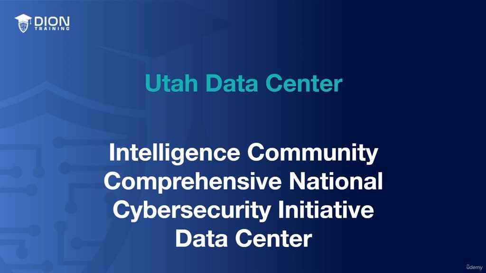 (Sơ đồ mô hình 3 lớp: Core Layer ở trên cùng, kết nối xuống Distribution Layer, và cuối cùng là Access Layer).

> **💡 Ví dụ nhớ đời:** Hãy hình dung Lớp Lõi (Core Layer) giống như một đường cao tốc 20 làn xe xuyên quốc gia. Nhiệm vụ của nó là cho phép xe cộ đi từ thành phố này sang thành phố khác với tốc độ tối đa. Bạn sẽ không bao giờ thấy đèn giao thông (chính sách lọc/bảo mật phức tạp) trên đường cao tốc này, vì mục đích duy nhất của nó là chuyển tiếp lưu lượng với tốc độ khủng khiếp. Mọi việc dừng đỗ, phân luồng nhỏ lẻ phải diễn ra ở các lớp dưới.

Tiếp nối cấu trúc phân cấp mạng, đoạn transcript đi sâu vào việc vận hành và mục đích của các tầng, cũng như khái niệm về thiết kế mạng hiện đại.

### 1. Phân tích Tầng Core (Lõi) và Tính sẵn sàng cao
Tầng Core được ví như "xương sống" tốc độ cao của hệ thống. Đoạn văn nhấn mạnh việc triển khai ít nhất hai router tại tầng này với cấu hình dự phòng (redundant configuration). Điều này nhằm đảm bảo tính khả dụng cao (High Availability). Nếu chỉ có một router duy nhất, mạng của bạn sẽ rơi vào tình trạng "Single Point of Failure" (điểm lỗi đơn lẻ).

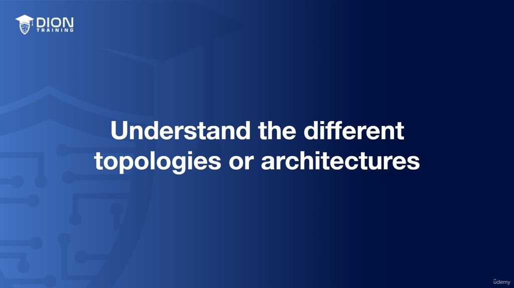

> **💡 Ví dụ nhớ đời:** Hãy tưởng tượng tầng Core giống như đường cao tốc nối giữa hai thành phố lớn. Nếu bạn chỉ xây một chiếc cầu duy nhất qua sông, chỉ cần một chiếc xe tải chết máy giữa cầu là toàn bộ giao thông tê liệt. Việc có hai router cũng giống như xây hai chiếc cầu song song; nếu cầu A gặp sự cố, cầu B ngay lập tức gánh tải, giúp cuộc sống (dòng dữ liệu) không bị gián đoạn.

### 2. Tầng Distribution (Phân phối/Tổng hợp) - "Bộ não của chính sách"
Tầng này đóng vai trò trung gian, thực hiện việc định nghĩa ranh giới (boundary definition). Thay vì để tầng Core phải xử lý mọi yêu cầu lọc gói tin phức tạp, tầng Distribution sẽ đảm nhận việc cài đặt Access Lists (ACLs) và các bộ lọc bảo mật. Việc sử dụng Layer 3 Switch ở đây là yếu tố then chốt, cho phép chuyển tiếp gói tin giữa các VLAN và Subnet khác nhau mà không cần đẩy lưu lượng lên tầng Core, từ đó giảm tải cho phần lõi mạng.

### 3. Tầng Access (Truy cập/Edge) - "Điểm chạm người dùng"
Đây là tầng thấp nhất, nơi kết nối trực tiếp với các thiết bị đầu cuối (endpoints) như máy tính, máy in, hay các điểm truy cập Wi-Fi (WAP). Các thiết bị tại tầng này thường là switch Layer 2. Chức năng chính của chúng là chuyển đổi dữ liệu từ dạng gói tin (IP packets) thành các khung dữ liệu (frames) để gửi đến đúng địa chỉ MAC của thiết bị đầu cuối.

### 4. Tại sao phải phân cấp? (Lợi ích về quản trị)
Hệ thống 3 tầng mang lại 4 giá trị cốt lõi:
*   **Performance (Hiệu năng):** Tách biệt các tác vụ lọc/định tuyến tại tầng Distribution giúp tối ưu hóa luồng dữ liệu.
*   **Management (Quản lý):** Phân chia khu vực rõ ràng.
*   **Scalability (Khả năng mở rộng):** Dễ dàng thêm các switch Access mới mà không làm thay đổi kiến trúc tổng thể.
*   **Redundancy (Dự phòng):** Đảm bảo không có điểm lỗi đơn lẻ.

Khả năng xử lý sự cố (troubleshooting) được tối ưu hóa nhờ tính cô lập. Khi có vấn đề, quản trị viên chỉ cần khoanh vùng lỗi tại thiết bị tầng Access cụ thể, thay vì phải kiểm tra toàn bộ hệ thống.

> **💡 Ví dụ nhớ đời:** Hãy coi hệ thống mạng như một tòa nhà chung cư: 
> - **Tầng Core:** Hệ thống cấp điện tổng cho cả tòa nhà.
> - **Tầng Distribution:** Các tủ điện chia tầng (tách biệt khu vực, có cầu chì bảo vệ). 
> - **Tầng Access:** Các ổ cắm trong từng căn hộ. Nếu bóng đèn trong phòng bạn hỏng, bạn chỉ cần sửa ổ cắm đó; cả tòa nhà không cần phải cắt điện để bạn thay bóng.

### 5. Triển khai vật lý: Datacenter và Branch Office
*   **Datacenter:** Nơi đặt các Core và Distribution Switch của khu vực trung tâm.
*   **Branch Office:** Mỗi văn phòng chi nhánh sẽ có một tủ phân phối chính (MDF - Main Distribution Frame) chứa thiết bị Distribution, và từ đó tỏa ra các tủ trung gian (IDF - Intermediate Distribution Frame) chứa các switch Access để kết nối tới từng bàn làm việc.

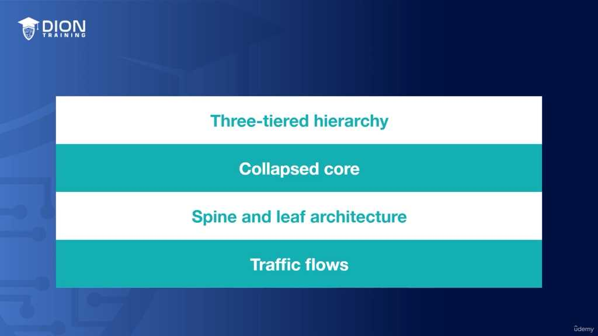

### 6. Khái niệm "Collapsed Core" (Lõi thu gọn)
Đoạn transcript bắt đầu giới thiệu về mô hình "Collapsed Core". Đây là thiết kế nơi tầng Core và tầng Distribution được gộp lại làm một. Điều này thường được áp dụng trong các doanh nghiệp quy mô vừa và nhỏ, nơi mà lưu lượng mạng không quá lớn đến mức cần tách biệt hoàn toàn hai tầng này. Bằng cách gộp lại, doanh nghiệp tiết kiệm chi phí phần cứng và quản lý, nhưng vẫn duy trì được hiệu suất cần thiết nhờ vào sức mạnh của các dòng switch hiện đại có khả năng xử lý đồng thời định tuyến lớp 3 và chuyển mạch tốc độ cao.

### 1. Kiến trúc Collapsed Core (Core rút gọn)

Trong mô hình mạng truyền thống, chúng ta thường thấy phân cấp ba tầng: Core (lõi), Distribution (phân phối) và Access (truy cập). Tuy nhiên, kiến trúc **Collapsed Core** ra đời nhằm tối ưu hóa bằng cách hợp nhất tầng Core và tầng Distribution thành một lớp duy nhất.

*   **Tại sao lại gộp?** Mục tiêu chính là tinh giản. Khi bạn gộp hai lớp này, thay vì phải quản lý các thiết bị riêng biệt cho từng chức năng, bạn chỉ cần một hệ thống switch chịu trách nhiệm cả về tốc độ chuyển mạch cao (Core) lẫn các chính sách định tuyến, lọc dữ liệu và quản lý VLAN (Distribution).

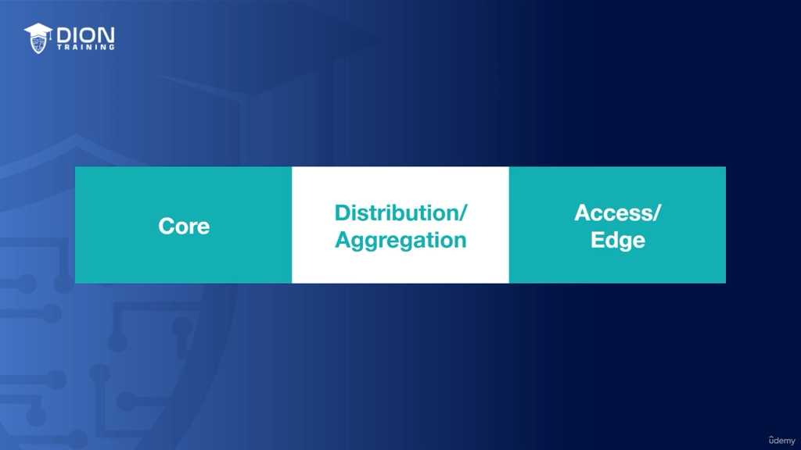 (Sơ đồ so sánh mô hình 3 tầng truyền thống so với mô hình Collapsed Core 2 tầng)

*   **Phạm vi ứng dụng:** Mô hình này không dành cho các siêu tập đoàn toàn cầu, mà nó "tỏa sáng" trong các trung tâm dữ liệu (datacenter) quy mô vừa và nhỏ. Ở những nơi này, nhu cầu về khả năng mở rộng cực hạn của mô hình 3 tầng là dư thừa, trong khi sự đơn giản lại là ưu tiên hàng đầu.
*   **Lợi ích kép:**
    *   **Tiết kiệm chi phí:** Bạn mua ít thiết bị hơn, tốn ít diện tích tủ rack hơn, và chi phí vận hành (điện năng, làm mát) cũng giảm xuống.
    *   **Giảm độ trễ (Latency):** Vì dữ liệu đi qua ít "hop" (bước nhảy giữa các thiết bị) hơn, tốc độ phản hồi giữa các server hoặc từ server ra mạng ngoài sẽ nhanh hơn đáng kể.

> **💡 Ví dụ nhớ đời:** Hãy tưởng tượng bạn đang điều hành một thư viện nhỏ. Thay vì có một thủ thư chuyên lấy sách từ kho (Core), một người chuyên phân loại sách theo kệ (Distribution) và một người phục vụ khách tại bàn (Access), thì trong mô hình "Collapsed Core", chính người phục vụ tại bàn cũng là người biết rõ kho sách và tự tay lấy sách cho khách. Bạn tiết kiệm được lương cho 1 người, thủ tục bàn giao giữa các bộ phận biến mất, và khách hàng nhận được sách ngay lập tức. Nhưng nếu đó là một thư viện khổng lồ như Thư viện Quốc gia, việc gom chung như vậy sẽ khiến hệ thống quá tải ngay lập tức.

Tuy nhiên, cần lưu ý: Khi mạng lưới phình to, việc thiếu sự tách biệt giữa tầng Core và Distribution sẽ gây khó khăn cho việc quản lý lưu lượng và mở rộng hạ tầng trong tương lai. Đó là lý do tại sao nó là "giải pháp" chứ không phải là "chân lý vĩnh cửu".

### 2. Kiến trúc Spine and Leaf (Xương sống và Lá)

Khi chuyển sang kiến trúc **Spine and Leaf**, chúng ta đang thay đổi cách tư duy về giao thông mạng trong nội bộ datacenter. Khác với mô hình 3 tầng vốn được thiết kế để "điều hướng" dữ liệu từ trên xuống dưới (từ Core xuống Access), Spine and Leaf được thiết kế để tối ưu hóa sự giao tiếp theo chiều ngang (East-West traffic) giữa các server.

*   **Cấu trúc 2 lớp:**
    *   **Leaf Layer (Lớp Lá):** Đây là các switch kết nối trực tiếp với server và các thiết bị đầu cuối. Các switch này đảm nhận vai trò tập hợp (aggregate) mọi traffic từ server.
    *   **Spine Layer (Lớp Xương sống):** Đây là "xương sống" của mạng. Mọi switch thuộc lớp Leaf đều phải kết nối với mọi switch thuộc lớp Spine.

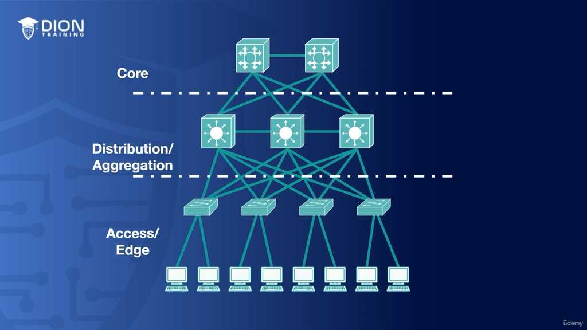 (Sơ đồ cấu trúc Full-Mesh của Spine and Leaf cho thấy sự kết nối dày đặc giữa các lớp)

*   **Topology Full-Mesh:** Đây là điểm mấu chốt. Việc các switch Leaf kết nối với tất cả các switch Spine tạo ra một mô hình "Full-Mesh". Điều này mang lại sự đảm bảo tuyệt đối về tính dự phòng: nếu một thiết bị Spine bị hỏng, traffic vẫn còn nhiều con đường khác để đi.
*   **Hiệu năng vượt trội:** Trong trung tâm dữ liệu hiện đại, nơi các server cần liên tục "nói chuyện" với nhau để xử lý các tác vụ phân tán (như Big Data hoặc Microservices), mô hình Spine and Leaf loại bỏ hoàn toàn các nút thắt cổ chai thường thấy ở mô hình phân cấp truyền thống. Nó đảm bảo độ trễ ổn định và băng thông cao nhất cho mọi thiết bị trong hệ thống.

> **💡 Ví dụ nhớ đời:** Nếu mô hình 3 tầng giống như một hệ thống đường cao tốc phân cấp (đường nhánh -> đường quốc lộ -> đường cao tốc), thì Spine and Leaf giống như một mạng lưới các con đường cao tốc nối thẳng từ điểm A đến điểm B mà không cần chờ đợi qua các nút giao thông phụ. Bạn muốn đi từ tầng 1 lên tầng 10 của tòa nhà? Bạn có cầu thang máy thẳng đứng ngay tại sảnh. Bạn muốn đi từ server A sang server B? Bạn có "đường cao tốc" nối thẳng qua Spine. Không có sự chậm trễ, không có nút thắt, mọi thứ đều thông suốt.

### Phân tích kiến trúc Spine-Leaf và các mô hình lưu lượng mạng

**1. Ưu thế vượt trội của kiến trúc Spine-Leaf**
Đoạn transcript nhấn mạnh rằng kiến trúc Spine-Leaf mang lại tốc độ truyền tải nhanh hơn và độ trễ (latency) thấp hơn so với mô hình phân cấp ba tầng (three-tiered hierarchy) truyền thống. Trong kiến trúc ba tầng, dữ liệu thường phải đi qua các lớp Access, Distribution, rồi mới tới Core, gây ra tình trạng "nút cổ chai" và đường đi vòng vèo. Ngược lại, Spine-Leaf tạo ra các "lối tắt" vật lý, đảm bảo mọi Leaf switch chỉ cách nhau đúng một bước nhảy (hop) qua Spine switch. 

Khi kết hợp với SDN (Software-Defined Networking), khả năng tối ưu hóa đường đi càng trở nên mạnh mẽ nhờ việc điều khiển luồng dữ liệu thông qua phần mềm thay vì phụ thuộc hoàn toàn vào các giao thức định tuyến tĩnh truyền thống.

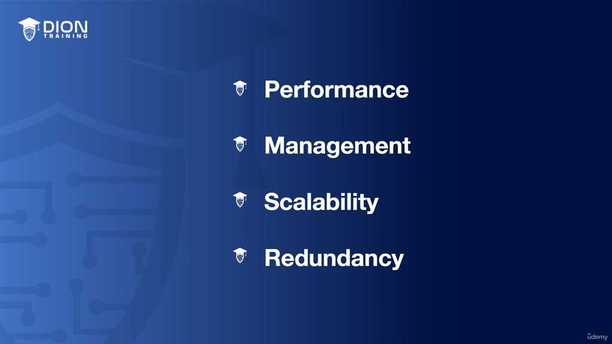 (Sơ đồ so sánh: Mô hình 3 tầng hình cây vs. Mô hình Spine-Leaf dạng lưới ngang)

**2. Triển khai vật lý: Top of Rack (ToR) Switching**
Cấu trúc tiêu chuẩn của Spine-Leaf thường sử dụng mô hình "Top of Rack". Mỗi tủ rack chứa server sẽ được lắp đặt hai switch ngay tại vị trí cao nhất (Top of Rack).
*   **Tính dự phòng:** Mỗi server bên trong rack sẽ có hai kết nối vật lý, mỗi kết nối cắm vào một trong hai switch này. Điều này đảm bảo nếu một switch bị lỗi, kết nối mạng của server không bị gián đoạn.
*   **Vai trò:** Hai switch này chính là các "Leaf". Chúng đóng vai trò là điểm tập trung (aggregation point) cho tất cả các thiết bị trong rack và là cửa ngõ để đẩy dữ liệu lên "Spine" (phần xương sống của mạng).

> **💡 Ví dụ nhớ đời:** Hãy tưởng tượng các server trong rack là những căn hộ trong một tòa chung cư. Hai switch ToR chính là hành lang chính của tầng đó. Thay vì người dân (dữ liệu) phải đi xuống tầng trệt rồi mới lên được tòa nhà khác, họ chỉ cần bước ra hành lang (Leaf) là gặp ngay cầu thang bộ (Spine) để đi thẳng sang tòa nhà bên cạnh.

**3. Lai ghép mô hình: Spine-Leaf kết hợp với 3 tầng truyền thống**
Đoạn transcript chỉ ra khả năng linh hoạt trong thiết kế: bạn không nhất thiết phải thay thế hoàn toàn hạ tầng cũ.
*   **Mô hình kết hợp:** Datacenter vẫn giữ cấu trúc Spine-Leaf cho các server, nhưng Spine lại được kết nối ngược về lớp Core của hệ thống 3 tầng truyền thống.
*   **Phân tầng chức năng:** Các thiết bị ngoại vi (như máy in, PC văn phòng, thiết bị IoT không thuộc datacenter) sẽ đi theo luồng cũ (Access -> Distribution -> Core). Trong khi đó, luồng dữ liệu nặng nề giữa các server sẽ được "gánh" bởi cấu trúc Spine-Leaf hiệu năng cao, sau đó mới đẩy vào lõi chung để ra ngoài.

**4. Phân loại luồng dữ liệu (Traffic Flows)**
Đây là khái niệm cốt lõi để quản lý hạ tầng mạng:

*   **North-South (Bắc-Nam):** Là luồng dữ liệu đi vào hoặc ra khỏi Datacenter.
    *   **North (Bắc):** Dữ liệu rời khỏi trung tâm dữ liệu (ví dụ: một user bên ngoài truy cập website đặt tại server của bạn).
    *   **South (Nam):** Dữ liệu đi vào trung tâm dữ liệu (ví dụ: các bản cập nhật phần mềm, dữ liệu từ internet đổ về).
    *   **Đặc điểm:** Luồng này bắt buộc phải đi qua các thiết bị biên như Router hoặc Firewall. Đây là "cửa ngõ" để kiểm soát an ninh.

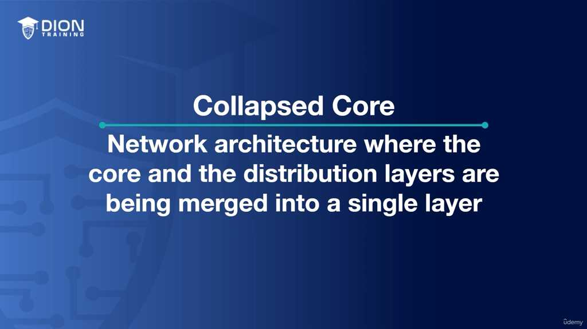 (Sơ đồ mô tả luồng North-South đi qua Firewall/Router ở rìa mạng)

*   **East-West (Đông-Tây):** Là luồng dữ liệu di chuyển nội bộ bên trong Datacenter, giữa server này với server khác, hoặc giữa server với hệ thống lưu trữ (storage).
    *   **Tầm quan trọng:** Trong môi trường ảo hóa hiện đại, lưu lượng East-West chiếm tỷ trọng rất lớn (thường lên tới 70-80%). Kiến trúc Spine-Leaf được thiết kế tối ưu chính là để xử lý luồng dữ liệu "Đông-Tây" này một cách hiệu quả nhất, tránh việc phải đẩy dữ liệu ra biên (North-South) rồi mới quay ngược trở lại, vốn gây lãng phí băng thông và tăng độ trễ.

> **💡 Ví dụ nhớ đời:** Trong một nhà hàng (Datacenter), luồng North-South là khách hàng vào cửa để gọi món và nhân viên mang món ăn ra ngoài. Luồng East-West chính là việc các đầu bếp, phụ bếp và người rửa bát liên tục chuyển nguyên liệu cho nhau trong khu vực bếp. Nếu luồng East-West bị tắc nghẽn (bếp rối loạn), thì dù cửa ra vào (North-South) có rộng đến đâu, khách hàng cũng sẽ phải đợi rất lâu.

Trong cấu trúc mạng hiện đại, đặc biệt là kiến trúc **Spine-Leaf**, luồng dữ liệu giữa các máy chủ (server) trong cùng một trung tâm dữ liệu (datacenter) – ngay cả khi chúng kết nối qua các "Leaf switch" khác nhau – luôn được định nghĩa là **East-West traffic** (lưu lượng Đông-Tây). Khái niệm này cực kỳ quan trọng vì sự chuyển dịch mô hình vận hành mạng hiện nay.

Sự gia tăng mạnh mẽ của các công nghệ như **Software-Defined Networking (SDN)** (mạng điều khiển bằng phần mềm), **ảo hóa (virtualization)**, **đám mây riêng (private cloud)** và **mạng hội tụ (converged networks)** đã làm thay đổi bản chất của lưu lượng mạng. Thay vì dữ liệu chủ yếu đi ra ngoài (như mô hình client-server truyền thống), ngày nay, khối lượng lớn dữ liệu di chuyển nội bộ để hỗ trợ việc giao tiếp giữa các máy chủ ảo, các container và các dịch vụ microservices. Điều này khiến phần lớn lưu lượng hiện nay đều là East-West, bất kể bạn đang chạy tại chỗ (on-premises) hay trên các nền tảng đám mây công cộng như AWS, Azure hoặc Google Cloud Platform.

Để phân loại lưu lượng theo hướng di chuyển, hãy ghi nhớ ba trục chính sau:

1.  **Southbound traffic (Lưu lượng Nam):** Là dữ liệu đi từ bên ngoài vào trong trung tâm dữ liệu. Hãy hình dung nó giống như khách hàng đi qua cổng chính của một tòa nhà để vào làm việc.
2.  **Northbound traffic (Lưu lượng Bắc):** Là dữ liệu rời khỏi trung tâm dữ liệu để đi ra bên ngoài (Internet hoặc các mạng khác). Đây là quá trình tòa nhà gửi phản hồi hoặc hàng hóa ra bên ngoài.
3.  **East-West traffic (Lưu lượng Đông-Tây):** Là lưu lượng di chuyển nội bộ giữa các thiết bị bên trong trung tâm dữ liệu. Đây là quá trình các phòng ban trong cùng một tòa nhà gửi email, tài liệu hoặc chia sẻ dữ liệu qua lại với nhau.

> **💡 Ví dụ nhớ đời:** Hãy tưởng tượng trung tâm dữ liệu của bạn là một **Siêu thị lớn**.
> * **Southbound:** Khách hàng từ ngoài đường đi vào cửa siêu thị.
> * **Northbound:** Hàng hóa đã bán xong, xe tải vận chuyển rời khỏi kho của siêu thị để đến tay khách hàng.
> * **East-West:** Nhân viên kho vận chuyển hàng từ kho ra kệ, hoặc nhân viên quầy thực phẩm trao đổi hàng hóa với quầy tạp hóa để bù trừ hàng tồn kho. Lưu lượng "East-West" là luồng công việc nội bộ khổng lồ giúp siêu thị vận hành trơn tru mà khách hàng ở bên ngoài hoàn toàn không thấy được.

Dù bạn đang sử dụng mô hình nào: **Three-tiered truyền thống** (phân tầng), **Collapsed core** (lõi rút gọn) hay **Spine-leaf** (kiến trúc hiện đại), thì việc nắm vững cách luồng dữ liệu (traffic flow) di chuyển là yêu cầu bắt buộc đối với một kỹ sư mạng.

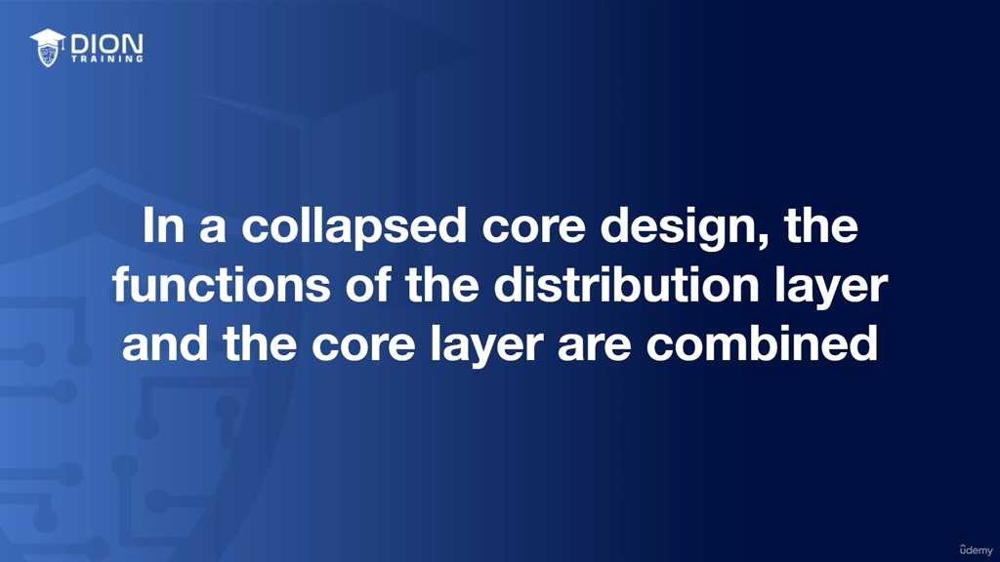

Việc chọn lựa cấu trúc hạ tầng không bao giờ có đáp án "đúng" tuyệt đối cho mọi trường hợp, mà nó phụ thuộc hoàn toàn vào **bài toán kinh doanh (business case)** và **nhu cầu của tổ chức**.
* Nếu doanh nghiệp cần khả năng mở rộng cực lớn và độ trễ thấp cho các dịch vụ đám mây, **Spine-Leaf** là lựa chọn tối ưu.
* Nếu doanh nghiệp có quy mô nhỏ, ngân sách hạn chế, mô hình **Collapsed core** có thể là giải pháp kinh tế và dễ quản lý hơn.

Do đó, trước khi thiết kế bất kỳ hệ thống mạng nào, bạn phải phân tích kỹ xem dữ liệu sẽ đi đâu nhiều nhất, khối lượng công việc nào là chủ chốt, và khả năng phát triển trong tương lai ra sao. Không có công nghệ "vạn năng", chỉ có giải pháp phù hợp nhất với nhu cầu thực tế của tổ chức.

### Hình ảnh minh họa thêm:

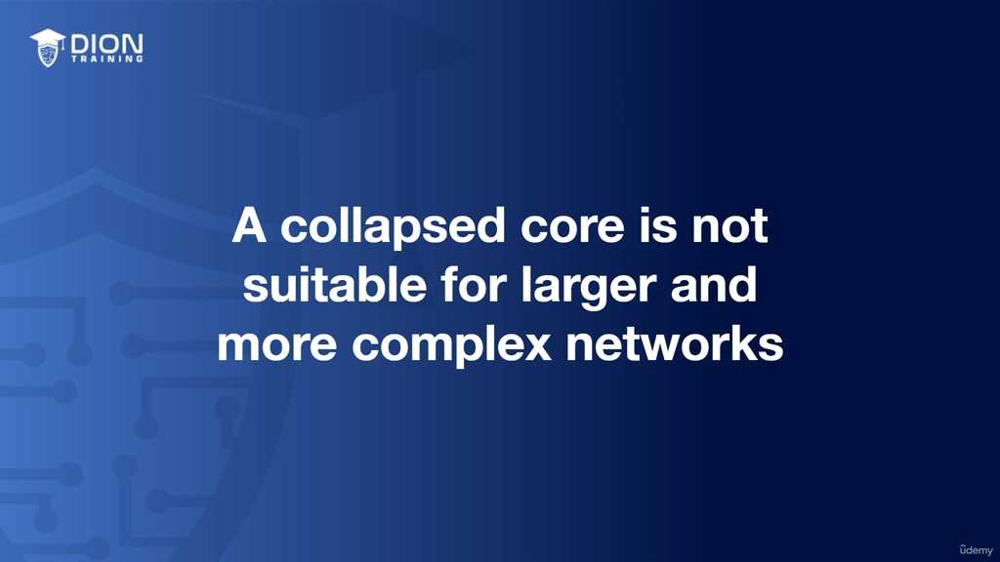
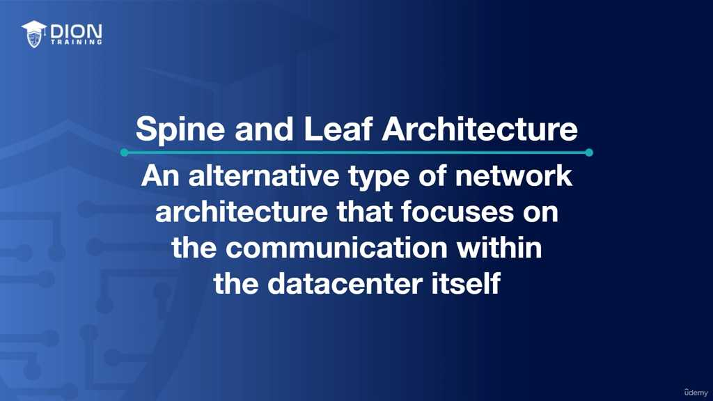
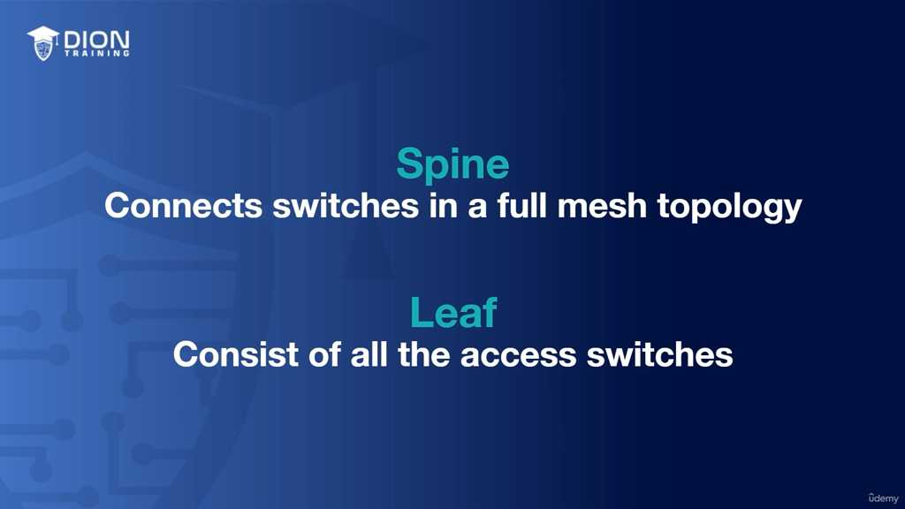
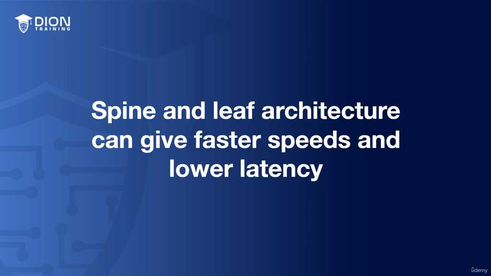
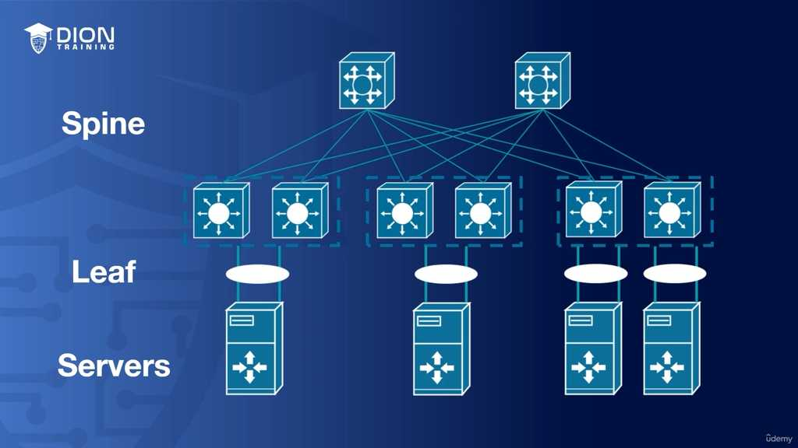
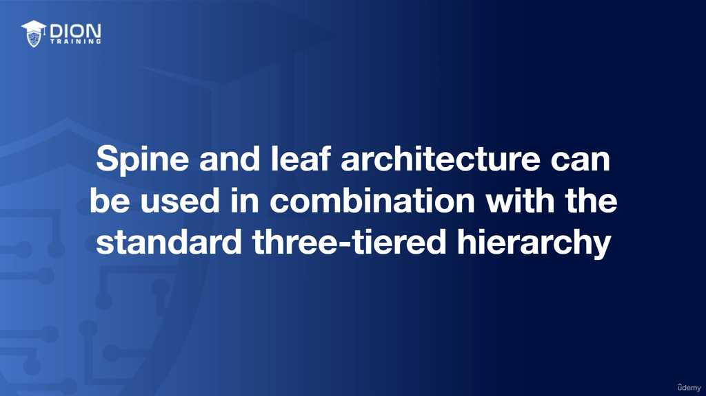
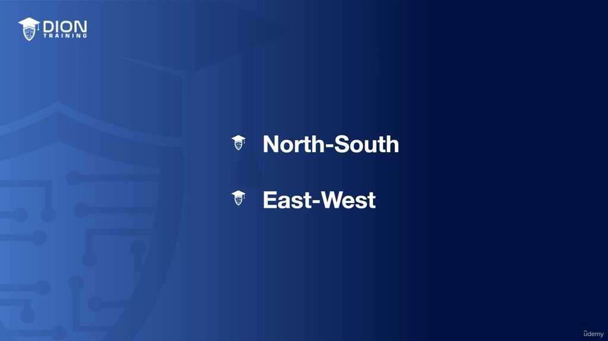
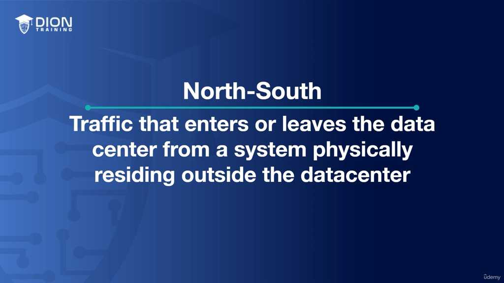
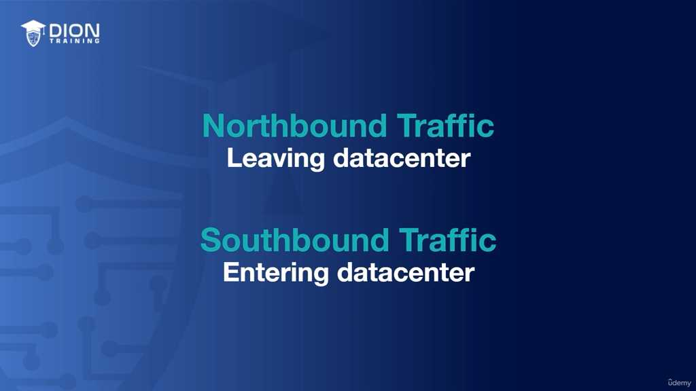
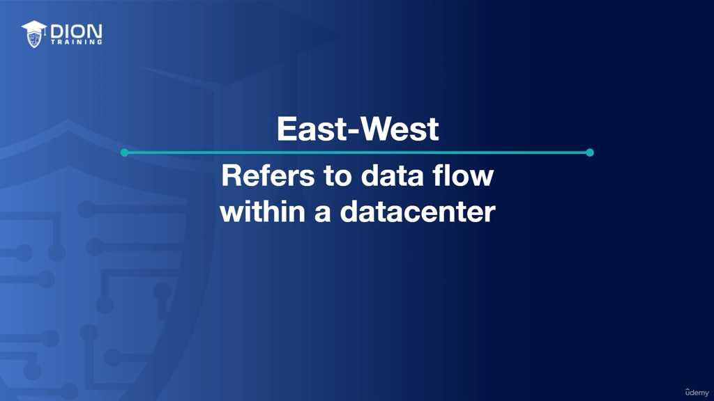
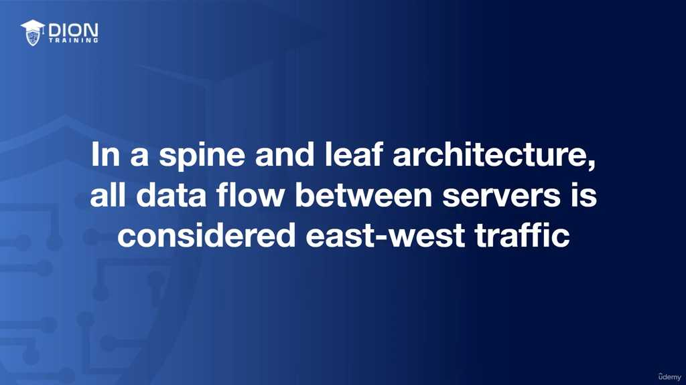
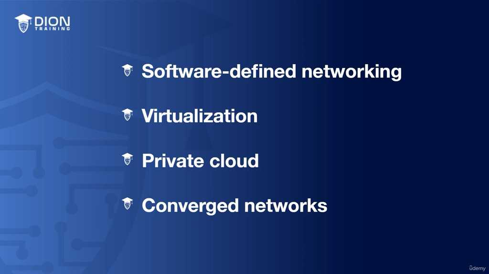
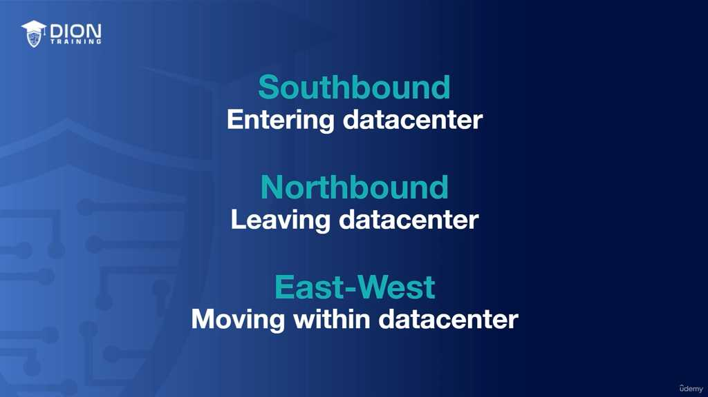

---
*Ghi chú: 24 hình ảnh minh họa (.jpg) đã được tải về và lưu tự động vào thư mục con `image/` cùng cấp với file này. Để ảnh hiển thị tự động, hãy đảm bảo bạn sao chép cả thư mục `image/` nếu bạn muốn di chuyển file markdown sang nơi khác!*
