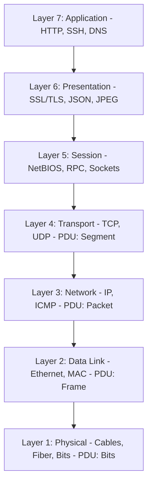

# 🌐 Mô Hình 7 Tầng OSI & Chuẩn TCP/IP (OSI Model Deep Dive) - Chuyên Sâu Mạng Máy Tính Cho DevOps

> 💡 **Bản chất 1 câu**: Phân tích bản chức năng và dữ liệu của 7 tầng mô hình OSI (Physical, Data Link, Network, Transport, Session, Presentation, Application).  
> 🎯 **Trọng tâm thực chiến DevOps**: Thành thạo 7 tầng OSI, đơn vị dữ liệu PDU tương ứng từng tầng và cách debug sự cố mạng theo từng tầng từ L1 đến L7.

---

## 1. 🧠 Hình Hình Dung Nhanh (Intuitive Mindset)

Mô hình 7 tầng OSI như quy trình gửi một bức thư quan trọng: L7 viết nội dung thư, L6 dịch sang tiếng Anh, L5 gọi điện hẹn giờ gửi, L4 đóng vào phong bì có mã số bảo đảm, L3 ghi địa chỉ nhà, L2 dán tem mã bưu chính, L1 trao cho người đưa thư chạy xe trên đường.

---

## 2. 📚 Lý Thuyết Chuyên Sâu & Bản Chất Mạng (Under The Hood Architecture)

### 2.1 Chi Tiết 7 Tầng Mô Hình Tham Chiếu OSI (Open Systems Interconnection)



| Tầng OSI | Tên Tầng (Layer) | Đơn vị dữ liệu (PDU) | Địa chỉ định danh | Thiết bị / Giao thức tiêu biểu |
| :--- | :--- | :--- | :--- | :--- |
| **Layer 7** | **Application** | Data | Data | HTTP, HTTPS, SSH, DNS, SMTP, FTP |
| **Layer 6** | **Presentation** | Data | Format / Encryption | SSL/TLS, ASCII, UTF-8, JSON, PNG |
| **Layer 5** | **Session** | Data | Session ID | NetBIOS, RPC, Sockets |
| **Layer 4** | **Transport** | **Segment** (TCP) / **Datagram** (UDP) | Port (Cổng: 80, 443) | TCP, UDP (Điều khiển luồng & tin cậy) |
| **Layer 3** | **Network** | **Packet** | IP Address (10.0.0.1) | Router, L3 Switch, IP, ICMP, IPsec |
| **Layer 2** | **Data Link** | **Frame** | MAC Address (AA:BB:CC) | Switch L2, NIC, Ethernet 802.3, Wi-Fi |
| **Layer 1** | **Physical** | **Bits** (010101) | Signals / Voltage | Cáp đồng, Cáp quang, Hub, Transceiver |

---

### 2.2 Quy Trình Debug Sự Cố Mạng Theo Phương Pháp Bottom-Up (L1 -> L7)
1. **Debug Layer 1**: Đèn link card mạng có sáng không? Cáp có bị rút không? (`ip link`)
2. **Debug Layer 2**: Đã nhận địa chỉ MAC chưa? Có đúng VLAN không? (`ip neighbor`)
3. **Debug Layer 3**: Đã gán đúng IP/Gateway chưa? Ping được Gateway không? (`ping`, `ip route`)
4. **Debug Layer 4**: Port có mở không? Có bị Firewall chặn Port không? (`nc -zvw3`, `ss -tulpn`)
5. **Debug Layer 7**: Application/Web Server có phản hồi đúng 200 OK không? (`curl -I`)


---

## 3. ⚡ Bảng Tra Cứu Câu Lệnh & Khái Niệm Thực Hành (Reference Table)

| Công cụ / Lệnh / Khái niệm | Tham số / Flag / Protocol | Giải thích ý nghĩa chi tiết | Ứng dụng thực tế trong DevOps / Network |
| :--- | :--- | :--- | :--- |
| **`Layer 1 Physical`** | `Bits` | Tín hiệu điện/quang/sóng vô tuyến | `Cáp UTP, SFP Transceiver` |
| **`Layer 2 Data Link`** | `Frame` | Chuyển mạch dựa theo địa chỉ MAC | `Ethernet Switch, Cạc mạng NIC` |
| **`Layer 3 Network`** | `Packet` | Định tuyến dựa theo địa chỉ IP | `Router, IP, ICMP` |
| **`Layer 4 Transport`** | `Segment` | Điều khiển kết nối theo số Port | `TCP, UDP` |
| **`Layer 7 Application`** | `Data` | Giao diện ứng dụng người dùng | `HTTP, SSH, DNS, Nginx` |


---

## 4. 🛠 Thao Tác Thực Chiến & Kịch Bản DevOps (Real-World Scenarios)

### 🛠 Các lệnh thực hành gõ là ăn ngay:
```bash
# Phương pháp Debug Bottom-Up chuẩn DevOps:
# 1. Check L1/L2 link:
ip link show eth0
# 2. Check L3 IP & Gateway:
ip addr show && ip route
# 3. Check L3 connectivity:
ping -c 3 8.8.8.8
# 4. Check L4 Port:
nc -zvw3 google.com 443
# 5. Check L7 HTTP App:
curl -Iv https://google.com
```

### 🚀 Kịch bản xử lý sự cố thực tế khi đi làm:
Sự cố Web App báo lỗi 504 Gateway Timeout:
# Phân tích theo OSI: L1-L3 OK (ping thông), L4 OK (Port 80 mở), L7 Nginx ngốn timeout do App backend xử lý quá chậm.

---

## 5. 🚀 Bộ Câu Hỏi Phỏng Vấn DevOps & Network Thực Tế (Interview Q&A)

> **Q: Đơn vị dữ liệu (PDU) tại Layer 2, Layer 3 và Layer 4 lần lượt tên là gì?**  
> **A**: Layer 2 là **Frame**, Layer 3 là **Packet**, Layer 4 là **Segment** (với TCP) hoặc Datagram (với UDP).

> **Q: Tại sao kỹ sư DevOps nên thuộc lòng mô hình OSI khi troubleshooting?**  
> **A**: Để có phương pháp debug hệ thống bài bản (Bottom-Up từ L1 đến L7), tránh đoán mò làm lãng phí thời gian.


---

## 6. 📝 Cheat Sheet & Ghi Nhớ Nhanh (Summary)

- [x] L1 Physical: Bits
- [x] L2 Data Link: Frame & MAC Address
- [x] L3 Network: Packet & IP Address
- [x] L4 Transport: Segment & Ports
- [x] L7 Application: Data & HTTP/SSH
- [x] Debug Bottom-Up: L1 -> L7

