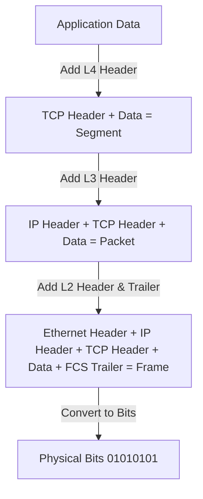

# 🌐 Quá Trình Đóng Gói (Encapsulation) & Giải Gói (Decapsulation) Dữ Liệu - Chuyên Sâu Mạng Máy Tính Cho DevOps

> 💡 **Bản chất 1 câu**: Phân tích cơ chế Kernel đóng gói dữ liệu (Encapsulation) từ L7 xuống L1 khi gửi và giải gói (Decapsulation) từ L1 lên L7 khi nhận.  
> 🎯 **Trọng tâm thực chiến DevOps**: Hiểu rõ Header được thêm vào từng tầng: Application Data -> TCP Header (Ports) -> IP Header (IPs) -> Ethernet Header/Trailer (MACs & FCS) -> Bits.

---

## 1. 🧠 Hình Hình Dung Nhanh (Intuitive Mindset)

Đóng gói dữ liệu như dán nhãn qua nhiều tầng bưu điện: L4 dán nhãn Mã số cổng (Port), L3 dán nhãn Địa chỉ nhà (IP), L2 bọc thùng gỗ dán nhãn Mã xe tải (MAC) và kiểm tra hàng vỡ (FCS CRC).

---

## 2. 📚 Lý Thuyết Chuyên Sâu & Bản Chất Mạng (Under The Hood Architecture)

### 2.1 Quá Trình Đóng Gói Dữ Liệu (Encapsulation Flow)



1. **Tầng 7-5 (Data)**: Ứng dụng tạo ra dữ liệu văn bản/HTML thuần túy (`Data`).
2. **Tầng 4 (Transport - Encapsulation)**:
   - Thêm **TCP Header** chứa: `Source Port` (ví dụ: 54321), `Destination Port` (80/443), `Sequence Number`, `Window Size`.
   - Kết quả tạo thành **Segment**.
3. **Tầng 3 (Network - Encapsulation)**:
   - Thêm **IP Header** chứa: `Source IP` (192.168.1.10), `Destination IP` (142.250.1.1), `TTL` (Time to Live), `Protocol` (TCP=6, UDP=17).
   - Kết quả tạo thành **Packet**.
4. **Tầng 2 (Data Link - Encapsulation)**:
   - Thêm **Ethernet Header** chứa: `Source MAC` (Cạc mạng nguồn), `Destination MAC` (Router Gateway MAC), `EtherType` (0x0800 cho IPv4).
   - Thêm **Ethernet Trailer** chứa: **FCS (Frame Check Sequence)** sử dụng thuật toán **CRC32** để phát hiện lỗi hỏng dữ liệu trên đường truyền.
   - Kết quả tạo thành **Frame**.
5. **Tầng 1 (Physical)**: Chuyển đổi Frame thành chuỗi xung điện/quang `Bits` bắn đi trên dây cáp.

---

### 2.2 Quá Trình Giải Gói Dữ Liệu (Decapsulation Flow Tại Máy Nhận)
- Máy nhận đón nhận Bits từ L1 -> Kiểm tra FCS CRC tại L2 (nếu khớp thì bóc Ethernet Header) -> Kiểm tra IP đích tại L3 (nếu đúng IP thì bóc IP Header) -> Kiểm tra Port tại L4 (chuyển Segment vào socket ứng dụng) -> L7 nhận Data thuần túy.


---

## 3. ⚡ Bảng Tra Cứu Câu Lệnh & Khái Niệm Thực Hành (Reference Table)

| Công cụ / Lệnh / Khái niệm | Tham số / Flag / Protocol | Giải thích ý nghĩa chi tiết | Ứng dụng thực tế trong DevOps / Network |
| :--- | :--- | :--- | :--- |
| **`Header`** | `Dữ liệu bổ sung ở đầu PDU` | Chứa địa chỉ và thông số kiểm soát của tầng đó | `IP Header chứa Source/Destination IP` |
| **`Trailer / FCS`** | `Dữ liệu bổ sung ở cuối L2 Frame` | Frame Check Sequence dùng CRC32 để kiểm tra lỗi | `Tự động thả (drop) Frame bị lỗi nhiễu dây` |
| **`TTL`** | `Time to Live trong IP Header` | Số hop tối đa gói tin được đi trước khi bị hủy | `Ngăn ngừa gói tin bị lặp vô tận (Routing Loop)` |


---

## 4. 🛠 Thao Tác Thực Chiến & Kịch Bản DevOps (Real-World Scenarios)

### 🛠 Các lệnh thực hành gõ là ăn ngay:
```bash
# Xem cấu trúc Header các tầng thực tế bằng tcpdump bắt gói tin:
sudo tcpdump -i eth0 -nn -vvv -c 1 tcp port 80
```

### 🚀 Kịch bản xử lý sự cố thực tế khi đi làm:
Sự cố Frame bị drop liên tục ở Layer 2 do cáp đứt ngầm nhiễu tín hiệu:
# Kiểm tra số lượng lỗi CRC/FCS trên cạc mạng:
ethtool -S eth0 | grep -i error

---

## 5. 🚀 Bộ Câu Hỏi Phỏng Vấn DevOps & Network Thực Tế (Interview Q&A)

> **Q: Thành phần nào nằm ở cuối Ethernet Frame (Layer 2 Trailer) dùng để kiểm tra lỗi dữ liệu hỏng trên đường truyền?**  
> **A**: Thành phần **FCS (Frame Check Sequence)** sử dụng thuật toán kiểm tra mã dư thừa vòng **CRC32**.

> **Q: Trường TTL (Time to Live) nằm trong Header của tầng nào và có tác dụng gì?**  
> **A**: Nằm trong **IP Header (Layer 3)**, dùng để giảm dần số hop mỗi khi qua Router nhằm triệt tiêu gói tin bị lặp vô hạn do vòng lặp routing.


---

## 6. 📝 Cheat Sheet & Ghi Nhớ Nhanh (Summary)

- [x] L4 thêm Port Header -> Segment
- [x] L3 thêm IP Header -> Packet
- [x] L2 thêm MAC Header & FCS Trailer -> Frame
- [x] L1 đổi Frame thành Bits
- [x] Decapsulation: Bóc tách từng lớp từ L1 lên L7

