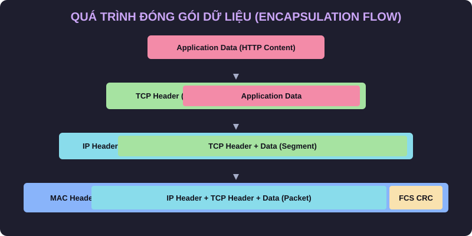
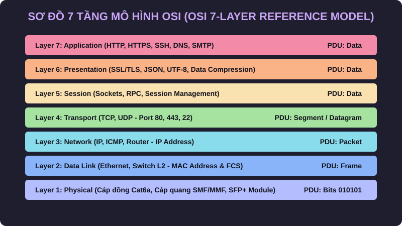
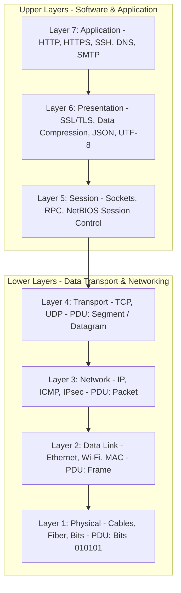
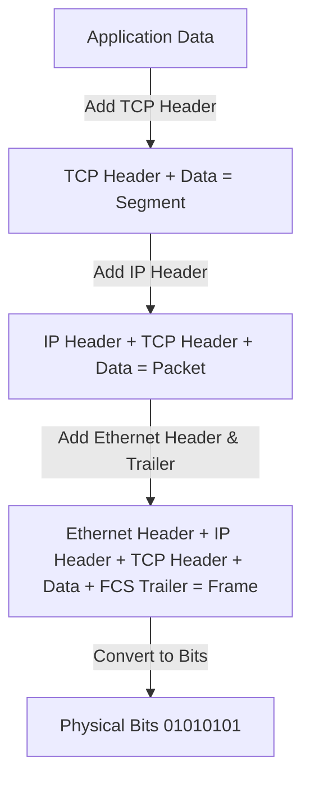
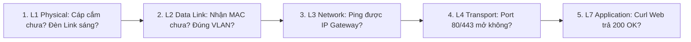

# 🌐 Module 02: Mô Hình 7 Tầng OSI & Quá Trình Đóng Gói Dữ Liệu (OSI Model & Encapsulation)

> 💡 **Bản chất 1 câu**: Mô hình OSI là khung tham chiếu chuẩn hóa 7 tầng quy định cách dữ liệu được biến đổi từ văn bản ứng dụng (Layer 7) thành các xung điện bits (Layer 1) để truyền qua mạng.  
> 🎯 **Trọng tâm thực chiến DevOps**: Thành thạo 7 tầng OSI, đơn vị dữ liệu PDU tương ứng từng tầng, quá trình Đóng gói (Encapsulation) / Giải gói (Decapsulation) và phương pháp Troubleshooting bài bản Bottom-Up (từ L1 lên L7).

---




## 1. 🧠 Hình Hình Dung Nhanh Cho Người Mới (Intuitive Mindset)

Hãy tưởng tượng **Quá trình truyền dữ liệu qua mô hình OSI** giống như **Quy trình đóng gói gửi hàng qua dịch vụ Bưu điện Quốc tế**:
1. **Layer 7 (Application)**: Bạn viết nội dung bức thư (Data).
2. **Layer 6 (Presentation)**: Bức thư được dịch sang tiếng Anh và nén/mã hóa bí mật.
3. **Layer 5 (Session)**: Gọi điện thoại hẹn giờ cho nhân viên bưu điện tới lấy thư.
4. **Layer 4 (Transport)**: Đóng bức thư vào Phong bì loại A, dán nhãn **Mã số phòng gửi (Source Port)** và **Mã số phòng nhận (Destination Port)** để biết giao cho ai.
5. **Layer 3 (Network)**: Cho phong bì vào Hộp quà thứ 2, dán nhãn **Địa chỉ nhà gửi (Source IP)** và **Địa chỉ nhà nhận (Destination IP)**.
6. **Layer 2 (Data Link)**: Đặt hộp quà vào Thùng gỗ bảo vệ, dán nhãn **Mã số xe tải (Source/Destination MAC)** và kèm **Mã kiểm tra hàng vỡ (FCS CRC32)**.
7. **Layer 1 (Physical)**: Bốc thùng gỗ lên xe tải và chạy trên đường nhựa (Bits truyền qua cáp).
- Khi tới nơi, bên nhận làm ngược lại: Bóc từng lớp vỏ bọc từ L1 lên L7 để lấy bức thư ban đầu (Decapsulation)!

---


## 2. 📚 Lý Thuyết Chuyên Sâu & Bản Chất Hệ Thống (Under The Hood Architecture)

### 2.1 Chi Tiết 7 Tầng Mô Hình Tham Chiếu OSI


 (OBJ 1.1)



| Tầng OSI | Tên Tầng (Layer) | Đơn vị dữ liệu (PDU) | Địa chỉ định danh | Chức năng & Thiết bị tiêu biểu |
| :---


 | :---


 | :---


 | :---


 | :---


 |
| **Layer 7** | **Application** | Data | Application Protocol | Giao diện cho ứng dụng (HTTP, SSH, DNS, Nginx, Apache) |
| **Layer 6** | **Presentation** | Data | Format / Syntax | Mã hóa/Giải mã SSL/TLS, nén dữ liệu, định dạng JSON/PNG |
| **Layer 5** | **Session** | Data | Session ID | Thiết lập, duy trì và giải phóng phiên kết nối (Sockets, RPC) |
| **Layer 4** | **Transport** | **Segment** (TCP) / **Datagram** (UDP) | Port Number (Cổng: 80, 443) | Điều khiển kết nối tin cậy, chia nhỏ gói tin, TCP/UDP |
| **Layer 3** | **Network** | **Packet** | IP Address (10.0.0.1) | Định tuyến gói tin xuyên mạng (Router, IP, ICMP, IPsec) |
| **Layer 2** | **Data Link** | **Frame** | MAC Address (AA:BB:CC) | Chuyển mạch nội bộ LAN, kiểm tra lỗi FCS (Switch L2, NIC) |
| **Layer 1** | **Physical** | **Bits** (010101) | Signal / Voltage | Truyền xung điện/quang/sóng vô tuyến (Cáp UTP, SFP, Hub) |

---


### 2.2 Cơ Chế Đóng Gói (Encapsulation) & Giải Gói (Decapsulation)



1. **TCP Header (Layer 4)**: Chứa `Source Port` (ví dụ: 54321), `Destination Port` (443), `Sequence Number`, `Window Size`.
2. **IP Header (Layer 3)**: Chứa `Source IP` (192.168.1.10), `Destination IP` (142.250.1.1), `TTL` (Time to Live), `Protocol` (TCP=6, UDP=17).
3. **Ethernet Header (Layer 2)**: Chứa `Source MAC`, `Destination MAC`, `EtherType` (0x0800 cho IPv4).
4. **Ethernet Trailer (Layer 2)**: Chứa **FCS (Frame Check Sequence)** sử dụng thuật toán **CRC32** để phát hiện lỗi nhiễu đường truyền. Nếu CRC không khớp, Switch/Card mạng sẽ tự động thả (drop) Frame ngay lập tức!

---


### 2.3 Quy Trình Troubleshooting Chuẩn Bottom-Up (L1 -> L7)



---


### 2.4 Cơ Chế Hoạt Động Bên Dưới Kernel & Kiến Trúc Hệ Thống Chi Tiết (Deep Under The Hood Architecture)
- **Tầng Giao Tiếp Mạng & Bắt Gói Tin**: Mọi gói tin đi qua Network Interface Card (NIC) đều trải qua quá trình xử lý Ring Buffer, ngắt phần cứng (Hardware Interrupts), Ring Buffer DMA và chồng giao thức Socket Buffers (`sk_buff`) trong Linux Kernel.
- **Tối Ưu Hóa & Cấu Trúc Dữ Liệu**: Hệ thống duy trì các bảng băm dữ liệu (Routing Table, ARP Cache Table, Connection Tracking Table `conntrack`, Socket Inode Tables) giúp chuyển tiếp gói tin ở tốc độ dây (Line-rate processing).
- **Phân Lập An Ninh & Phân Vùng**: Sử dụng cơ chế Linux Network Namespaces (`ip netns`), iptables/nftables hooks và mã hóa phần cứng để cách ly lưu lượng mạng tuyệt đối.

---

## 3. ⚡ Bảng Tra Cứu Khái Niệm & Lệnh Thực Hành (Reference Table)

| Khái niệm / Lệnh | Tầng OSI | Ý nghĩa chi tiết | Lệnh thực hành tương ứng |
| :---


 | :---


 | :---


 | :---


 |
| **`Frame`** | Layer 2 | Đơn vị dữ liệu L2 chứa MAC Header & FCS Trailer | `ip neighbor show` |
| **`Packet`** | Layer 3 | Đơn vị dữ liệu L3 chứa IP Header & TTL | `ping -c 3 8.8.8.8` |
| **`Segment`** | Layer 4 | Đơn vị dữ liệu L4 chứa TCP Header & Port Numbers | `ss -tulpn` |
| **`FCS / CRC32`** | Layer 2 | Chuỗi kiểm tra phát hiện lỗi dữ liệu hỏng | `ethtool -S eth0 | grep crc` |
| **`TTL`** | Layer 3 | Time to Live - Giảm 1 mỗi qua Router để tránh loop | `traceroute -n 8.8.8.8` |

---


## 4. 🛠 Thao Tác Thực Chiến & Kịch Bản DevOps

### 🛠 Thực hành chẩn đoán theo từng tầng OSI:
```bash
# Step 1 (L1/L2 Check): Kiểm tra trạng thái cáp mạng vật lý và tốc độ kết nối:
ethtool eth0

# Step 2 (L2 Check): Kiểm tra xem cạc mạng có bị lỗi CRC (Frame Check Sequence) do cáp hỏng không:
ethtool -S eth0 | grep -i error

# Step 3 (L3 Check): Kiểm tra IP và Ping thử Default Gateway:
ip route show
ping -c 3 192.168.1.1

# Step 4 (L4 Check): Kiểm tra xem Port 443 trên Server có mở không:
nc -zvw3 google.com 443

# Step 5 (L7 Check): Kiểm tra phản hồi ứng dụng HTTP:
curl -Iv https://google.com
```

---


### 4.2 Chi Tiết Các Lỗi Thường Gặp & Kịch Bản Khắc Phục Lỗi (Troubleshooting Deep-Dive)
1. **Sự cố 1: Lỗi Mất Gói Tin & Mất Kết Nối Cổng Mạng (Packet Loss & Port Unreachable)**:
   - **Triệu chứng**: Gửi HTTP Request bị Timeout, SSH không kết nối được hoặc gói tin bị nảy rải rác.
   - **Các bước xử lý khẩn cấp**:
     ```bash
     # 1. Kiểm tra trạng thái cổng mạng TCP/UDP đang lắng nghe:
     sudo ss -tulpn | grep :80
     
     # 2. Bắt gói tin trực tiếp trên Interface để kiểm tra bắt tay 3 bước TCP:
     sudo tcpdump -i eth0 port 80 -nn -vv
     
     # 3. Phân tích đường đi của gói tin tìm điểm đứt gãy bằng MTR:
     mtr -n --report --report-cycles=10 8.8.8.8
     
     # 4. Kiểm tra xem gói tin có bị Firewall Drop không:
     sudo iptables -L -n -v | grep DROP
     ```

2. **Sự cố 2: Lỗi Sai Cấu Hình DNS & Chuyển Tiếp IP (DNS Resolution & IP Routing Error)**:
   - **Triệu chứng**: Ping IP thành công nhưng ping Domain Name báo `Could not resolve host`.
   - **Các bước xử lý khẩn cấp**:
     ```bash
     # 1. Tra cứu thử nghiệm phân giải DNS qua server cụ thể:
     dig @8.8.8.8 company.com +trace
     
     # 2. Kiểm tra file cấu hình DNS resolver địa phương:
     cat /etc/resolv.conf
     
     # 3. Kiểm tra bảng định tuyến Kernel IP Routing Table:
     ip route show default
     ```

---

## 5. 🚀 Bộ Câu Hỏi Phỏng Vấn DevOps & Network Thực Tế (Interview Q&A)

> **Q: Đơn vị dữ liệu (PDU) tại Layer 2, Layer 3 và Layer 4 lần lượt tên là gì?**  
> **A**: Đơn vị dữ liệu PDU tại Layer 2 là **Frame**, tại Layer 3 là **Packet**, tại Layer 4 là **Segment** (đối với TCP) hoặc Datagram (đối với UDP).

> **Q: Trường FCS (Frame Check Sequence) nằm ở đâu và đóng vai trò gì trong quá trình truyền tin?**  
> **A**: FCS nằm ở phần đuôi (Trailer) của **Ethernet Frame ở Layer 2**. Nó sử dụng thuật toán kiểm tra mã dư thừa vòng **CRC32** để giúp cạc mạng phát hiện gói tin có bị nhiễu hỏng dữ liệu trên đường truyền hay không. Nếu hỏng, Frame sẽ bị âm thầm thả (drop).


> **Q: Làm thế nào để điều tra và dập tắt sự cố một Server bị tấn công làm tràn bộ đệm kết nối TCP SYN Flood DoS?**  
> **A**:  
> 1. **Nhận biết**: Lệnh `ss -ant | grep SYN_RECV | wc -l` trả về hàng ngàn kết nối ở trạng thái `SYN_RECV`.  
> 2. **Xử lý khẩn cấp**: Bật ngay cơ chế **SYN Cookies** của Linux Kernel bằng lệnh `sudo sysctl -w net.ipv4.tcp_syncookies=1`. Kích hoạt bộ lọc Firewall drop các gói tin SYN có tần suất bất thường: `sudo iptables -A INPUT -p tcp --syn -m limit --limit 1/s --limit-burst 3 -j ACCEPT`.

> **Q: Sự khác biệt về mặt bản chất giữa Stateful Firewall và Stateless Firewall là gì?**  
> **A**: Stateless Firewall chỉ kiểm tra từng gói tin riêng rẻ dựa trên IP nguồn/đích và Port mà KHÔNG nhớ ngữ cảnh. Stateful Firewall duy trì một bảng theo dõi trạng thái kết nối (**Connection Tracking Table `conntrack`**), tự động nhận diện gói tin thuộc về một kết nối hợp lệ đã được chấp nhận trước đó (như trạng thái `ESTABLISHED,RELATED`), giúp bảo mật và tối ưu hiệu năng vượt trội.

---


## 6. 📝 Cheat Sheet Ghi Nhớ Nhanh (Summary)

- [x] **L1 Physical**: Bits, Cáp đồng/quang, SFP Module.
- [x] **L2 Data Link**: Frame, MAC Address, Switch L2, FCS CRC32 check error.
- [x] **L3 Network**: Packet, IP Address, Router, ICMP Ping, TTL field.
- [x] **L4 Transport**: Segment, TCP/UDP, Port Numbers (80, 443, 22).
- [x] **L7 Application**: Data, HTTP, HTTPS, SSH, DNS.
- [x] **Bottom-Up Debug**: L1 (Link) -> L2 (MAC) -> L3 (IP) -> L4 (Port) -> L7 (App).
