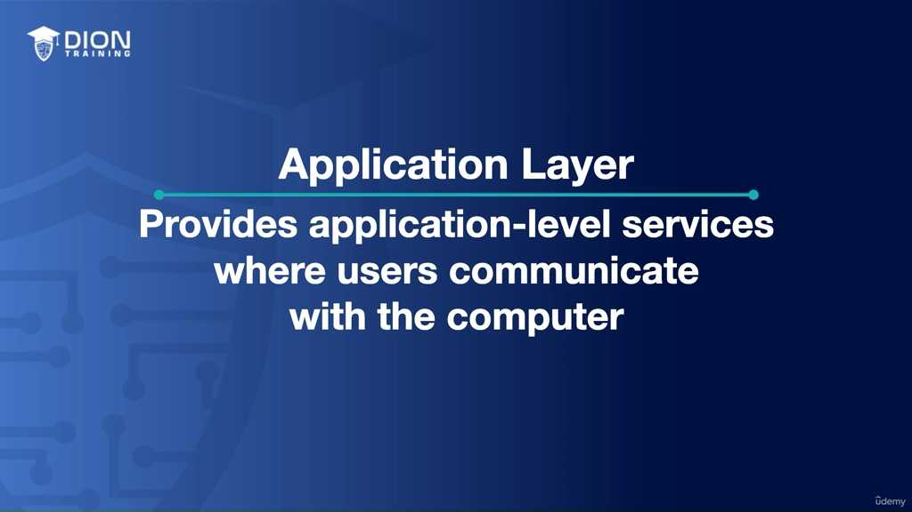
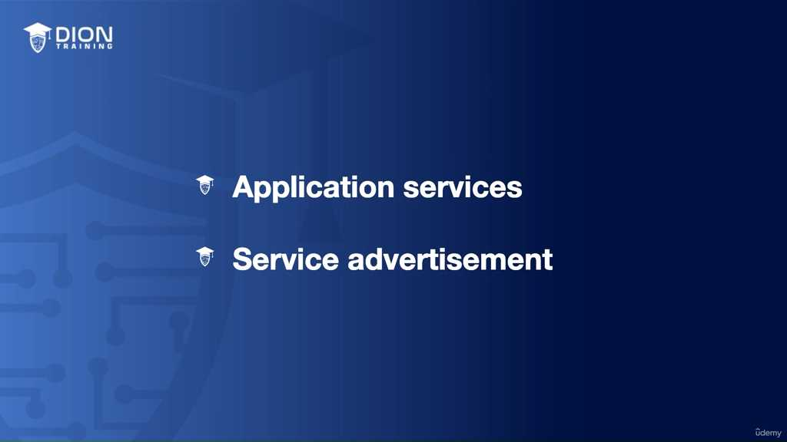
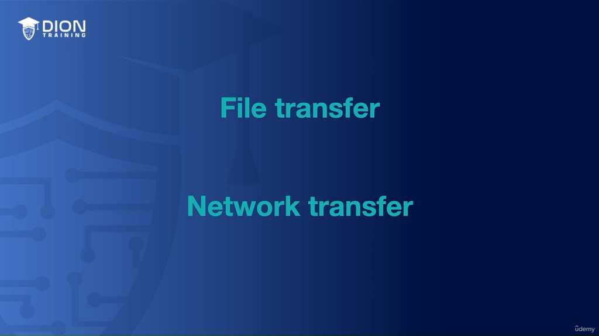
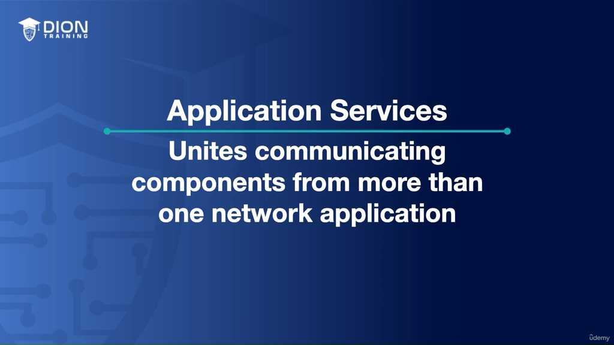
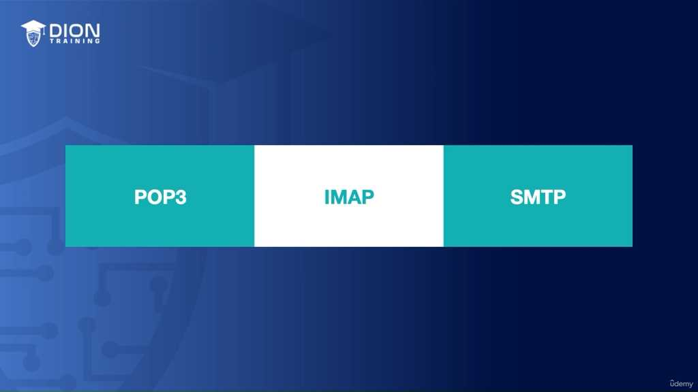
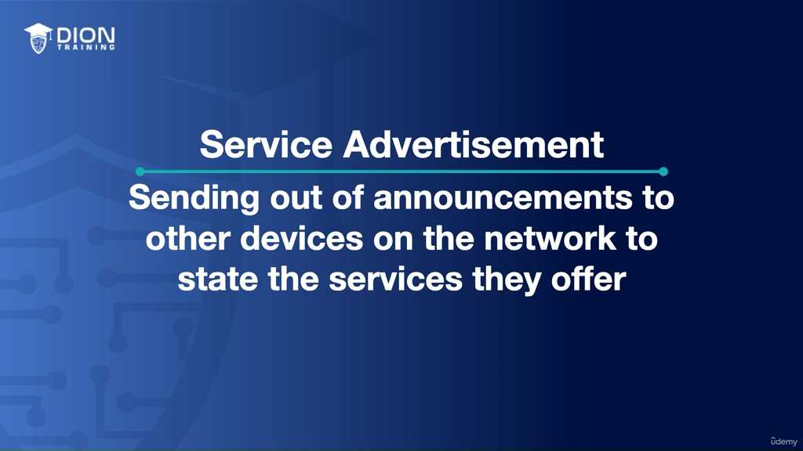
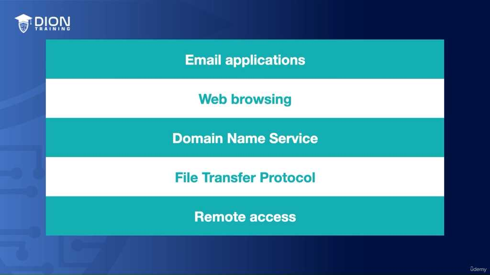

# Application Layer Overview

### CHƯƠNG: TẦNG ỨNG DỤNG (APPLICATION LAYER - LAYER 7)

Trong mô hình OSI (Open Systems Interconnection), **Tầng 7 (Application Layer)** là tầng cuối cùng và gần gũi nhất với người dùng. Đây là điểm cuối của mô hình, nơi giao tiếp giữa người dùng và mạng máy tính diễn ra.

---

### 1. Bản chất của Tầng Ứng dụng (Layer 7)
Mặc dù tên gọi là "Tầng Ứng dụng", nhưng cần phân biệt rõ ràng giữa **phần mềm người dùng** và **ứng dụng mạng**:
*   **Không phải là phần mềm người dùng:** Khi nhắc đến Layer 7, tuyệt đối không được nghĩ đến các trình duyệt như Chrome, Internet Explorer hay các phần mềm văn phòng như Word, PowerPoint, Notepad. Đây chỉ là các chương trình chạy *trên* hệ điều hành.
*   **Là các dịch vụ cấp thấp (Lower-level services):** Trong ngữ cảnh mạng OSI, tầng này tập trung vào các giao thức và quy trình cho phép máy tính trao đổi dữ liệu như: truyền tệp (file transfer), truyền tải mạng, quản lý thiết bị, và truy cập từ xa.
*   **Chức năng chính:** Đây là nơi người dùng tương tác với máy tính, và máy tính thực hiện các tác vụ chuyển đổi thông tin đó để đóng gói và gửi đi qua môi trường mạng.

> **💡 Ví dụ nhớ đời:** Hãy tưởng tượng bạn đang viết một lá thư tay (Dữ liệu người dùng). Tầng Ứng dụng không phải là cây bút hay tờ giấy bạn đang cầm, mà là "Dịch vụ bưu điện" – nơi tiếp nhận lá thư, kiểm tra địa chỉ, dán tem và đảm bảo lá thư đó được hệ thống chuyển phát hiểu và gửi đi đúng cách.

---

### 2. Các chức năng cốt lõi của Tầng Ứng dụng

#### A. Application Services (Dịch vụ Ứng dụng)
Đây là các dịch vụ thống nhất các thành phần giao tiếp cho nhiều ứng dụng mạng khác nhau. Nó cung cấp nền tảng để các tiến trình mạng hoạt động, bao gồm:
*   Truyền và chia sẻ tệp (File transfer & sharing).
*   Thư điện tử (Email).
*   Truy cập từ xa (Remote access).
*   Quản lý mạng (Network management).
*   Các tiến trình Client-Server.

**Lưu ý quan trọng:** Khi nói về Email ở Layer 7, ta không nói đến giao diện Microsoft Outlook, mà nói đến các **giao thức cấp thấp** (low-level protocols) vận hành bên dưới:
*   **POP3 (Post Office Protocol 3):** Giao thức tải email từ máy chủ về thiết bị.
*   **IMAP (Internet Message Access Protocol):** Giao thức quản lý email trực tiếp trên máy chủ.
*   **SMTP (Simple Mail Transfer Protocol):** Giao thức dùng để gửi email.

> **💡 Ví dụ nhớ đời:** Nếu bạn là một giám đốc (người dùng), thì Outlook chính là thư ký của bạn. Nhưng khi thư ký gửi thư đi, cô ấy phải tuân thủ quy định của Bưu điện (giao thức SMTP). Tầng 7 chính là bộ quy định của Bưu điện đó, đảm bảo mọi lá thư đều được gửi theo đúng chuẩn mực để máy chủ nhận có thể "đọc" được.

#### B. Service Advertisement (Quảng bá dịch vụ)
Đây là cơ chế mà các thiết bị/ứng dụng chủ động thông báo cho các thiết bị khác trong mạng về các dịch vụ mà chúng cung cấp.

*   **Cách thức:** Ứng dụng gửi các bản tin (announcement) vào mạng để thông báo khả năng của mình.
*   **Vai trò của Active Directory:** Trong môi trường doanh nghiệp, Active Directory (AD) thường đóng vai trò trung tâm để quản lý và quảng bá các dịch vụ như máy in, máy chủ tệp (file server).
*   **Tự quảng bá (Self-advertisement):** Nếu không có AD, các thiết bị có thể tự phát tín hiệu để các thiết bị khác nhận diện.

> **💡 Ví dụ nhớ đời:** Hãy tưởng tượng bạn bước vào một buổi tiệc (Mạng LAN). Bạn vừa bước vào cửa, một người phục vụ (Máy in không dây) lập tức chạy đến đưa danh thiếp cho bạn: "Chào bạn, tôi là người phục vụ đồ uống, nếu bạn khát, hãy gọi tôi nhé!". Đó chính là sự quảng bá dịch vụ.

---

### 3. Danh sách các giao thức điển hình tại Layer 7
Để đạt được sự thông thạo cho kỳ thi, bạn cần ghi nhớ các giao thức quan trọng này.

*   **Email:** POP3, IMAP, SMTP.
*   **Duyệt Web:** HTTP (Hypertext Transfer Protocol), HTTPS (HTTP Secure).
*   **Phân giải tên miền:** DNS (Domain Name Service) – Dịch tên miền sang địa chỉ IP và ngược lại.
*   **Truyền tệp:** FTP (File Transfer Protocol), FTPS, SFTP.
*   **Truy cập từ xa:** Telnet, SSH (Secure Shell).
*   **Quản lý mạng:** SNMP (Simple Network Management Protocol).

**Lời khuyên:** Đừng quá lo lắng nếu các tên viết tắt (acronyms) này nghe có vẻ xa lạ. Trong các bài học tiếp theo, mỗi giao thức sẽ được "mổ xẻ" cụ thể về định nghĩa, chức năng và **số hiệu cổng (port number)** – một kiến thức bắt buộc phải thuộc lòng để vượt qua các kỳ thi chứng chỉ mạng.

> **💡 Ví dụ nhớ đời:** Hãy coi các giao thức này như các loại "ngôn ngữ" khác nhau trong một đại hội quốc tế. DNS là phiên dịch viên (chuyển đổi tên người sang mã số), FTP là nhân viên vận chuyển hàng hóa, còn Telnet/SSH là những chìa khóa để điều khiển từ xa. Mỗi giao thức có một "cửa ra vào" riêng (gọi là Port) để đảm bảo thông tin đi đúng nơi, đúng chỗ.

---
*Ghi chú: 7 hình ảnh minh họa (.jpg) đã được tải về và lưu tự động vào thư mục con `image/` cùng cấp với file này. Để ảnh hiển thị tự động, hãy đảm bảo bạn sao chép cả thư mục `image/` nếu bạn muốn di chuyển file markdown sang nơi khác!*
