# Data Link Layer

### Phân tích chuyên sâu về Layer 2: Data Link Layer (Lớp liên kết dữ liệu)

**1. Vai trò của Data Link Layer (Lớp 2)**
Tại tầng này, chúng ta chuyển dịch từ việc truyền tải các dòng bit thuần túy (từ Layer 1) sang việc đóng gói chúng thành các **Frames (khung dữ liệu)**. Việc đóng gói này đóng vai trò như việc chuyển những lá thư rời rạc vào các phong bì có địa chỉ.

Các chức năng cốt lõi của tầng này bao gồm:

* **Đóng gói (Framing):** Biến dữ liệu bit thành cấu trúc có cấu trúc để dễ quản lý.
* **Phát hiện và sửa lỗi:** Đảm bảo dữ liệu không bị sai lệch trong quá trình truyền dẫn.
* **Định danh thiết bị:** Sử dụng địa chỉ vật lý (MAC Address).
* **Kiểm soát luồng (Flow Control):** Điều tiết tốc độ truyền giữa các thiết bị để tránh tình trạng "nghẽn cổ chai" khi máy gửi quá nhanh mà máy nhận không kịp xử lý.

---

**2. Bản chất của MAC Address và sự chuyển đổi tư duy**
Địa chỉ MAC (Media Access Control) là một định danh vật lý (Physical Address), nhưng điều thú vị là nó lại cho phép các thiết bị vận hành trên một **Logical Topology (sơ đồ logic)**.

* **Sự khác biệt:** Ở Layer 1 (Physical), chúng ta quan tâm đến dây dẫn, sóng vô tuyến hay tín hiệu điện. Nhưng từ Layer 2 trở đi, chúng ta bắt đầu nhìn vào "cách dữ liệu chảy trên mạng" bất kể kết nối vật lý bên dưới trông như thế nào. Các thiết bị như **Switch** chính là "nhân vật chính" vận hành ở tầng này.

---

**3. Cấu trúc của một địa chỉ MAC**
Địa chỉ MAC là một chuỗi 48-bit, thường được biểu diễn dưới dạng 12 ký tự thập lục phân (hexadecimal). Mỗi ký tự hex đại diện cho 4 bit (0-9 và A-F).

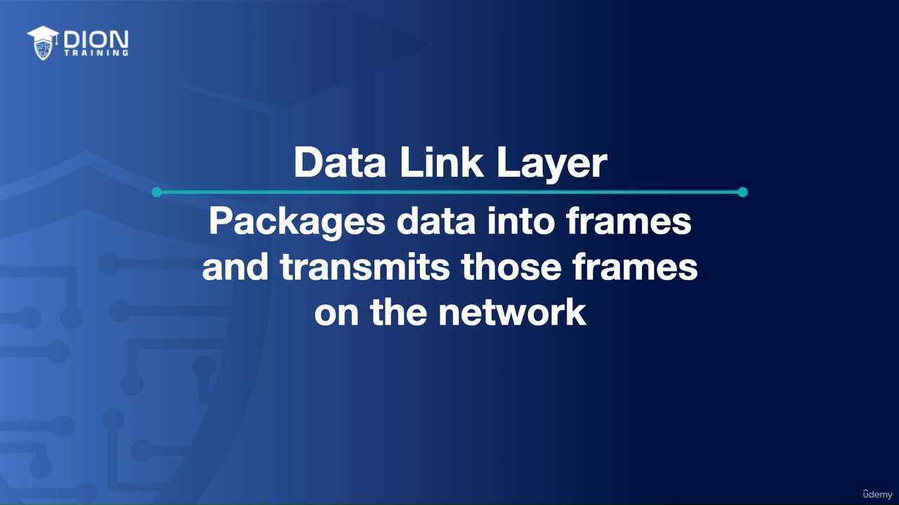
*(Hình ảnh mô tả cấu trúc 12 ký tự của địa chỉ MAC: D2:51:F1:AB:CD:EF)*

* **24-bit đầu (OUI - Organizationally Unique Identifier):** Định danh nhà sản xuất. Ví dụ, `D2:51:F1` là "chữ ký" của hãng sản xuất card mạng đó.
* **24-bit sau:** Định danh duy nhất cho riêng chiếc card mạng đó (giống như số thứ tự sản xuất).

> **💡 Ví dụ nhớ đời:** Hãy tưởng tượng địa chỉ MAC như một chiếc xe hơi. 3 ký tự đầu của biển số xe (hoặc mã quốc gia/hãng sản xuất) cho biết chiếc xe này được lắp ráp tại đâu và bởi ai (giống như OUI). 6 ký tự phía sau chính là số khung (VIN) duy nhất của riêng chiếc xe đó, dù có hàng triệu chiếc cùng mẫu mã, nhưng không bao giờ có hai chiếc trùng số khung.

---

**4. Tại sao lại dùng Thập lục phân (Hexadecimal)?**
Máy tính giao tiếp bằng bit (0 và 1). Nếu con người phải đọc địa chỉ 48-bit bằng hệ nhị phân (ví dụ: 11010010:01010001:...), chúng ta sẽ rất dễ nhầm lẫn. Hệ thập lục phân (Hex) là cách viết tắt hoàn hảo: mỗi 4 bit được gộp thành 1 ký tự hex, giúp địa chỉ 48-bit trở nên gọn gàng chỉ với 12 ký tự, giảm thiểu sai sót khi cấu hình mạng.

---

**5. Sự phân tách giữa Vật lý và Logic**
Điều quan trọng cần ghi nhớ là khi dữ liệu đã lên đến Layer 2, chúng ta không còn quá bận tâm đến việc thiết bị được cắm vào ổ điện nào hay dùng loại cáp gì. Đó là câu chuyện của Layer 1. Ở Layer 2, chúng ta nhìn vào:

* "Ai là người gửi?" (MAC nguồn)
* "Ai là người nhận?" (MAC đích)

Điều này giúp mạng lưới trở nên linh hoạt. Một thiết bị có thể thay đổi vị trí vật lý (cắm vào một switch khác, hoặc chuyển từ LAN sang Wi-Fi), nhưng địa chỉ MAC của nó vẫn giữ nguyên, giúp logic mạng không bị phá vỡ khi cấu trúc hạ tầng thay đổi. Đây là bước đệm quan trọng để hiểu cách các gói tin (frames) được định tuyến và chuyển tiếp hiệu quả trong một mạng lưới nội bộ phức tạp.

Trong lớp liên kết dữ liệu (Data Link Layer - Layer 2), các thiết bị cần một "bộ luật" để điều tiết cách truyền thông tin nhằm tránh tình trạng va chạm tín hiệu. Đoạn transcript này tập trung vào hai phân lớp chính: **Media Access Control (MAC)** và **Logical Link Control (LLC)**.

### 1. Kiểm soát quyền truy cập: "Ai được quyền nói?"

Ở cấp độ 2, vấn đề cốt lõi là giải quyết sự hỗn loạn khi nhiều thiết bị cùng muốn gửi dữ liệu lên đường truyền. Nếu tất cả cùng truyền một lúc, tín hiệu sẽ chồng chéo lên nhau và gây ra lỗi, khiến không thiết bị nào nhận được nội dung nguyên vẹn.

Để giải quyết, người giảng viên đưa ra một ẩn dụ về môi trường lớp học: thay vì tất cả cùng la hét, chúng ta dùng quy tắc "giơ tay phát biểu". Trong mạng máy tính, các cơ chế điện tử (như CSMA/CD hoặc CSMA/CA) đóng vai trò là "giáo viên", chỉ định thiết bị nào được quyền chiếm sóng tại một thời điểm nhất định để đảm bảo thông điệp được truyền đi thông suốt.

> **💡 Ví dụ nhớ đời:** Hãy tưởng tượng một ngã tư không có đèn tín hiệu giao thông. Nếu mọi xe đều lao vào cùng lúc, tai nạn chắc chắn sẽ xảy ra. Cơ chế điều khiển truy cập giống như một người cảnh sát giao thông, chỉ cho phép một làn xe đi vào ngã tư tại một thời điểm, giữ cho dòng chảy thông tin không bị tắc nghẽn hay va chạm.

### 2. Logical Link Control (LLC) - Cơ quan kiểm soát kết nối

Sau khi đã giành được quyền truy cập, LLC đảm nhận vai trò quản lý logic của kết nối. Nó không quan tâm đến phần cứng (như cáp hay card mạng) mà tập trung vào việc **xác nhận (acknowledgment)**.

LLC cho phép thiết bị nhận thông báo lại cho người gửi rằng "Tôi đã nhận được gói tin của bạn". Đây là cơ sở của việc truyền dữ liệu tin cậy. Nếu không có xác nhận, người gửi sẽ mãi trong trạng thái "bất an" vì không biết thông tin đã đến nơi hay chưa.

### 3. Kiểm soát lưu lượng (Flow Control)

Đây là kỹ thuật đảm bảo người nhận không bị "ngợp" vì quá tải. Nếu người gửi truyền dữ liệu với tốc độ nhanh hơn khả năng xử lý của người nhận, bộ đệm (buffer) của người nhận sẽ đầy và dữ liệu sẽ bị mất.

LLC đóng vai trò điều phối: nếu bên nhận thấy dữ liệu đến quá nhanh, nó sẽ yêu cầu bên gửi "hãy chậm lại" hoặc "truyền lại đoạn vừa rồi".

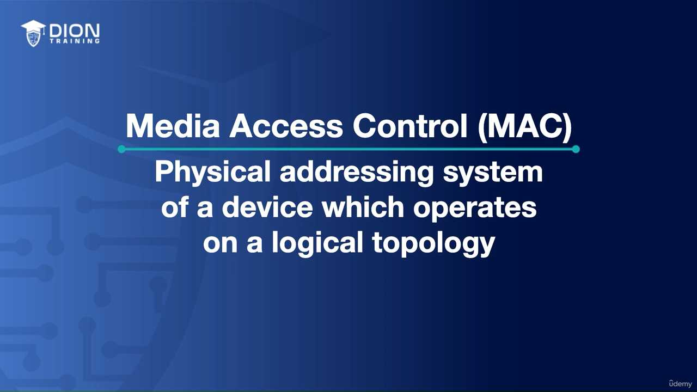
*(Sơ đồ mô tả quy trình gửi gói tin: Bên gửi truyền dữ liệu -> Bên nhận phản hồi "tạm dừng" hoặc "yêu cầu truyền lại" khi bộ đệm đạt ngưỡng giới hạn)*

> **💡 Ví dụ nhớ đời:** Hãy tưởng tượng bạn đang xem một bộ phim. Nếu tốc độ internet quá chậm, trình phát video sẽ tự động hiển thị biểu tượng "đang tải" (buffering). Đó chính là lúc máy tính của bạn nói với máy chủ: "Tôi chưa xử lý kịp dữ liệu, hãy chờ một chút cho tôi tải xong rồi hãy gửi tiếp".

### 4. Kiểm soát lỗi (Error Control) và Checksum

Làm sao để biết dữ liệu nhận được có bị biến dạng trên đường đi do nhiễu điện từ hay không? Đây là lúc **Checksum (tổng kiểm tra)** lên tiếng.

Dữ liệu trong mạng thực chất chỉ là một chuỗi các bit 0 và 1. Khi một gói tin được gửi đi, thiết bị gửi sẽ cộng tổng số các bit 1 trong khung dữ liệu đó. Kết quả (chẵn hoặc lẻ) được đính kèm vào khung tin.

* **Tại nơi nhận:** Thiết bị cũng thực hiện phép cộng tương tự trên chuỗi dữ liệu vừa nhận được.
* **So sánh:** Nếu kết quả của bên nhận khớp với giá trị Checksum mà bên gửi đính kèm, dữ liệu được coi là toàn vẹn.
* **Xử lý lỗi:** Nếu kết quả không khớp, điều đó chứng tỏ dữ liệu đã bị thay đổi trong quá trình truyền (có một bit 0 biến thành 1 hoặc ngược lại do nhiễu). Khi đó, LLC sẽ ra lệnh hủy gói tin hỏng và yêu cầu thiết bị nguồn gửi lại toàn bộ khung dữ liệu đó (retransmission).

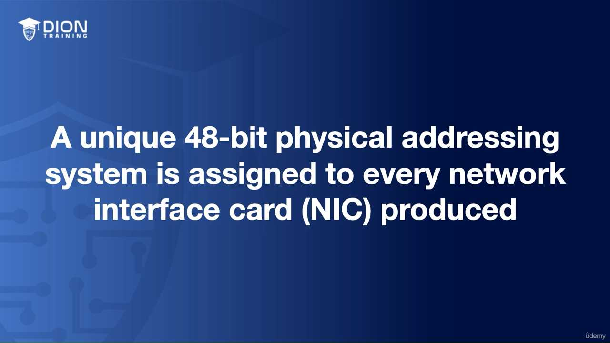
*(Sơ đồ minh họa quá trình tính toán Checksum: Bên gửi gắn mã kiểm tra -> Bên nhận tính toán lại -> So sánh kết quả để chấp nhận hoặc bác bỏ dữ liệu)*

Cơ chế này tuy đơn giản (chỉ dựa vào tính chẵn/lẻ) nhưng nó là lớp lá chắn đầu tiên và quan trọng nhất để đảm bảo rằng thông tin đi từ điểm A đến điểm B không bị sai lệch, giúp hệ thống mạng vận hành ổn định và chính xác.

Trong lớp Data Link (Layer 2), việc đồng bộ hóa dữ liệu là yếu tố sống còn để đảm bảo dữ liệu không bị xung đột hoặc mất mát khi truyền tải. Có ba cơ chế chính để giải quyết vấn đề này:

### 1. Isochronous (Chế độ thời gian thực đồng bộ)

Đây là phương thức tối ưu hóa nhất về mặt hiệu suất. Nó kết hợp hai thế giới: sử dụng một xung nhịp (clock) chung cho toàn hệ thống để giữ nhịp, nhưng đồng thời chia nhỏ thời gian thành các "khe thời gian" (time slots) cố định.

* **Cơ chế:** Giống như một đoàn tàu chạy trên đường ray, mỗi toa tàu (đơn vị dữ liệu) được ấn định đúng thời điểm để đi qua một vị trí.
* **Ưu điểm:** Vì mọi thiết bị đều biết chính xác "khi nào" đến lượt mình và "bao lâu" được truyền, hệ thống không cần gửi thêm các thông tin điều khiển thừa thãi (overhead). Điều này giúp băng thông được sử dụng triệt để.

> **💡 Ví dụ nhớ đời:** Hãy tưởng tượng một vũ điệu tập thể nơi mọi người đều đeo tai nghe phát cùng một nhịp đếm. Bạn không cần ra hiệu "bắt đầu" hay "dừng lại" vì bạn biết chính xác mình phải bước chân vào giây thứ mấy. Mọi người cứ thế nhảy khớp với nhau mà không cần ai phải hô to chỉ đạo, giúp tiết kiệm năng lượng và không gian cho các bước nhảy.

### 2. Synchronous (Chế độ đồng bộ)

Phương thức này dựa hoàn toàn vào xung nhịp dùng chung giữa các thiết bị, tương tự như cách hoạt động ở Layer 1 (Physical). Điểm khác biệt mấu chốt so với Isochronous là ở đây không có "khe thời gian" cố định, thay vào đó, hệ thống sử dụng các khung (frames) có điểm đầu và điểm cuối rõ ràng (start/stop frames) kèm theo các ký tự điều khiển đặc biệt.

* **Cơ chế:** Khi có dữ liệu, thiết bị sẽ phát đi một tín hiệu "bắt đầu", dữ liệu truyền đi theo nhịp của đồng hồ, và kết thúc bằng một tín hiệu "kết thúc".
* **Nhược điểm:** Do phụ thuộc vào các nhịp clock cứng nhắc, nếu tại một thời điểm nào đó không có dữ liệu để truyền, nhưng nhịp clock vẫn chạy, các khoảng trống này sẽ bị lãng phí.
  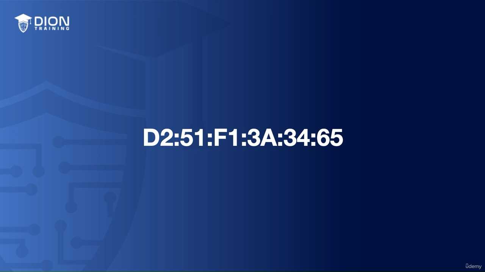
  *(Hình ảnh mô tả luồng dữ liệu đồng bộ với các nhịp clock đều đặn, nơi các khoảng trống giữa các khung truyền dữ liệu bị bỏ phí do không thể chèn dữ liệu khác vào được).*

> **💡 Ví dụ nhớ đời:** Giống như một bản nhạc có nhịp 4/4. Dù ca sĩ có hát hay nghỉ, dàn nhạc vẫn phải chơi đúng nhịp. Nếu ca sĩ im lặng một đoạn trong khuông nhạc, thì khoảng lặng đó vẫn là một phần của nhịp điệu và không thể bị cắt bỏ hay nén lại, dẫn đến sự lãng phí "thời gian" nếu không có âm thanh nào được phát ra.

### 3. Asynchronous (Chế độ bất đồng bộ)

Đây là phương thức linh hoạt nhất nhưng cũng ít tính kỷ luật nhất. Mỗi thiết bị trong mạng tự sở hữu đồng hồ riêng. Chúng không cần phải khớp nhịp với nhau.

* **Cơ chế:** Để biết đâu là bắt đầu và kết thúc của một gói tin, thiết bị sẽ đính kèm các bit khởi đầu (start bit) và bit kết thúc (stop bit) vào từng byte dữ liệu.
* **Nhược điểm:** Vì không có sự điều phối chung về thời gian, các thiết bị có thể truyền dữ liệu bất cứ lúc nào, dẫn đến khả năng xung đột cao hơn và cần nhiều bit điều khiển hơn trên mỗi byte truyền đi. Đây là cái giá phải trả cho sự tự do của các thiết bị.

---

### Chuyển dịch từ Hub sang Switch ở Layer 2

Khi nói về phần cứng, chúng ta cần phân biệt rõ giữa "Hub" và "Switch".

* **Hub (Thiết bị "câm"):** Khi nhận được dữ liệu từ cổng A, nó sẽ sao chép dữ liệu đó và gửi tới tất cả các cổng còn lại (trừ cổng A). Nó không hề biết dữ liệu đó dành cho ai.
* **Switch (Thiết bị "thông minh"):** Đây là sự nâng cấp đột phá. Thay vì truyền mù quáng, switch sử dụng logic để xây dựng bảng địa chỉ.

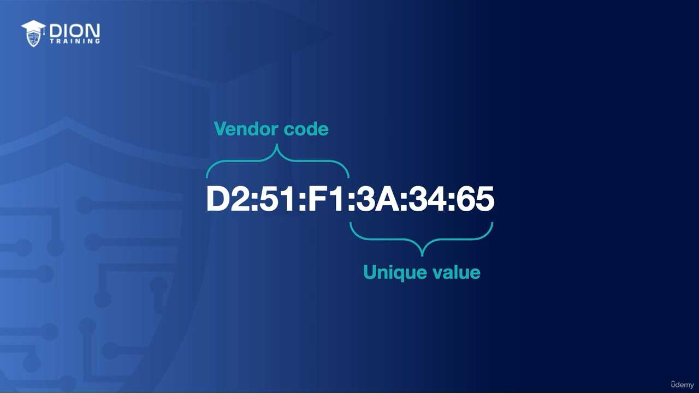
*(Sơ đồ so sánh: Một bên là Hub broadcast dữ liệu tới mọi máy tính trong mạng; một bên là Switch chỉ gửi gói tin trực tiếp tới đúng địa chỉ MAC mục tiêu).*

**Tại sao Switch thông minh hơn?**

1. **Học địa chỉ (Learning):** Switch quan sát địa chỉ MAC (Media Access Control) của các thiết bị kết nối vào các cổng vật lý của nó.
2. **Lưu trữ (CAM Table):** Nó tạo ra một bảng ánh xạ (Content Addressable Memory - CAM table), ghi nhớ rằng "Địa chỉ MAC X đang ở cổng số 1".
3. **Chuyển mạch có đích (Forwarding):** Nhờ bảng này, khi có dữ liệu gửi đến, switch chỉ chuyển tiếp nó ra đúng cổng cần thiết. Điều này giúp tối ưu hóa băng thông cực lớn vì không làm phiền các thiết bị không liên quan và cho phép nhiều cuộc hội thoại diễn ra song song trên các phân đoạn mạng khác nhau.

Đây chính là nền tảng cốt lõi giúp các mạng máy tính hiện đại vận hành hiệu quả mà không bị tắc nghẽn bởi lưu lượng rác.

Đoạn transcript này tập trung vào việc định vị các thiết bị và giao thức then chốt trong mô hình tham chiếu OSI, cụ thể là tầng thứ hai – tầng Liên kết dữ liệu (Data Link Layer).

### 1. Bản chất của các thiết bị tại Tầng 2 (Data Link Layer)

Tác giả nhắc đến ba thành phần cốt lõi: **Switches (Thiết bị chuyển mạch)**, **Bridges (Cầu nối mạng)**, và **MAC addresses (Địa chỉ điều khiển truy cập môi trường)**. Để hiểu tại sao chúng lại thuộc về tầng 2, ta cần nhớ rằng tầng 2 có nhiệm vụ đóng gói dữ liệu thành các "khung" (frames) và đảm bảo dữ liệu được truyền tải chính xác giữa các thiết bị nằm cùng một mạng nội bộ (LAN).

* **Bridges (Cầu nối):** Đây là các thiết bị tiền thân của Switch, được thiết kế để kết nối hai phân đoạn mạng khác nhau nhằm giảm lưu lượng (traffic) bằng cách lọc các khung dữ liệu dựa trên địa chỉ nguồn và đích.
* **Switches:** Đây là phiên bản nâng cấp và thông minh hơn của Bridge. Một Switch có nhiều cổng (port), cho phép nó kết nối nhiều thiết bị cùng lúc. Nó hoạt động dựa trên bảng địa chỉ MAC (MAC Address Table) để quyết định dữ liệu đi từ cổng nào đến đúng cổng nào thay vì phát tán ra toàn mạng.
  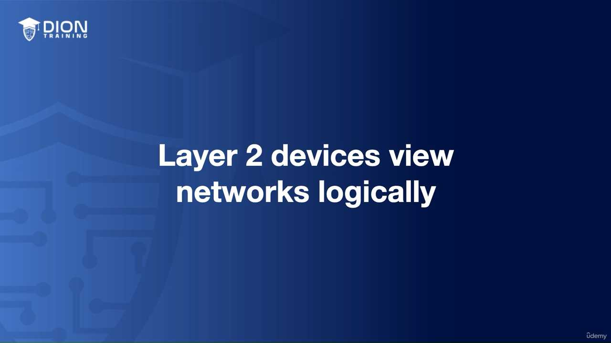 (Sơ đồ mô phỏng quá trình Switch học địa chỉ MAC và chuyển tiếp dữ liệu thông qua bảng CAM - Content Addressable Memory).

> **💡 Ví dụ nhớ đời:** Hãy tưởng tượng tầng 2 giống như một **"Người quản lý thư viện địa phương"**. Bạn không cần biết thư viện quốc gia ở đâu (đó là việc của tầng 3 - Router). Người quản lý thư viện chỉ giữ một danh sách tên người đọc (Địa chỉ MAC) và vị trí các kệ sách (Cổng của Switch). Khi có một cuốn sách (Dữ liệu) cần đưa đến cho bạn, người quản lý nhìn vào danh sách, biết ngay bạn đang ngồi ở bàn số mấy và chuyển sách trực tiếp đến tận tay bạn mà không cần hỏi bạn sống ở thành phố nào.

### 2. Tầm quan trọng của địa chỉ MAC

Địa chỉ MAC (Media Access Control) là địa chỉ vật lý duy nhất, thường được ghi cứng vào card mạng (NIC) của thiết bị ngay từ khi sản xuất. Khác với địa chỉ IP (có thể thay đổi), địa chỉ MAC là "danh tính" vĩnh viễn của phần cứng trong mạng.

Khi một Switch nhận được một khung dữ liệu, nó sẽ đọc địa chỉ MAC đích. Nếu địa chỉ đó nằm trong bảng của nó, nó sẽ chuyển tiếp trực tiếp đến cổng tương ứng. Nếu chưa có, nó sẽ gửi khung dữ liệu đó ra tất cả các cổng (trừ cổng gửi đến) để tìm kiếm thiết bị sở hữu địa chỉ đó. Đây chính là cơ chế truyền tin cục bộ đặc trưng của tầng 2.

### Hình ảnh minh họa thêm:

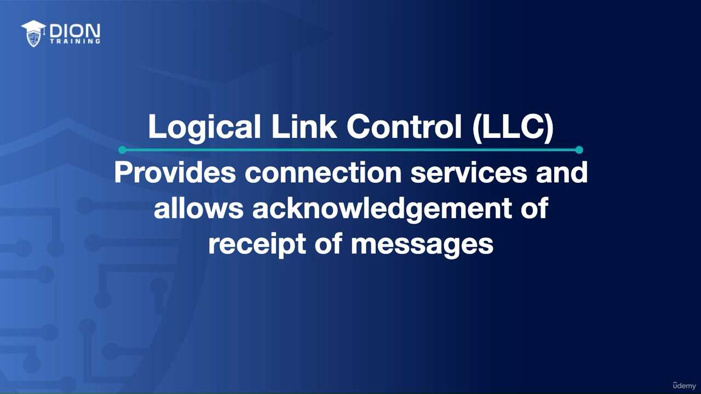
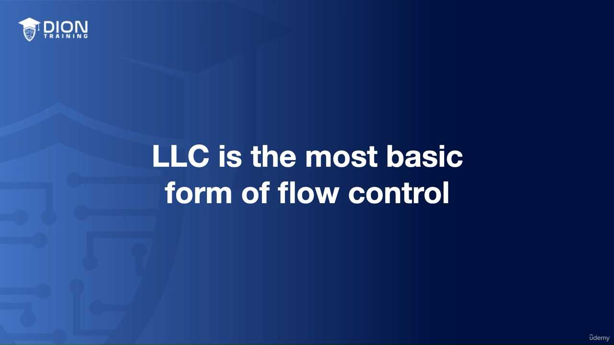
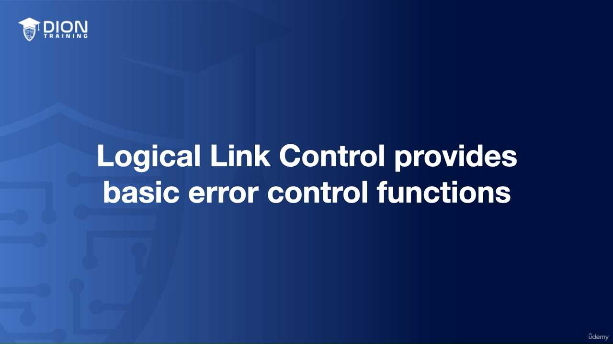
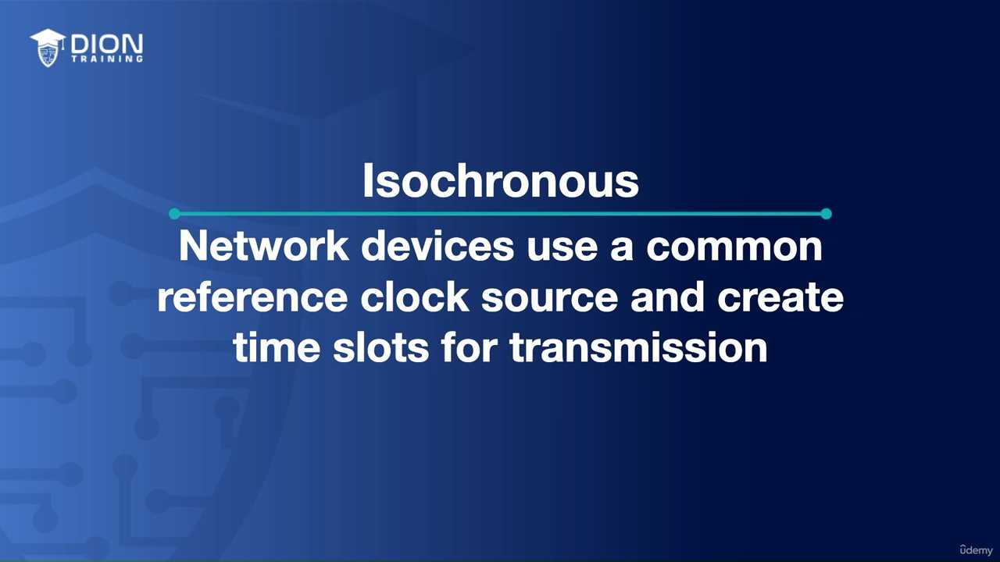
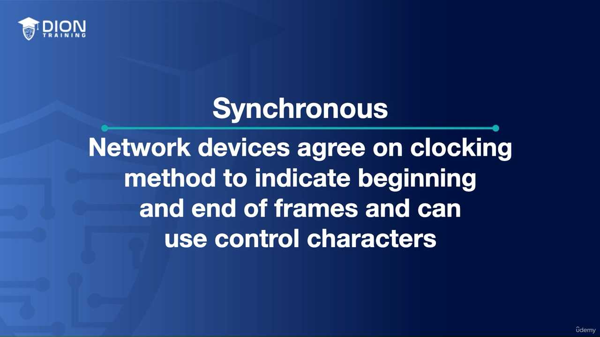
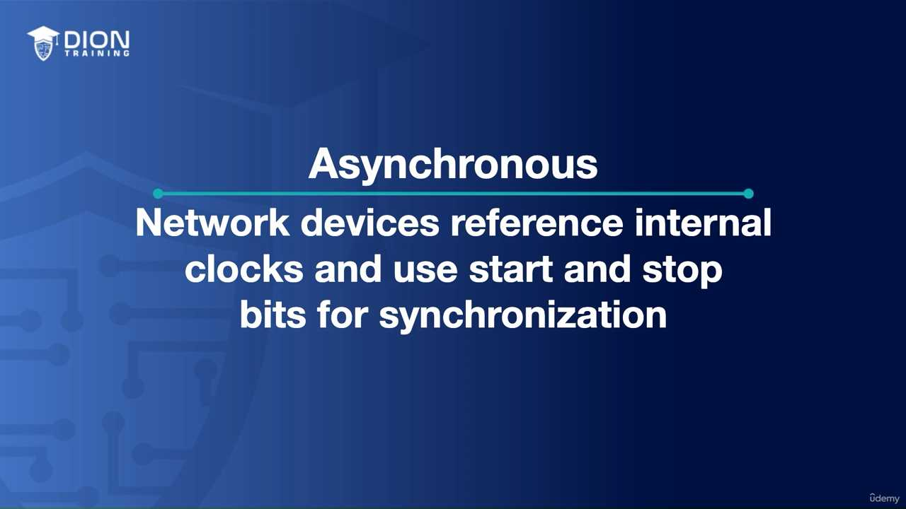
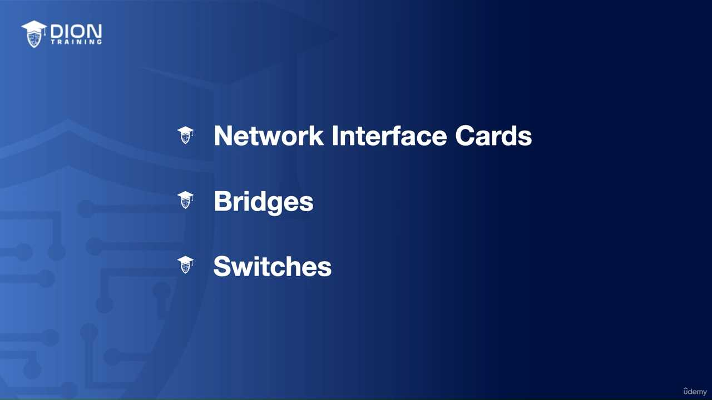
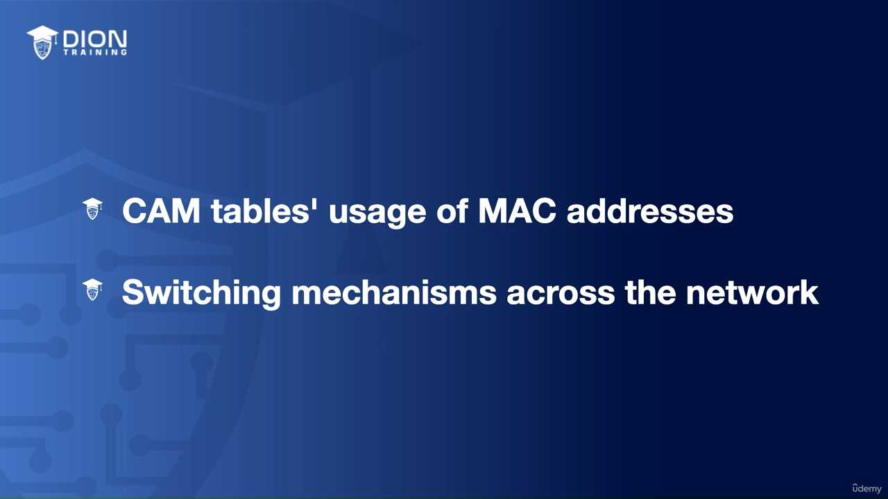

---

*Ghi chú: 14 hình ảnh minh họa (.jpg) đã được tải về và lưu tự động vào thư mục con `image/` cùng cấp với file này. Để ảnh hiển thị tự động, hãy đảm bảo bạn sao chép cả thư mục `image/` nếu bạn muốn di chuyển file markdown sang nơi khác!*
