# Layer 4: Transport Layer

### Phân tích chi tiết: Tầng Giao vận (Layer 4 - Transport Layer)

**Vị thế của Layer 4 trong mô hình OSI**
Layer 4 đóng vai trò là "biên giới" chiến lược trong mô hình OSI. Nó tách biệt rõ rệt hai nhóm chức năng:
*   **Lower Layers (Tầng dưới: Physical, Data Link, Network):** Tập trung vào việc "làm sao để dữ liệu di chuyển từ điểm A đến điểm B" – xử lý cáp, địa chỉ MAC, địa chỉ IP và định tuyến.
*   **Upper Layers (Tầng trên: Session, Presentation, Application):** Tập trung vào việc "dữ liệu đó là gì và được xử lý ra sao" – xử lý phiên làm việc, định dạng dữ liệu và giao diện người dùng.
Tầng Giao vận chính là "người phiên dịch" và "người kiểm soát" kết nối giữa việc truyền tải thô sơ bên dưới và logic ứng dụng bên trên.

**Đơn vị dữ liệu (PDU) tại Layer 4**
Tại tầng này, dữ liệu không còn được gọi là frame (đóng khung) hay packet (gói tin) nữa, mà được gọi là **Segment** (phân đoạn) hoặc **Datagram**. Việc gọi tên này tùy thuộc vào giao thức bạn sử dụng. Nếu bạn đang nói về TCP, chúng ta dùng thuật ngữ "Segment". Nếu nói về UDP, chúng ta dùng "Datagram".

**Các tính năng cốt lõi: TCP và UDP**
Layer 4 xoay quanh hai giao thức chính:
1.  **TCP (Transmission Control Protocol):** Chú trọng sự tin cậy tuyệt đối.
2.  **UDP (User Datagram Protocol):** Chú trọng tốc độ (sẽ được làm rõ ở các phần sau).

Bên cạnh đó, Layer 4 còn quản lý hai cơ chế quan trọng giúp tối ưu hóa hiệu suất:
*   **Windowing (Cửa sổ trượt):** Cho phép gửi nhiều gói tin trước khi cần một xác nhận, giúp tăng tốc độ truyền tải mà không cần đợi xác nhận từng gói.
*   **Buffering (Bộ đệm):** Lưu trữ tạm thời dữ liệu để xử lý khi tốc độ gửi và nhận không đồng bộ, tránh mất mát dữ liệu do quá tải.

**Đi sâu vào TCP: Giao thức hướng kết nối (Connection-oriented)**
TCP hoạt động giống như một cuộc đối thoại có sự xác nhận qua lại. Tính chất "Connection-full" có nghĩa là trước khi dữ liệu được gửi đi, thiết bị nguồn và đích phải thiết lập một "thỏa thuận". Nếu một đoạn dữ liệu (segment) bị mất trên đường đi, TCP sẽ không bỏ qua. Nó sẽ kiểm tra trạng thái ACK (Acknowledgement) và yêu cầu gửi lại ngay lập tức.

**Cơ chế Three-way Handshake (Bắt tay 3 bước)**
Đây là linh hồn của sự tin cậy trong TCP. Quá trình này được mô tả qua sơ đồ dưới đây:

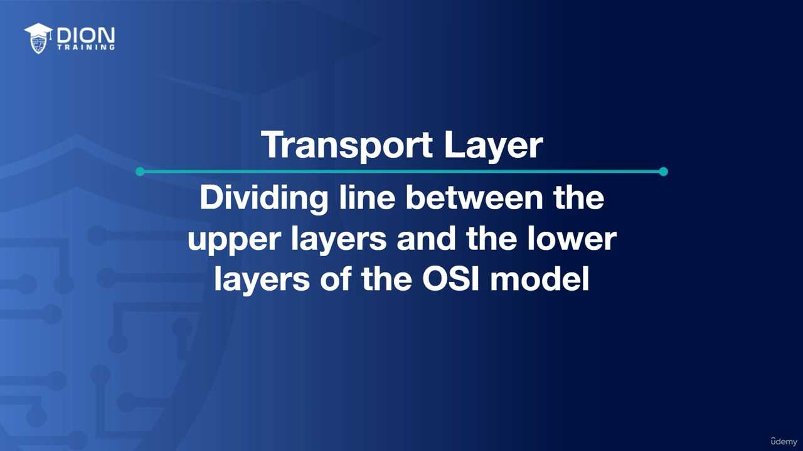

Cấu trúc bắt tay 3 bước diễn ra như sau:
1.  **SYN (Synchronize):** Client gửi yêu cầu: "Tôi muốn kết nối với ông, số thứ tự bắt đầu của tôi là X".
2.  **SYN-ACK (Synchronize-Acknowledgment):** Server trả lời: "Tôi nhận được yêu cầu của ông, tôi đồng ý. Số thứ tự của tôi là Y, và tôi xác nhận số X của ông đã đến".
3.  **ACK (Acknowledgment):** Client chốt lại: "Đã nhận được thông báo của ông. Kết nối chính thức mở, hãy bắt đầu truyền dữ liệu".

> **💡 Ví dụ nhớ đời:** Hãy tưởng tượng bạn đang gọi điện cho một người bạn qua điện thoại bàn kiểu cũ.
> - **SYN:** Bạn gọi điện và nói: "Alo, cậu đó không?"
> - **SYN-ACK:** Bạn của bạn nghe máy và nói: "Ừ, mình đây, mình nghe rõ. Cậu có nghe rõ mình không?"
> - **ACK:** Bạn trả lời: "Ừ, mình nghe rất rõ. Giờ tớ bắt đầu kể chuyện đây nhé."
> Nếu bạn không nghe thấy câu "Ừ, mình nghe rõ" (ACK), bạn sẽ không bắt đầu kể chuyện vì sợ rằng người kia chưa sẵn sàng hoặc cuộc gọi bị nhiễu. TCP cũng hoạt động chính xác như vậy để đảm bảo không một bit dữ liệu nào bị "nói một mình".

Sau khi quá trình "bắt tay ba bước" (three-way handshake) hoàn tất, chúng ta đã thiết lập một "kênh liên lạc" đã được xác nhận. Lúc này, cả client và server đều hiểu rằng: "Tôi đã sẵn sàng nhận dữ liệu" và "Tôi đã sẵn sàng gửi dữ liệu". Đây chính là nền tảng của giao thức TCP (Transmission Control Protocol), một giao thức hướng kết nối (connection-oriented).

### Cơ chế truyền dữ liệu và xác nhận (Acknowledgement)
Trong TCP, dữ liệu không được truyền đi như một khối khổng lồ, mà được chia nhỏ thành các đơn vị gọi là **Segment**. Khi một segment được gửi đi, bên nhận không chỉ đơn thuần là nhận lấy, mà nó phải gửi ngược lại một thông điệp xác nhận (ACK - Acknowledgement). 

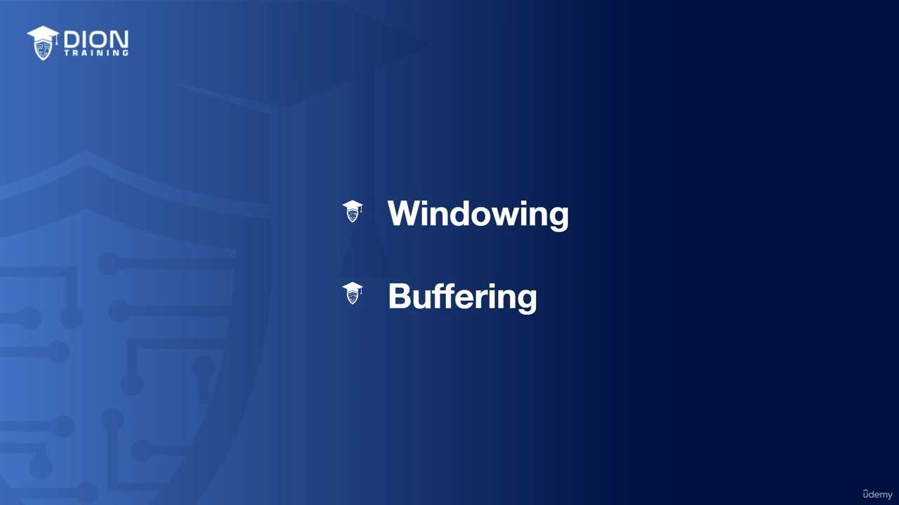 (Sơ đồ luồng gửi gói tin Segment và phản hồi ACK giữa Client và Server)

Điều này đảm bảo tính "toàn vẹn" của dữ liệu. Nếu server dự định nhận 100 gói dữ liệu nhưng chỉ nhận được 98, nó sẽ lập tức phản hồi rằng: "Tôi đã nhận đủ 98, nhưng 2 gói còn lại đang bị mất". Cơ chế này kích hoạt việc **retransmission** (truyền lại). Nhờ đó, người nhận có thể khôi phục lại dữ liệu nguyên bản như phía gửi đã mong đợi.

> **💡 Ví dụ nhớ đời:** Hãy tưởng tượng bạn gửi một bộ hồ sơ quan trọng cho đối tác qua dịch vụ "Thư bảo đảm". Bạn không chỉ quăng lá thư vào thùng thư rồi đi về. Bạn yêu cầu người nhận phải ký tên vào biên lai xác nhận. Nếu người nhận báo là thiếu mất 2 trang trong bộ hồ sơ, bạn sẽ gửi bổ sung ngay 2 trang đó. Đó chính là cách TCP đảm bảo không có bất kỳ thông tin nào bị thất lạc.

### Sự khác biệt cốt lõi: TCP vs UDP
Đoạn transcript chuyển hướng sang một giao thức đối lập hoàn toàn: **UDP (User Datagram Protocol)**. Nếu TCP là "Thư bảo đảm", thì UDP giống như việc bạn hét lớn vào đám đông: bạn nói, thông tin bay ra ngoài không gian, và bạn chẳng hề quan tâm liệu có ai nghe rõ từng chữ hay không.

#### Các đặc điểm của UDP:
1. **Connectionless (Phi kết nối):** UDP không cần "bắt tay", không cần kiểm tra đối phương có sẵn sàng hay không. Nó gửi thẳng dữ liệu đi ngay lập tức.
2. **Datagram:** Đây là thuật ngữ dành riêng cho dữ liệu của UDP (khác với Segment của TCP). Dù là Segment hay Datagram, chúng đều nằm ở **Layer 4 (Transport Layer)** của mô hình OSI.
3. **Unreliable (Không tin cậy):** Nếu dữ liệu bị mất (dropped) trên đường truyền, UDP sẽ không có cơ chế báo lại hay gửi lại. Bên gửi thậm chí còn không biết là đã xảy ra lỗi.

### Tại sao chúng ta lại dùng một giao thức "không tin cậy" như UDP?
Có thể bạn sẽ tự hỏi: "Tại sao lại phải dùng thứ gì đó không an toàn?". Câu trả lời nằm ở **độ trễ (latency)** và **overhead (tài nguyên dư thừa)**.

Trong các ứng dụng như gọi điện video (VoIP), livestreaming hay chơi game online, tốc độ là ưu tiên hàng đầu. 
- Nếu bạn đang xem một trận bóng đá trực tiếp và một gói tin bị mất: Việc bắt hệ thống phải "dừng lại, gửi lại gói tin đó" sẽ khiến hình ảnh bị khựng, bị lag. 
- Thay vào đó, UDP cho phép bỏ qua gói tin bị mất đó để tiếp tục nhận các gói tin mới nhất. Người dùng chấp nhận một chút nhiễu hình ảnh để đổi lấy dòng chảy thời gian thực không bị gián đoạn.

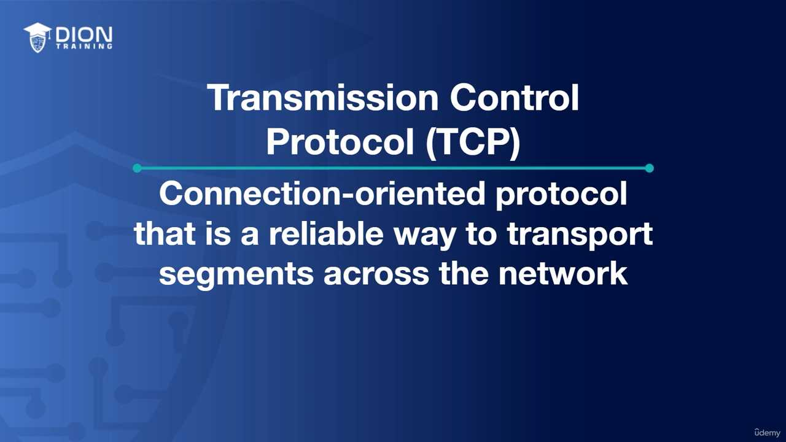 (Biểu đồ so sánh: TCP nặng nề với các gói tin ACK ngược lại, trong khi UDP nhẹ nhàng với các mũi tên dữ liệu đi thẳng một chiều)

TCP có quá nhiều "overhead" (chi phí quản lý) – nghĩa là các thông tin phụ trợ, các gói tin xác nhận làm nặng thêm đường truyền. UDP cắt bỏ hoàn toàn các thủ tục đó, khiến nó trở thành lựa chọn tối ưu cho những ứng dụng mà tốc độ quan trọng hơn sự chính xác tuyệt đối của từng bit dữ liệu.

Đoạn transcript này tập trung vào việc so sánh sự khác biệt cơ bản giữa hai giao thức truyền tải tầng Transport là TCP và UDP, đồng thời giải thích lý do tại sao UDP lại chiếm ưu thế trong các ứng dụng thời gian thực.

### 1. Bản chất của UDP: Tốc độ thay vì sự hoàn hảo
Người giảng bắt đầu bằng việc nhấn mạnh rằng UDP (User Datagram Protocol) bỏ qua quy trình "three-way handshake" (bắt tay ba bước). Trong TCP, trước khi dữ liệu được gửi đi, máy gửi và máy nhận phải "chào hỏi" nhau để đảm bảo kết nối sẵn sàng. UDP thì không. Nó hoạt động theo cơ chế "fire-and-forget" (gửi đi và quên luôn).

Việc không có "checks and balances" (các cơ chế kiểm soát và đối chiếu) giúp UDP loại bỏ được độ trễ (latency). Vì không có yêu cầu gửi lại (retransmission), UDP không bao giờ phải chờ đợi các gói tin bị mất, từ đó tăng hiệu suất mạng đáng kể.

### 2. Sự đánh đổi: Tại sao lại chấp nhận mất dữ liệu?
Người giảng đặt câu hỏi: "Tại sao lại muốn mất thông tin?". Câu trả lời nằm ở ngữ cảnh sử dụng. Trong truyền tải video/audio, thời gian thực là ưu tiên số một.

*   **Với TCP:** Nếu một gói tin bị mất, hệ thống bắt buộc phải dừng lại để yêu cầu gửi lại (retransmission), sau đó sắp xếp lại đúng thứ tự rồi mới phát tiếp. Quá trình này gây ra "buffering" (xoay vòng loading).
*   **Với UDP:** Nếu mất 1/100 giây video, người dùng không hề nhận ra. Thay vì dừng cả hệ thống để sửa lỗi nhỏ, UDP chọn cách "bỏ qua" và tiếp tục phát các gói tin mới.

> **💡 Ví dụ nhớ đời:** Hãy tưởng tượng TCP giống như việc gửi thư bảo đảm có ký nhận: Bạn gửi thư, người nhận ký tên, bạn nhận lại biên lai. Nếu thư thất lạc, bưu điện phải gửi lại bản sao. Còn UDP giống như việc bạn đang đứng ở sân vận động và tung hàng trăm quả bóng bay về phía khán giả. Bạn không quan tâm ai bắt được quả nào, bạn chỉ cần ném liên tục để tạo ra bầu không khí sôi động. Nếu vài quả bóng rơi xuống đất, buổi biểu diễn vẫn tiếp tục mà không ai dừng lại để nhặt từng quả.

[CHÈN_ẢNH_MINH_HỌA: Sơ đồ so sánh cơ chế hoạt động của TCP (có vòng lặp phản hồi ACK/Retransmission) và UDP (một chiều, không phản hồi)]

### 3. Bảng so sánh TCP và UDP
Người giảng liệt kê các khác biệt cốt lõi mà học viên cần ghi chép lại:

| Đặc điểm | TCP (Transmission Control Protocol) | UDP (User Datagram Protocol) |
| :--- | :--- | :--- |
| **Độ tin cậy** | Tin cậy (Reliable) | Không tin cậy (Unreliable) |
| **Bắt tay** | Có (3-way handshake) | Không có |
| **Kết nối** | Connection-oriented (Có kết nối) | Connectionless (Không kết nối) |
| **Truyền lại** | Có (Retransmission) | Không có |
| **Điều khiển** | Có Windowing (Flow control) | Không có |
| **Thứ tự** | Có Sequencing (Đánh số thứ tự) | Không có |

### 4. Cơ chế Sequencing và Windowing
Người giảng nhấn mạnh rằng dù TCP hay UDP, dữ liệu đều được gửi từ số 1 đến 100. Tuy nhiên, sự khác biệt nằm ở cách xử lý khi có sai sót:

*   **TCP:** Sử dụng **Sequencing** để đánh số thứ tự từng gói tin. Nếu gói số 5 bị mất, TCP sẽ biết ngay vì nó chỉ nhận được 1, 2, 3, 4, 6... và nó sẽ ra lệnh "Gửi lại gói số 5". Thêm vào đó, cơ chế **Windowing** (cửa sổ trượt) giúp TCP điều tiết lưu lượng: nếu mạng chậm, nó sẽ gửi ít gói tin hơn để tránh nghẽn.
*   **UDP:** Không có cơ chế này. Nếu gói số 5 bị mất trên đường đi, nó sẽ vĩnh viễn biến mất. Dữ liệu sẽ tiếp tục với gói 6, 7, 8... mà không cần quan tâm gói 5 đã đến nơi hay chưa.

[CHÈN_ẢNH_MINH_HỌA: Sơ đồ minh họa quá trình "Sequencing" trong TCP nơi các gói tin được đánh số và yêu cầu truyền lại nếu bị mất thứ tự hoặc thất lạc]

Tóm lại, thông điệp chính ở đây là: TCP dành cho những dữ liệu cần sự chính xác tuyệt đối (web, email, file transfer), còn UDP dành cho những dữ liệu cần tốc độ và sự liên tục (video streaming, voice call, gaming).

### 1. Phân tích cơ chế truyền dữ liệu: TCP vs UDP (Sequencing & Order)

Trong mạng máy tính, các gói tin (packets) không phải lúc nào cũng đi theo một con đường cố định từ A đến B. Giống như việc bạn gửi 1.000 lá thư qua các bưu điện khác nhau, chúng có thể đến nơi vào những thời điểm khác nhau.

*   **Với TCP (Transmission Control Protocol):** TCP giống như một thư ký mẫn cán. Nó đánh số thứ tự (sequencing) cho từng gói tin (từ 1 đến 1.000). Khi dữ liệu đến đích, dù chúng đến lộn xộn (ví dụ: gói số 50 đến trước gói số 1), TCP sẽ "giữ" tất cả lại, chờ đợi cho đến khi đầy đủ, sau đó sắp xếp lại đúng thứ tự rồi mới bàn giao cho ứng dụng. Điều này đảm bảo dữ liệu nguyên vẹn 100%.
*   **Với UDP (User Datagram Protocol):** Ngược lại, UDP giống như một người đưa tin vội vã. Nó không quan tâm đến thứ tự. Nếu các gói tin đến theo trình tự 1, 50, 2, 500... thì người dùng sẽ nhận được đúng sự lộn xộn đó ngay lập tức. Trong âm thanh hoặc video, điều này tạo ra hiện tượng "jumpiness" (giật lag) hoặc những tiếng rít (high-pitch squeaks) do dữ liệu bị xáo trộn hoặc bị mất một vài khung hình (frames).

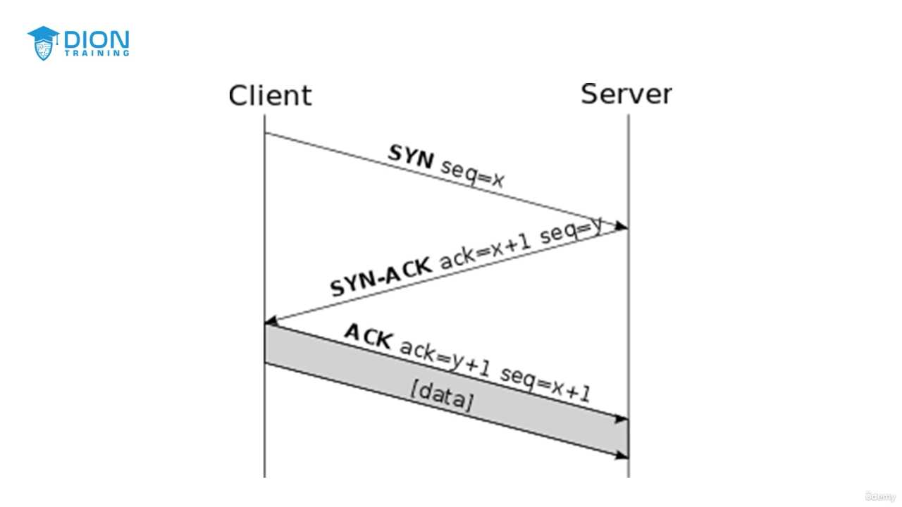

> **💡 Ví dụ nhớ đời:** Hãy tưởng tượng bạn đang xem một vở kịch. 
> * **TCP** giống như việc đạo diễn yêu cầu diễn viên đứng đúng vị trí theo kịch bản từ chương 1 đến chương 10. Nếu một diễn viên chưa ra, vở kịch sẽ tạm dừng chờ. 
> * **UDP** giống như việc diễn viên cứ nhảy lên sân khấu bất cứ khi nào họ đến nơi. Bạn có thể thấy đoạn kết trước đoạn đầu, hoặc thấy diễn viên lộn xộn. Với một cuộc gọi video, việc thấy bạn mình "nhảy múa" một chút còn hơn là cuộc gọi bị ngắt quãng hoàn toàn.

### 2. Sự đánh đổi: Độ tin cậy (Acknowledgement) và Overhead

Sự khác biệt cốt lõi nằm ở cơ chế **Acknowledgement (Xác nhận)**:
*   **TCP:** Có cơ chế "bắt tay". Khi bên nhận nhận được một đoạn dữ liệu (segment), nó phải gửi lại một tín hiệu "Tôi đã nhận được". Nếu bên gửi không nhận được tín hiệu này, nó tự động hiểu là gói tin đã mất và thực hiện **retransmission** (truyền lại). Điều này cực kỳ an toàn nhưng tốn tài nguyên (overhead lớn).
*   **UDP:** Không có xác nhận. Bên gửi cứ gửi đi và không bao giờ quan tâm bên kia có nhận được hay không. Không có retransmission, không có sequencing, không có windowing.

**Tại sao phải lựa chọn?**
*   **Sử dụng TCP cho:** Ngân hàng, Website, E-commerce. Ở đây, mất một gói tin đồng nghĩa với mất tiền, mất mật khẩu hoặc lỗi hiển thị giao diện. Sự an toàn và chính xác là ưu tiên số 1.
*   **Sử dụng UDP cho:** Audio, Video streaming, Game online. Nếu bạn đang xem bóng đá trực tuyến, việc mất một miligiây hình ảnh không quan trọng bằng việc video bị đứng hình (buffering) do phải chờ tải lại dữ liệu cũ. Việc "bỏ qua" một vài mảnh vỡ dữ liệu là một sự đánh đổi chấp nhận được để có tốc độ thời gian thực.

### 3. Cơ chế Windowing: Nghệ thuật điều tiết lưu lượng

Windowing là cơ chế thông minh cho phép các thiết bị "thỏa thuận" về tốc độ truyền tải dựa trên khả năng của đường truyền.

*   **Định nghĩa:** Windowing cho phép client và server điều chỉnh số lượng dữ liệu (kích thước cửa sổ - window size) được gửi đi trong mỗi lần truyền.

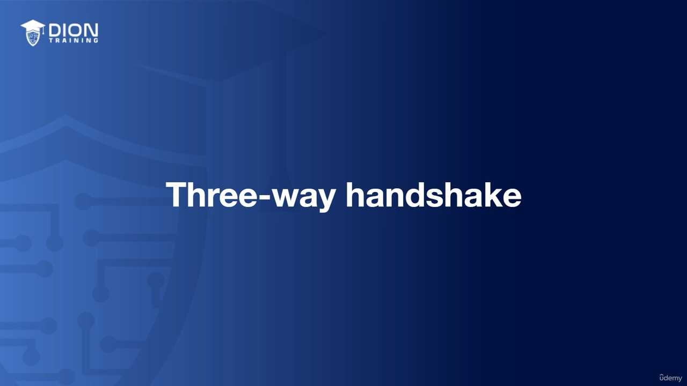

**Logic hoạt động của Windowing:**
1.  **Khi mạng ổn định:** Nếu bên gửi không thấy bất kỳ yêu cầu truyền lại (retransmission) nào, hệ thống hiểu rằng: "Đường truyền đang rất tốt, ta có thể gửi nhiều hơn". Lúc này, nó **mở rộng cửa sổ (open the window)** để gửi nhiều dữ liệu hơn trong mỗi segment.
2.  **Khi mạng bị tắc nghẽn:** Nếu bên gửi nhận được quá nhiều yêu cầu truyền lại, hệ thống hiểu rằng: "Đường truyền đang quá tải, không nhận kịp". Lúc này, nó **thu hẹp cửa sổ (close the window)**. Việc gửi ít dữ liệu hơn mỗi lần giúp giảm áp lực lên mạng, ngăn chặn tình trạng gói tin bị rơi rụng (packet loss).

> **💡 Ví dụ nhớ đời:** Hãy tưởng tượng bạn đang rót nước vào một chiếc cốc. 
> * Nếu bạn rót vừa phải (window nhỏ), nước không bị tràn (retransmission). 
> * Nếu bạn tự tin rót nhanh (mở rộng window), nhưng thấy nước bắt đầu tràn ra ngoài (retransmission), bạn phải hạ miệng bình xuống để rót chậm lại (thu hẹp window). Đó chính là cách Windowing giữ cho luồng dữ liệu luôn được tối ưu mà không gây quá tải cho thiết bị nhận.

Trong mạng máy tính, khái niệm "cửa sổ" (windowing) đóng vai trò là cơ chế điều khiển lưu lượng (flow control) và tránh tắc nghẽn (congestion control). Đây là cách mà giao thức TCP (Transmission Control Protocol) đảm bảo tính ổn định của việc truyền dữ liệu.

### Bản chất của việc thay đổi kích thước cửa sổ
Cửa sổ là lượng dữ liệu mà bên gửi có thể truyền đi trước khi cần nhận được tín hiệu xác nhận (ACK - Acknowledgement) từ bên nhận. Khi truyền một tệp tin lớn từ ổ đĩa chia sẻ về máy tính, bạn thường thấy thanh tiến trình nhảy vọt thời gian một cách bất thường. Nguyên nhân nằm ở sự co giãn của kích thước cửa sổ dựa trên tình trạng mạng.

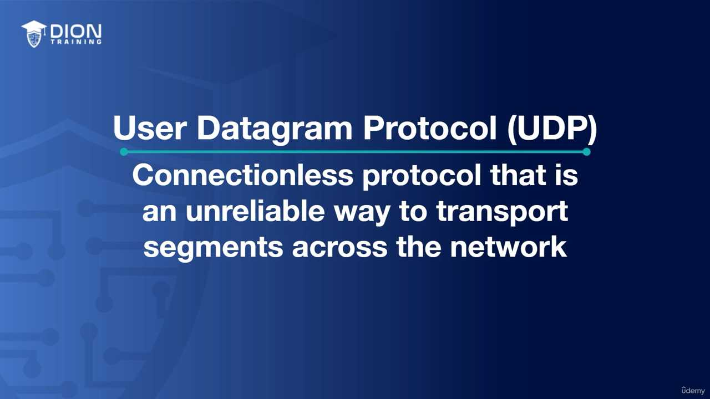
*(Sơ đồ minh họa quá trình TCP Window Scaling với trục tung là lượng dữ liệu và trục hoành là thời gian, thể hiện sự dao động của kích thước cửa sổ theo các khung hình răng cưa)*

Khi mạng xảy ra lỗi hoặc có hiện tượng mất gói tin, cơ chế điều khiển sẽ hiểu rằng mạng đang bị nghẽn. Kết quả là kích thước cửa sổ bị thu hẹp lại. Khi cửa sổ nhỏ hơn, bên gửi chỉ được phép gửi một lượng dữ liệu ít hơn trước khi phải dừng lại chờ xác nhận. Điều này làm giảm tốc độ truyền tải, dẫn đến việc Windows ước tính thời gian hoàn thành phải tăng lên (thời gian còn lại tăng vọt). Ngược lại, khi mạng ổn định, cửa sổ được mở rộng dần, giúp tối ưu hóa băng thông và thời gian hoàn thành giảm xuống.

> **💡 Ví dụ nhớ đời:** Hãy tưởng tượng bạn đang rót nước vào một chiếc bình cổ hẹp. Nếu bạn đổ ồ ạt, nước sẽ tràn ra ngoài (mất gói tin). Để rót nhanh nhất có thể, bạn sẽ rót từ từ lúc đầu. Khi thấy nước chảy ổn định, bạn tăng dần tốc độ dòng chảy. Nếu thấy nước bắt đầu tràn ở miệng bình, bạn lập tức giảm tốc độ lại. Bạn cứ liên tục "tăng - giảm" tốc độ rót như thế cho đến khi tìm được điểm cân bằng cao nhất mà không làm tràn nước. Đó chính là cách TCP "nhấp nhô" để đạt băng thông tối đa.

### Quá trình dò tìm ngưỡng băng thông
Quá trình này là một vòng lặp liên tục:
1. **Giai đoạn tăng tốc (Additive Increase):** Hệ thống tăng kích thước cửa sổ để đẩy thêm nhiều dữ liệu hơn. 
2. **Giai đoạn nhận diện tắc nghẽn:** Khi bên nhận không thể theo kịp (hoặc có gói tin bị mất), bên gửi nhận được tín hiệu cần giảm tốc độ.
3. **Giai đoạn thu hẹp (Multiplicative Decrease):** Hệ thống ngay lập tức cắt giảm kích thước cửa sổ để giải tỏa nghẽn mạng.

Hình ảnh minh họa về "màu xanh và màu đỏ" trong đoạn transcript mô tả cuộc chiến giữa:
* **Màu xanh (Tốc độ gửi của bạn):** Nỗ lực đẩy dữ liệu vào đường truyền.
* **Màu đỏ (Khả năng đáp ứng của mạng):** Giới hạn vật lý hoặc sự tắc nghẽn mà mạng có thể chịu đựng.

Nếu màu xanh luôn cao hơn màu đỏ, gói tin sẽ bị mất. Hệ thống thông minh ở chỗ nó luôn cố gắng đẩy màu xanh lên cao sát mức màu đỏ. Nó không giữ nguyên một tốc độ cố định, mà liên tục thử nghiệm. Nếu chưa thấy nghẽn, nó sẽ tăng tốc. Nếu thấy nghẽn, nó giảm tốc. Cứ lặp đi lặp lại như vậy, TCP sẽ đạt được cái gọi là "tốc độ tối ưu" cho điều kiện mạng hiện tại.

### Ví dụ về giao tiếp thực tế
Để dễ hiểu hơn, hãy xem xét ví dụ về việc đọc số:
* Bạn bắt đầu đọc chậm: "Một... hai... ba". Người nghe phản hồi tốt, cho phép bạn tăng tốc.
* Bạn tăng tốc độ: "Một, hai, ba, bốn, năm". Người nghe vẫn tiếp nhận kịp.
* Bạn tiếp tục tăng tốc độ lên mức tối đa cho phép của người nghe: "Một, hai, ba, bốn, năm...". Đến một lúc, người nghe bị quá tải, họ kêu "Dừng lại, quá nhanh rồi!".
* Ngay lập tức, bạn giảm tốc độ xuống để họ kịp tiêu hóa dữ liệu.

Đây chính là cơ chế **Slow Start** (Khởi động chậm) và **Congestion Avoidance** (Tránh tắc nghẽn) trong TCP. Hệ thống bắt đầu cẩn trọng, thử nghiệm giới hạn, và sau đó điều chỉnh liên tục để khai thác tối đa băng thông sẵn có mà không làm "sập" đường truyền dữ liệu của bạn.

Tiếp nối ý tưởng về "windowing" (cửa sổ truyền tải) dùng để điều khiển luồng dữ liệu, diễn giả chuyển sang một cơ chế quan trọng không kém để quản lý sự tắc nghẽn: **Buffering** (đệm dữ liệu).

### Bản chất của Buffering trong mạng
Khái niệm "buffering" mà chúng ta thường thấy khi xem video trực tuyến thực chất là việc tạo ra một vùng đệm tạm thời. Trong các thiết bị mạng như Router, đây là một khu vực bộ nhớ (memory) được thiết kế để giữ chân các gói tin (segments) khi băng thông đầu ra không đủ đáp ứng tốc độ đầu vào.

> **💡 Ví dụ nhớ đời:** Hãy tưởng tượng bạn đang ở trong một trạm thu phí cao tốc với 10 làn xe đổ dồn về một làn đường duy nhất đang sửa chữa. Các xe không thể biến mất được, nên chúng phải xếp hàng chờ đợi trên con đường dẫn vào trạm. Vùng đường dẫn chờ đó chính là "Buffer". Khi làn đường sửa xong, xe sẽ được giải phóng dần dần.

Khi băng thông trở nên sẵn sàng, bộ định tuyến sẽ lấy dữ liệu từ "kho chứa" tạm thời này và tiếp tục truyền tải, đồng thời giải phóng bộ nhớ để đón nhận các luồng dữ liệu mới.

### Hiện tượng tràn bộ đệm (Buffer Overflow)
Mọi tài nguyên đều có giới hạn, và bộ nhớ trong Router cũng vậy. Khi tốc độ dữ liệu đi vào (input) vượt xa tốc độ dữ liệu đi ra (output), vùng đệm sẽ dần đầy. Nếu tình trạng này kéo dài, Router sẽ chạm ngưỡng "tràn bộ đệm".

Kết quả tất yếu khi bộ nhớ cạn kiệt là **rớt gói tin (packet drop)**. Router không còn chỗ để lưu trữ thêm dữ liệu mới, nên nó buộc phải loại bỏ các phân đoạn dữ liệu đến sau. Điều này dẫn đến mất mát thông tin và yêu cầu các giao thức tầng trên (như TCP) phải thực hiện truyền lại (retransmission), làm giảm hiệu năng toàn mạng.

### Phân tích sơ đồ nút thắt cổ chai
Diễn giả đưa ra một kịch bản thực tế tại Router 4 để minh họa sự mất cân bằng giữa luồng vào và luồng ra.

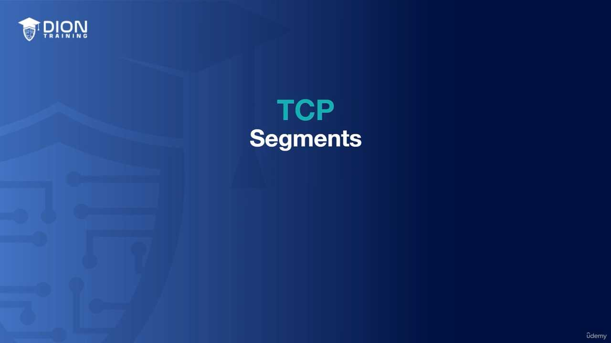

Trong sơ đồ, Router 4 đóng vai trò trung tâm tiếp nhận lưu lượng từ ba hướng:
*   Từ Router 6: 100 Mbps
*   Từ Router 1: 100 Mbps
*   Từ Router 3: 10 Mbps
*   **Tổng lưu lượng vào:** 210 Mbps.

Tuy nhiên, đường truyền duy nhất nối từ Router 4 tới đích (Router 5) chỉ có băng thông là 50 Mbps. Tại đây, một "nút thắt cổ chai" (bottleneck) được hình thành.

### Tại sao lại thiết kế mạng như vậy?
Nhiều người sẽ tự hỏi: Tại sao lại thiết kế một cấu trúc mà đầu vào lớn gấp hơn 4 lần đầu ra như vậy? Câu trả lời nằm ở khái niệm **tận dụng tài nguyên (utilization)**.

Trong thực tế, hiếm khi tất cả các nguồn dữ liệu (Router 1, 3, 6) đều gửi dữ liệu ở mức tải tối đa 100% cùng một lúc. Lưu lượng mạng mang tính chất "bùng nổ" (bursty) – tức là nó tăng vọt trong vài mili giây rồi lại giảm xuống. Thiết kế này tận dụng khả năng lưu trữ tạm thời (buffer) để xử lý các đợt bùng nổ nhỏ mà không gây ra sự cố, đồng thời tiết kiệm chi phí vận hành cho các đường truyền WAN đắt đỏ (thường là kết nối đi ra phía Router 5). Việc chấp nhận sự tắc nghẽn tạm thời và xử lý bằng buffer là một sự đánh đổi khôn ngoan trong kỹ thuật mạng để tối ưu hóa chi phí và hiệu suất trung bình.

Trong phần cuối của bài học này, chúng ta tập trung vào việc quản lý lưu lượng mạng thông qua kỹ thuật "buffer" (bộ đệm) và các thiết bị hoạt động ở Tầng 4 (Layer 4 - Transport Layer) trong mô hình OSI.

### 1. Cơ chế Buffer: Bài toán "nút thắt cổ chai" và tối ưu chi phí
Giảng viên đưa ra một kịch bản giả định: Bạn có nhiều Router (1, 3, 6) gửi dữ liệu về một Router trung tâm (Router 4) để đi ra Internet thông qua một kết nối có giới hạn 50 Mbps.

*   **Trường hợp lưu lượng thấp:** Nếu tổng băng thông từ các thiết bị này (10+30+1 = 41 Mbps) nhỏ hơn giới hạn 50 Mbps của đường truyền ra ngoài, dữ liệu sẽ chảy thông suốt. Không có hàng đợi, không có sự chậm trễ.
*   **Trường hợp bão hòa (Buffer xảy ra):** Nếu Router 1 và 3 đột ngột gửi dữ liệu vượt quá ngưỡng 50 Mbps, Router 4 không thể "xả" hết dữ liệu ra ngoài ngay lập tức. Lúc này, nó sử dụng **Buffer (bộ đệm)**. Nó sẽ giữ lại các gói tin trong bộ nhớ tạm thời, chờ đợi đường truyền ra ngoài rảnh rang, rồi từ từ đẩy tiếp. Đây là giải pháp để tránh việc mất gói tin (packet drop) khi lưu lượng tăng đột biến.

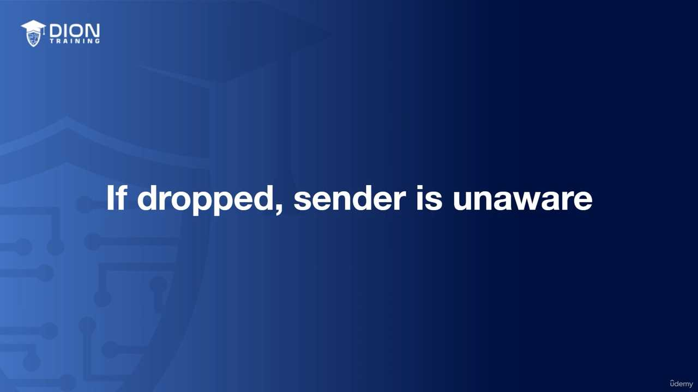

> **💡 Ví dụ nhớ đời:** Hãy tưởng tượng đường truyền 50 Mbps của bạn là một cửa soát vé tại sân vận động chỉ có 1 cổng ra. Nếu 100 người (dữ liệu) cùng chạy ra một lúc, họ sẽ bị kẹt. Cái "Buffer" chính là khu vực chờ ngay trước cửa soát vé. Người soát vé (Router) lần lượt cho từng người qua. Nhờ có khu vực chờ này, không ai bị đuổi về (mất gói tin), họ chỉ cần đợi một chút là ra được bên ngoài.

### 2. Tại sao doanh nghiệp cần kỹ thuật này?
Thay vì phải bỏ ra một số tiền khổng lồ hàng tháng để thuê đường truyền Fiber 1 Gbps (mà có thể phần lớn thời gian bạn không dùng hết), các doanh nghiệp chọn cách thuê đường truyền nhỏ hơn (ví dụ 50 Mbps). Bằng cách hiểu rõ mô hình lưu lượng mạng (network utilization), họ dùng bộ đệm để "làm phẳng" các đỉnh lưu lượng cao điểm. 

Điều này giúp:
*   **Tiết kiệm chi phí vận hành:** Chỉ trả tiền cho băng thông trung bình, không phải băng thông cực đại.
*   **Tối ưu tài nguyên:** Tận dụng tối đa đường truyền hiện có mà không gây nghẽn nghiêm trọng.

Tuy nhiên, với xu hướng băng thông ngày càng rẻ và tốc độ mạng gia đình tăng nhanh, khái niệm này ít quan trọng hơn với người dùng cá nhân (SOHO), nhưng vẫn là "bài toán sống còn" trong kiến trúc hệ thống của các tập đoàn lớn.

### 3. Thiết bị Tầng 4 (Layer 4 - Transport Layer)
Khi nhắc đến Tầng 4, chúng ta đang nói đến tầng truyền tải, nơi chịu trách nhiệm đảm bảo dữ liệu được gửi đi một cách tin cậy hoặc nhanh chóng.

*   **TCP (Transmission Control Protocol):** Giao thức hướng kết nối, đảm bảo dữ liệu đến nơi không bị thiếu, không lỗi.
*   **UDP (User Datagram Protocol):** Giao thức không kết nối, tập trung vào tốc độ, thường dùng cho streaming hoặc game.

Bất kỳ thiết bị nào "nhìn" được vào TCP/UDP đều được gọi là thiết bị Tầng 4. Cụ thể:

*   **WAN Accelerators (Bộ tăng tốc WAN):** Thiết bị này thực hiện nén (compression) các gói tin IP ở tầng thấp, làm giảm dung lượng thực tế phải truyền qua mạng, giúp dữ liệu đi nhanh hơn trên các đường truyền đường dài (WAN).
*   **Load Balancers (Bộ cân bằng tải):** Nó phân phối lưu lượng truy cập giữa nhiều máy chủ. Nó có thể quyết định "gói tin này đi vào server A, gói tin kia đi vào server B" dựa trên thông tin cổng (port) của TCP/UDP.
*   **Firewalls (Tường lửa):** Đây là ứng dụng thực tế phổ biến nhất. Tường lửa lọc traffic dựa trên Port và Protocol. 

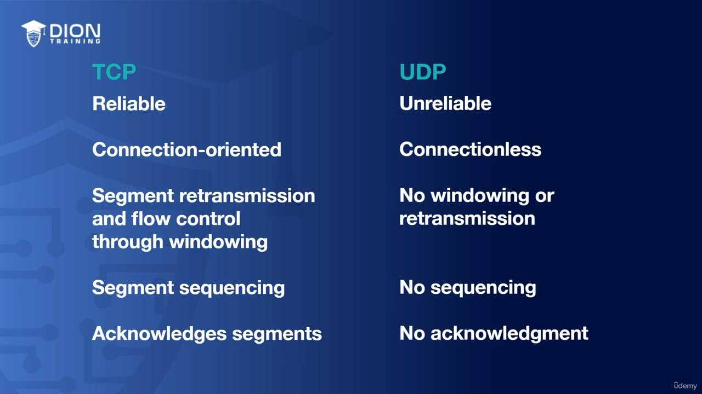

### 4. Giải mã khái niệm "Chặn Port" (Layer 4 Block)
Khi bạn vào cấu hình Firewall và thực hiện lệnh "Block Port 80 (TCP)", bạn đang thực hiện hành động của một thiết bị Tầng 4.
*   **Tại sao lại là Tầng 4?** Vì Port 80 là một thành phần của giao thức TCP (nằm ở Tầng 4). 
*   **Cách thức hoạt động:** Tường lửa kiểm tra header của gói tin, thấy yêu cầu gửi đến Port 80 (HTTP/Web traffic) qua TCP, nó sẽ đối chiếu với luật bạn đã đặt và từ chối (Drop/Reject) gói tin đó ngay tại ngưỡng Tầng 4, không cho phép gói tin đi sâu vào các ứng dụng bên trong (Tầng 5, 6, 7). 

Việc chặn tại Tầng 4 cực kỳ hiệu quả vì nó ngăn chặn sớm các mối đe dọa trước khi chúng kịp tiếp cận tới các dịch vụ đang chạy trên server.

### Hình ảnh minh họa thêm:

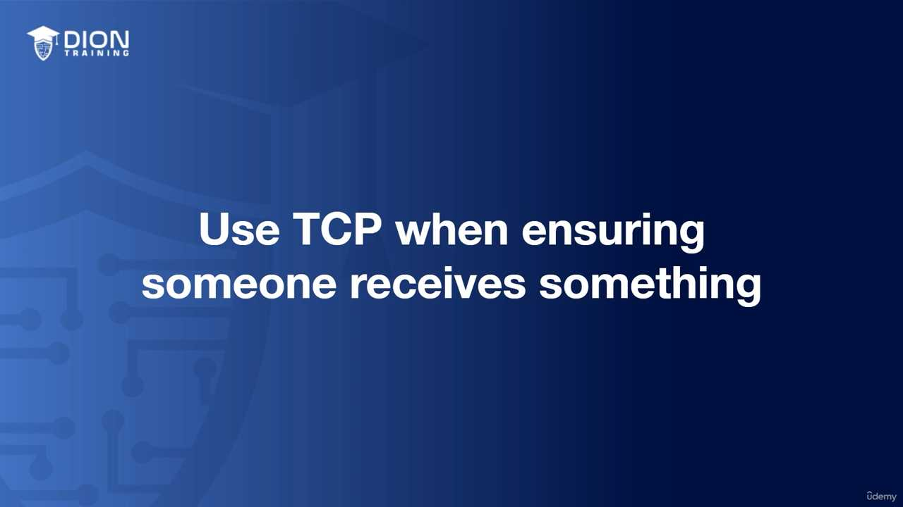
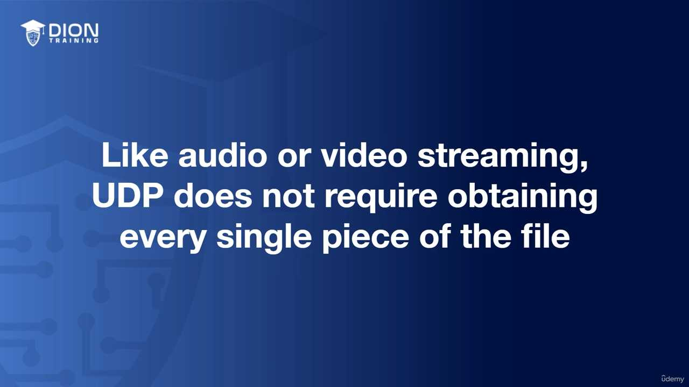
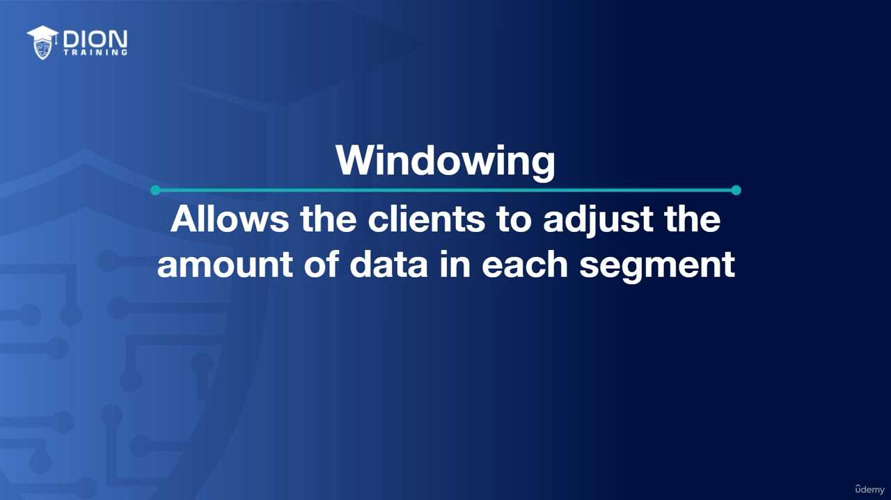
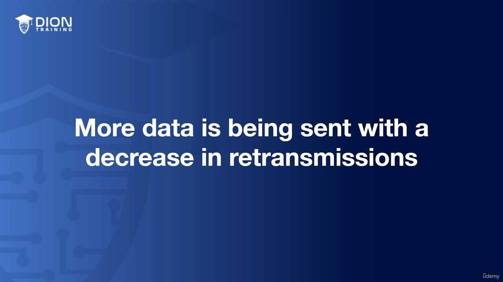
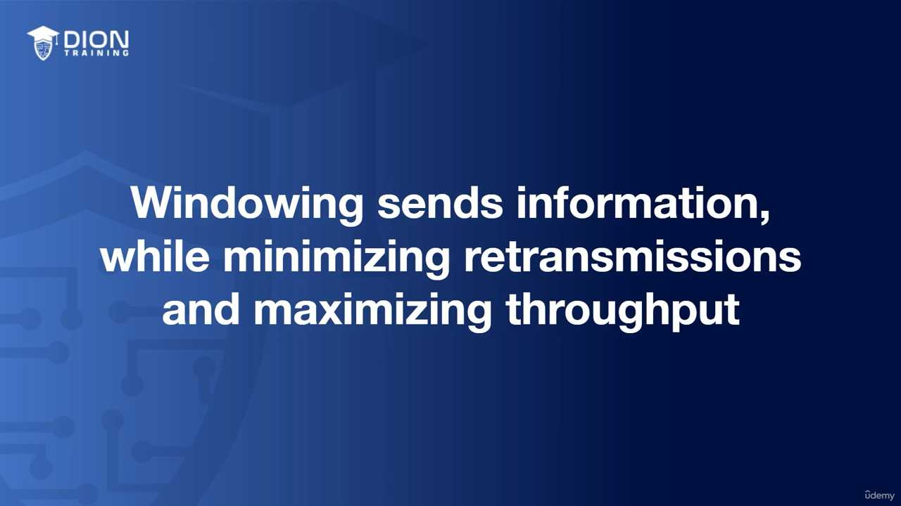
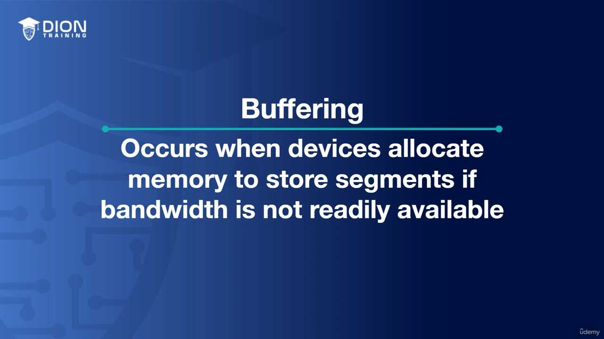
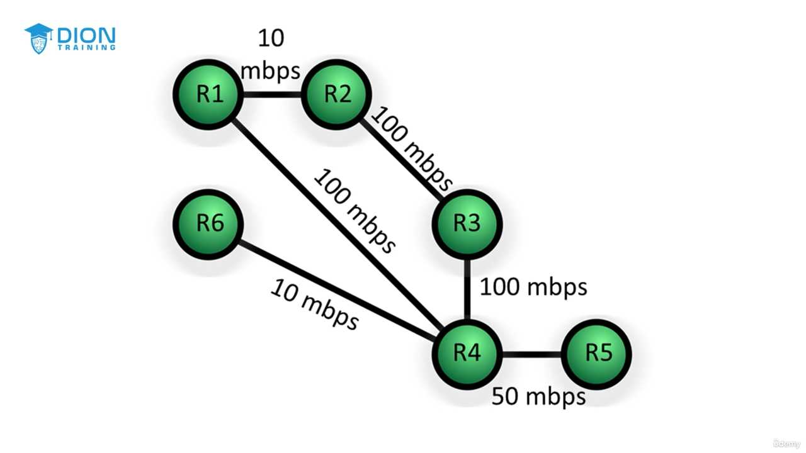
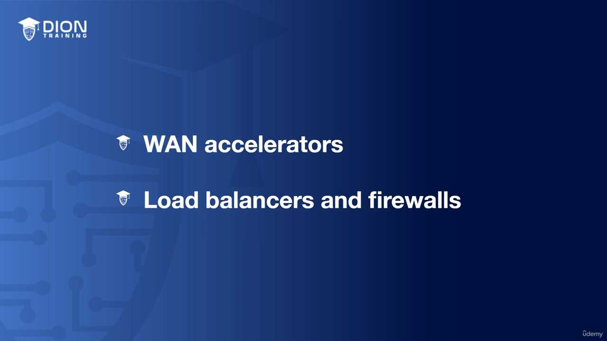

---
*Ghi chú: 17 hình ảnh minh họa (.jpg) đã được tải về và lưu tự động vào thư mục con `image/` cùng cấp với file này. Để ảnh hiển thị tự động, hãy đảm bảo bạn sao chép cả thư mục `image/` nếu bạn muốn di chuyển file markdown sang nơi khác!*
