# Network Layer Routing

### 1. Bản chất của Lớp mạng (Network Layer - Layer 3)
Tại tầng này của mô hình OSI, trọng tâm dịch chuyển từ việc truyền dữ liệu vật lý (tầng 1) hay kết nối giữa các thiết bị cùng phân đoạn (tầng 2) sang **định tuyến (routing)**. Mục tiêu cốt lõi của tầng 3 là xác định con đường tối ưu để dữ liệu đi từ điểm A đến điểm B trong một mạng lưới khổng lồ, sử dụng **địa chỉ logic** làm căn cứ dẫn đường. Không giống như địa chỉ MAC (địa chỉ vật lý, cố định trên card mạng), địa chỉ logic (IP) cho phép thiết kế cấu trúc mạng có phân cấp, giúp các bộ định tuyến (router) hiểu được vị trí của đích đến mà không cần biết đích danh phần cứng.

### 2. Địa chỉ logic: IPv4 và IPv6
Địa chỉ logic là nhãn định danh cho mỗi thiết bị trong mạng, cho phép chúng giao tiếp xuyên qua các biên giới mạng khác nhau.
*   **IPv4 (Internet Protocol version 4):** Sử dụng 32 bit, hiển thị dưới dạng 4 nhóm số thập phân (ví dụ: 192.168.1.1). Đây là nền tảng của Internet trong hàng thập kỷ.
*   **IPv6 (Internet Protocol version 6):** Sử dụng 128 bit, được thiết kế để giải quyết sự cạn kiệt địa chỉ của IPv4, cho phép lượng địa chỉ khổng lồ để đáp ứng kỷ nguyên Internet of Things (IoT).

> **💡 Ví dụ nhớ đời:** Hãy tưởng tượng địa chỉ MAC là số căn cước công dân của bạn (duy nhất, không đổi), còn địa chỉ IP giống như "địa chỉ nhà" của bạn trên bản đồ. Khi bạn chuyển nhà, số căn cước không đổi nhưng địa chỉ nhà phải thay đổi để bưu tá (router) biết được hiện tại bạn đang ở đâu để gửi thư đến.

### 3. Phân biệt "Switching" và "Routing"
Đây là điểm gây nhầm lẫn lớn nhất đối với những người mới học mạng:
*   **Thiết bị Switch (Layer 2):** Là thiết bị vật lý dùng để kết nối các máy tính trong cùng một mạng nội bộ (LAN) dựa trên địa chỉ MAC.
*   **Hành động "Switching" ở Layer 3:** Trong ngữ cảnh kỹ thuật cao cấp, thuật ngữ "switching" đôi khi được dùng để mô tả quá trình chuyển tiếp gói tin (forwarding) của bộ định tuyến. Thực tế, ở Layer 3, hành động chuyển tiếp gói tin từ cổng này sang cổng kia chính là **Routing**.

Sự khác biệt nằm ở phạm vi: Layer 2 làm việc với "phòng ban" (cùng một mạng), còn Layer 3 làm việc với "thành phố" (liên mạng).

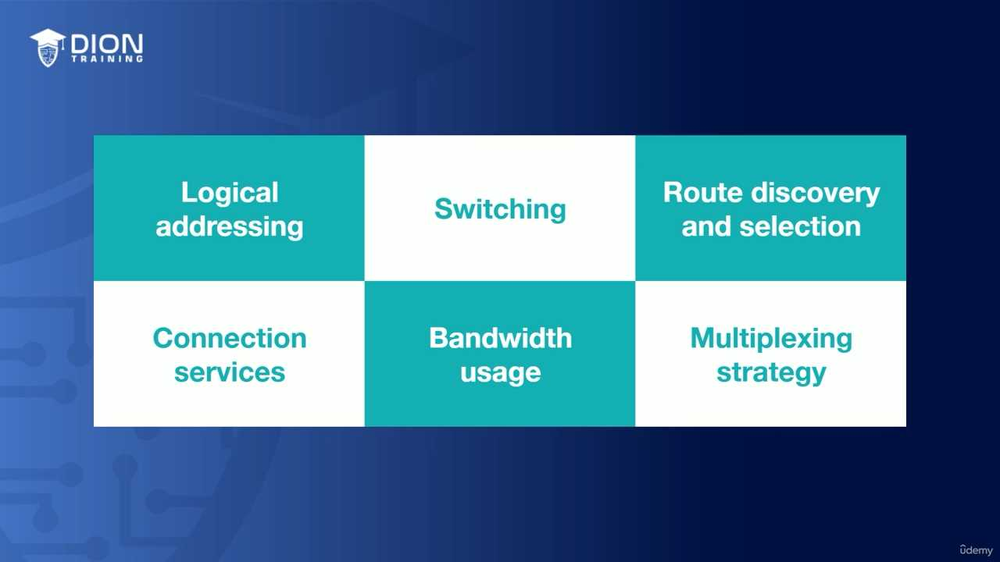
*(Hình ảnh sơ đồ cho thấy luồng dữ liệu đi từ một switch cục bộ vào một router, nơi router đóng vai trò là "người điều phối giao thông" giữa các mạng khác nhau)*

### 4. Khám phá và Lựa chọn đường đi (Route Discovery and Selection)
Làm thế nào một router biết đường đi nào là "ngắn nhất" hoặc "tốt nhất"? Đây là bài toán về **Route Discovery**. Các router sử dụng các giao thức định tuyến để cập nhật bản đồ mạng liên tục. Khi một gói tin đến, router sẽ kiểm tra bảng định tuyến (routing table) để đưa ra quyết định:
*   **Connection Services:** Thiết lập cách thức gói tin được gửi đi (có đáng tin cậy hay không).
*   **Bandwidth Utilization:** Tối ưu hóa băng thông bằng cách chọn đường đi không bị nghẽn.
*   **Multiplexing:** Cho phép nhiều luồng dữ liệu cùng chia sẻ một đường truyền vật lý tại Layer 3.

### 5. Lịch sử của các giao thức định tuyến
Trong quá khứ, thế giới mạng không đồng nhất như bây giờ:
*   **AppleTalk:** Một giao thức độc quyền của Apple, chỉ dành riêng cho các thiết bị của họ.
*   **IPX (Internetwork Packet Exchange):** Giao thức của Novell NetWare, cực kỳ phổ biến trong các doanh nghiệp thập niên 90.

> **💡 Ví dụ nhớ đời:** Hãy coi AppleTalk và IPX là những ngôn ngữ địa phương rất hẹp. Ngày xưa, nếu bạn muốn gửi thư (dữ liệu) cho một người, bạn phải biết họ dùng ngôn ngữ gì. Nhưng sau đó, "Tiếng Anh" xuất hiện – đó chính là **IP (Internet Protocol)**. IP trở thành ngôn ngữ chung, xóa bỏ mọi rào cản, khiến AppleTalk và IPX dần biến mất vì chúng trở nên không cần thiết trong một thế giới mà mọi thiết bị đều có thể nói chuyện bằng IP.

Tại Layer 3 (Network Layer) của mô hình OSI, chúng ta không chỉ có Internet Protocol (IP). Mặc dù IP là giao thức thống trị, nhưng lịch sử mạng máy tính từng chứng kiến sự tồn tại của các giao thức khác như IPX (Internetwork Packet Exchange) của Novell. Tuy nhiên, các giao thức này dần trở nên lỗi thời (legacy systems) và chỉ còn tồn tại trong những hệ thống mạng doanh nghiệp cũ kỹ. Ngày nay, khi nhắc đến Layer 3, IP chính là chuẩn mực tuyệt đối từ mạng Internet toàn cầu cho đến mạng nội bộ gia đình bạn.

IP hiện tại tồn tại dưới hai hình thái chính: IPv4 và IPv6. Trong đó, IPv4 là loại phổ biến nhất mà chúng ta cần làm quen ngay lúc này. 

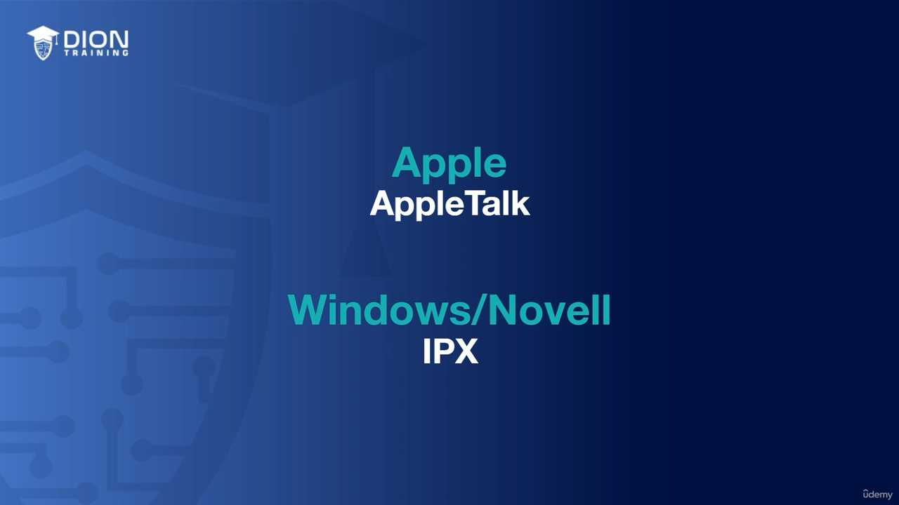

Khi quan sát một địa chỉ IPv4, bạn sẽ thấy nó được hiển thị dưới dạng chuỗi số như `172.16.254.1`. Đây là định dạng "dotted octet notation" (ký hiệu thập phân có dấu chấm). Cấu trúc của nó bao gồm bốn nhóm số (octet), mỗi nhóm cách nhau bởi một dấu chấm. Việc hiểu cách đọc và phân chia địa chỉ này là nền tảng cốt lõi cho các bài học chuyên sâu về định tuyến (routing) sau này.

> **💡 Ví dụ nhớ đời:** Hãy tưởng tượng mỗi chiếc máy tính trong mạng giống như một ngôi nhà. Địa chỉ IPv4 chính là số nhà kèm tên đường, phường, quận và thành phố. Nếu không có địa chỉ cụ thể này, các "người đưa thư" (thiết bị mạng) sẽ không biết phải chuyển gói dữ liệu đến cửa nhà ai trong hàng tỷ ngôi nhà trên thế giới.

Câu hỏi quan trọng nhất tại Layer 3 là: Làm thế nào để luân chuyển dữ liệu hiệu quả qua hệ thống mạng phức tạp? Có ba phương pháp chính để thực hiện việc này:
1. **Packet switching (Chuyển mạch gói):** Đây là phương pháp phổ biến nhất, chính là cơ chế của định tuyến (routing). Dữ liệu được băm nhỏ thành các "gói" (packets), mỗi gói chứa địa chỉ đích (IP address) và được gửi đi độc lập qua mạng.
2. **Circuit switching (Chuyển mạch kênh):** Thiết lập một đường truyền cố định duy nhất từ nguồn đến đích trước khi gửi dữ liệu (giống như hệ thống điện thoại cố định truyền thống).
3. **Message switching (Chuyển mạch thông điệp):** Lưu trữ toàn bộ thông điệp tại các điểm trung chuyển trước khi gửi tiếp (một phương pháp cũ và ít được dùng trong mạng hiện đại do độ trễ cao).

Trong kiến trúc mạng hiện đại, Packet Switching (Routing) là "vua". Cơ chế hoạt động của nó cực kỳ giống với hệ thống bưu chính toàn cầu. Khi bạn gửi một lá thư cho mẹ:
- Bạn viết địa chỉ cụ thể (IP đích) lên phong bì.
- Lá thư không bay thẳng đến nhà mẹ, mà nó được đưa đến bưu cục trung tâm.
- Tại bưu cục, nhân viên sẽ xem địa chỉ để phân loại theo vùng (bang/tỉnh).
- Sau đó, thư được chuyển xuống bưu cục thành phố, rồi đến bưu điện khu vực gần nhà.
- Cuối cùng, nhân viên đưa thư sẽ dựa vào địa chỉ trên phong bì để trao tận tay người nhận.

Trong thế giới mạng, "các bưu cục" chính là các bộ định tuyến (routers). Khi một gói dữ liệu đi vào mạng, mỗi router chỉ nhìn vào địa chỉ IP trên gói tin đó, đối chiếu với bảng định tuyến (routing table) của chính nó để quyết định: "Gói tin này nên được gửi đi hướng nào để đến đích nhanh nhất?". Quá trình này diễn ra liên tục, gói tin được chuyển tiếp từ router này sang router khác (switching) cho đến khi nó cập bến đích cuối cùng. Đây chính là bản chất của việc di chuyển thông tin trong mạng IP.

Trong phần này, chúng ta sẽ đi sâu vào việc phân tích sự khác biệt cốt lõi giữa ba phương thức chuyển mạch dữ liệu: **Packet Switching** (Chuyển mạch gói), **Circuit Switching** (Chuyển mạch kênh) và **Message Switching** (Chuyển mạch thông điệp).

### 1. Phân tích cơ chế Packet Switching (Chuyển mạch gói)
Tác giả bắt đầu bằng cách nhắc lại nguyên lý của *Packet Switching*: dữ liệu không đi theo một lộ trình cố định. Giống như việc bạn gửi nhiều lá thư cùng lúc, mỗi lá thư có thể đi qua các bưu cục khác nhau, thậm chí đến tay người nhận không theo thứ tự. 

*   **Đặc điểm:** Sự linh hoạt là chìa khóa. Mạng lưới không quan tâm con đường cụ thể, miễn là gói tin (packet) đến được đích. 
*   **Hiệu quả:** Cách này giúp tối ưu hóa băng thông vì các gói tin có thể "lách" qua các đường truyền đang rảnh, tránh tắc nghẽn cục bộ. 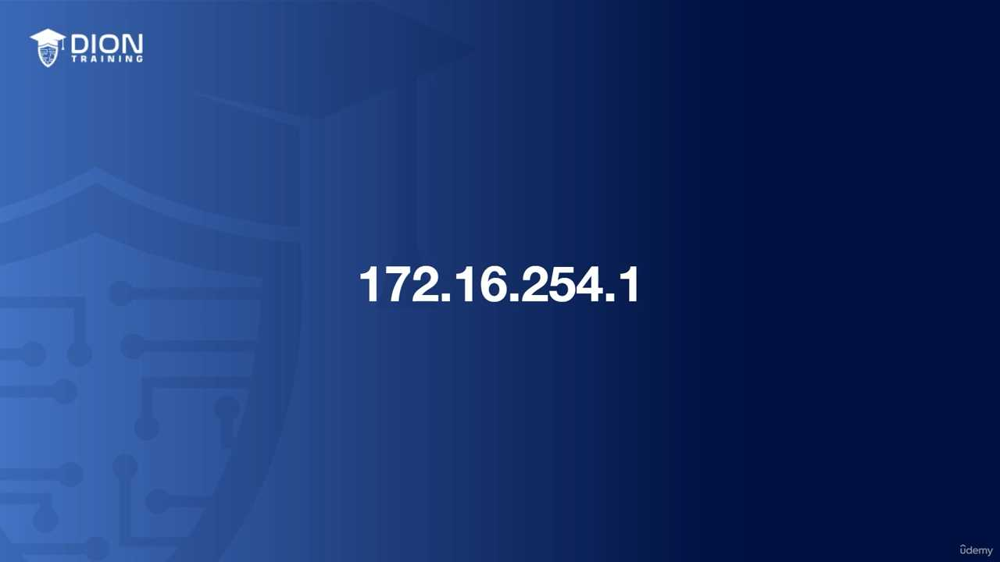 (Hình minh họa: Các gói tin đi theo nhiều con đường khác nhau từ nguồn đến đích).

> **💡 Ví dụ nhớ đời:** Hãy tưởng tượng bạn gửi 100 trang tài liệu cho bạn. Thay vì gửi một phong bì dày cộp (cần một đường chuyển phát riêng biệt), bạn xé nhỏ 100 trang đó, gửi 100 lá thư riêng lẻ. Có những lá đi máy bay, có những lá đi tàu hỏa. Khi đến nơi, bạn chỉ việc sắp xếp lại chúng theo số thứ tự trang. Nếu một lá bị thất lạc, bạn chỉ cần yêu cầu gửi lại duy nhất lá đó, không cần gửi lại cả tập tài liệu.

### 2. Phân tích cơ chế Circuit Switching (Chuyển mạch kênh)
Trái ngược với sự linh hoạt của chuyển mạch gói, *Circuit Switching* đòi hỏi sự ổn định tuyệt đối về đường truyền. Đây là cách thức vận hành của mạng điện thoại truyền thống.

*   **Tính chất:** Khi bạn nhấc điện thoại, một "kênh truyền ảo" (dedicated path) được thiết lập giữa bạn và người nghe. 
*   **Độc quyền:** Trong suốt cuộc hội thoại, con đường đó được "giữ chỗ" riêng cho bạn. Không ai khác có thể chen vào hoặc sử dụng tài nguyên của đường dẫn đó cho đến khi bạn gác máy.
*   **Hệ quả:** Nếu bạn im lặng, đường truyền vẫn tồn tại và lãng phí băng thông, nhưng bù lại, chất lượng âm thanh ổn định và không bao giờ bị trễ do nghẽn mạng trên các tuyến đường khác.

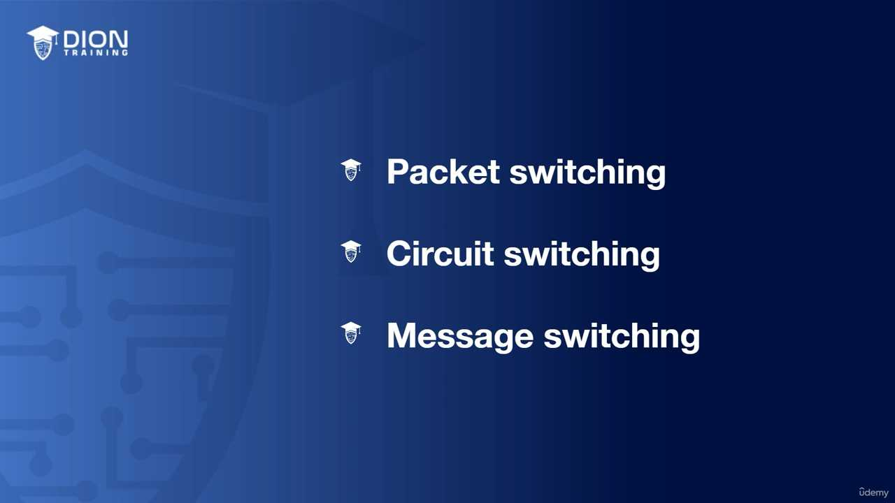 (Hình minh họa: Một đường ống trực tiếp nối giữa hai thiết bị, loại bỏ mọi sự can thiệp từ các thiết bị khác).

> **💡 Ví dụ nhớ đời:** Chuyển mạch kênh giống như việc bạn thuê một xe taxi riêng đi từ nhà đến sân bay. Toàn bộ con đường đó là của riêng bạn, không ai được phép lên xe giữa chừng. Cho dù bạn ngủ gật trên xe (không truyền dữ liệu), chiếc taxi đó vẫn không chở ai khác cho đến khi bạn xuống xe.

### 3. Phân tích cơ chế Message Switching (Chuyển mạch thông điệp)
Đây là khái niệm then chốt thứ ba. *Message Switching* khác biệt ở khả năng **"Store and Forward"** (Lưu trữ và Chuyển tiếp).

*   **Cách thức:** Thay vì chia nhỏ dữ liệu thành các gói tin nhỏ xíu như *Packet Switching*, dữ liệu được gom thành các "thông điệp" (message) hoàn chỉnh.
*   **Sự khác biệt về thời gian:** Ở *Packet Switching*, nếu một nút mạng (node) không thể nhận dữ liệu ngay lập tức, dữ liệu đó thường bị loại bỏ (shredded) để tránh làm nghẽn hệ thống. Nhưng với *Message Switching*, các nút mạng có khả năng "giữ lại" thông điệp (ví dụ: bưu cục đóng cửa vào Chủ nhật, thư nằm yên ở đó).
*   **Ứng dụng thực tế:** Đây chính là nền tảng của hệ thống Email hiện đại. Email của bạn được gửi đi, đến một server trung gian, nằm ở đó, rồi khi server đích sẵn sàng, nó sẽ tiếp tục chuyển đi.

> **💡 Ví dụ nhớ đời:** Chuyển mạch thông điệp giống như việc bạn gửi một món hàng qua dịch vụ chuyển phát nhanh. Nếu kho trung chuyển của hãng vận chuyển đóng cửa vào cuối tuần, kiện hàng của bạn không bị "hủy bỏ". Nó được nằm an toàn trong kho (Store) cho đến sáng thứ Hai, khi nhân viên làm việc trở lại, họ mới tiếp tục hành trình vận chuyển kiện hàng đó đến đích (Forward). Đó là sự khác biệt giữa việc "hỏng dữ liệu" (nếu là packet switching) và "trì hoãn dữ liệu" (message switching).

### Phân tích sâu về Cơ chế Chuyển mạch và Định tuyến trong Mạng máy tính

Trong phần này, bài giảng chuyển dịch từ các khái niệm nền tảng về chuyển mạch sang việc giải quyết bài toán cốt lõi: Làm thế nào để dữ liệu biết đường đi đến đích?

#### 1. Sự thống trị của Packet Switching (Chuyển mạch gói)
Mặc dù *message switching* (chuyển mạch thông điệp) có tính hữu ích nhất định, nhưng thực tế hiện nay, **packet switching** là "ông vua" của thế giới mạng. Lý do cốt lõi không nằm ở tốc độ đơn thuần mà nằm ở **khả năng phục hồi (resilience)**. Trong chuyển mạch gói, dữ liệu được chia nhỏ thành các gói (packets). Nếu một gói tin bị mất hoặc hỏng trên đường đi, các giao thức ở tầng cao hơn (như TCP) sẽ phát hiện ra và yêu cầu gửi lại (retransmit) gói đó qua một đường dẫn khác.

Trong khi đó, *circuit switching* (chuyển mạch kênh - như điện thoại truyền thống) đòi hỏi một đường truyền cố định được giữ riêng biệt. Nếu đường đó đứt, cuộc gọi ngắt quãng. Đối với các mạng cục bộ (LAN) tại nhà hay văn phòng, packet switching mang lại hiệu suất tối ưu vì nó tận dụng băng thông một cách linh hoạt, không lãng phí tài nguyên khi không truyền dữ liệu.

[CHÈN_ẢNH_MINH_HỌA: Sơ đồ so sánh: Packet Switching (dữ liệu chia nhỏ đi nhiều đường) vs Circuit Switching (đường dây nối trực tiếp từ A tới B)]

> **💡 Ví dụ nhớ đời:** Hãy tưởng tượng bạn gửi một bức thư dày 100 trang. Với *Circuit Switching*, bạn phải thuê một người đưa thư chạy theo một con đường cố định, nếu con đường đó bị chặn bởi biểu tình, người đưa thư đứng chờ tại đó đến khi đường thông. Với *Packet Switching*, bạn chia 100 trang đó thành 100 phong bì nhỏ, gửi chúng qua 100 con đường khác nhau. Dù một vài phong bì bị lạc, bạn vẫn có thể gửi lại riêng các phong bì đó, và người nhận sẽ gom chúng lại theo số thứ tự để hoàn thiện bức thư.

#### 2. Định tuyến: Bản đồ và Cách chọn lộ trình
Khi mạng lưới trở nên phức tạp, các bộ định tuyến (router) đóng vai trò như các trạm chỉ đường. Mỗi router sở hữu một **Routing Table (Bảng định tuyến)**. Đây là một cơ sở dữ liệu nội tại lưu trữ thông tin về các mạng đích và "cổng" (gateway) hoặc giao diện tốt nhất để đi đến đó dựa trên địa chỉ IP.

Có hai cách để "điền" vào bảng định tuyến này:
*   **Static Route (Tuyến tĩnh):** Quản trị viên mạng tự tay nhập đường đi. Cách này cực kỳ ổn định nhưng cứng nhắc, không thể tự thích ứng nếu hạ tầng mạng thay đổi.
*   **Dynamic Route (Tuyến động):** Sử dụng các giao thức định tuyến (Routing Protocols) như **RIP, OSPF, EIGRP**. Đây là "bộ não" tự động giúp các router "nói chuyện" với nhau.

[CHÈN_ẢNH_MINH_HỌA: Hình ảnh minh họa bảng định tuyến (Routing Table) với các cột Destination, Next Hop, và Interface]

#### 3. Bài toán chọn đường: Tư duy thuật toán
Bài giảng đặt ra tình huống tại router số 5, muốn đến router số 1. Có nhiều đường đi khả thi (5-4-1 hoặc 5-4-3-2-1). Sự khác biệt nằm ở **Metric** – chỉ số đo lường "độ tốt" của một con đường (có thể là độ trễ thấp nhất, băng thông cao nhất, hoặc số lượng router đi qua ít nhất).

Các giao thức định tuyến động liên tục trao đổi thông tin ("Hello packets") để cập nhật trạng thái mạng. Nếu một đường dây bị quá tải hoặc bị cắt, các router sẽ ngay lập tức tính toán lại lộ trình tối ưu mới mà không cần sự can thiệp của con người.

> **💡 Ví dụ nhớ đời:** Hãy coi các router là những nút giao thông. Giao thức định tuyến động giống như ứng dụng Google Maps trên điện thoại của bạn. Google Maps không chỉ dựa vào khoảng cách địa lý (tuyến tĩnh) mà nó liên tục nhận dữ liệu từ hàng triệu người dùng khác để biết: "À, đoạn đường này đang tắc nghẽn, hãy rẽ sang lối nhỏ này, dù xa hơn 2km nhưng lại nhanh hơn 10 phút". Chính sự linh hoạt đó giúp lưu lượng dữ liệu trên internet luôn thông suốt ngay cả khi có các sự cố cục bộ xảy ra.

### 1. Cơ chế Định tuyến và Lựa chọn Đường đi (Route Discovery & Selection)
Trong mạng máy tính, các Router không làm việc đơn độc. Chúng liên tục giao tiếp với nhau để hiểu rõ "bản đồ" mạng tại thời điểm hiện tại. Khi một con đường bị tắc nghẽn (congestion), Router không chỉ đứng yên nhìn gói tin bị nghẽn lại mà chúng sẽ chủ động trao đổi thông tin để tối ưu hóa lộ trình. 

Đây là quá trình **Route Discovery** (Khám phá tuyến đường) và **Route Selection** (Lựa chọn tuyến đường). Hãy tưởng tượng các Router giống như những trạm điều phối giao thông thông minh trên đường cao tốc; nếu làn đường chính xảy ra tai nạn, chúng sẽ điều hướng xe cộ sang các tuyến đường phụ để đảm bảo lưu lượng di chuyển thông suốt nhất có thể.

### 2. Dịch vụ Kết nối (Connection Services) tại Layer 3
Tại Layer 3 (Network Layer), chúng ta bổ sung các dịch vụ để tăng cường độ tin cậy so với những gì Layer 2 đã cung cấp. Một trong những tính năng cốt lõi ở đây là **Flow Control** (Kiểm soát lưu lượng). 

> **💡 Ví dụ nhớ đời:** Hãy tưởng tượng bạn đang nhận hàng từ một băng chuyền. Nếu người gửi đẩy hàng đến quá nhanh trong khi bạn không kịp sắp xếp vào kệ, hàng hóa sẽ bị đổ và hư hỏng. Flow Control đóng vai trò như một tín hiệu điều khiển băng chuyền: khi bạn thấy quá tải, bạn ra dấu "Dừng lại/Chậm lại", khi bạn đã sẵn sàng, bạn ra dấu "Tăng tốc lên". Điều này giúp tránh việc làm tràn bộ đệm (buffer) của thiết bị nhận.

### 3. Tái sắp xếp gói tin (Packet Reordering)
Internet không phải là một đường ống thẳng tắp mà là một mạng lưới chằng chịt. Khi một tệp tin lớn được chia nhỏ thành các gói tin (packets), chúng có thể đi theo các con đường khác nhau để tới đích nhằm tận dụng tối đa băng thông. Kết quả là, gói tin số 5 có thể đến trước gói tin số 1.

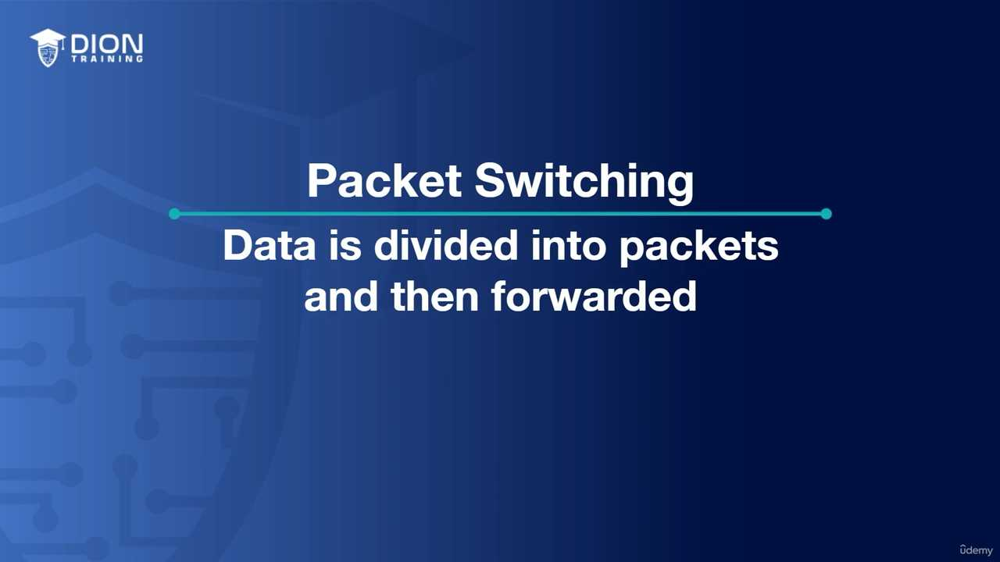 *(Sơ đồ mô tả một tệp gốc bị chia nhỏ thành các gói đánh số 1-5, đi qua các hướng khác nhau, đến đích theo thứ tự 1-5-2-4-3 và sau đó được sắp xếp lại thành 1-2-3-4-5)*

Nhờ vào việc mỗi gói tin đều được gán số thứ tự (sequencing), thiết bị nhận có khả năng thông minh để "lắp ghép" lại các mảnh vỡ đó theo đúng trình tự logic ban đầu. Nếu không có cơ chế này, dữ liệu khi đến nơi sẽ là những mảnh rời rạc, hỗn loạn và không thể đọc được.

### 4. Giao thức ICMP (Internet Control Message Protocol)
Sau khi đã hiểu cách truyền tin và xử lý lỗi, chúng ta cần một công cụ để chẩn đoán. Đó chính là **ICMP**. Thay vì truyền tải dữ liệu người dùng (như văn bản hay video), ICMP được sử dụng để truyền tải thông tin vận hành và báo lỗi giữa các thiết bị mạng.

**Công cụ Ping:**
Đây là ứng dụng phổ biến nhất của ICMP. Khi bạn gõ lệnh "ping example.com", máy tính của bạn sẽ gửi một gói tin "Echo Request" đến máy chủ đích. Nếu máy chủ đó hoạt động bình thường, nó sẽ gửi ngược lại một gói tin "Echo Reply".

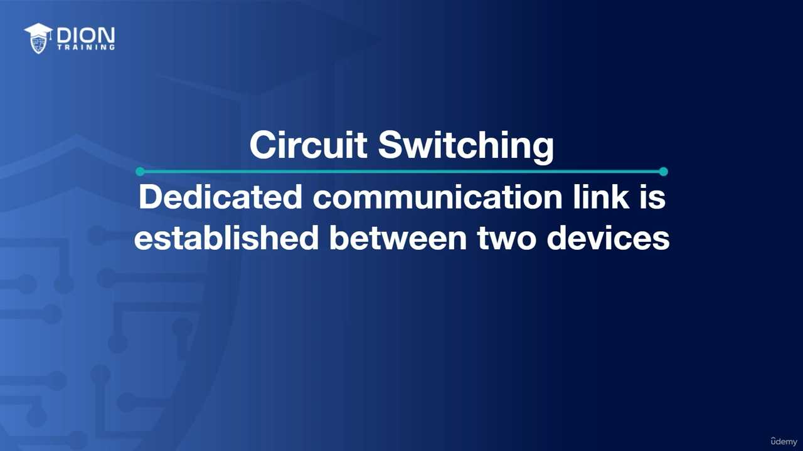 *(Giao diện dòng lệnh - Terminal - hiển thị kết quả lệnh Ping đến một trang web, kèm theo thông số thời gian phản hồi (ms) và trạng thái gói tin đã nhận/mất)*

Thông qua Ping, quản trị viên mạng có thể ngay lập tức biết được:
*   Đích đến có đang "sống" hay không.
*   Thời gian trễ (latency) của mạng là bao nhiêu.
*   Có gói tin nào bị mất (packet loss) trong quá trình truyền hay không.

Đây là công cụ "thần thánh" đầu tiên mà bất kỳ chuyên gia IT nào cũng phải nắm lòng để kiểm tra tính kết nối cơ bản của một hệ thống mạng.

Để hiểu cách thức hoạt động của lớp 3 (Network Layer) trong mô hình OSI, trước hết chúng ta cần phân tích công cụ "Ping" và "Traceroute" – những trợ thủ đắc lực nhất của quản trị viên mạng.

Khi bạn thực hiện lệnh ping, máy tính sẽ gửi đi một gói tin (packet) nhỏ gọi là ICMP Echo Request. Bản chất của lệnh này là "hỏi thăm" thiết bị ở phía xa: "Bạn có đó không?". Nếu nhận được phản hồi, hệ thống sẽ xác nhận trạng thái "Up" (đang hoạt động) và đo đạc thời gian trễ (latency). Trong đoạn transcript, tác giả nhấn mạnh rằng đây là công cụ chuẩn mực để kiểm tra sự kết nối giữa các điểm trong mạng.

> **💡 Ví dụ nhớ đời:** Hãy tưởng tượng bạn gửi một lá thư cho một người bạn qua đường bưu điện và yêu cầu họ gửi lại một tấm thiệp xác nhận ngay khi nhận được. Nếu tấm thiệp quay lại tay bạn, bạn biết con đường bưu điện đang hoạt động tốt. Ping chính là lá thư đó, và thời gian từ lúc gửi đến lúc nhận lại chính là "độ trễ" (latency) của mạng.

Tiếp theo là **Traceroute**. Nếu Ping chỉ trả lời "Có" hoặc "Không", thì Traceroute lại là một hành trình chi tiết. Nó không chỉ hỏi đích đến, mà còn hỏi từng "trạm trung chuyển" (router) trên đường đi. Nó thực hiện hàng loạt các lệnh ping tới từng bước nhảy (hop) để chỉ ra chính xác vị trí nào trong chuỗi đang bị nghẽn hoặc bị lỗi.

Về các thiết bị hoạt động ở lớp 3, chúng ta cần ghi nhớ các "gương mặt tiêu biểu":

**1. Router (Bộ định tuyến):**
Đây là thiết bị chủ chốt trong sơ đồ mạng. Trong các bản vẽ kỹ thuật, router luôn được ký hiệu bằng một hình tròn với bốn mũi tên chỉ vào tâm. 
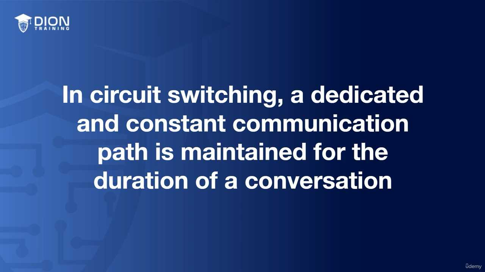
Hình ảnh này đại diện cho khả năng tiếp nhận dữ liệu từ nhiều hướng và định hướng nó đến đích một cách tối ưu.

**2. Multi-layer Switch (Switch đa lớp):**
Đây là một thiết bị "lai". Nếu một switch thông thường chỉ hoạt động ở lớp 2 (chỉ biết địa chỉ MAC), thì Multi-layer Switch sở hữu "trí thông minh" của một router (hiểu địa chỉ IP - lớp 3). Nó giúp tăng tốc độ chuyển mạch trong khi vẫn có khả năng định tuyến dữ liệu.
*Lưu ý quan trọng cho kỳ thi:* Mặc định, một thiết bị được gọi là "switch" thì bạn phải mặc định nó là Layer-2. Nó chỉ trở thành Layer-3 khi đề bài khẳng định rõ ràng đó là "Multi-layer switch".

**3. Giao thức ở lớp 3:**
*   **IPv4 và IPv6:** Đây là các ngôn ngữ chung (giao thức) định danh cho mọi thiết bị trên mạng toàn cầu. Chúng là trái tim của Layer-3.
*   **ICMP (Internet Control Message Protocol):** Đây là giao thức hỗ trợ. Nó không mang dữ liệu người dùng (như web hay email), mà nó mang các "thông điệp điều khiển" để chẩn đoán lỗi, ví dụ như thông báo "Destination Unreachable" (Không thể tìm thấy đích đến).

Tóm lại, khi đứng trước các câu hỏi thi về Layer-3, hãy luôn ưu tiên phản xạ ngay đến **IP** (giao thức) và **Router** (thiết bị). Đây chính là hai cột trụ vững chắc nhất đại diện cho toàn bộ chức năng của tầng mạng: Định tuyến (Routing) và Định danh (Addressing). Bất cứ khi nào bạn thấy một thiết bị có khả năng "xử lý địa chỉ IP", đó chính là thiết bị lớp 3.

### Hình ảnh minh họa thêm:

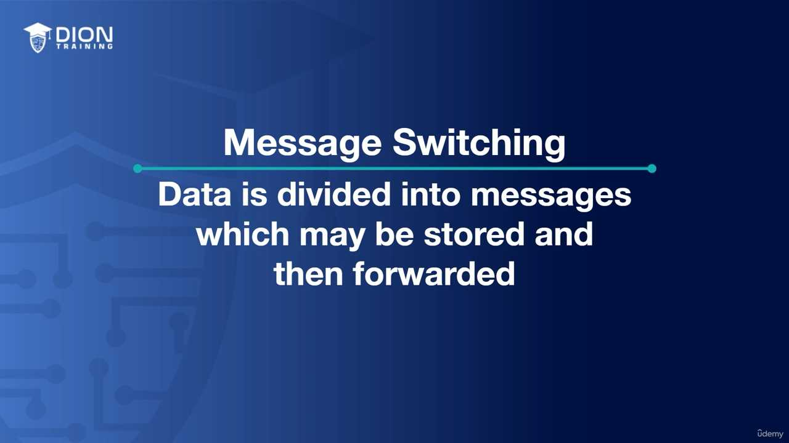
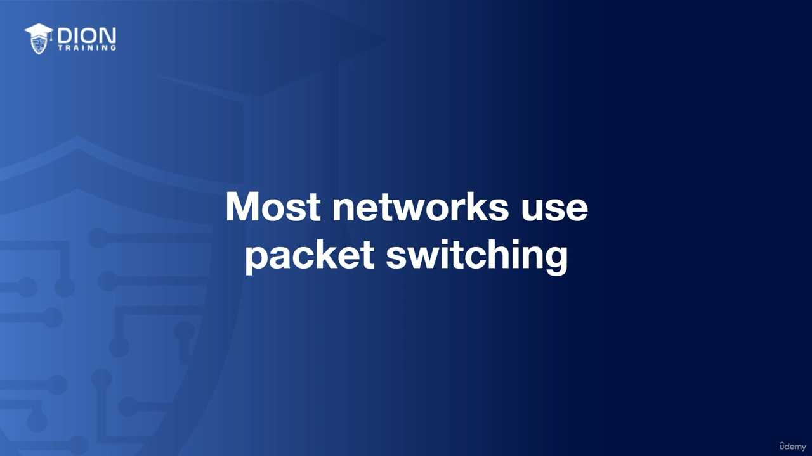
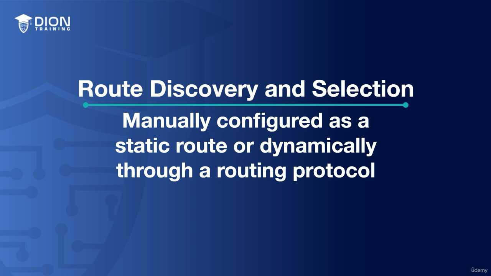
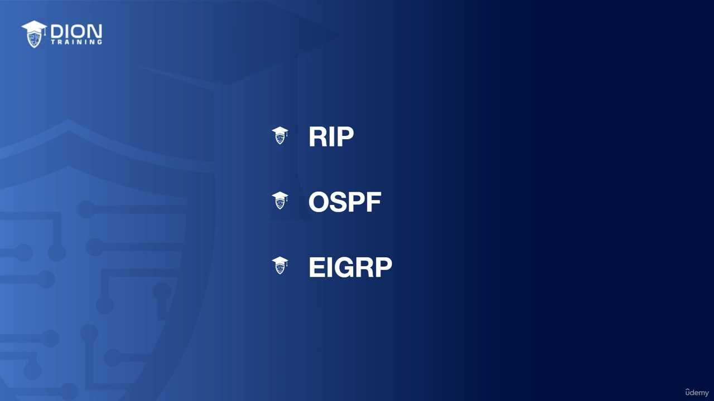
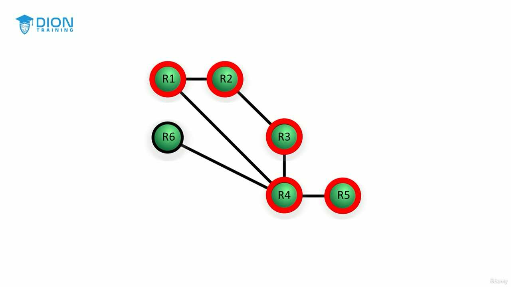
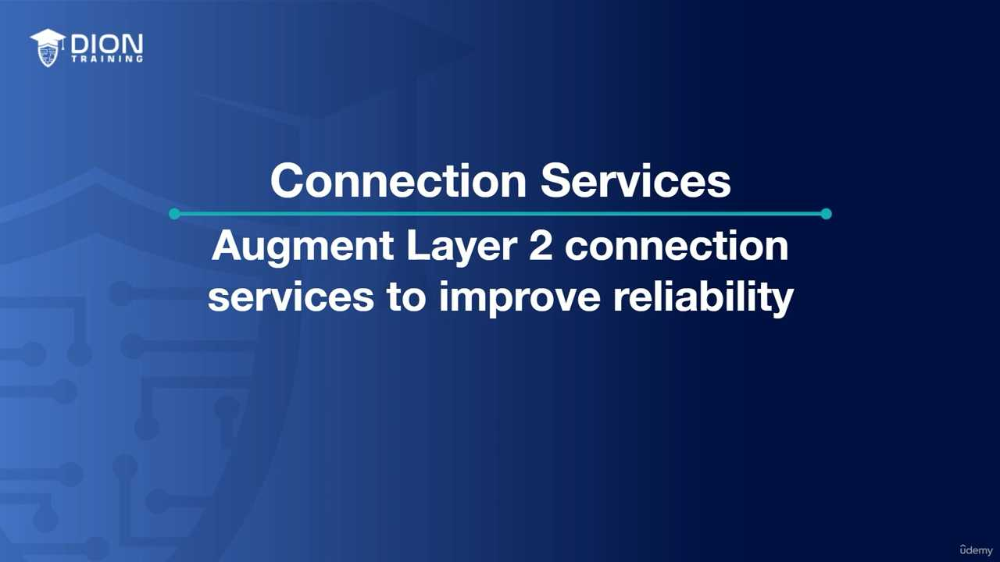
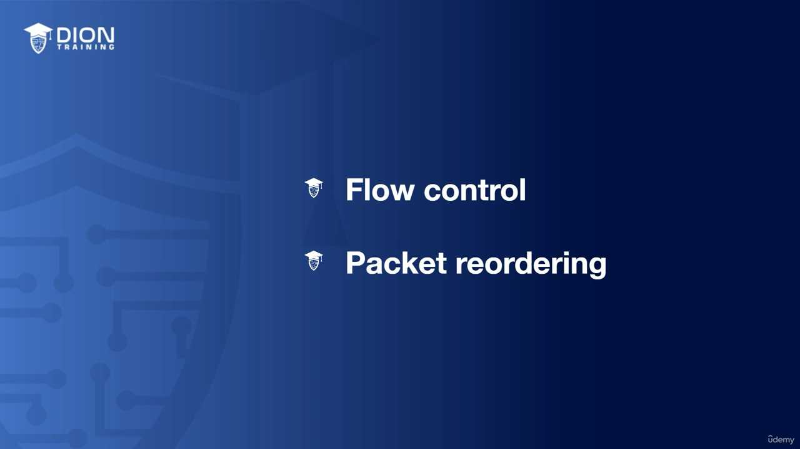
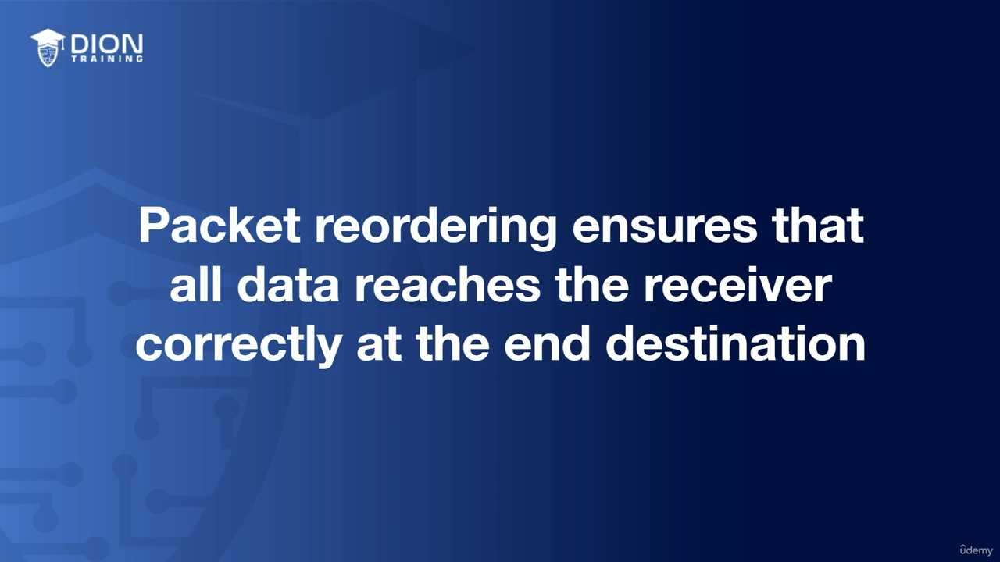
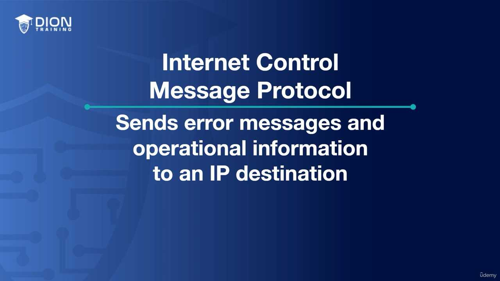
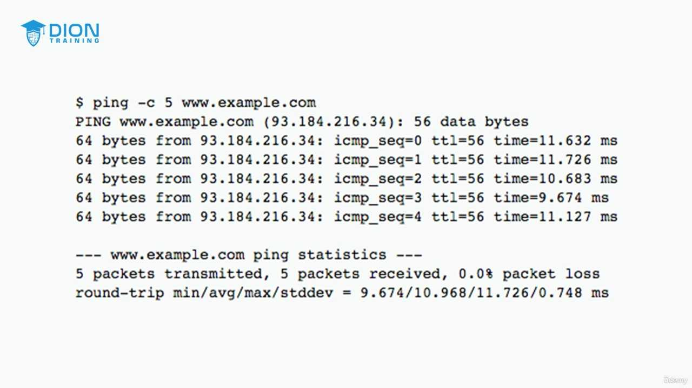
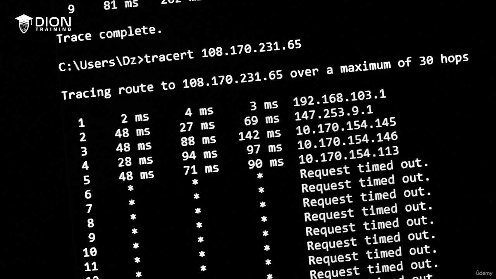
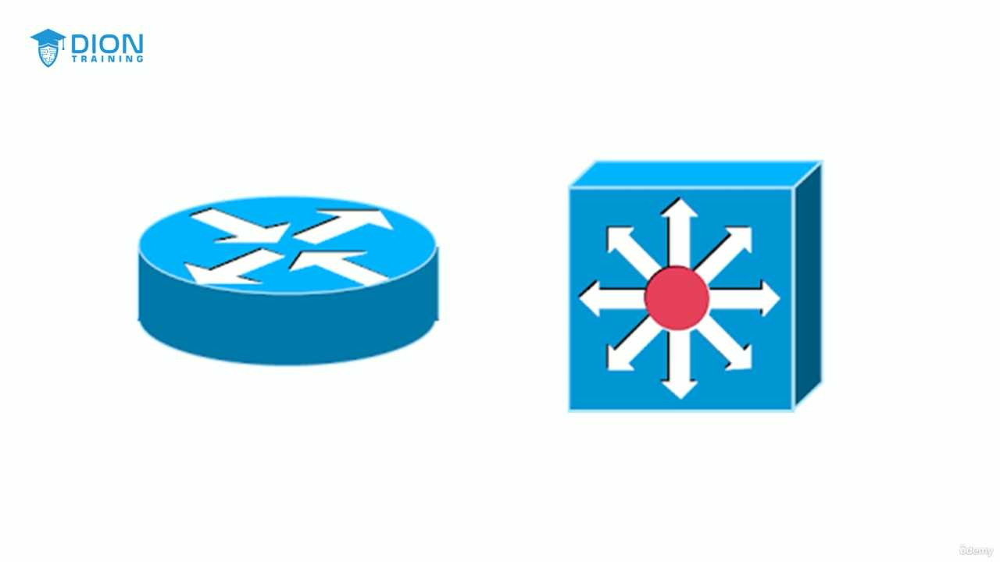

---
*Ghi chú: 19 hình ảnh minh họa (.jpg) đã được tải về và lưu tự động vào thư mục con `image/` cùng cấp với file này. Để ảnh hiển thị tự động, hãy đảm bảo bạn sao chép cả thư mục `image/` nếu bạn muốn di chuyển file markdown sang nơi khác!*
