# OSI Model Overview

### Hướng dẫn học tập: Mô hình OSI (Phần 1 - Tổng quan & Tầm quan trọng)

--- 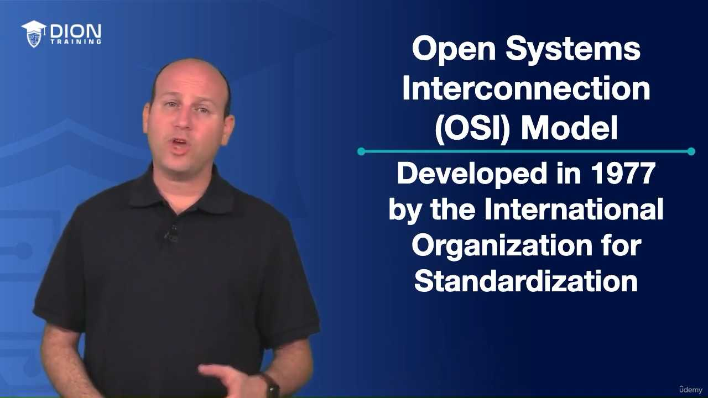

### 1. Khái niệm Mô hình OSI là gì?

**OSI** là viết tắt của **Open Systems Interconnection** (Mô hình kết nối các hệ thống mở). Đây là một mô hình kiến trúc mạng được **International Organization for Standardization (ISO)** – Tổ chức Tiêu chuẩn hóa Quốc tế – phát triển vào năm 1977. 

* **Tại sao gọi là ISO?** Tổ chức này tạo ra hàng loạt các chuẩn quốc tế. Tên các chuẩn này thường có định dạng là "ISO" kèm theo một dãy số.
* **Ví dụ:** **ISO 7498** chính là mã chuẩn dành riêng cho mô hình OSI.
* **Lưu ý cho kỳ thi:** Bạn không cần phải học thuộc lòng các dãy số ISO (như 7498), nhưng cần hiểu rằng trong thế giới công nghệ thông tin, mọi thành phần, giao thức hay thiết bị đều phải tuân thủ một chuẩn chung để có thể "nói chuyện" được với nhau.

> **💡 Ví dụ nhớ đời:** Hãy tưởng tượng ISO giống như "Luật giao thông quốc tế". Dù bạn lái xe ở Mỹ hay ở Việt Nam, nếu tất cả mọi người đều tuân thủ quy tắc đèn đỏ dừng, đèn xanh đi, thì dù là xe của hãng Ford hay Toyota, tất cả đều lưu thông an toàn trên cùng một hệ thống đường bộ.

--- 

### 2. Các tên gọi khác

Ngoài tên gọi chính thức, mô hình này còn được gọi là:

* **OSI Model:** Tên thông dụng nhất.
* **OSI Stack:** Một cách gọi khác nhấn mạnh vào cấu trúc xếp chồng 7 lớp của nó.
* **OSI Reference Model:** Mô hình tham chiếu (đây là cách gọi phản ánh đúng bản chất nhất của nó trong thực tế hiện nay).

--- 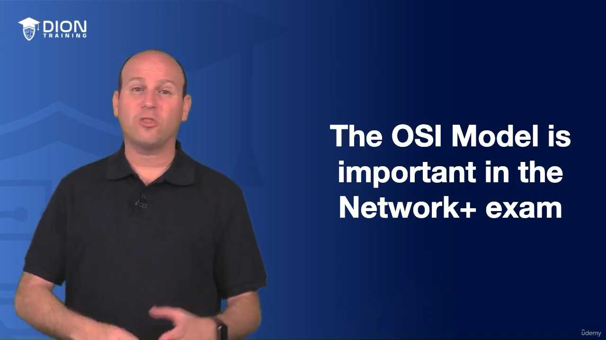

### 3. Tại sao Mô hình OSI lại quan trọng?

Đây là nền tảng cốt lõi trong chứng chỉ **Network+**. Tầm quan trọng của nó bao gồm:

* **Ngôn ngữ chung:** Nó cung cấp một ngôn ngữ thống nhất để các kỹ sư mạng mô tả các thành phần và bộ phận của hệ thống mạng. 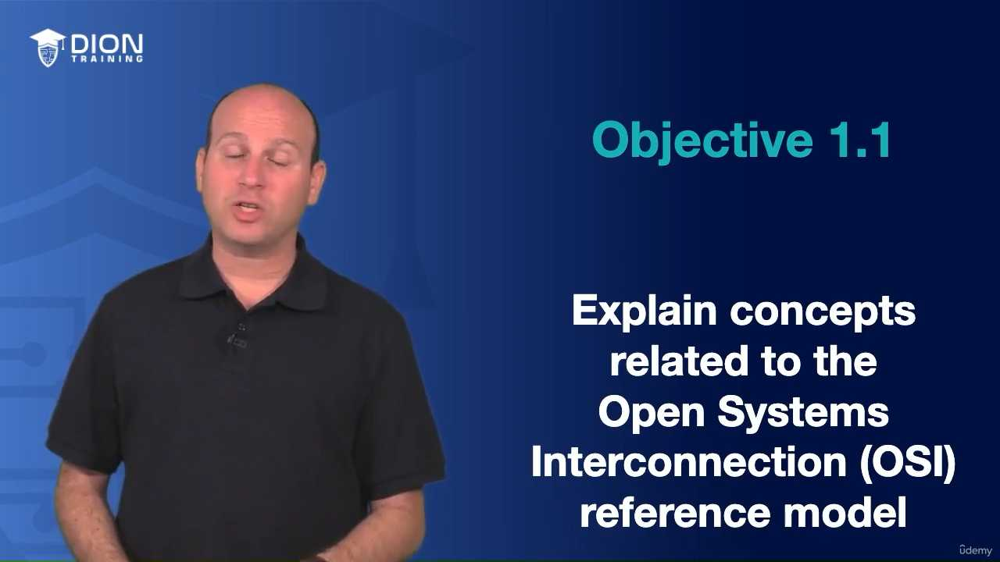
* **Công cụ xử lý sự cố (Troubleshooting):** Khi mạng gặp sự cố, việc chia nhỏ hệ thống thành 7 lớp giúp bạn thu hẹp phạm vi tìm kiếm. 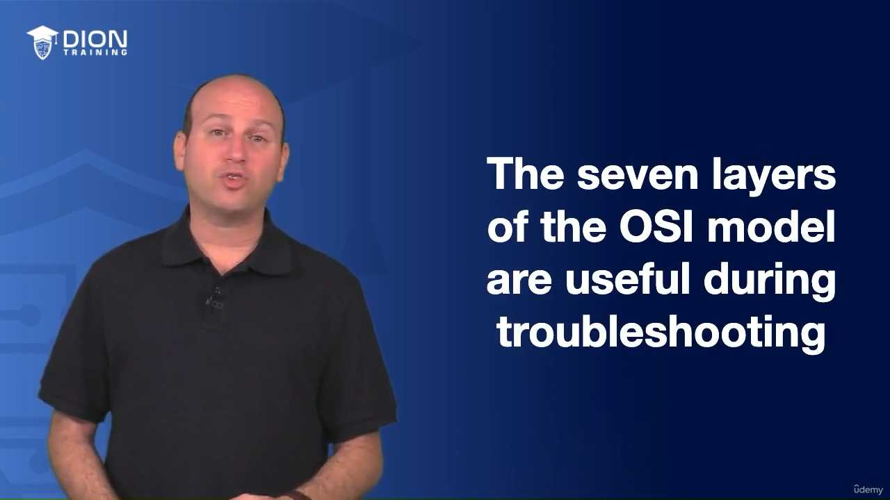 Thay vì kiểm tra "tất cả mọi thứ", bạn có thể kiểm tra từng lớp một để tìm chính xác nơi lỗi phát sinh.
* **Tính linh hoạt:** Là một "mô hình tham chiếu", nó giúp phân loại chức năng của bất kỳ công nghệ mạng nào. 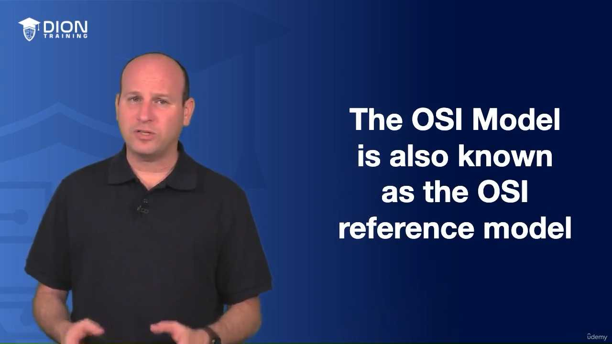

--- 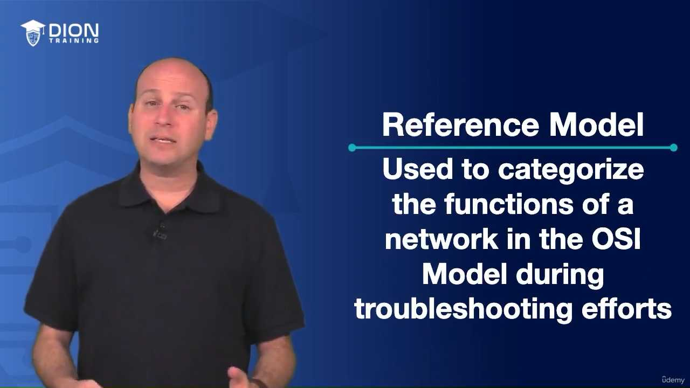

### 4. Mối quan hệ giữa OSI và thực tế (TCP/IP)

Dù OSI rất quan trọng, nhưng thực tế các mạng hiện đại ngày nay vận hành dựa trên **mô hình TCP/IP**. 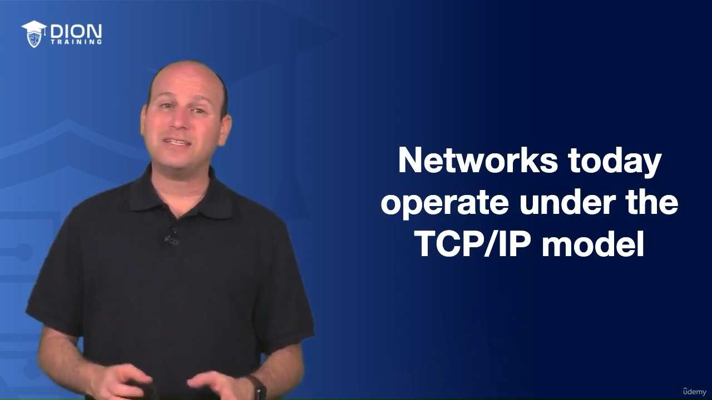

* **Tại sao vẫn học OSI?** Vì OSI mang tính chất "tổng quát". Nó là công cụ chuẩn để so sánh các thiết bị từ các nhà sản xuất khác nhau. 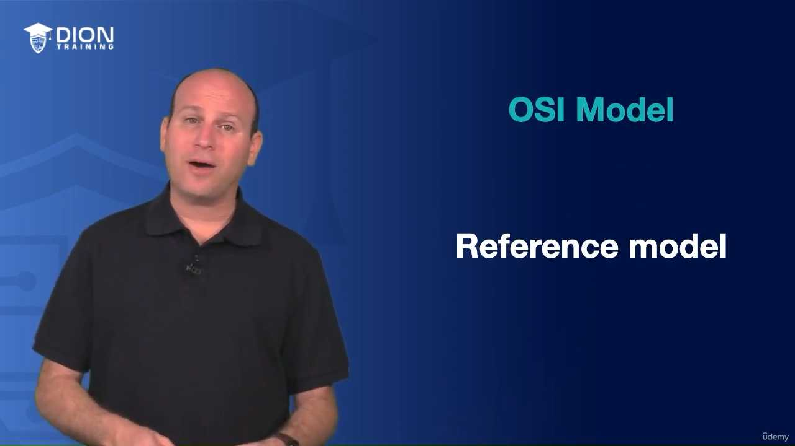

--- 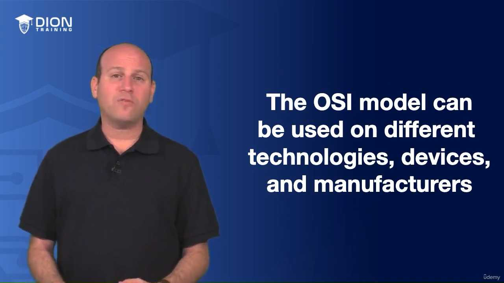

### 5. Cấu trúc 7 lớp của Mô hình OSI

Bạn bắt buộc phải ghi nhớ 7 lớp này theo đúng thứ tự (từ dưới lên trên hoặc từ trên xuống dưới): 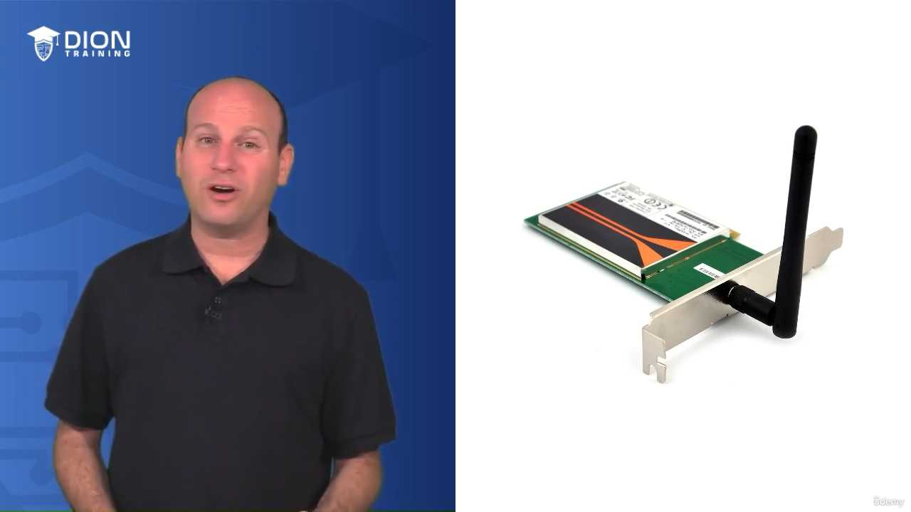

1. **Lớp 7 (Application):** Lớp ứng dụng.
2. **Lớp 6 (Presentation):** Lớp trình bày.
3. **Lớp 5 (Session):** Lớp phiên.
4. **Lớp 4 (Transport):** Lớp vận chuyển.
5. **Lớp 3 (Network):** Lớp mạng.
6. **Lớp 2 (Data Link):** Lớp liên kết dữ liệu.
7. **Lớp 1 (Physical):** Lớp vật lý.

---

### 1. Mẹo ghi nhớ 7 lớp của mô hình OSI (Mnemonic)

* **Công thức "Pizza":** **P**lease **D**o **N**ot **T**hrow **S**ausage **P**izza **A**way. 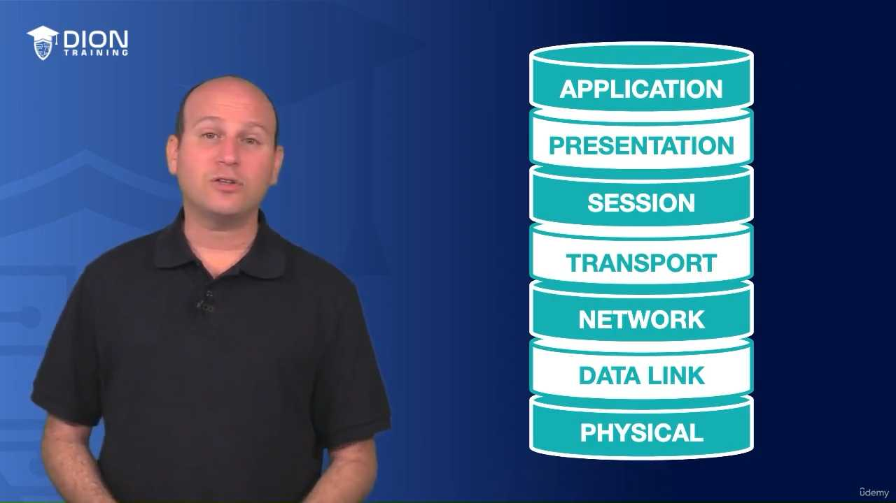

### 3. Sự thay đổi của Dữ liệu (PDU) qua các lớp

Khi dữ liệu di chuyển qua các tầng, tên gọi của nó thay đổi theo luồng thiết kế mạng.  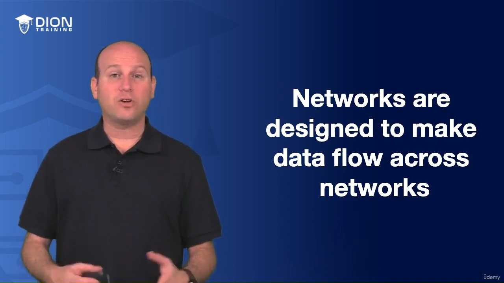

* **Tầng 7, 6, 5:** Data
* **Tầng 4:** Segment
* **Tầng 3:** Packet
* **Tầng 2:** Frame
* **Tầng 1:** Bits

---

### 1. Mẹo ghi nhớ PDU

Sử dụng câu: **"Do Some People Fear Birthdays?"** 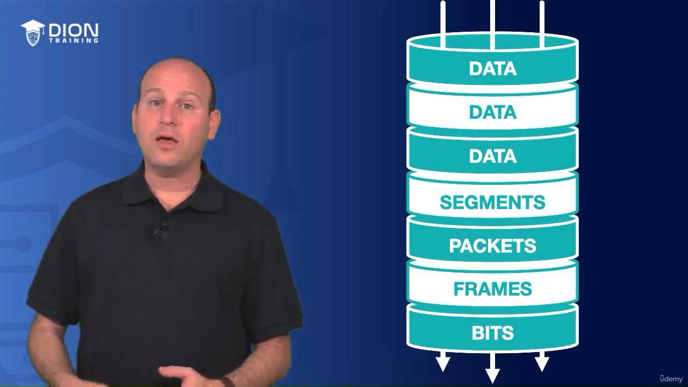

### 5. Lộ trình học tập tiếp theo

Chúng ta sẽ đi chi tiết từng lớp và quy trình đóng gói.  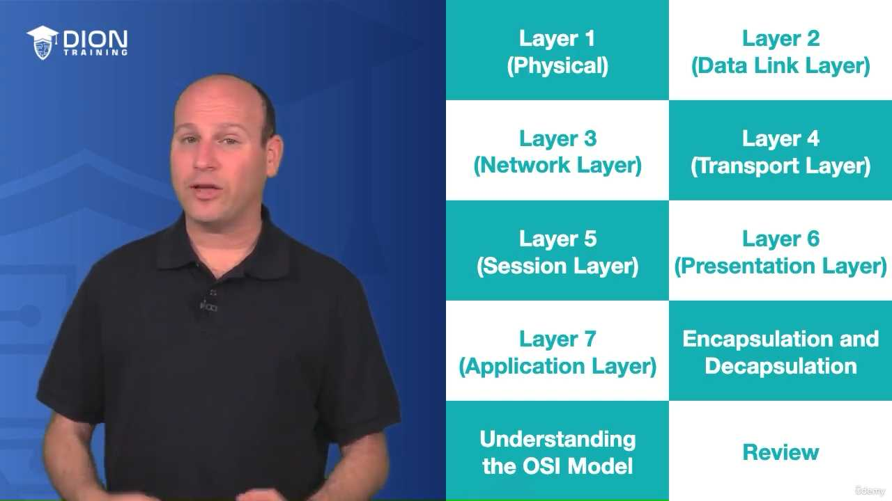

---

*Ghi chú: 20 hình ảnh minh họa (.jpg) đã được tải về và lưu tự động vào thư mục con `image/` cùng cấp với file này. Để ảnh hiển thị tự động, hãy đảm bảo bạn sao chép cả thư mục `image/` nếu bạn muốn di chuyển file markdown sang nơi khác!*
