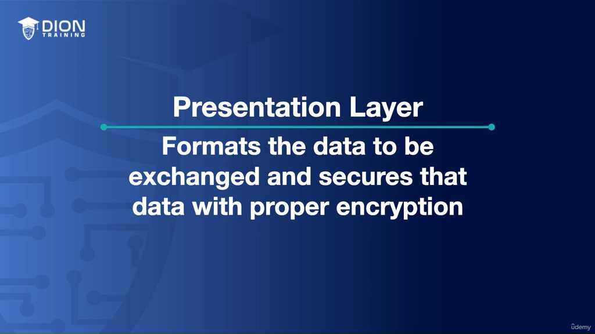
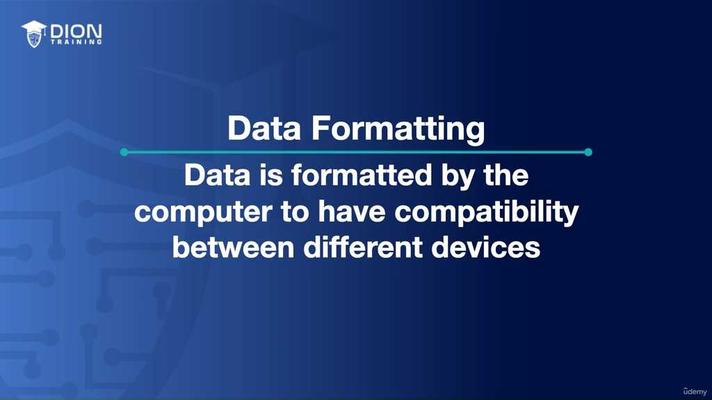
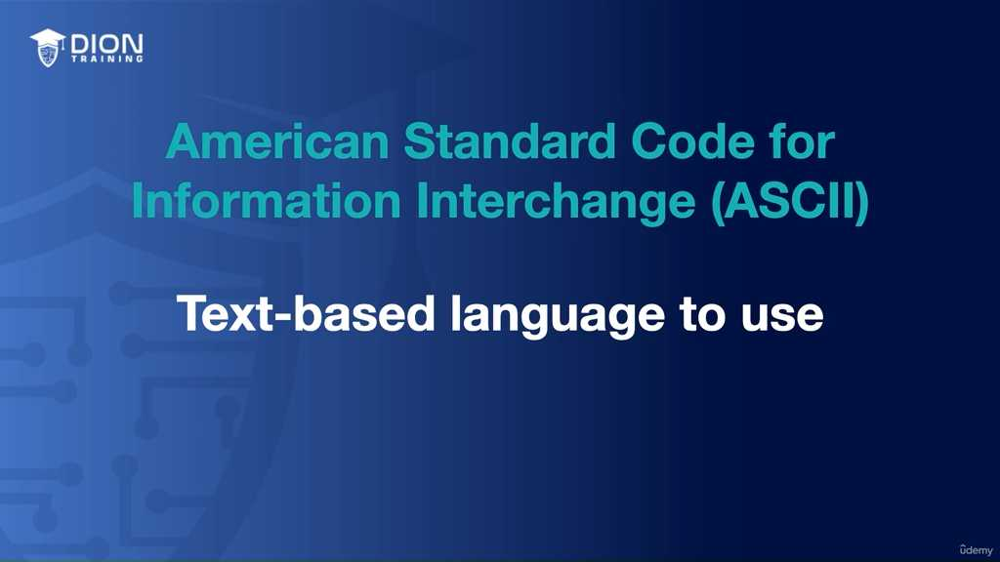
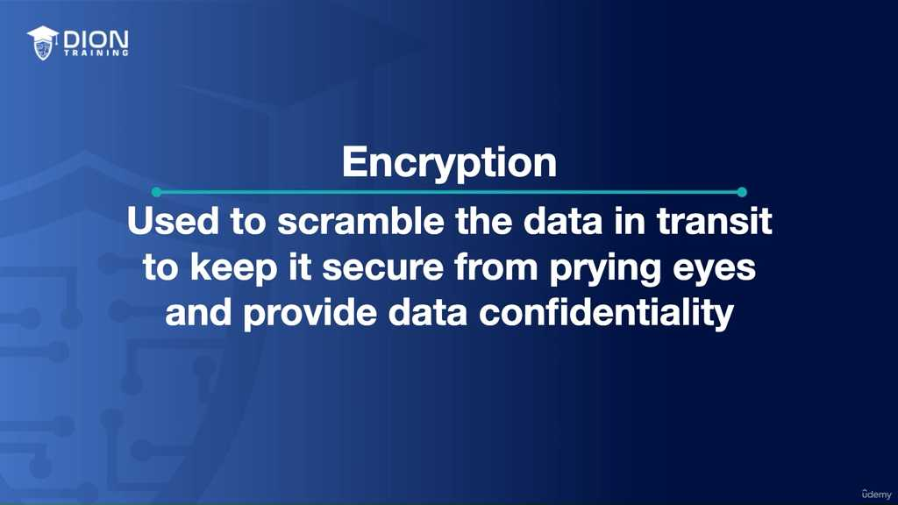
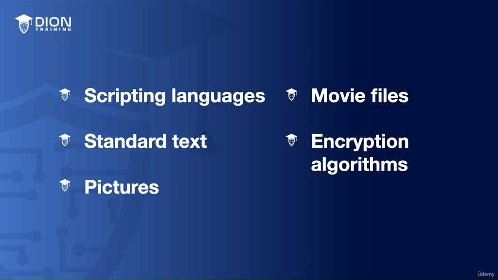
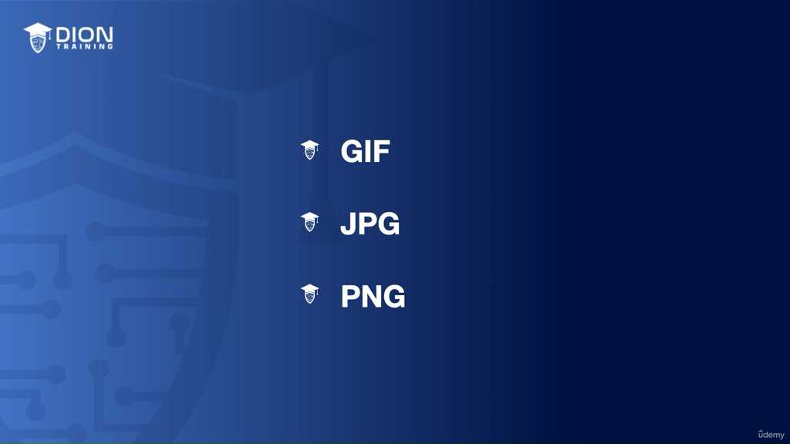
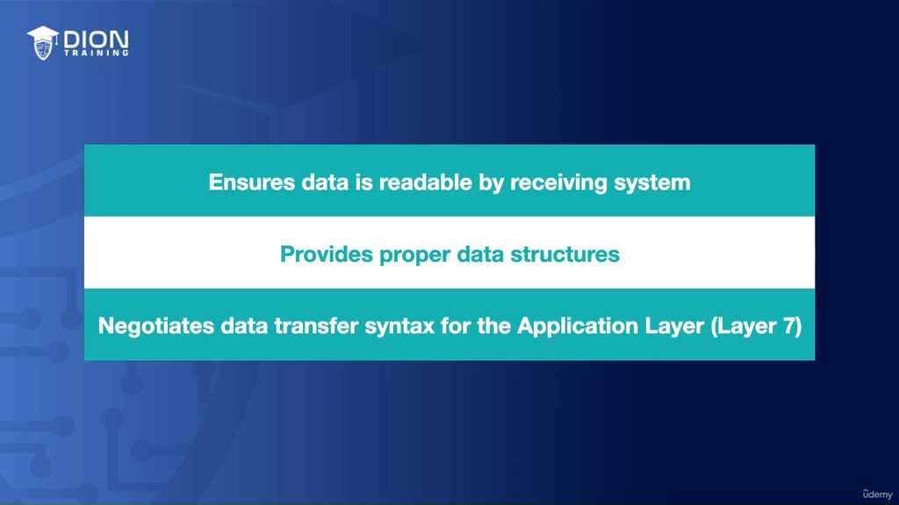

# Presentation Layer Overview

### Layer 6: Presentation Layer (Lớp Trình diễn)

Lớp trình diễn (Presentation Layer) là lớp thứ 6 trong mô hình OSI.  Nhiệm vụ cốt lõi của lớp này là đóng vai trò như một "bộ phiên dịch" và "bộ bảo vệ" cho dữ liệu. Mục tiêu chính là đảm bảo rằng dữ liệu được định dạng theo một chuẩn nhất định để các thiết bị khác nhau có thể hiểu nhau, đồng thời bảo mật dữ liệu đó thông qua mã hóa.

---

### 1. Chức năng chính: Định dạng dữ liệu (Data Formatting)
Trong môi trường mạng, các thiết bị đến từ các nhà sản xuất khác nhau, sử dụng hệ điều hành khác nhau.  Lớp 6 đảm nhận vai trò chuẩn hóa dữ liệu từ các dãy số nhị phân (0 và 1) thành các định dạng mà máy tính có thể xử lý và hiển thị một cách thống nhất.

*   **Tầm quan trọng của định dạng:** Nếu không có lớp này, một tệp tin hình ảnh hoặc văn bản trên máy tính A có thể trở thành một dãy ký tự vô nghĩa trên máy tính B. Lớp 6 thiết lập các "quy tắc ngôn ngữ chung" để dữ liệu được truyền tải đồng nhất.
*   **Các chuẩn văn bản phổ biến:**
    *   **ASCII (American Standard Code for Information Interchange):**  Đây là hệ thống mã hóa văn bản cơ bản nhất. Mỗi ký tự, chữ cái hoặc biểu tượng được gán cho một giá trị số cụ thể.
    *   **Các chuẩn khác:** Unicode, EBCDIC.

> **💡 Ví dụ nhớ đời:** ASCII đóng vai trò như một bảng "từ điển quốc tế", nơi cả hai bên đều đồng ý rằng ký hiệu "65" chắc chắn là chữ "A".

---

### 2. Chức năng chính: Mã hóa dữ liệu (Encryption)
Lớp 6 chịu trách nhiệm đảm bảo tính bảo mật (Confidentiality) của dữ liệu trong quá trình truyền tải trên mạng. 

*   **Cơ chế:** Dữ liệu gốc được "xáo trộn" bằng các thuật toán phức tạp để biến thành dữ liệu mã hóa.
*   **Giao thức tiêu biểu - TLS (Transport Layer Security):** Thiết lập một "đường hầm bảo mật" để bảo vệ thông tin nhạy cảm.

---

### 3. Các thành phần thuộc tầng Presentation
Để quản lý dữ liệu hiệu quả, lớp 6 phân loại các loại hình dữ liệu thành các chuẩn định dạng cụ thể: 

*   **Ngôn ngữ lập trình:** HTML, XML, PHP, JavaScript.
*   **Định dạng hình ảnh:**  GIF, JPEG, PNG, TIFF, SVG.
*   **Định dạng video:** MP4, MPEG, MOV.

---

### 4. Vai trò điều phối
Lớp 6 đóng vai trò cầu nối quan trọng: 
*   Đảm bảo dữ liệu đọc được bởi hệ thống tiếp nhận.
*   Cung cấp cấu trúc dữ liệu phù hợp.
*   Đàm phán cú pháp chuyển đổi dữ liệu cho Lớp 7 (Application Layer).

---

### Tổng kết các từ khóa cần nhớ (Key Takeaways)
Khi nhắc đến **Lớp 6 - Presentation Layer**, bạn cần lập tức liên tưởng đến 2 từ khóa:
1.  **Data Formatting (Định dạng dữ liệu):** Đảm bảo sự tương thích.
2.  **Encryption (Mã hóa):** Đảm bảo tính bảo mật, chống lại sự tò mò của kẻ xấu (TLS, SSL...).

---
*Ghi chú: 7 hình ảnh minh họa (.jpg) đã được tải về và lưu tự động vào thư mục con `image/` cùng cấp với file này. Để ảnh hiển thị tự động, hãy đảm bảo bạn sao chép cả thư mục `image/` nếu bạn muốn di chuyển file markdown sang nơi khác!*
