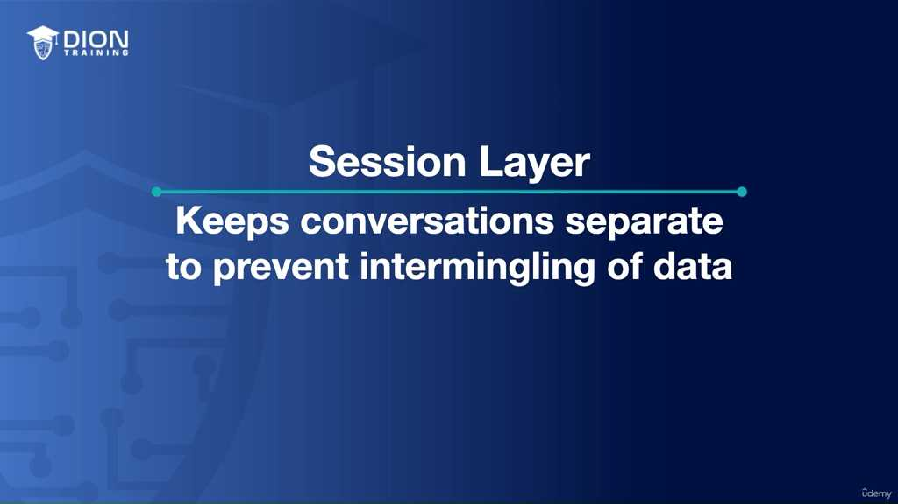
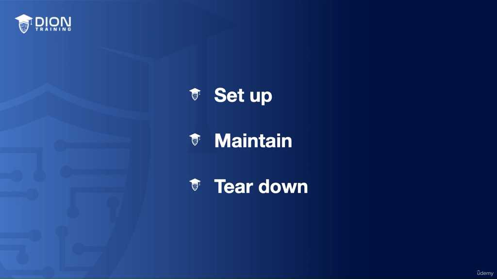
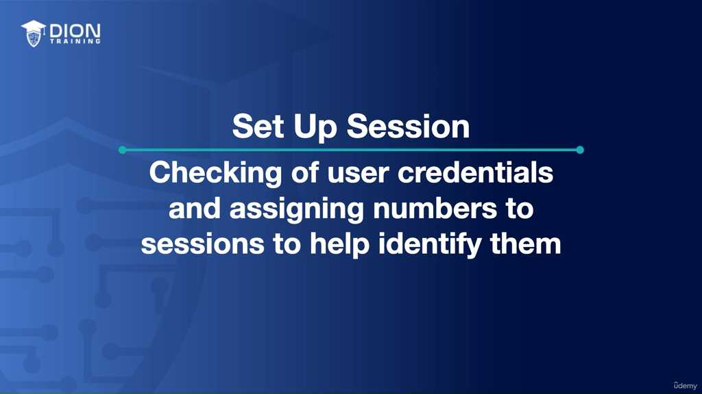
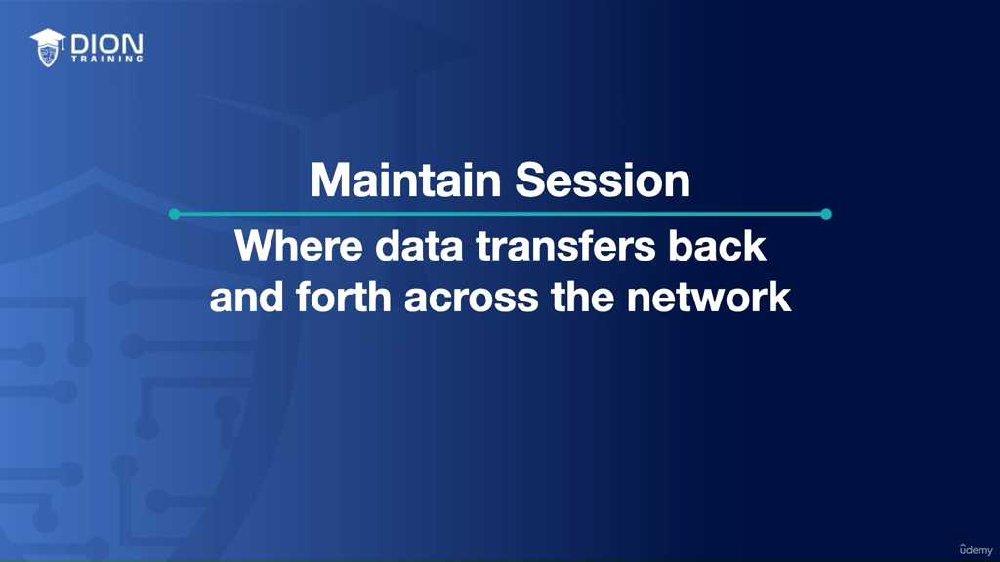
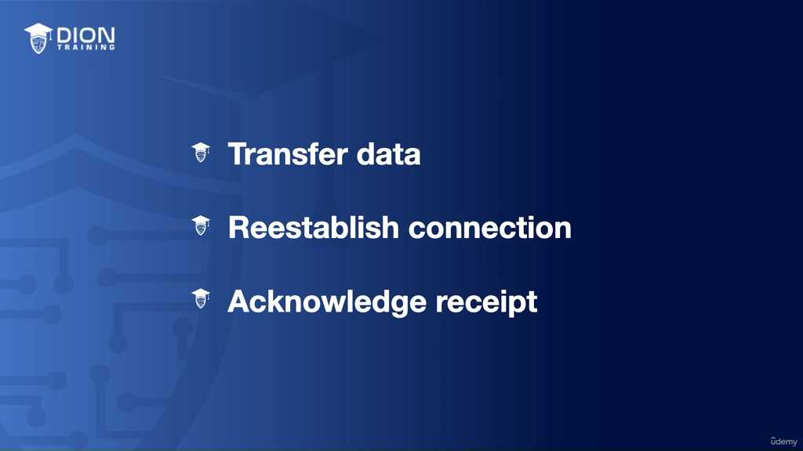
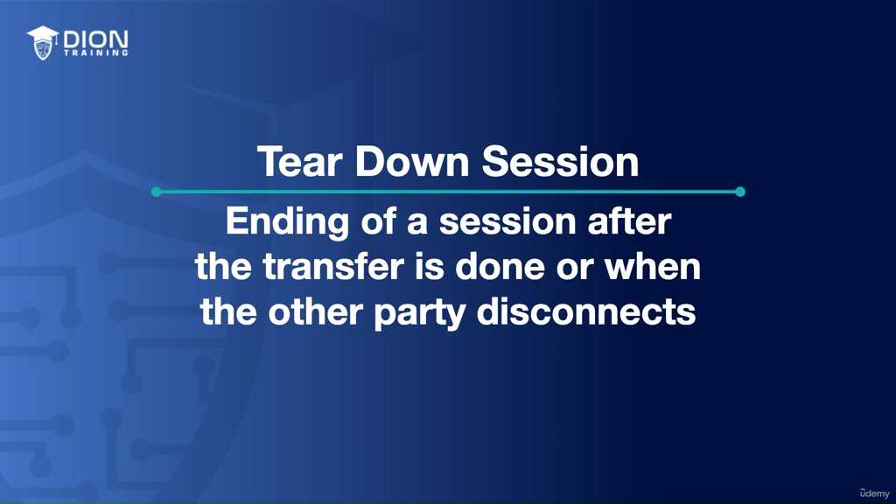
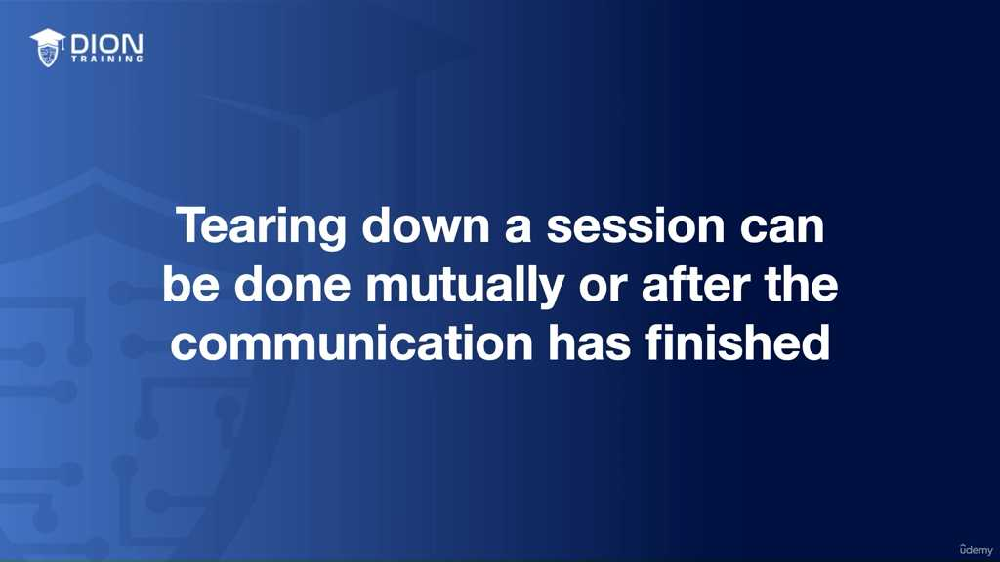
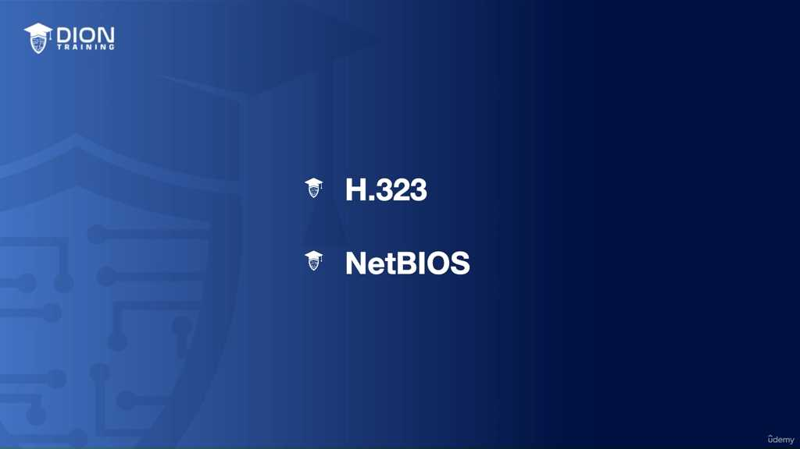
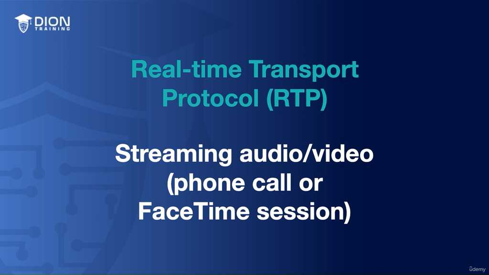
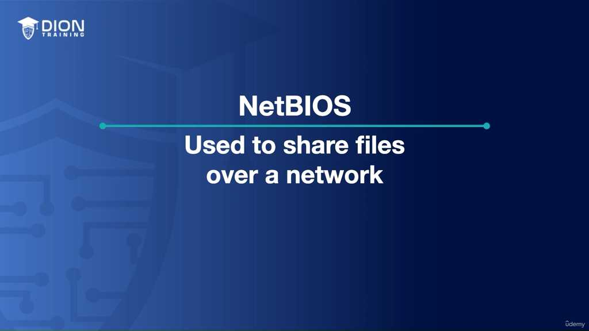

# Session Layer Essentials

### Tầng 5: Session Layer (Tầng Phiên)

**Session Layer** là tầng thứ 5 trong mô hình OSI. Chức năng cốt lõi của nó là quản lý các "phiên" (sessions) giao tiếp giữa các thiết bị.

---

### 1. Định nghĩa về "Phiên" (Session)
Một **phiên** có thể được hiểu là một cuộc đối thoại logic, biệt lập giữa hai thực thể trên mạng. Mục đích chính là đảm bảo dữ liệu của cuộc trò chuyện này không bị trộn lẫn (intermingling) hoặc gây nhiễu với các cuộc trò chuyện khác đang diễn ra cùng lúc trên cùng một hệ thống mạng.

> **💡 Ví dụ nhớ đời:** Hãy tưởng tượng bạn đang ở trong một lớp học có 20 sinh viên. Khi bạn muốn trao đổi riêng với một sinh viên, bạn dẫn bạn đó ra ngoài hành lang. Cuộc hội thoại ở hành lang là một "phiên" riêng biệt, trong khi 19 sinh viên còn lại vẫn tiếp tục trao đổi với nhau trong lớp.

---

### 2. Ba nhiệm vụ chính của Session Layer
Tầng phiên chịu trách nhiệm quản lý toàn bộ vòng đời của một kết nối thông qua ba giai đoạn: **Thiết lập (Setup)**, **Duy trì (Maintenance)** và **Kết thúc (Teardown)**.

#### A. Thiết lập phiên (Session Setup)
Đây là bước khởi đầu để tạo ra một "kênh" liên lạc an toàn và có trật tự.

*   **Xác thực (Credential Checking):** Kiểm tra thông tin định danh của người dùng/thiết bị để đảm bảo quyền truy cập.
*   **Định danh phiên:** Hệ thống gán cho phiên một số hiệu (ID) ngẫu nhiên.
*   **Thỏa thuận dịch vụ (Negotiation):** Các thiết bị đàm phán về việc ai sẽ là người gửi trước, ai nhận trước.

#### B. Duy trì phiên (Session Maintenance)
Sau khi thiết lập, tầng phiên đảm bảo dữ liệu được truyền tải liên tục và chính xác.

*   **Truyền dữ liệu (Data Transfer):** Dữ liệu được gửi qua lại giữa hai điểm.
*   **Phục hồi sau lỗi (Re-establishing):** Nếu có sự cố mất kết nối, tầng phiên đồng bộ lại dữ liệu.
*   **Xác nhận (Acknowledgement):** Tầng phiên liên tục kiểm tra xem dữ liệu đã đến nơi chưa.

#### C. Kết thúc phiên (Session Teardown)
Khi quá trình trao đổi dữ liệu hoàn tất, phiên cần phải được đóng lại để giải phóng tài nguyên.

---

### 3. Các giao thức quan trọng tại Tầng 5
Tại tầng này, không có "thiết bị phần cứng" chuyên dụng, mà thay vào đó là các **giao thức (protocols)**.

#### A. Giao thức H.323
Là chuẩn giao thức được sử dụng để thiết lập, duy trì và kết thúc các phiên truyền thông đa phương tiện (giọng nói và hình ảnh).

#### B. Giao thức RTP (Real-time Transport Protocol)

RTP là giao thức dùng để truyền dữ liệu thời gian thực, chuyên biệt cho việc truyền tải luồng âm thanh và video.

#### C. Giao thức NetBIOS (Network Basic Input/Output System)

Cho phép các máy tính trên mạng nội bộ (LAN) giao tiếp với nhau, đặc biệt là trong việc chia sẻ tài nguyên (file, máy in).

### Bảng tóm tắt nhanh

| Giao thức | Chức năng chính | Ứng dụng tiêu biểu |
| :--- | :--- | :--- |
| **H.323** | Thiết lập/Quản lý phiên đa phương tiện | FaceTime, Skype, VoIP |
| **RTP** | Truyền tải luồng dữ liệu thời gian thực | Streaming Voice/Video |
| **NetBIOS** | Chia sẻ file/tài nguyên trong mạng nội bộ | File sharing trong Windows |

---
*Ghi chú: 10 hình ảnh minh họa (.jpg) đã được tải về và lưu tự động vào thư mục con `image/` cùng cấp với file này. Để ảnh hiển thị tự động, hãy đảm bảo bạn sao chép cả thư mục `image/` nếu bạn muốn di chuyển file markdown sang nơi khác!*
